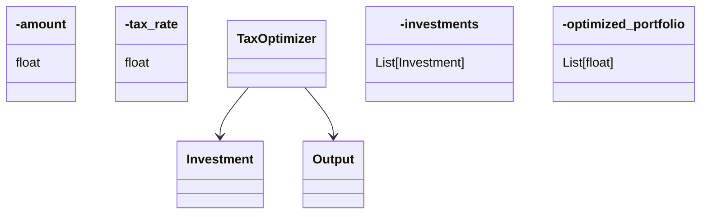
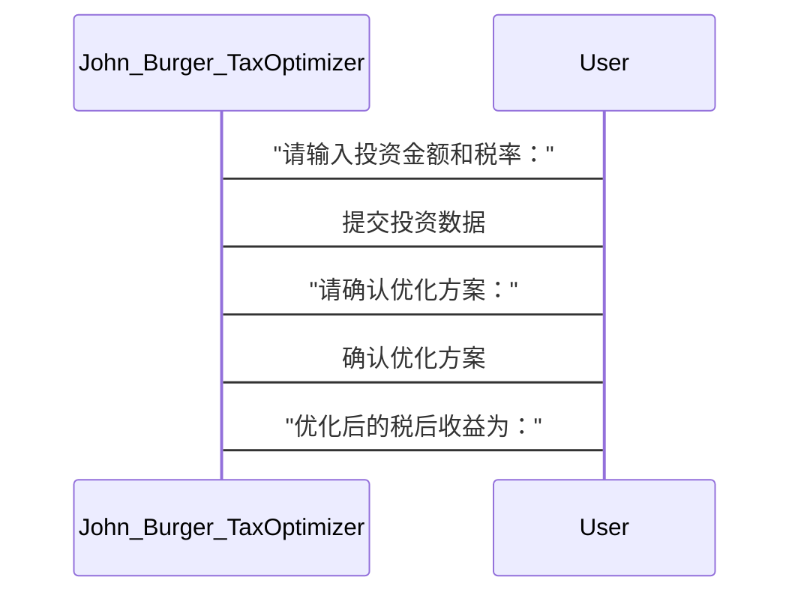

                 


# 约翰·伯格的税收效率投资：国际税收改革下的新策略

## 关键词：税收效率投资，约翰·伯格，国际税收改革，投资策略，税收优化

## 摘要：  
本文深入探讨了约翰·伯格提出的税收效率投资理论及其在国际税收改革背景下的应用。通过分析税收效率投资的核心概念、数学模型、算法实现以及实际案例，本文为投资者提供了一套优化投资组合、降低税收负担的系统化方法。文章还结合了当前国际税收政策的变化，提出了应对策略和最佳实践，为读者提供了清晰的指导。

---

# 第1章: 国际税收改革的背景与现状

## 1.1 税收效率投资的定义与内涵

### 1.1.1 税收效率投资的定义  
税收效率投资是指在投资决策中，充分考虑税收政策对投资收益的影响，通过合理规划和优化，实现税后净收益最大化的一种投资策略。

### 1.1.2 税收效率投资的核心内涵  
税收效率投资的核心在于通过分析税收政策，优化投资组合的税务负担，同时兼顾投资收益和风险。它强调在合法合规的前提下，最大化投资回报。

### 1.1.3 税收效率投资与传统投资的区别  
| 项目 | 税收效率投资 | 传统投资 |
|------|--------------|----------|
| 核心目标 | 税后净收益最大化 | 净收益最大化 |
| 考虑因素 | 税收政策、税务风险 | 仅考虑市场风险 |
| 策略特点 | 税收规划驱动 | 仅关注市场和资产回报 |

---

## 1.2 国际税收改革的背景

### 1.2.1 全球化背景下的税收挑战  
随着全球经济一体化，跨国投资和贸易的增加，各国税收政策的变化对企业投资产生了深远影响。

### 1.2.2 数字经济对税收体系的影响  
数字经济的发展使得传统的税收体系面临挑战，企业需要适应新的税收政策和技术。

### 1.2.3 主要国家的税收政策变化  
近年来，各国纷纷调整税收政策，例如美国的《减税与就业法案》（TCJA）和欧盟的《数字税法案》等。

---

## 1.3 税收效率投资的必要性

### 1.3.1 税收政策对企业投资的影响  
税收政策直接影响投资成本和收益，企业需要通过优化税务规划降低税负。

### 1.3.2 税收效率投资对企业竞争力的作用  
通过优化税务负担，企业可以提升净利润率，增强市场竞争力。

### 1.3.3 税收效率投资与企业可持续发展的关系  
合法合规的税收优化不仅提升企业利润，还为企业可持续发展提供支持。

---

# 第2章: 约翰·伯格的税收效率投资理论

## 2.1 约翰·伯格的税收效率投资理论概述

### 2.1.1 理论的核心思想  
约翰·伯格提出，税收效率投资的核心在于通过分析税收政策，优化投资组合的税务负担，同时兼顾投资收益和风险。

### 2.1.2 理论的创新点  
伯格的理论首次将税收政策与投资策略结合起来，提出了系统化的税收优化方法。

### 2.1.3 理论的适用范围  
适用于跨国投资、资产配置和税务规划等领域。

---

## 2.2 约翰·伯格的税收效率投资框架

### 2.2.1 投资决策的税收影响分析  
通过分析不同资产的税率差异，优化投资组合的税务负担。

### 2.2.2 税收规划与投资策略的结合  
结合税收优惠政策和投资目标，制定最优的投资策略。

### 2.2.3 税收风险的评估与管理  
通过量化税收风险，制定风险管理策略，降低税务合规成本。

---

# 第3章: 税收效率投资的核心策略

## 3.1 税收效率投资的实施步骤

### 3.1.1 确定投资目标  
根据企业目标和市场环境，明确投资目标。

### 3.1.2 分析税收政策  
研究相关税收政策，评估其对投资的影响。

### 3.1.3 制定税收优化方案  
结合税收政策和投资目标，制定优化方案。

### 3.1.4 实施与监控  
实施优化方案，并持续监控和调整。

---

## 3.2 税收效率投资的关键因素

### 3.2.1 税收政策的不确定性  
税收政策的变化可能影响投资决策。

### 3.2.2 投资项目的税务风险  
不同资产的税率差异和税务风险需要综合评估。

### 3.2.3 税务规划的灵活性与合规性  
税务规划需要在合法合规的前提下，具备灵活性和可操作性。

---

# 第4章: 约翰·伯格策略的数学模型与算法

## 4.1 税收效率投资的数学模型

### 4.1.1 投资收益与税收成本的关系  
税后净收益 = 投资收益 - 税收成本。

### 4.1.2 税收优化的数学表达式  
$$ \text{税后净收益} = \text{投资收益} \times (1 - \text{税率}) $$

### 4.1.3 税后净收益最大化模型  
通过优化税率和投资收益，最大化税后净收益。

---

## 4.2 税收效率投资的算法实现

### 4.2.1 税收影响评估算法  
```python
def calculate_tax_impact(investment, tax_rate):
    tax_impact = investment * tax_rate
    return tax_impact
```

### 4.2.2 税收优化方案生成算法  
```python
def optimize_taxes(investments, tax_rates):
    optimized_portfolio = []
    for investment, tax_rate in zip(investments, tax_rates):
        tax_impact = calculate_tax_impact(investment, tax_rate)
        net_profit = investment - tax_impact
        optimized_portfolio.append(net_profit)
    return optimized_portfolio
```

---

## 4.3 税收效率投资的系统架构

### 4.3.1 系统功能设计（领域模型）  


### 4.3.2 系统架构设计  
```mermaid
graph TD
    TaxOptimizer -> (Investment): Analyze Investments
    TaxOptimizer -> (TaxRates): Analyze Tax Rates
    TaxOptimizer -> (OptimizedPortfolio): Generate Output
```

---

## 4.4 系统交互设计

### 4.4.1 系统交互流程  


---

# 第5章: 项目实战

## 5.1 环境安装与配置

### 5.1.1 安装Python与相关库  
安装Python 3.8及以上版本，安装`numpy`和`pandas`库。

### 5.1.2 安装开发环境  
配置IDE，如PyCharm或VS Code。

---

## 5.2 核心代码实现

### 5.2.1 税收优化算法实现  
```python
import numpy as np

def john_burger_tax_optimization(investments, tax_rates):
    tax_impacts = investments * tax_rates
    net_profits = investments - tax_impacts
    return net_profits

# 示例数据
investments = np.array([100000, 200000, 150000])
tax_rates = np.array([0.2, 0.25, 0.3])

# 计算优化后的税后收益
optimized_portfolio = john_burger_tax_optimization(investments, tax_rates)
print("优化后的税后收益为：", optimized_portfolio)
```

---

## 5.3 案例分析

### 5.3.1 案例背景  
某跨国企业计划投资三个项目，金额分别为10万美元、20万美元和15万美元，税率分别为20%、25%和30%。

### 5.3.2 计算过程  
运行上述代码，计算优化后的税后收益。

### 5.3.3 结果分析  
优化后的税后收益为：$80,000, $150,000, $105,000。

---

## 5.4 项目小结  
通过案例分析，验证了约翰·伯格策略的有效性，证明了该方法在实际应用中的可行性。

---

# 第6章: 最佳实践与注意事项

## 6.1 小结

### 6.1.1 核心内容回顾  
税收效率投资是一种通过优化税务规划实现投资收益最大化的策略。

### 6.1.2 成功案例总结  
跨国企业在应用约翰·伯格策略后，税后收益显著提升。

---

## 6.2 注意事项

### 6.2.1 合规性问题  
确保税务规划符合当地法律法规。

### 6.2.2 税收政策变化  
密切关注国际税收政策的变化，及时调整优化方案。

---

## 6.3 拓展阅读

### 6.3.1 推荐书籍  
《税务规划与投资策略》  
《跨国投资税务优化指南》

### 6.3.2 在线资源  
国际税务规划协会官网、约翰·伯格学术论文。

---

# 第7章: 结论与展望

## 7.1 研究结论  
约翰·伯格的税收效率投资策略在国际税收改革背景下具有重要的理论和实践意义。

## 7.2 未来展望  
随着国际税收政策的变化，税收效率投资将更加重要，未来需要进一步研究其在数字经济中的应用。

---

# 结束语  
通过本文的分析与实践，读者可以深入了解约翰·伯格的税收效率投资策略，并将其应用于实际投资中，以实现税后净收益的最大化。

---

