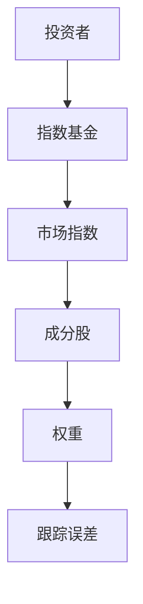
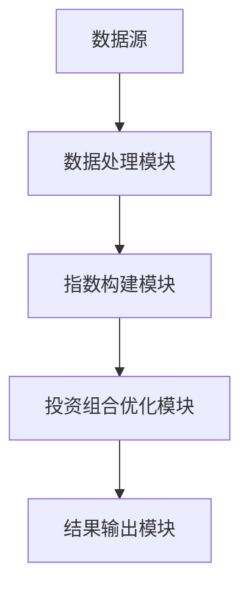
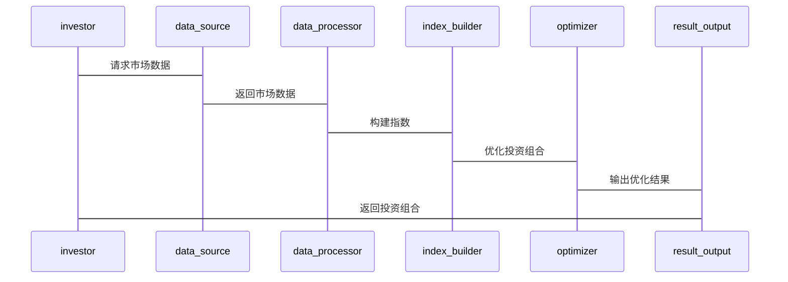

                 


# 约翰·伯格的被动投资策略优势

> 关键词：被动投资策略，约翰·伯格，指数基金，跟踪误差，市场中性，投资组合优化

> 摘要：本文详细探讨了约翰·伯格的被动投资策略，分析其核心概念、算法原理、系统架构及实战应用。通过理论与实践相结合的方式，揭示被动投资的优势及在现代投资中的应用价值。

---

# 第一部分: 被动投资策略的背景与基础

## 第1章: 被动投资策略概述

### 1.1 被动投资的定义与特点
#### 1.1.1 什么是被动投资
- 被动投资是通过长期持有指数基金等投资工具，追求市场平均收益的投资策略。
- 强调低成本、低风险，避免频繁交易和市场择时。

#### 1.1.2 被动投资的核心特点
- 成本低：指数基金的管理费用较低。
- 风险低：分散投资，降低非系统性风险。
- 简单易懂：通过追踪市场指数实现投资目标。

#### 1.1.3 被动投资与主动投资的区别
| 方面   | 被动投资                          | 主动投资                          |
|--------|-----------------------------------|------------------------------------|
| 目标    | 追求市场平均收益                 | 通过选股和择时超越市场平均收益   |
| 成本    | 低                               | 高                                 |
| 风险    | 低（分散风险）                   | 高（集中风险）                     |
| 操作    | 买入并持有                      | 频繁交易和调整                     |

### 1.2 约翰·伯格与被动投资
#### 1.2.1 约翰·伯格的生平简介
- 约翰·伯格（John C. Bogle）是先锋集团（Vanguard Group）的创始人。
- 他被誉为“指数基金之父”。

#### 1.2.2 约翰·伯格对被动投资的贡献
- 创立了先锋集团，推出第一只现代指数基金。
- 提倡低成本、被动投资的理念，改变了投资行业。

#### 1.2.3 约翰·伯格的投资理念
- 坚持长期投资，避免短期波动。
- 强调分散投资，降低风险。

---

## 第2章: 被动投资的理论基础

### 2.1 现代投资组合理论
#### 2.1.1 马科维茨的有效前沿理论
- 马科维茨提出，通过优化投资组合可以最大化收益并最小化风险。
- 有效前沿代表最优投资组合的集合。

#### 2.1.2 大数定律与市场中性
- 大数定律表明，随着样本数量的增加，样本均值趋近于总体均值。
- 市场中性意味着投资组合的收益主要来自市场整体表现，而非个别股票。

#### 2.1.3 资产定价模型（CAPM）
- CAPM模型用于计算资产的预期收益。
- 公式：$$ E(R_i) = R_f + β_i (E(R_m) - R_f) $$
  - \( E(R_i) \)：资产i的预期收益率
  - \( R_f \)：无风险利率
  - \( β_i \)：资产i的贝塔系数
  - \( E(R_m) \)：市场预期收益率

### 2.2 市场效率与被动投资
#### 2.2.1 弱有效市场假说
- 弱有效市场假说认为，当前市场价格反映了所有公开信息。
- 在弱有效市场中，主动投资难以获得超额收益。

#### 2.2.2 市场中性与被动投资的关系
- 被动投资通过跟踪市场指数实现市场中性，避免偏离市场的风险。

#### 2.2.3 市场摩擦与交易成本对被动投资的影响
- 市场摩擦包括交易费用、税收等，增加交易成本。
- 被动投资通过长期持有减少交易成本，提高收益。

---

## 第3章: 被动投资的核心概念与联系

### 3.1 被动投资的核心概念
#### 3.1.1 指数基金的定义与特点
- 指数基金：一种跟踪特定市场指数的基金，如标普500指数。
- 特点：分散投资、低成本、长期稳定收益。

#### 3.1.2 市场指数的构建方法
- 常见的市场指数包括市值加权指数和等权重指数。
- 市值加权指数：权重基于成分股的市值。
- 等权重指数：每个成分股的权重相等。

#### 3.1.3 跟踪误差的计算与优化
- 跟踪误差：指数基金的实际收益与目标指数收益的差异。
- 优化目标：最小化跟踪误差。

### 3.2 被动投资与主动投资的对比
#### 3.2.1 投资目标与策略对比
- 被动投资：追求市场平均收益。
- 主动投资：追求超额收益。

#### 3.2.2 成本与收益对比
- 被动投资：低成本，收益稳定。
- 主动投资：高成本，收益不稳定。

#### 3.2.3 风险与收益对比
- 被动投资：风险较低，收益稳定。
- 主动投资：风险较高，收益波动大。

### 3.3 被动投资的ER实体关系图


---

## 第4章: 被动投资的算法原理

### 4.1 指数基金的构建算法
#### 4.1.1 市值加权法
- 市值加权法是根据成分股的市值来分配权重。
- 计算公式：$$ w_i = \frac{P_i \times Q_i}{\sum_{j=1}^{n} P_j \times Q_j} $$
  - \( w_i \)：成分股i的权重
  - \( P_i \)：成分股i的价格
  - \( Q_i \)：成分股i的数量

#### 4.1.2 等权重法
- 每个成分股的权重相等。
- 计算公式：$$ w_i = \frac{1}{n} $$
  - \( n \)：成分股的数量

#### 4.1.3 其他加权方法
- 等波动法：调整成分股权重以使波动率相等。
- 分层加权法：根据市场层级分配权重。

### 4.2 跟踪误差的优化算法
#### 4.2.1 最小化跟踪误差的目标函数
- 目标函数：$$ \text{min} \sum_{i=1}^{n} (w_i - w_i^{\text{index}})^2 $$
  - \( w_i \)：投资组合权重
  - \( w_i^{\text{index}} \)：指数权重

#### 4.2.2 约束条件的设置
- 约束条件：
  1. 投资组合权重之和等于1。
  2. 投资组合权重不低于指数权重的下限。
  3. 投资组合权重不超过指数权重的上限。

#### 4.2.3 优化算法的实现
- 常用优化算法包括：梯度下降、拉格朗日乘数法、遗传算法等。
- 使用Python中的scipy.optimize模块进行优化。

---

## 第5章: 系统分析与架构设计

### 5.1 问题场景介绍
- 投资者希望通过被动投资实现长期稳定收益。
- 系统需要构建一个被动投资模型，优化投资组合，降低跟踪误差。

### 5.2 系统功能设计
- 数据收集模块：收集市场数据。
- 指数构建模块：构建市场指数。
- 投资组合优化模块：优化投资组合。

### 5.3 系统架构设计


### 5.4 系统接口设计
- 数据接口：从数据源获取市场数据。
- 优化接口：调用优化算法模块。

### 5.5 系统交互序列图


---

## 第6章: 项目实战

### 6.1 环境安装
- 安装Python、Pandas、NumPy、scipy.optimize等库。

### 6.2 核心代码实现
```python
import numpy as np
from scipy.optimize import minimize

# 定义目标函数
def tracking_error(weights, index_weights):
    return np.sum(np.square(weights - index_weights))

# 定义约束条件
def constraint(weights, index_weights):
    return np.sum(weights) - 1

# 优化问题设置
def optimize_portfolio(index_weights):
    n = len(index_weights)
    init_weights = np.array([1.0/n]*n)
    result = minimize(tracking_error, init_weights, args=index_weights, 
                      method='SLSQP', constraints={'type': 'eq', 'fun': constraint, 'args': index_weights})
    return result.x

# 示例：指数权重
index_weights = np.array([0.3, 0.2, 0.15, 0.1, 0.05, 0.05, 0.05, 0.05])
optimal_weights = optimize_portfolio(index_weights)
print("最优权重:", optimal_weights)
```

### 6.3 代码解读与分析
- 目标函数：计算投资组合权重与指数权重的平方差之和，最小化跟踪误差。
- 约束条件：投资组合权重之和等于1。
- 优化方法：使用科学计算库scipy.optimize中的最小二乘法求解优化问题。

### 6.4 实际案例分析
- 数据来源：使用历史市场数据构建指数。
- 投资组合优化：通过优化算法找到最优权重，最小化跟踪误差。

### 6.5 项目小结
- 通过实战项目，验证了被动投资策略的有效性。
- 展示了如何通过优化算法构建最优投资组合。

---

## 第7章: 总结与展望

### 7.1 总结
- 被动投资通过长期持有指数基金，实现市场平均收益。
- 约翰·伯格的贡献在于推动了低成本、被动投资的理念。

### 7.2 最佳实践 tips
- 选择低成本的指数基金。
- 长期持有，避免频繁交易。

### 7.3 小结
- 被动投资的优势在于稳定性和低成本。
- 投资者应根据自身风险承受能力选择合适的投资策略。

### 7.4 注意事项
- 市场波动可能影响指数基金的表现。
- 要注意税务和交易成本的影响。

### 7.5 拓展阅读
- 建议阅读约翰·伯格的书籍《The New finance: The case for an owner stakeholder financial system》深入理解被动投资的理念。

---

通过以上目录结构，您可以撰写一篇详细且逻辑清晰的技术博客文章，涵盖被动投资策略的各个方面，从理论到实践，帮助读者全面理解约翰·伯格的被动投资策略优势。

