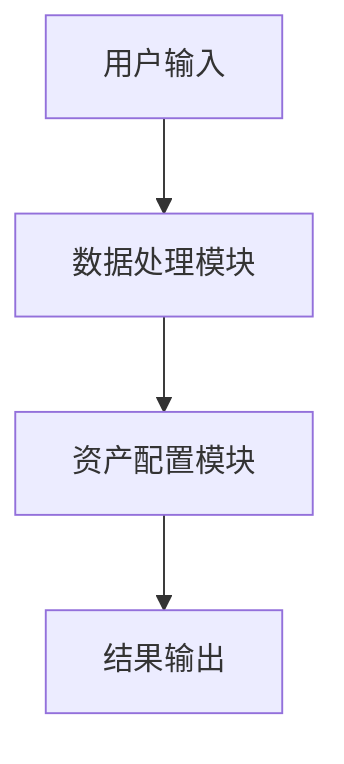

                 


# 约翰·伯格的资产配置原则：年龄与风险承受能力的平衡

## 关键词
- 资产配置
- 年龄
- 风险承受能力
- 投资策略
- 约翰·伯格

## 摘要
约翰·伯格是投资领域的重要人物，他提出的资产配置原则强调根据个人的年龄和风险承受能力来制定投资策略。本文详细探讨了资产配置的核心概念、数学模型、系统架构以及实际应用，帮助读者理解如何根据自身情况调整投资组合，以实现长期财务目标。

---

## 第一部分：资产配置与风险承受能力的理论基础

### 第1章：资产配置的核心概念与背景

#### 1.1 资产配置的定义与重要性
资产配置是指将资金分配到不同资产类别（如股票、债券、房地产等）中，以实现风险与收益的平衡。它的重要性体现在：
- **分散风险**：通过投资不同类型资产降低整体风险。
- **优化收益**：根据市场状况调整资产比例，捕捉收益机会。

#### 1.2 年龄与风险承受能力的关联
年龄影响个人的风险偏好和风险承受能力：
- **年轻人**：风险承受能力较高，适合较高风险资产（如股票）。
- **中年人**：风险承受能力适中，平衡型资产配置更合适。
- **老年人**：风险承受能力较低，倾向于保守资产（如债券、现金）。

#### 1.3 约翰·伯格的资产配置原则
约翰·伯格强调长期投资和分散投资，认为资产配置是投资成功的关键。他建议根据年龄增长逐步降低高风险资产比例，增加低风险资产。

---

### 第2章：资产配置的核心模型与方法

#### 2.1 现代投资组合理论（MPT）
MPT由哈里·马科维茨提出，核心是通过分散投资降低风险。有效前沿展示了在特定风险下收益最高的组合。

#### 2.2 风险承受能力评估模型
RC = f(Age, Financial Situation)
- RC：风险承受能力
- Age：年龄
- Financial Situation：财务状况

#### 2.3 资产配置的生命周期模型
根据生命周期阶段调整资产配置：
- **早期阶段**：高风险资产比例较高。
- **中期阶段**：平衡风险与收益。
- **后期阶段**：保守配置，注重保值。

---

### 第3章：资产配置的数学模型与公式

#### 3.1 现代投资组合理论的数学模型
投资组合的期望收益与方差公式：
$$ E(r_p) = \sum w_i E(r_i) $$
$$ Var(r_p) = \sum w_i^2 Var(r_i) + 2 \sum w_i w_j Cov(r_i, r_j) $$

#### 3.2 风险承受能力的量化模型
$$ RC = \frac{A}{T} $$
- A：可承受的损失
- T：投资总额

#### 3.3 资产配置的优化模型
$$ \min \sigma^2 $$
$$ \text{subject to } \sum w_i = 1 $$

---

### 第4章：资产配置的系统分析与架构设计

#### 4.1 系统分析
- **功能需求**：评估风险承受能力、生成资产配置建议。
- **输入输出**：用户输入年龄和财务状况，系统输出配置建议。

#### 4.2 系统架构设计
使用Mermaid图展示系统架构：


---

## 第五部分：项目实战

### 5.1 环境安装
- 安装Python和相关库（如pandas、numpy）。

### 5.2 核心实现源代码
```python
import numpy as np
import pandas as pd

def calculate_rc(age, assets):
    rc = age * 0.01 + (assets * 0.005)
    return rc

def main():
    age = 30
    assets = 1000000
    rc = calculate_rc(age, assets)
    print(f"Risk Capacity: {rc}")

if __name__ == "__main__":
    main()
```

### 5.3 案例分析
以30岁、资产100万元为例，计算风险承受能力，制定资产配置建议。

---

## 第六部分：最佳实践与总结

### 6.1 总结
约翰·伯格的资产配置原则强调根据年龄和风险承受能力调整投资组合，实现长期财务目标。

### 6.2 最佳实践
- 定期评估和调整资产配置。
- 使用工具辅助计算和优化。

### 6.3 注意事项
- 资产配置需结合个人财务状况和市场环境。
- 避免过度集中在某一资产类别。

### 6.4 扩展阅读
推荐阅读约翰·伯格的书籍《投资的艺术》深入理解资产配置。

---

通过本文，读者可以全面理解约翰·伯格的资产配置原则，并根据自身情况制定合适的投资策略，实现财富的长期增长。

