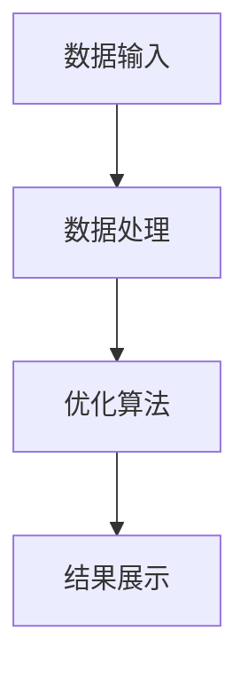

                 


# 约翰·伯格的资产配置理论

## 关键词
- 资产配置
- 现代投资组合理论
- 投资组合优化
- 风险管理
- 资产类别

## 摘要
资产配置是投资管理中的核心策略，通过合理分配资金在不同资产类别之间，以实现风险与收益的最佳平衡。本文将深入探讨约翰·伯格的资产配置理论，结合现代投资组合理论（MPT）和资本资产定价模型（CAPM），分析资产配置的数学模型、算法实现、系统架构设计以及实际案例。文章内容包括资产配置的基本概念、理论基础、数学模型、算法实现、系统设计、项目实战和最佳实践等，为读者提供全面而深入的指导。

---

# 第一部分：资产配置理论的背景与核心概念

## 第1章：资产配置的基本概念

### 1.1 资产配置的定义与背景

#### 1.1.1 资产配置的定义
资产配置是指将投资资金分配到不同资产类别（如股票、债券、房地产、现金等）中的过程，旨在在风险与收益之间找到最佳平衡点。

#### 1.1.2 资产配置的历史演变
资产配置理论起源于20世纪50年代，以Harry Markowitz的现代投资组合理论（MPT）为开端，随后发展出多种资产配置策略，如恒定混合资产配置、动态资产配置等。

#### 1.1.3 资产配置在投资管理中的重要性
资产配置是投资组合管理的核心，它决定了投资组合的风险、收益和流动性特征。合理的资产配置能够有效降低投资风险，提高收益。

---

### 1.2 资产配置的核心要素

#### 1.2.1 投资目标与风险承受能力
- 投资目标：包括保本、追求稳定收益、资本增值等。
- 风险承受能力：投资者对资产价值波动的容忍程度。

#### 1.2.2 资产类别与市场流动性
- 资产类别：股票、债券、现金、房地产等。
- 市场流动性：资产在短时间内以合理价格买卖的能力。

#### 1.2.3 时间跨度与经济周期的影响
- 时间跨度：短期、中期和长期资产配置策略。
- 经济周期：资产配置需要根据经济周期的波动进行调整。

---

## 第2章：资产配置的核心概念与理论框架

### 2.1 资产配置的理论基础

#### 2.1.1 现代投资组合理论（MPT）
MPT的核心思想是通过分散投资来降低风险，即“不要把所有鸡蛋放在一个篮子里”。

#### 2.1.2 资本资产定价模型（CAPM）
CAPM用于确定资产的预期收益，公式为：
$$ E(r_i) = r_f + \beta_i (E(r_m) - r_f) $$

其中：
- $E(r_i)$：资产$i$的预期收益率
- $r_f$：无风险利率
- $\beta_i$：资产$i$的贝塔系数
- $E(r_m)$：市场预期收益率

#### 2.1.3 风险与收益的权衡
资产配置需要在风险和收益之间找到平衡点，避免过度冒险或过于保守。

---

## 第3章：资产配置的数学模型与算法原理

### 3.1 均值-方差优化模型

#### 3.1.1 模型描述
均值-方差优化模型的目标是最小化投资组合的方差（风险），同时满足收益目标。

#### 3.1.2 数学公式
$$ \min_w \sigma^2 = w^T \Sigma w $$
$$ \text{subject to} \quad w^T \mu = \mu_p, \quad w^T 1 = 1 $$

其中：
- $w$：资产权重向量
- $\Sigma$：资产间的协方差矩阵
- $\mu$：资产的预期收益向量
- $\mu_p$：目标收益

#### 3.1.3 Python实现
```python
import numpy as np
from scipy.optimize import minimize

# 示例数据
mu = np.array([0.1, 0.15, 0.08])  # 资产的预期收益
Sigma = np.array([[0.16, 0.05, 0.03],
                  [0.05, 0.20, 0.02],
                  [0.03, 0.02, 0.10]])  # 协方差矩阵

# 目标函数
def portfolio_risk(weights, mu, Sigma):
    return np.dot(weights.T, np.dot(Sigma, weights))

# 约束条件
def constraint(weights, mu, target):
    return np.sum(weights * mu) - target

# 最优化
target = 0.12
cons = [{'type': 'eq', 'fun': lambda w: np.sum(w) - 1},
        {'type': 'eq', 'fun': lambda w: constraint(w, mu, target)}]

result = minimize(portfolio_risk, np.array([1/3, 1/3, 1/3]), 
                  args=(mu, target), constraints=cons)

print("最优权重：", result.x)
print("最小方差：", result.fun)
```

---

## 第4章：资产配置的系统分析与架构设计

### 4.1 系统功能设计

#### 4.1.1 功能模块
- 数据输入模块：读取资产数据和用户需求。
- 优化算法模块：实现均值-方差优化或风险平价配置。
- 结果展示模块：输出优化后的资产配置方案。

#### 4.1.2 系统架构图（Mermaid）


### 4.2 接口设计

#### 4.2.1 输入接口
- 用户输入：资产列表、预期收益、协方差矩阵。
- 约束条件：目标收益、权重总和为1。

#### 4.2.2 输出接口
- 优化后的资产权重。
- 投资组合的风险和收益。

---

## 第5章：项目实战

### 5.1 环境搭建与数据准备

#### 5.1.1 环境安装
- 安装Python和必要的库（numpy, scipy, matplotlib）。
- 安装Jupyter Notebook用于开发和测试。

#### 5.1.2 数据准备
- 下载历史资产数据（如股票价格、债券收益率）。
- 计算预期收益和协方差矩阵。

### 5.2 资产配置模型的实现

#### 5.2.1 均值-方差优化实现
```python
def portfolio_optimization(mu, Sigma, target_return):
    n = len(mu)
    # 初始权重
    init_weights = np.array([1/n]*n)
    
    # 目标函数
    def risk(weights):
        return np.dot(weights.T, np.dot(Sigma, weights))
    
    # 约束条件
    def constraint(weights, mu, target):
        return np.sum(weights * mu) - target
    
    cons = [{'type': 'eq', 'fun': lambda w: np.sum(w) - 1},
            {'type': 'eq', 'fun': lambda w: constraint(w, mu, target_return)}]
    
    result = minimize(risk, init_weights, method='SLSQP', constraints=cons)
    return result.x, result.fun

# 示例
mu = np.array([0.1, 0.15, 0.08])
Sigma = np.array([[0.16, 0.05, 0.03],
                  [0.05, 0.20, 0.02],
                  [0.03, 0.02, 0.10]])
target_return = 0.12

weights, variance = portfolio_optimization(mu, Sigma, target_return)
print("优化权重：", weights)
print("最小方差：", variance)
```

---

## 第6章：最佳实践与总结

### 6.1 最佳实践
- 定期审视和调整资产配置。
- 选择适合自身风险承受能力的策略。
- 结合市场环境灵活调整。

### 6.2 注意事项
- 避免过于集中单一资产类别。
- 考虑交易成本和税收的影响。

### 6.3 拓展阅读
- Harry Markowitz的《Portfolio Selection》。
- 加里·普拉特的《The New Finance》。

---

通过本文的详细讲解，读者可以全面理解约翰·伯格的资产配置理论，并掌握其实现方法和实际应用技巧。

