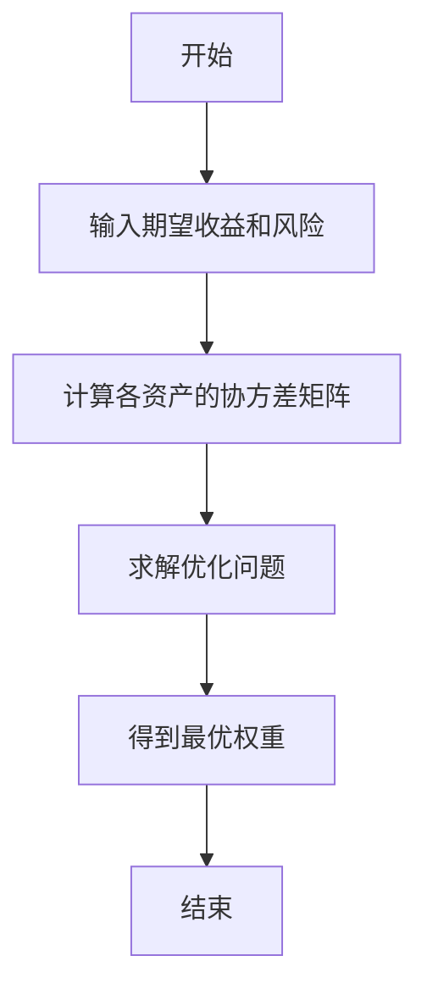

                 


# 目录大纲：《约翰·伯格的退休投资建议：简单而有效》

---

## 第一部分：背景介绍

### 第1章：退休投资的重要性

#### 1.1 退休投资的背景与意义
- 1.1.1 退休投资的必要性
  - 人口老龄化与退休保障压力
  - 养老金体系的现状与挑战
  - 个人退休规划的紧迫性
- 1.1.2 当前经济环境对退休投资的影响
  - 经济波动对退休资金的影响
  - 利率变化与投资回报的关系
  - 通货膨胀对购买力的侵蚀
- 1.1.3 退休投资的误区与真相
  - 过度乐观与过度悲观的误区
  - 短期波动与长期收益的平衡
  - 投资产品的风险与收益匹配

---

## 第二部分：投资策略与资产配置

### 第2章：资产配置的核心作用

#### 2.1 资产配置的基本原理
- 2.1.1 资产配置的定义与分类
  - 股票、债券、房地产等资产类别
  - 不同资产类别的风险与收益特征对比（表格形式）

#### 2.2 资产配置的数学模型
- 2.2.1 现代投资组合理论（MPT）的数学模型
  - 均值-方差优化模型的公式推导
    $$ \text{Minimize } \sigma^2 \text{ subject to } \mu = \text{target return} $$
  - 有效前沿的绘制与解释

#### 2.3 资产配置的实践应用
- 2.3.1 根据生命周期的资产配置建议
- 2.3.2 不同风险偏好下的资产配置比例

---

### 第3章：投资组合优化的算法实现

#### 3.1 现代投资组合理论的算法步骤


#### 3.2 Python代码实现
```python
import numpy as np
from scipy.optimize import minimize

def portfolio_optimization(returns, cov_matrix, target_return):
    n = len(cov_matrix)
    init_guess = np.zeros(n)
    bou
```

---

## 第三部分：风险管理与投资组合优化

### 第4章：风险管理的核心策略

#### 4.1 风险评估方法
- 4.1.1 风险的来源与分类
  - 市场风险、流动性风险、信用风险等
- 4.1.2 风险度量指标：波动率、VaR、CVaR

#### 4.2 投资组合的优化策略
- 4.2.1 最优投资组合的构建
  - 理论基础与实际应用
- 4.2.2 动态调整与再平衡

---

### 第5章：系统架构与投资工具

#### 5.1 投资组合管理系统的架构设计
- 5.1.1 系统功能模块
  - 数据采集、分析、优化、监控
- 5.1.2 系统架构图


#### 5.2 投资组合模拟工具的实现
- 5.2.1 工具的功能特点
- 5.2.2 工具的使用步骤

---

## 第四部分：实战案例与最佳实践

### 第6章：实战案例分析

#### 6.1 案例分析
- 6.1.1 投资目标与风险偏好
- 6.1.2 资产配置方案
- 6.1.3 投资组合的表现评估

#### 6.2 投资组合模拟代码
```python
import numpy as np
import pandas as pd

def calculate_return(portfolio_weights, returns):
    return np.dot(portfolio_weights, returns.mean())
```

---

## 第五部分：总结与展望

### 第7章：结论与小结

#### 7.1 核心观点回顾
- 退休投资的简单而有效策略
- 约翰·伯格投资理念的实践意义

#### 7.2 最佳实践 tips
- 定期审查和调整投资组合
- 长期投资与分散投资的重要性

#### 7.3 未来展望
- 退休投资的趋势与新技术应用
- 投资者教育的重要性

---

## 附录

### 附录A：术语表

### 附录B：进一步阅读的资源

---

**关键词：退休投资、约翰·伯格、资产配置、风险管理、投资组合优化、价值投资**

**摘要：**  
本文系统介绍了约翰·伯格的退休投资建议，强调了简单而有效的投资策略。通过深入分析资产配置、风险管理、投资组合优化等核心概念，结合数学模型和实际案例，为读者提供了科学的投资指导。

