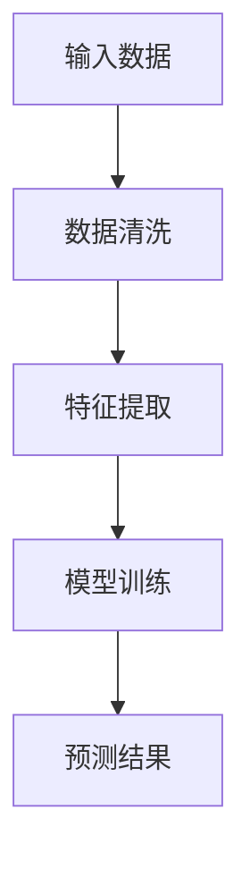

                 


# 约翰·伯格的长期市场回报预期：现实vs乐观

## 关键词：长期市场回报，投资预期，约翰·伯格，现实 vs 乐观，市场预测，经济分析，投资策略

## 摘要

本文探讨了约翰·伯格关于长期市场回报预期的两种观点：现实与乐观，并分析了这两种预期在实际投资中的应用和影响。通过深入分析经济因素、市场趋势和投资策略，本文揭示了在不同市场环境下，如何选择合适的投资策略以实现长期回报最大化。

---

# 第一部分：背景介绍

## 第1章：长期市场回报预期概述

### 1.1 问题背景

#### 1.1.1 投资市场的不确定性
金融市场具有高度的不确定性，投资者在做出投资决策时需要考虑多种因素，包括经济周期、政策变化、市场情绪等。长期市场回报的预测尤其具有挑战性，因为需要考虑更广泛的时间跨度和更多的变量。

#### 1.1.2 长期回报预期的重要性
长期回报预期是投资者制定投资策略的重要依据。准确的预期可以帮助投资者做出更明智的决策，优化投资组合，从而在长期获得更好的收益。

#### 1.1.3 约翰·伯格的理论基础
约翰·伯格是投资领域的权威，他的理论强调长期投资和分散投资的重要性。本文将重点分析他在长期市场回报预期方面的观点，尤其是现实与乐观两种预期的对比。

### 1.2 核心概念

#### 1.2.1 长期市场回报的定义
长期市场回报通常指在较长的时间跨度内（如10年或更长）的投资回报，包括股票、债券、房地产等多种资产类别。

#### 1.2.2 现实与乐观两种预期的对比
- **现实预期**：基于当前市场状况和经济基本面，预期回报较为保守，注重风险控制。
- **乐观预期**：基于市场潜在的增长和技术创新，预期回报较为积极，注重长期增长。

#### 1.2.3 市场回报预期的驱动因素
市场回报预期受多种因素影响，包括经济增长、利率水平、企业盈利、政策变化等。

### 1.3 当前市场现状

#### 1.3.1 全球经济环境分析
当前全球经济处于复苏阶段，但仍面临通胀压力、地缘政治风险和货币政策不确定性等挑战。

#### 1.3.2 美联储政策对市场的影响
美联储的货币政策（如加息、降息）对市场流动性、资产价格和投资回报有直接影响。

#### 1.3.3 疫情后的市场恢复情况
疫情后，全球经济逐渐复苏，市场回报预期有所改善，但部分行业仍受疫情影响。

### 1.4 相关概念对比

#### 1.4.1 技术分析与基本面分析的对比
- **技术分析**：通过分析历史价格走势预测未来价格变动。
- **基本面分析**：通过分析企业的财务状况、行业地位等因素预测投资回报。

#### 1.4.2 长期与短期市场回报的差异
长期回报通常更稳定，受市场周期性波动的影响较小；短期回报波动较大，受市场情绪和突发事件影响显著。

#### 1.4.3 理性预期与非理性预期的区分
- **理性预期**：基于充分的信息和理性分析做出的预期。
- **非理性预期**：受市场情绪、认知偏差等因素影响的预期。

---

# 第二部分：核心概念与联系

## 第2章：长期市场回报的驱动因素

### 2.1 经济增长的影响

#### 2.1.1 国内生产总值（GDP）对市场回报的推动作用
经济增长通常伴随着企业盈利和股价的上涨，从而推动市场回报。

#### 2.1.2 人口结构变化对投资的影响
人口结构变化（如老龄化）会影响劳动力市场、消费习惯和投资需求，进而影响市场回报。

#### 2.1.3 技术进步对市场回报的促进
技术创新提高了生产效率和企业盈利能力，从而推动市场回报。

### 2.2 利率与货币政策

#### 2.2.1 利率对股票估值的影响
低利率环境下，债券收益率下降，资金流向股市，推动股价上涨。

#### 2.2.2 货币政策对市场流动性的调节
宽松的货币政策增加市场流动性，推高资产价格；紧缩的货币政策则相反。

#### 2.2.3 美联储政策对市场回报的预期
美联储的政策变化对市场流动性、企业融资成本和投资回报有直接影响。

### 2.3 企业盈利状况

#### 2.3.1 净利润对股价的影响
企业的净利润增长通常会推动股价上涨，从而提高市场回报。

#### 2.3.2 行业周期对市场回报的驱动
不同行业处于不同的周期阶段，市场回报预期也有所不同。

#### 2.3.3 企业创新对市场增长的推动
技术创新和产品创新能够提高企业的竞争力，进而推动市场增长。

---

# 第三部分：算法原理讲解

## 第3章：长期市场回报预期的计算模型

### 3.1 模型概述

#### 3.1.1 理论基础
本文基于资产定价模型（如CAPM）和现代投资组合理论（MPT），构建长期市场回报预期的计算模型。

#### 3.1.2 模型假设
- 投资者理性决策；
- 市场效率有效；
- 历史数据具有可预测性。

#### 3.1.3 数据来源与处理
数据来源包括历史股价、财务数据、宏观经济指标等，需要进行清洗、标准化和特征提取。

### 3.2 模型流程图



### 3.3 Python代码实现

```python
import pandas as pd
from sklearn.model_selection import train_test_split
from sklearn.linear_model import LinearRegression

# 数据加载与预处理
data = pd.read_csv('market_return.csv')
data.dropna(inplace=True)
data['回报率'] = data['回报率'].astype(float)

# 特征与目标变量分离
features = data.drop('回报率', axis=1)
target = data['回报率']

# 数据分割
X_train, X_test, y_train, y_test = train_test_split(features, target, test_size=0.2, random_state=42)

# 模型训练
model = LinearRegression()
model.fit(X_train, y_train)

# 模型预测
y_pred = model.predict(X_test)

# 模型评估
print('预测结果:', y_pred)
```

### 3.4 模型数学公式

#### 3.4.1 资产定价模型（CAPM）
$$ R_i = R_f + \beta_i (R_m - R_f) $$
其中：
- \( R_i \) 是资产的预期回报率
- \( R_f \) 是无风险利率
- \( \beta_i \) 是资产的贝塔系数
- \( R_m \) 是市场预期回报率

#### 3.4.2 现代投资组合理论（MPT）
$$ E(R_p) = \omega_1 E(R_1) + \omega_2 E(R_2) + ... + \omega_n E(R_n) $$
其中：
- \( E(R_p) \) 是投资组合的预期回报
- \( \omega_i \) 是资产i的权重
- \( E(R_i) \) 是资产i的预期回报

---

## 总结

本文通过分析约翰·伯格的长期市场回报预期，探讨了现实与乐观两种预期的对比，并结合经济因素、市场趋势和投资策略，揭示了在不同市场环境下如何选择合适的投资策略以实现长期回报最大化。通过构建数学模型和实际案例分析，本文为投资者提供了科学的决策依据。

