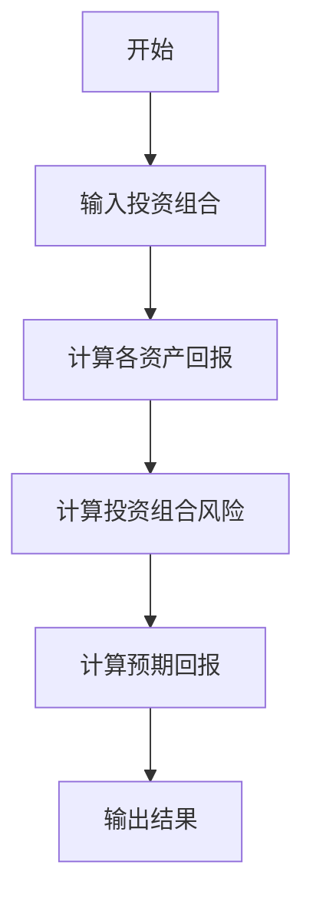
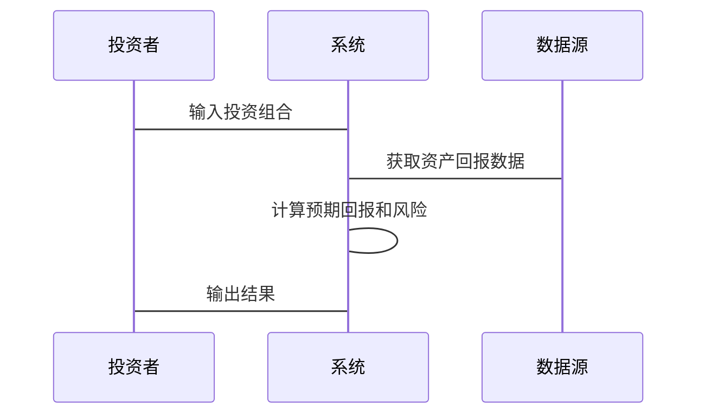

                 


# 约翰·伯格的长期投资回报预期管理

> 关键词：约翰·伯格，长期投资，回报预期管理，投资组合，风险管理

> 摘要：本文深入探讨约翰·伯格的长期投资回报预期管理，从理论基础到实践应用，结合数学模型、算法实现和系统架构设计，分析如何通过科学的方法实现长期投资回报的有效管理。

---

## 第1章 约翰·伯格的长期投资回报管理概述

### 1.1 约翰·伯格的背景与投资理念

#### 1.1.1 约翰·伯格的生平简介

- 约翰·伯格的出生与成长背景
- 约翰·伯格的职业历程与成就
- 约翰·伯格在投资领域的影响力

#### 1.1.2 约翰·伯格的投资哲学

- 长期投资的重要性
- 价值投资的核心理念
- 投资风险管理的策略

#### 1.1.3 约翰·伯格对投资行业的贡献

- 投资理论的创新
- 投资实践的典范
- 投资教育的推动

### 1.2 长期投资回报预期管理的定义与目标

#### 1.2.1 长期投资回报的定义

- 投资回报的基本概念
- 长期回报与短期回报的区别
- 长期回报的衡量标准

#### 1.2.2 投资回报预期管理的目标

- 确保投资回报的稳定性
- 优化投资组合的回报率
- 控制投资风险

#### 1.2.3 长期投资回报与短期波动的关系

- 短期波动对长期回报的影响
- 长期投资中波动的应对策略
- 投资者心理对回报预期的影响

### 1.3 长期投资回报预期管理的核心要素

#### 1.3.1 投资组合管理

- 投资组合的基本概念
- 投资组合的风险与收益平衡
- 投资组合的优化策略

#### 1.3.2 风险管理

- 风险的定义与分类
- 风险评估的方法
- 风险控制的策略

#### 1.3.3 时间因素在投资中的作用

- 时间对投资回报的影响
- 复利效应的数学模型
- 时间窗口与投资策略的关系

---

## 第2章 长期投资回报预期管理的背景与现状

### 2.1 当前投资环境的复杂性

#### 2.1.1 经济周期对投资回报的影响

- 经济周期的定义与阶段
- 不同经济周期下的投资策略
- 经济周期对长期回报的影响

#### 2.1.2 全球化与投资回报的关系

- 全球化对投资环境的影响
- 全球化背景下资产配置的优化
- 全球经济波动对长期回报的影响

#### 2.1.3 数字化与投资回报的新趋势

- 数字化对投资的影响
- 金融科技在投资中的应用
- 数字化对长期投资回报的影响

### 2.2 长期投资回报预期管理的挑战

#### 2.2.1 市场波动对长期投资的影响

- 市场波动的定义与特征
- 市场波动对长期投资回报的影响
- 应对市场波动的策略

#### 2.2.2 经济政策变化对投资回报的影响

- 经济政策的定义与分类
- 经济政策变化对投资的影响
- 政策风险的应对策略

#### 2.2.3 投资者行为对预期管理的干扰

- 投资者行为的特征
- 投资者行为对预期管理的影响
- 投资者心理与投资决策的关系

### 2.3 长期投资回报预期管理的现状

#### 2.3.1 现有投资策略的优缺点

- 主流投资策略的分类
- 各种投资策略的优缺点
- 长期投资策略的现状

#### 2.3.2 现有投资模型的局限性

- 投资模型的分类与特点
- 现有模型的局限性
- 新型投资模型的发展趋势

#### 2.3.3 现有投资工具的不足

- 现有投资工具的种类与特点
- 工具的局限性
- 技术进步对投资工具的影响

---

## 第3章 长期投资回报预期管理的核心概念

### 3.1 投资回报预期管理的数学模型与算法

#### 3.1.1 预期回报的计算公式

- 预期回报的数学公式
- 投资组合预期回报的计算
- 风险调整后的预期回报模型

#### 3.1.2 现代投资组合理论（MPT）

- MPT的核心原理
- 风险与回报的关系
- 有效前沿的概念与应用

#### 3.1.3 风险调整后的预期回报模型

- 风险调整回报的数学公式
- 不同风险水平下的预期回报
- 风险调整回报的实证分析

### 3.2 投资组合管理的算法实现

#### 3.2.1 算法流程图（Mermaid）



#### 3.2.2 Python实现代码

```python
import numpy as np

def expected_return(weights, returns):
    return np.dot(weights.T, returns)

def portfolio_risk(weights, covariance_matrix):
    return np.sqrt(np.dot(weights.T @ covariance_matrix @ weights))

# 示例数据
returns = np.array([0.1, 0.2, 0.15])
covariance_matrix = np.array([[0.02, 0.01, 0.015],
                              [0.01, 0.03, 0.02],
                              [0.015, 0.02, 0.035]])
weights = np.array([0.3, 0.5, 0.2])

# 计算预期回报和风险
er = expected_return(weights, returns)
risk = portfolio_risk(weights, covariance_matrix)

print(f"预期回报: {er}")
print(f"投资组合风险: {risk}")
```

#### 3.2.3 数学模型与公式的详细讲解

- 预期回报的公式推导
- 投资组合风险的计算方法
- 风险调整回报模型的应用

### 3.3 系统架构设计与实现

#### 3.3.1 系统功能设计

- 系统功能模块划分
- 各模块的功能描述
- 系统功能的实现流程

#### 3.3.2 系统架构设计（Mermaid）


#### 3.3.3 系统接口设计

- 系统输入接口的设计
- 系统输出接口的设计
- 接口之间的数据流设计

#### 3.3.4 系统交互设计（Mermaid）



---

## 第4章 长期投资回报预期管理的实践与案例分析

### 4.1 项目实战

#### 4.1.1 环境安装与配置

- 开发环境的选择
- 相关工具的安装与配置
- 数据源的获取与处理

#### 4.1.2 系统核心实现源代码

```python
import numpy as np
import pandas as pd

# 示例数据加载
data = pd.read_csv('asset_returns.csv')
returns = data.iloc[:, 1:].values

# 计算协方差矩阵
covariance_matrix = np.cov(returns.T)

# 定义优化目标函数
def optimize_portfolio(weights, returns, covariance_matrix):
    return -expected_return(weights, returns)

# 使用 scipy.optimize 进行优化
from scipy.optimize import minimize

weights = np.array([1/3, 1/3, 1/3])
result = minimize(optimize_portfolio, weights, args=(returns, covariance_matrix))
optimized_weights = result.x

print(f"优化后的投资组合权重: {optimized_weights}")
```

#### 4.1.3 代码应用解读与分析

- 代码的功能分析
- 代码实现的逻辑解读
- 代码结果的分析与解释

#### 4.1.4 实际案例分析

- 案例背景介绍
- 案例分析过程
- 案例结果与启示

### 4.2 最佳实践与小结

#### 4.2.1 投资策略的选择

- 长期投资策略的优化
- 投资组合的动态调整
- 风险管理的加强

#### 4.2.2 系统架构的优化

- 系统性能的提升
- 系统功能的扩展
- 系统维护与升级

#### 4.2.3 注意事项与风险提示

- 投资风险的提醒
- 系统使用的注意事项
- 长期投资的潜在风险

---

## 第5章 长期投资回报预期管理的未来展望

### 5.1 技术进步对投资管理的影响

- 人工智能在投资中的应用
- 区块链技术对投资的影响
- 大数据在投资回报管理中的应用

### 5.2 投资理论与实践的结合

- 理论与实践的互动关系
- 新型投资理论的发展
- 理论指导实践的优化

### 5.3 投资回报预期管理的未来发展

- 投资管理的智能化趋势
- 可持续投资的发展前景
- 全球化与本地化结合的投资策略

---

## 第6章 总结与展望

### 6.1 约翰·伯格的长期投资回报预期管理的核心思想

- 长期投资的核心理念
- 投资回报管理的关键点
- 风险控制的重要性

### 6.2 本文的主要内容与结论

- 本文的主要内容回顾
- 研究的结论与启示
- 对未来研究的展望

### 6.3 最终思考与读者的建议

- 对读者的建议
- 对投资行业的展望
- 对未来研究的建议

---

通过以上目录结构，我们可以系统地探讨约翰·伯格的长期投资回报预期管理，从理论到实践，从算法到系统设计，为投资者和投资专业人士提供全面的指导与参考。

