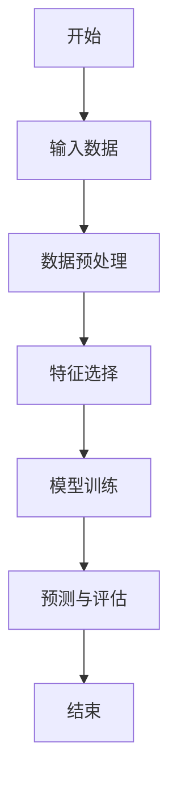
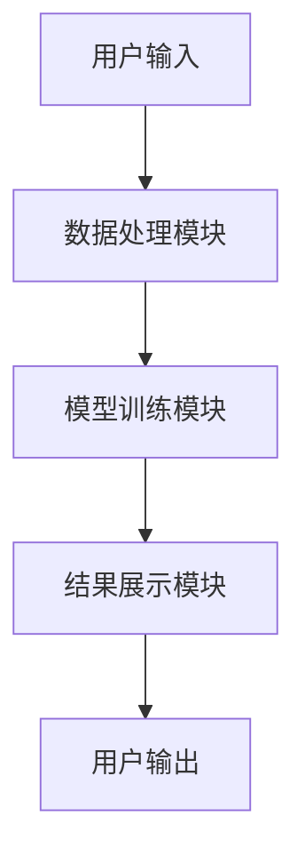

                 


# 约翰·伯格的长期投资回报预测模型

## 关键词：投资回报预测、长期投资、约翰·伯格、金融模型、机器学习

## 摘要：  
《约翰·伯格的长期投资回报预测模型》这篇文章详细探讨了如何利用数据分析和机器学习技术构建一个高效的长期投资回报预测模型。文章首先介绍了长期投资回报预测的背景和重要性，然后深入分析了约翰·伯格模型的核心概念、算法原理和系统架构设计。通过实际案例分析，展示了如何将模型应用于实际投资决策中，并提供了详细的代码实现和系统交互流程图。最后，总结了模型的优势与局限性，并给出了最佳实践建议。

---

## 第一部分：背景介绍

### 第1章：长期投资回报预测的背景与重要性

#### 1.1 投资学基础

- **1.1.1 投资的基本概念**  
  投资是指将资金投入到某种资产或项目中，以期在未来获得收益的过程。投资的核心目标是实现资产的保值与增值。

- **1.1.2 长期投资的核心理念**  
  长期投资是指投资者将资金投入市场，持有资产数年甚至数十年，以期获得稳定的复利增长。这种投资策略注重资产的长期增值，而非短期波动。

- **1.1.3 投资回报的定义与分类**  
  投资回报包括资本利得和分红收益。长期投资回报预测关注的是资产在未来一段时间内的预期收益。

#### 1.2 长期投资回报预测的必要性

- **1.2.1 经济周期对投资的影响**  
  经济周期的波动（如衰退、复苏、繁荣、萧条）直接影响资产价格和投资回报。

- **1.2.2 风险与收益的平衡**  
  长期投资需要在风险可控的前提下追求收益最大化，这需要对市场风险、流动性风险等进行评估。

- **1.2.3 投资者行为与市场情绪**  
  投资者的决策往往受到市场情绪的影响，而长期投资回报预测需要考虑这些情绪因素对市场的影响。

#### 1.3 约翰·伯格的长期投资模型

- **1.3.1 约翰·伯格的生平与贡献**  
  约翰·伯格是投资领域的权威，以其长期投资策略闻名。他提出的模型为投资者提供了科学的决策依据。

- **1.3.2 模型的提出背景与目标**  
  约翰·伯格模型旨在通过分析历史数据和市场趋势，预测未来资产的长期回报。

- **1.3.3 模型的核心思想与应用场景**  
  该模型强调长期视角，适用于机构投资者和高净值个人的资产配置。

---

## 第二部分：模型的核心概念与联系

### 第2章：模型的核心概念

#### 2.1 模型的基本原理

- **2.1.1 预测的基本假设**  
  约翰·伯格模型假设市场是有效的，且历史数据可以为未来提供一定的参考。

- **2.1.2 模型的输入变量与输出结果**  
  输入变量包括历史价格、宏观经济指标、行业趋势等；输出结果是未来资产的预期回报率。

- **2.1.3 模型的核心算法与计算步骤**  
  约翰·伯格模型结合了时间序列分析和回归模型，通过历史数据拟合未来回报。

#### 2.2 模型的属性特征对比

- **2.2.1 模型的线性与非线性特征**  
  约翰·伯格模型在某些情况下表现出非线性特征，尤其是当市场趋势发生变化时。

| 模型属性 | 线性模型 | 非线性模型 |
|----------|----------|------------|
| 输入变量 | 线性关系  | 非线性关系 |
| 预测精度 | 较低      | 较高        |

- **2.2.2 模型的稳定性与适应性**  
  约翰·伯格模型具有较高的稳定性，但在市场剧烈波动时可能需要调整参数。

- **2.2.3 模型的可解释性与复杂性**  
  模型复杂性较高，但其可解释性较强，适合投资专业人士使用。

#### 2.3 实体关系图


---

## 第三部分：算法原理讲解

### 第3章：模型的算法原理

#### 3.1 算法流程图



#### 3.2 算法实现步骤

- **数据预处理**  
  对历史数据进行清洗，处理缺失值和异常值。

- **特征选择**  
  选择对预测有显著影响的特征，如收益率、波动率等。

- **模型训练**  
  使用时间序列分析和回归模型进行训练，优化模型参数。

- **预测与评估**  
  对未来回报进行预测，并通过回测验证模型的准确性。

#### 3.3 算法的数学模型

- **时间序列模型**  
  使用ARIMA模型进行预测：

  $$ ARIMA(p, d, q) $$

  其中，p为自回归阶数，d为差分阶数，q为移动平均阶数。

- **回归模型**  
  使用多元线性回归模型：

  $$ y = \beta_0 + \beta_1x_1 + \beta_2x_2 + ... + \beta_nx_n + \epsilon $$

  其中，$\beta_i$为回归系数，$\epsilon$为误差项。

---

## 第四部分：系统分析与架构设计

### 第4章：系统架构设计

#### 4.1 功能设计

- **数据采集模块**  
  从数据源获取历史价格、宏观经济指标等数据。

- **数据处理模块**  
  对数据进行清洗和特征提取。

- **模型训练模块**  
  使用机器学习算法训练预测模型。

- **结果展示模块**  
  显示预测结果和可视化图表。

#### 4.2 系统架构图


#### 4.3 接口设计

- **API接口**  
  提供RESTful API，供其他系统调用预测结果。

- **数据接口**  
  支持CSV、Excel等多种数据格式的导入和导出。

#### 4.4 交互流程



---

## 第五部分：项目实战

### 第5章：项目实战

#### 5.1 环境安装

- **Python环境**  
  安装Python 3.8及以上版本。

- **依赖库安装**  
  使用pip安装numpy、pandas、scikit-learn等库。

#### 5.2 核心代码实现

```python
import pandas as pd
from sklearn.linear_model import LinearRegression
from sklearn.metrics import mean_squared_error

# 数据加载
data = pd.read_csv('investment_data.csv')

# 特征选择
X = data[['return', 'volatility']]
y = data['future_return']

# 模型训练
model = LinearRegression()
model.fit(X, y)

# 预测与评估
y_pred = model.predict(X)
mse = mean_squared_error(y, y_pred)
print(f'Mean Squared Error: {mse}')
```

#### 5.3 案例分析

- **案例背景**  
  假设我们有某只股票的历史数据，希望预测其未来一年的回报率。

- **数据准备**  
  加载数据并提取相关特征。

- **模型训练**  
  使用线性回归模型训练预测模型。

- **结果分析**  
  对比实际回报与预测回报，评估模型的准确性。

---

## 第六部分：最佳实践

### 第6章：总结与展望

#### 6.1 小结

- 约翰·伯格模型为长期投资回报预测提供了科学的框架。
- 模型的成功依赖于高质量的数据和合理的算法选择。

#### 6.2 注意事项

- 数据质量对预测结果影响重大，需谨慎处理数据。
- 模型需定期更新，以适应市场变化。

#### 6.3 拓展阅读

- 推荐阅读《投资学基础》和《机器学习实战》等书籍。

---

## 结语

约翰·伯格的长期投资回报预测模型为投资者提供了科学的决策工具，但其成功依赖于对市场的深刻理解和技术的不断进步。希望本文能为读者在长期投资领域提供有价值的参考和启发。

