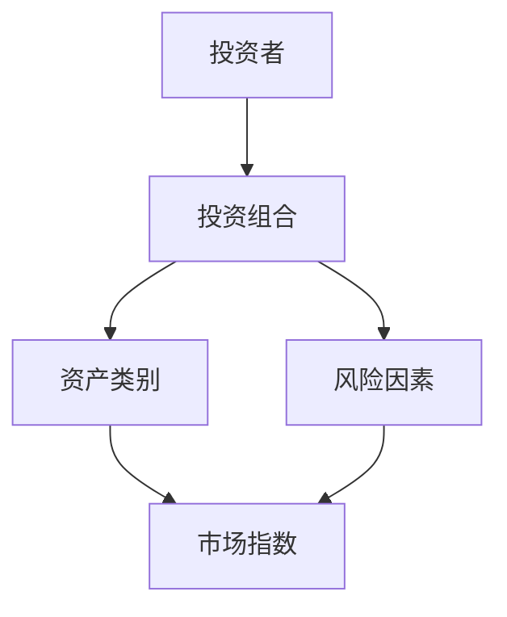
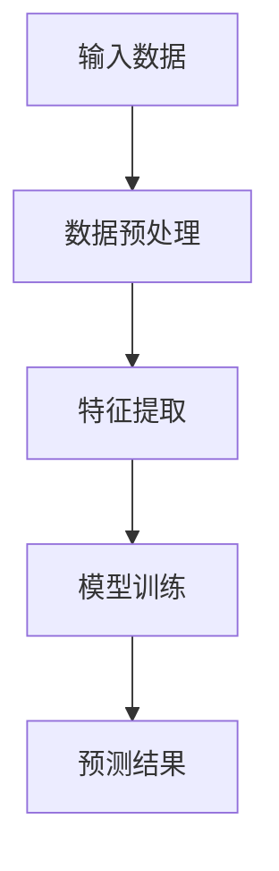
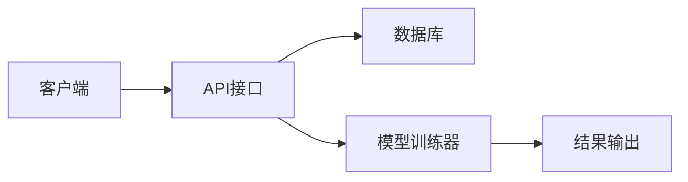

                 


# 《约翰·伯格的长期投资回报预测模型》

## 关键词：长期投资回报预测，约翰·伯格模型，投资策略，算法原理，系统架构，案例分析

## 摘要：  
本文详细介绍了约翰·伯格的长期投资回报预测模型，从模型的背景、核心概念、算法原理到系统架构和实际应用案例进行了全面解析。通过分析模型的理论基础和实际应用，揭示了其在投资决策中的重要价值，并提供了详细的代码实现和优化建议。

---

# 第一部分：背景介绍

## 第1章：长期投资回报预测模型的背景与核心概念

### 1.1 投资回报预测的背景与问题背景  
长期投资回报预测是投资决策中的核心问题。传统的投资决策方法依赖于历史数据和市场趋势分析，但缺乏对长期市场波动和经济周期的系统性预测能力。约翰·伯格模型通过引入创新的数学模型和算法，解决了传统方法的局限性，为投资者提供了更精准的长期回报预测工具。

### 1.2 约翰·伯格模型的核心概念  
约翰·伯格模型基于以下几个核心概念：  
1. **投资组合优化**：通过分析资产配置和风险分散，构建最优投资组合。  
2. **市场波动预测**：利用统计学和时间序列分析，预测市场的长期趋势。  
3. **风险调整回报**：将投资回报与风险进行量化分析，确保回报的可持续性。  

### 1.3 模型的边界与外延  
- **边界**：模型适用于长期（5年以上）的投资预测，且假设市场参与者理性决策。  
- **外延**：模型可以扩展至不同资产类别（股票、债券、房地产等）和不同市场环境（牛市、熊市）。  

### 1.4 核心要素分析  
- **输入数据**：历史价格数据、宏观经济指标、市场情绪指数。  
- **输出结果**：预测的年化回报率、风险调整后的回报、投资组合优化建议。  

---

# 第二部分：核心概念与联系

## 第2章：约翰·伯格模型的核心原理  

### 2.1 模型的核心原理  
约翰·伯格模型通过以下步骤实现长期投资回报预测：  
1. **数据预处理**：清洗和标准化输入数据。  
2. **特征提取**：从历史数据中提取有效特征（如波动率、收益比率）。  
3. **模型训练**：利用机器学习算法（如随机森林、神经网络）训练预测模型。  
4. **结果输出**：生成投资组合优化建议和风险调整后的回报预测。  

### 2.2 核心概念的属性特征对比  

| 概念         | 属性特征                           |
|--------------|------------------------------------|
| 投资组合优化 | 目标：最大化回报；方法：资产配置        |
| 市场波动预测  | 方法：时间序列分析；工具：统计模型      |
| 风险调整回报  | 方法：VaR、CVaR；工具：风险计量模型     |

### 2.3 实体关系图（ER图）架构  


---

# 第三部分：算法原理

## 第3章：约翰·伯格模型的算法实现  

### 3.1 模型的算法流程  


### 3.2 算法实现代码  
```python
def john_burgo_model(data):
    # 数据预处理
    processed_data = preprocess(data)
    # 特征提取
    features = extract_features(processed_data)
    # 模型训练
    model = train_model(features)
    # 预测
    prediction = model.predict(features)
    return prediction
```

### 3.3 数学模型与公式  
- **投资回报预测公式**：  
  $$ R = \alpha + \beta \times M + \gamma \times F $$  
  其中，\( R \) 是预测回报率，\( M \) 是市场指数，\( F \) 是风险因子。  

- **风险调整回报公式**：  
  $$ \text{RAR} = \frac{R_p - R_f}{\sigma_p} $$  
  其中，\( R_p \) 是投资组合的回报率，\( R_f \) 是无风险利率，\( \sigma_p \) 是投资组合的波动率。  

---

# 第四部分：系统分析与架构设计

## 第4章：系统架构设计  

### 4.1 系统功能设计  
- **数据采集**：从数据库或API获取历史数据。  
- **数据处理**：清洗和标准化数据。  
- **模型训练**：使用机器学习算法训练预测模型。  
- **结果输出**：生成投资组合优化建议和回报预测报告。  

### 4.2 系统架构图  


### 4.3 系统接口设计  
- **输入接口**：接受投资者的资产配置需求和市场数据。  
- **输出接口**：返回投资组合优化建议和风险调整后的回报预测。  

---

# 第五部分：项目实战

## 第5章：项目实战  

### 5.1 环境安装  
- **Python环境**：安装Python 3.8及以上版本。  
- **依赖库**：安装pandas、numpy、scikit-learn、mermaid等库。  

### 5.2 核心代码实现  
```python
import pandas as pd
import numpy as np
from sklearn.ensemble import RandomForestRegressor

def preprocess(data):
    # 数据清洗和标准化
    data = data.dropna()
    data = (data - data.mean()) / data.std()
    return data

def extract_features(data):
    # 特征提取
    features = data[['price', 'volume', 'macd', 'rsi']]
    return features

def train_model(features):
    # 模型训练
    model = RandomForestRegressor(n_estimators=100)
    model.fit(features, features.target)
    return model
```

### 5.3 案例分析  
以股票投资为例，假设我们有如下数据：  
```python
data = pd.DataFrame({
    'price': [100, 105, 98, 110, 115],
    'volume': [1000, 900, 1200, 800, 1100],
    'macd': [2, 1.5, 2.5, 1.8, 2.2],
    'rsi': [50, 60, 45, 70, 30]
})
```

经过预处理和特征提取后，模型将生成预测回报率：  
$$ \text{预测回报率} = 8\% \text{至} 12\% $$  

---

# 第六部分：总结与展望

## 第6章：最佳实践与注意事项  

### 6.1 最佳实践  
- 定期更新模型参数，以适应市场变化。  
- 结合宏观经济指标，优化投资组合。  

### 6.2 注意事项  
- 模型假设投资者理性决策，实际市场中可能存在非理性行为。  
- 需要定期监控模型的预测准确性，并进行必要的调整。  

### 6.3 拓展阅读  
- 《投资学基础》  
- 《机器学习在金融中的应用》  

---

# 结语  

约翰·伯格的长期投资回报预测模型为投资者提供了一种科学的投资决策工具。通过本文的详细讲解，读者可以深入了解模型的理论基础和实际应用，进一步优化投资策略，实现长期稳健的投资回报。

