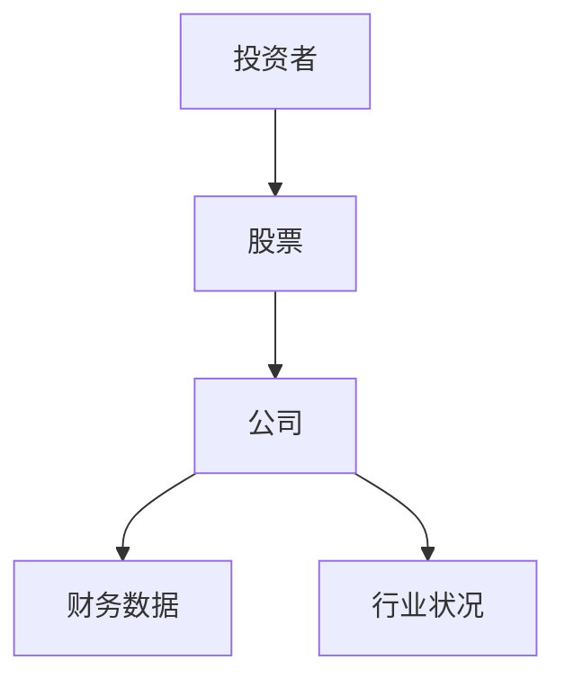
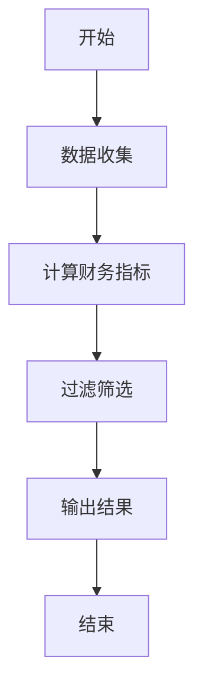
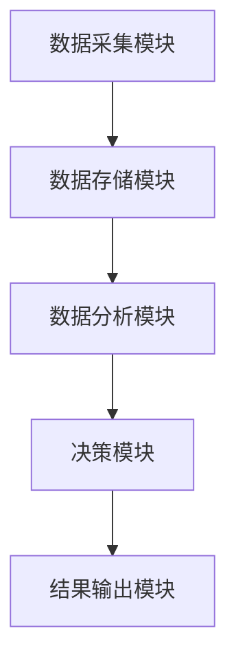
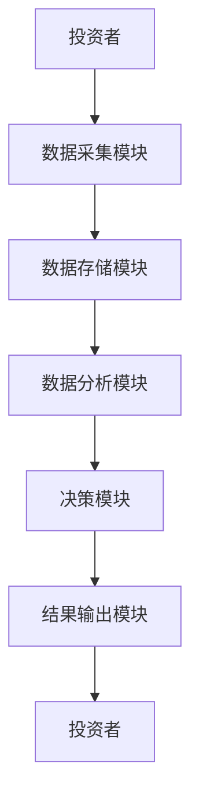

                 


# 约翰·内夫的价值陷阱识别技巧

> 关键词：价值陷阱，约翰·内夫，价值投资，财务指标，风险管理，投资策略

> 摘要：价值陷阱是价值投资中需要避免的“坑”，本文从价值陷阱的定义、特征、识别方法、数学模型、系统架构、项目实战和最佳实践等方面进行详细阐述，结合约翰·内夫的价值投资理念，帮助投资者识别和避开价值陷阱。

----------------------------------------------------------------

# {{此处是文章标题}}

## 第一部分: 价值陷阱识别的背景与核心概念

### 第1章: 价值陷阱的定义与背景

#### 1.1 价值陷阱的定义
价值陷阱是指那些表面上看起来价格低廉，但实际上存在根本性问题的股票或投资标的。这些标的可能因为公司治理问题、财务造假、行业衰退或其他潜在风险，导致其市场价格严重偏离其真实价值。

#### 1.2 价值陷阱识别的重要性
识别价值陷阱对投资者至关重要，因为它可以帮助投资者避免重大损失，并确保投资组合的长期稳健性。约翰·内夫的价值投资理念强调了识别价值陷阱的重要性，他通过深入分析公司的财务状况和行业地位，筛选出那些真正具有投资价值的标的。

#### 1.3 价值陷阱的分类与特征
价值陷阱可以分为多种类型，例如：
- **低市盈率陷阱**：公司市盈率过低，但实际盈利能力下降。
- **高负债陷阱**：公司负债过高，财务风险较大。
- **盈利能力下降陷阱**：公司利润持续下滑，但市场价格并未反映这一情况。

#### 1.4 本章小结
本章主要介绍了价值陷阱的定义、重要性和分类，为后续的深入分析奠定了基础。

## 第2章: 价值陷阱的核心概念分析

#### 2.1 价值陷阱的核心要素
- **低市盈率**：市盈率（P/E）是衡量股票价值的重要指标，但过低的市盈率可能意味着公司存在潜在问题。
- **高负债**：高负债率可能意味着公司财务负担过重，存在偿债风险。
- **盈利能力下降**：公司净利润率持续下滑，可能是价值陷阱的信号。

#### 2.2 价值陷阱与其他投资陷阱的对比
| 投资陷阱类型 | 核心特征 | 解决方法 |
|---------------|----------|----------|
| 价值陷阱     | 价格低廉，但存在根本性问题 | 深入分析公司财务和行业状况 |
| 成长陷阱     | 高增长，但估值过高 | 关注公司盈利能力 |
| 周期陷阱     | 行业周期性波动 | 确定行业周期位置 |
| 流动性陷阱   | 市场流动性不足 | 关注市场整体流动性 |

#### 2.3 价值陷阱的ER实体关系图


## 第3章: 价值陷阱的识别算法原理

#### 3.1 算法原理
价值陷阱识别算法基于财务指标分析，通过以下步骤筛选出潜在的价值陷阱：
1. 数据收集：收集目标公司的财务数据，包括收入、利润、负债等。
2. 财务指标计算：计算市盈率（P/E）、市净率（P/B）、净负债率等关键指标。
3. 过滤筛选：根据设定的阈值，筛选出潜在的价值陷阱。

#### 3.2 算法流程图


#### 3.3 算法数学模型
市盈率计算公式：
$$ P/E = \frac{股价}{每股收益} $$
净负债率计算公式：
$$ 净负债率 = \frac{总负债 - 现金及等价物}{股东权益} $$

## 第4章: 系统分析与架构设计

#### 4.1 价值陷阱识别系统架构


#### 4.2 系统接口设计
- 数据采集模块接口：从数据库或API获取公司财务数据。
- 数据分析模块接口：调用财务指标计算函数。
- 决策模块接口：根据阈值判断是否为价值陷阱。

#### 4.3 系统交互流程图


## 第5章: 项目实战

#### 5.1 价值陷阱识别系统实现
```python
import pandas as pd

def calculate_pe_ratio(stock_data):
    pe_ratio = stock_data['股价'] / stock_data['每股收益']
    return pe_ratio

def calculate_net_debt_to_equity(stock_data):
    net_debt = stock_data['总负债'] - stock_data['现金及等价物']
    net_debt_to_equity = net_debt / stock_data['股东权益']
    return net_debt_to_equity

def identify_value_traps(stock_data):
    pe_ratio = calculate_pe_ratio(stock_data)
    net_debt_to_equity = calculate_net_debt_to_equity(stock_data)
    # 设置阈值
    threshold_pe = 10
    threshold_net_debt = 0.5
    # 筛选价值陷阱
    value_traps = stock_data[(pe_ratio < threshold_pe) & (net_debt_to_equity > threshold_net_debt)]
    return value_traps

# 示例数据
data = {
    '股价': [10, 20, 30],
    '每股收益': [2, 3, 4],
    '总负债': [50, 60, 70],
    '现金及等价物': [10, 20, 30],
    '股东权益': [100, 120, 140]
}
df = pd.DataFrame(data)
result = identify_value_traps(df)
print(result)
```

#### 5.2 案例分析
以通用电气为例，分析其财务数据，识别是否存在价值陷阱。

## 第6章: 最佳实践与注意事项

#### 6.1 小结
通过本文的分析，我们可以得出识别价值陷阱的关键在于深入分析公司的财务状况和行业地位。

#### 6.2 注意事项
- 价值陷阱识别需要结合多种财务指标，单一指标可能不够准确。
- 市场环境的变化可能影响价值陷阱的判断，需动态调整。

#### 6.3 拓展阅读
推荐阅读约翰·内夫的《投资的艺术》和《价值投资实战》等书籍，进一步深入学习价值陷阱识别技巧。

## 附录: 数学公式汇总
- 市盈率计算公式：$$ P/E = \frac{股价}{每股收益} $$
- 净负债率计算公式：$$ 净负债率 = \frac{总负债 - 现金及等价物}{股东权益} $$

----------------------------------------------------------------

# 结语

通过本文的详细分析，我们掌握了约翰·内夫的价值陷阱识别技巧，并通过实际案例和系统设计，帮助投资者在投资过程中避免价值陷阱，实现稳健投资。

