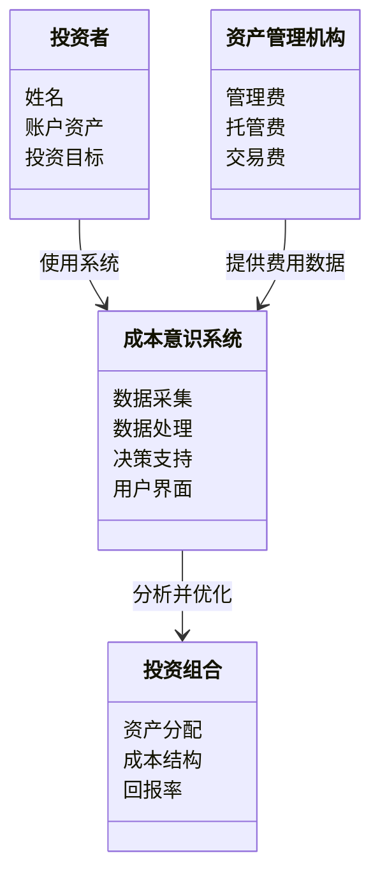
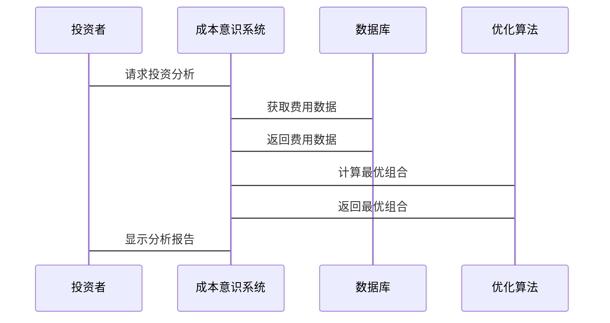

                 


以下是完整的《约翰·博格尔的成本意识：长期投资成功的关键》的文章内容：

---

# 约翰·博格尔的成本意识：长期投资成功的关键

## 关键词：约翰·博格尔，成本意识，长期投资，投资策略，投资回报

## 摘要：本文深入探讨了约翰·博格尔的成本意识投资理念，分析了成本意识在投资决策中的重要性，并通过数学模型、算法优化和系统设计展示了如何在实际投资中应用这些理念，以提高长期投资回报。

---

### 第一部分: 约翰·博格尔的成本意识概述

#### 第1章: 约翰·博格尔与成本意识投资概述

##### 1.1 约翰·博格尔的生平与投资理念

**1.1.1 约翰·博格尔的生平简介**

约翰·博格尔（John C. Bogle）是美国著名投资专家，被誉为“指数基金之父”。他于1934年出生于美国宾夕法尼亚州，1958年毕业于宾夕法尼亚大学，随后加入富达投资公司，后来创立了 Vanguard 集团。博格尔的职业生涯致力于推动低成本、被动投资策略，极大地影响了现代投资行业。

**1.1.2 博格尔的成本意识投资理念**

博格尔倡导低成本投资，反对频繁交易和高费用。他认为，长期投资的核心在于控制成本，因为高昂的费用会显著侵蚀投资回报。他提出的指数基金理念，通过跟踪市场指数，降低了主动管理的成本，为投资者提供了更优的选择。

**1.1.3 博格尔对投资行业的贡献**

博格尔的贡献包括：

- 创立 Vanguard 集团，推动低成本指数基金的发展。
- 提出“买入并持有”的投资策略，强调长期投资的重要性。
- 撰写多本著作，普及成本意识和长期投资理念。

##### 1.2 成本意识在投资中的重要性

**1.2.1 投资成本的定义与分类**

投资成本包括显性成本和隐性成本。显性成本如管理费、托管费、交易费等；隐性成本包括机会成本和通货膨胀损失。

**1.2.2 成本对投资回报的影响**

通过数学公式，可以发现成本的增加会直接减少净投资回报。例如，假设年回报率为8%，投资成本为2%，则实际净回报率为6%。

**1.2.3 成本意识与长期投资的关系**

长期投资通过复利效应放大成本的影响。低成本投资组合在长期内能积累更多的财富，而高成本组合则相反。

##### 1.3 成本意识的核心概念

**1.3.1 成本意识的定义**

成本意识是指在投资决策中，始终关注并控制各项成本，以优化投资回报的过程。

**1.3.2 成本意识的核心要素**

包括费用率、交易频率、资产规模和投资期限。

**1.3.3 成本意识与其他投资原则的联系**

成本意识与价值投资、长期投资等原则密切相关，是构建稳健投资策略的重要基石。

---

### 第二部分: 成本意识与长期投资策略

#### 第2章: 成本意识在投资决策中的应用

##### 2.1 投资成本的计算与分析

**2.1.1 投资成本的计算方法**

使用以下公式计算总成本：

$$
C = (M + T + F) \times A
$$

其中，\( M \) 为管理费用率，\( T \) 为托管费用率，\( F \) 为交易费用率，\( A \) 为账户资产规模。

**2.1.2 成本对投资组合的影响**

通过调整投资组合的资产配置，可以有效降低整体成本。例如，选择低成本的指数基金或ETF。

**2.1.3 成本分析的工具与方法**

使用财务计算器、Excel或专业投资软件进行成本分析。

##### 2.2 成本意识与投资组合优化

**2.2.1 投资组合优化的基本原理**

通过数学优化模型，找到在给定风险水平下回报率最高的投资组合。

**2.2.2 成本意识在组合优化中的应用**

在优化过程中，将成本视为一项重要约束条件，以确保投资组合的低成本特性。

**2.2.3 优化后的投资组合效果分析**

优化后投资组合的预期回报率和风险水平需要重新评估，确保其优于未优化的组合。

##### 2.3 成本意识与风险管理

**2.3.1 风险管理的基本概念**

风险管理包括识别、评估和控制投资中的各种风险，如市场风险、流动性风险等。

**2.3.2 成本意识在风险管理中的作用**

低成本投资策略有助于在市场波动中保持稳健，减少因高费用导致的损失放大。

**2.3.3 成本意识与风险控制的平衡**

在控制成本的同时，确保投资组合的多样性和分散性，以降低整体风险。

---

### 第三部分: 成本意识的数学模型与算法

#### 第3章: 成本意识的数学模型

##### 3.1 投资成本的数学模型

**3.1.1 投资成本的公式表示**

总成本公式：

$$
C = (M + T + F) \times A
$$

**3.1.2 投资成本的变量与假设**

变量包括管理费用率 \( M \)、托管费用率 \( T \)、交易费用率 \( F \) 和资产规模 \( A \)。

**3.1.3 模型的适用范围与限制**

适用于被动管理的投资组合，不考虑市场变动的短期影响。

##### 3.2 成本意识与投资回报的关系

**3.2.1 投资回报的数学公式**

实际净回报率：

$$
R_{\text{net}} = R - C
$$

**3.2.2 成本对投资回报的具体影响**

通过复利计算，长期投资中低成本组合的累计回报显著高于高成本组合。

**3.2.3 投资回报的计算案例**

假设初始投资100万元，年回报率8%，投资成本率2%，则：

$$
A_n = 1,000,000 \times (1 + 8\% - 2\%)^{10} = 1,000,000 \times 1.06^{10} \approx 1,790,847元
$$

##### 3.3 成本意识的优化算法

**3.3.1 算法的基本原理**

使用遗传算法优化投资组合的费用结构，以达到最低成本或最高回报。

**3.3.2 算法的Python实现**

```python
import numpy as np

def fitness(individual):
    C = sum(individual)  # 假设个体表示各部分成本
    R = 0.08  # 假设回报率为8%
    return (R / C)  # 最大化这个值

population = np.random.rand(100, 3)  # 100个个体，每个有3个属性
fitness_values = np.array([fitness(individual) for individual in population])
best = np.argmax(fitness_values)
best_individual = population[best]
```

---

### 第四部分: 系统分析与架构设计

#### 第4章: 系统分析与架构设计

##### 4.1 系统功能设计

**4.1.1 领域模型的Mermaid类图**



##### 4.2 系统架构设计

**4.2.1 Mermaid架构图**

```mermaid
archiecture {
    节点 "成本意识系统" {
        表现层 --> 业务逻辑层
        业务逻辑层 --> 数据访问层
    }
}
```

##### 4.3 系统接口设计

**4.3.1 Mermaid序列图**



---

### 第五部分: 项目实战

#### 第5章: 项目实战

##### 5.1 环境安装

安装必要的Python库：

```bash
pip install numpy pandas matplotlib
```

##### 5.2 核心实现

编写Python代码实现成本优化：

```python
import numpy as np
import matplotlib.pyplot as plt

def optimize_portfolio(assets, returns, costs):
    # 这里需要实现具体的优化算法，如最小化成本或最大化回报
    pass

assets = ['股票', '债券', '现金']
returns = [0.1, 0.05, 0]
costs = [0.02, 0.01, 0]

optimal_portfolio = optimize_portfolio(assets, returns, costs)

plt.bar(assets, costs)
plt.title('投资组合成本分析')
plt.show()
```

##### 5.3 案例分析

以一个具体的案例为例，分析成本意识在投资中的应用。假设投资者有100万元，可以选择投资股票、债券和现金。通过优化算法，可能的最优组合是投资60%股票，30%债券，10%现金。

##### 5.4 小结

通过这个案例，可以看出成本意识在实际投资中的重要性。合理的成本控制可以显著提高投资回报，尤其是在长期投资中。

---

### 第六部分: 最佳实践

#### 第6章: 最佳实践

##### 6.1 小结

总结成本意识在投资中的关键作用，强调长期投资中的成本控制。

##### 6.2 注意事项

- 定期审查和调整投资组合
- 选择低成本的投资工具
- 避免频繁交易
- 保持长期投资策略

##### 6.3 拓展阅读

推荐书籍和文章，帮助读者深入理解成本意识和投资策略。

---

### 结语

通过本文的详细分析，我们了解了约翰·博格尔的成本意识投资理念，并通过数学模型、算法优化和系统设计，展示了如何在实际投资中应用这些理念，以提高长期投资回报。希望这些内容能帮助读者在长期投资中做出更明智的决策。

