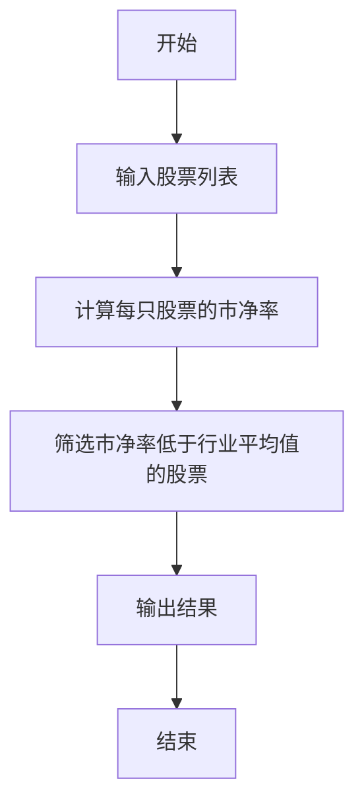
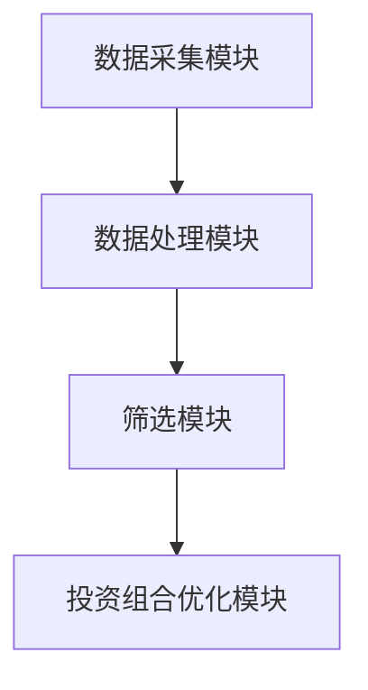

                 


# 约翰·奈夫的低市净率投资策略

## 关键词：低市净率，投资策略，约翰·奈夫，股票估值，安全边际

## 摘要：约翰·奈夫的低市净率投资策略是一种基于市净率的股票估值方法，旨在通过寻找被市场低估的股票来实现长期投资收益。本文详细探讨了低市净率策略的核心概念、算法原理、系统架构以及实际应用，结合案例分析和最佳实践，为投资者提供了深入的指导。

---

## 第一部分：低市净率投资策略的背景与起源

### 第1章：低市净率投资策略的背景与起源

#### 1.1 低市净率投资策略的定义与核心概念

##### 1.1.1 低市净率的定义与计算公式

低市净率（Low Price-to-Book Ratio，简称P/B ratio）是指股票的市场价格与其每股账面价值（即每股净资产）的比率。计算公式如下：

$$ P/B = \frac{Market\ Price}{Book\ Value\ Per\ Share} $$

当P/B比值低于1时，通常认为该股票被市场低估，具有投资价值。

##### 1.1.2 约翰·奈夫的低市净率投资理念

约翰·奈夫是低市净率投资策略的倡导者，他强调通过寻找市净率低于行业平均水平的股票，来实现长期稳定的收益。他的投资哲学基于以下几点：

1. **价值投资**：寻找具有内在价值的股票，而非关注短期市场波动。
2. **安全边际**：通过低市净率筛选出具有足够安全边际的股票，降低投资风险。
3. **长期持有**：买入低估股票后长期持有，等待市场重新估值。

##### 1.1.3 低市净率策略的适用场景与边界

低市净率策略适用于那些具有稳定资产基础、净资产收益率（ROE）较高的行业，如银行、制造业和房地产等。然而，对于成长型企业或无形资产占比较高的企业，市净率可能不是一个合适的估值指标。

---

#### 1.2 低市净率策略的历史发展与现状

##### 1.2.1 低市净率策略的起源与演变

低市净率策略起源于20世纪中期，当时市场普遍关注市盈率（P/E ratio）。约翰·奈夫通过研究发现，市净率在某些行业（如银行）中更能反映企业的实际价值，因此他开始倡导使用市净率作为估值指标。

##### 1.2.2 约翰·奈夫的投资哲学与方法论

奈夫的投资方法论强调以下几点：

1. **基本面分析**：深入研究企业的财务状况、盈利能力和发展前景。
2. **分散投资**：通过投资多个低市净率股票分散风险。
3. **长期持有**：避免频繁交易，降低交易成本。

##### 1.2.3 当前低市净率策略的应用现状

尽管低市净率策略在某些市场环境下表现优异，但随着市场环境的变化，其应用也面临挑战。例如，近年来科技股的高市盈率和低市净率使其成为市场的热点，传统低市净率策略在这些领域的应用受到限制。

---

## 第二部分：低市净率策略的核心概念与联系

### 第2章：低市净率策略的核心概念与联系

#### 2.1 核心概念原理

##### 2.1.1 市净率的计算公式与属性特征

市净率的计算公式为：

$$ P/B = \frac{Market\ Price}{Book\ Value\ Per\ Share} $$

其中，账面价值（Book Value）是企业净资产的评估指标，反映了企业的实际资产价值。市净率越低，通常意味着股票越被低估。

##### 2.1.2 低市净率策略的核心要素与关系

低市净率策略的核心要素包括：

1. **市净率**：主要筛选指标。
2. **净资产收益率（ROE）**：衡量企业盈利能力的重要指标。
3. **资产质量**：企业资产的流动性与变现能力。

#### 2.2 核心概念对比表格

以下是市净率与其他估值指标的对比：

| 指标 | 定义 | 适用场景 | 优缺点 |
|------|------|----------|--------|
| P/B | 市场价与账面价值之比 | 资产密集型行业 | 简单易懂，适用于评估资产价值 | 
| P/E | 市场价与每股收益之比 | 成长型企业 | 反映盈利能力，但受收益波动影响较大 |
| EV/EBITDA | 企业价值与息税折旧及摊销前利润之比 | 整体估值 | 考虑了企业整体价值，计算复杂 |

#### 2.3 ER实体关系图

以下是一个低市净率策略的实体关系图：

```mermaid
er
  actor 投资者
  actor 系统
  entity 股票
  entity 财务数据
  entity 市净率

  投资者 --> 系统: 提供输入
  系统 --> 股票: 筛选低市净率股票
  股票 --> 财务数据: 获取账面价值
  股票 --> 市净率: 计算市净率
```

---

## 第三部分：低市净率策略的算法原理与数学模型

### 第3章：低市净率策略的算法原理与数学模型

#### 3.1 算法原理

##### 3.1.1 市净率筛选算法的流程图

以下是一个低市净率筛选算法的流程图：



##### 3.1.2 算法的数学模型与公式

市净率筛选的数学模型如下：

1. 计算每只股票的市净率：
   $$ P/B = \frac{P}{B} $$

2. 筛选市净率低于行业平均值的股票：
   $$ P/B < \text{行业平均P/B} $$

#### 3.2 数学模型与公式

##### 3.2.1 市净率计算公式

$$ P/B = \frac{Market\ Price}{Book\ Value\ Per\ Share} $$

##### 3.2.2 市净率与ROE的关系

净资产收益率（ROE）的计算公式为：

$$ ROE = \frac{Net\ Profit}{Equity} $$

市净率与ROE的关系可以用于进一步筛选优质股票。通常，ROE较高的低市净率股票具有更高的投资价值。

##### 3.2.3 低市净率筛选的数学模型

1. 筛选条件：
   - 市净率低于行业平均值。
   - 净资产收益率高于行业平均水平。

---

## 第四部分：低市净率策略的系统分析与架构设计方案

### 第4章：低市净率策略的系统分析与架构设计方案

#### 4.1 问题场景介绍

##### 4.1.1 低市净率策略的应用场景

低市净率策略适用于以下场景：

- 投资者希望寻找被低估的股票。
- 市场处于熊市或震荡期，低市净率股票具有防御性。
- 企业资产密集，账面价值较高。

##### 4.1.2 投资决策系统的功能需求

投资决策系统需要实现以下功能：

1. 数据采集与处理。
2. 市净率计算与筛选。
3. 投资组合优化。

##### 4.1.3 系统的输入输出与边界条件

系统输入包括：

- 股票代码。
- 市场价格。
- 账面价值。

系统输出包括：

- 筛选结果。
- 投资组合建议。

#### 4.2 系统架构设计

##### 4.2.1 系统功能模块划分

系统功能模块包括：

1. 数据采集模块。
2. 数据处理模块。
3. 筛选模块。
4. 投资组合优化模块。

##### 4.2.2 系统架构的Mermaid架构图



##### 4.2.3 系统接口设计与交互流程

系统接口设计包括：

1. 数据接口：获取股票数据。
2. 筛选接口：返回符合条件的股票列表。

交互流程：

1. 用户输入筛选条件。
2. 系统采集数据。
3. 系统处理数据。
4. 系统返回结果。

---

## 第五部分：低市净率策略的项目实战与案例分析

### 第5章：低市净率策略的项目实战与案例分析

#### 5.1 项目环境安装与配置

##### 5.1.1 系统运行环境要求

- 操作系统：Windows/Mac/Linux。
- Python版本：3.6及以上。
- 工具：Jupyter Notebook，Pandas库。

##### 5.1.2 工具安装与配置步骤

安装Python和Pandas库：

```bash
pip install pandas
```

##### 5.1.3 数据源获取与处理方法

从Yahoo Finance获取股票数据。

#### 5.2 核心代码实现

##### 5.2.1 筛选低市净率股票的Python代码

```python
import pandas as pd

# 获取股票数据
def get_stock_data(ticker):
    # 实现从Yahoo Finance获取数据的函数
    pass

# 筛选低市净率股票
def screen_low_pb(stocks, industry_avg):
    selected = []
    for stock in stocks:
        pb = stock['P/B']
        if pb < industry_avg:
            selected.append(stock)
    return selected

# 示例应用
stocks = [{'Ticker': 'AAPL', 'P/B': 2.5}, {'Ticker': 'MSFT', 'P/B': 1.8}]
industry_avg = 2.0
selected = screen_low_pb(stocks, industry_avg)
print(selected)
```

##### 5.2.2 代码运行结果与分析

假设行业平均市净率为2.0，筛选出的股票为{'Ticker': 'MSFT', 'P/B': 1.8}。

#### 5.3 实际案例分析

##### 5.3.1 某行业低市净率股票筛选案例

以银行业为例，筛选市净率低于1.5的银行股。

##### 5.3.2 约翰·奈夫经典投资案例剖析

奈夫曾投资于富国银行（WFC），因为其市净率低于行业平均水平，且ROE较高。

##### 5.3.3 案例分析的总结与启示

低市净率策略在银行等资产密集型行业表现优异，但在成长型企业中可能效果有限。

---

## 第六部分：低市净率策略的最佳实践、小结与注意事项

### 第6章：低市净率策略的最佳实践、小结与注意事项

#### 6.1 最佳实践与操作技巧

##### 6.1.1 低市净率策略的最佳实践

- 定期调整投资组合。
- 结合其他估值指标（如ROE）进行筛选。
- 避免过度集中投资。

##### 6.1.2 投资组合管理

- 定期评估投资组合的市净率和ROE。
- 根据市场变化动态调整投资策略。

#### 6.2 小结

低市净率投资策略是一种简单有效的价值投资方法，但需要结合企业的基本面和市场环境进行动态调整。

#### 6.3 注意事项

- 避免仅依赖市净率指标。
- 低市净率股票可能面临资产减值风险。
- 市场波动可能影响短期收益。

#### 6.4 拓展阅读

推荐阅读约翰·奈夫的《投资常识》以及相关投资策略书籍。

---

## 结语

约翰·奈夫的低市净率投资策略为投资者提供了一种寻找低估股票的有效方法。通过结合市净率和ROE等指标，投资者可以在不同的市场环境下找到具有长期投资价值的股票。然而，投资者在实际操作中需要灵活调整策略，结合市场环境和企业基本面进行综合判断。

