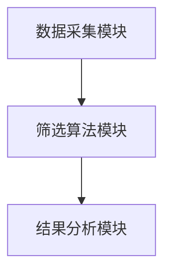

                 


# 《约翰·奈夫的低市盈率投资法：简单而有效的价值策略》

> **关键词**：低市盈率投资法、约翰·奈夫、价值投资、股票筛选、投资策略  
> 
> **摘要**：本文深入探讨了约翰·奈夫的低市盈率投资法，从其理论基础、核心概念、算法原理到实际应用，全面分析了这一简单而有效的价值投资策略。文章通过详细的逻辑推理和实际案例，揭示了低市盈率投资法的内在逻辑、数学模型以及在现代投资环境中的应用前景。通过对低市盈率投资法的系统分析，本文旨在为投资者提供一种简洁而高效的投资策略，帮助他们在复杂多变的市场中实现稳健的投资收益。

---

# 《约翰·奈夫的低市盈率投资法：简单而有效的价值策略》

## 《约翰·奈夫的低市盈率投资法：简单而有效的价值策略》

---

## 《约翰·奈夫的低市盈率投资法：简单而有效的价值策略》

### **摘要**  
约翰·奈夫的低市盈率投资法是一种简单而有效的价值投资策略，其核心在于通过筛选低市盈率的股票来寻找被市场低估的投资机会。本文从低市盈率投资法的理论基础、核心概念、算法原理、数学模型以及实际应用等多个角度，全面分析了这一投资策略的内在逻辑和实践价值。通过详细的逻辑推理和实际案例，本文揭示了低市盈率投资法在现代投资环境中的优势和局限性，为投资者提供了一种简洁而高效的投资策略。

---

### **关键词**  
- 低市盈率投资法  
- 约翰·奈夫  
- 价值投资  
- 股票筛选  
- 投资策略  

---

## 《约翰·奈夫的低市盈率投资法：简单而有效的价值策略》

### 第一部分: 低市盈率投资法的理论基础

#### 第1章: 低市盈率投资法的起源与发展

##### 1.1 低市盈率投资法的起源  
低市盈率投资法起源于价值投资理念，其核心思想是通过寻找市场低估的股票，利用市场的非理性波动实现超额收益。约翰·奈夫是这一投资策略的代表人物之一，他通过长期实践总结出一套简单而有效的股票筛选方法。

##### 1.2 价值投资与低市盈率投资法的关系  
价值投资强调买入具有内在价值的股票，而低市盈率投资法是价值投资的一种具体实现方式。它通过市盈率这一简单而有效的估值指标，帮助投资者快速筛选出具有投资潜力的股票。

##### 1.3 低市盈率投资法的核心思想  
低市盈率投资法的核心思想是：通过筛选市盈率低于市场平均水平的股票，寻找具有长期投资价值的标的。这种方法不仅简单易行，而且能够有效规避市场的短期波动风险。

---

#### 第2章: 低市盈率投资法的核心概念

##### 2.1 市盈率的定义与计算  
市盈率（P/E）是衡量股票估值的重要指标，其计算公式为：  
$$ P/E = \frac{\text{股价}}{\text{每股收益}} $$  
市盈率反映了市场对公司未来盈利能力的预期，是投资者评估股票价值的重要工具。

##### 2.2 低市盈率投资法的筛选标准  
低市盈率投资法的核心在于通过以下标准筛选股票：  
1. 市盈率低于市场平均水平（如15倍）。  
2. 公司具有稳定的盈利能力。  
3. 行业地位稳固，竞争优势明显。  

##### 2.3 低市盈率与高分红的结合  
低市盈率投资法通常与高分红策略相结合，通过筛选低市盈率且高分红的股票，投资者能够在获得股息收入的同时，等待股价回升带来的资本增值。

---

#### 第3章: 低市盈率投资法的逻辑与原理

##### 3.1 低市盈率投资法的逻辑框架  
低市盈率投资法的逻辑框架包括以下步骤：  
1. 确定市场平均市盈率。  
2. 筛选市盈率低于市场平均值的股票。  
3. 评估公司的基本面，确认其盈利能力和行业地位。  
4. 结合市场环境和行业趋势，选择具有长期投资价值的股票。

##### 3.2 低市盈率投资法的数学模型  
低市盈率投资法的数学模型可以通过以下公式表示：  
$$ \text{筛选条件} = \begin{cases}  
\text{市盈率} < \text{市场平均市盈率} & \text{且} \\  
\text{每股收益} > 0 & \text{且} \\  
\text{行业地位} = \text{稳固}  
\end{cases} $$  
通过上述公式，投资者可以快速筛选出符合低市盈率投资法的股票。

##### 3.3 低市盈率投资法的优缺点  
**优点**：  
- 策略简单易行，易于理解和实施。  
- 通过低市盈率筛选出的股票通常具有较高的安全边际。  
- 适合长期投资者，能够在市场波动中获得稳定收益。  

**缺点**：  
- 低市盈率股票可能隐藏着较大的风险，如公司基本面恶化。  
- 短期内可能跑输市场，需要较长的时间周期才能体现投资价值。  

---

#### 第4章: 低市盈率投资法的系统架构

##### 4.1 系统功能设计  
低市盈率投资法的系统架构包括以下功能模块：  
1. 数据采集模块：收集股票的市盈率、每股收益等数据。  
2. 筛选算法模块：根据低市盈率标准筛选股票。  
3. 结果分析模块：对筛选结果进行进一步分析，评估投资价值。  

##### 4.2 系统架构图  


##### 4.3 系统交互流程  
```mermaid  
sequenceDiagram  
    actor 投资者  
    participant 数据源  
    participant 系统  
   投资者->数据源：请求股票数据  
    data源->系统：返回股票数据  
    系统->投资者：显示筛选结果  
```

---

#### 第5章: 低市盈率投资法的实战案例

##### 5.1 案例背景  
假设当前市场平均市盈率为15倍，投资者希望通过低市盈率投资法筛选出具有投资价值的股票。

##### 5.2 数据收集与筛选  
投资者收集了以下股票的市盈率和每股收益数据：  

| 股票代码 | 市盈率 | 每股收益 | 行业地位 |  
|----------|--------|----------|----------|  
| A        | 10     | 2        | 稳固     |  
| B        | 12     | 1.5      | 稳固     |  
| C        | 18     | 1        | 竞争     |  

##### 5.3 筛选结果分析  
根据低市盈率投资法的筛选标准，投资者选择市盈率低于15倍的股票A和B。进一步分析发现，股票A的每股收益为2元，行业地位稳固；股票B的每股收益为1.5元，行业地位同样稳固。因此，投资者可以选择股票A和B作为投资标的。

##### 5.4 投资策略  
投资者可以选择在低市盈率股票的基础上，结合高分红策略，进一步优化投资组合。例如，优先选择股息率高且市盈率低的股票。

---

### 第二部分: 低市盈率投资法的实践与优化

#### 第6章: 低市盈率投资法的优化策略

##### 6.1 动态调整筛选标准  
投资者可以根据市场环境和行业趋势，动态调整低市盈率投资法的筛选标准。例如，在市场低迷时期，可以适当降低筛选标准，扩大投资范围；在市场繁荣时期，可以提高筛选标准，避免过度投资。

##### 6.2 结合其他估值指标  
低市盈率投资法可以与其他估值指标（如市净率、股息率等）结合使用，进一步提高筛选的准确性和投资收益。

##### 6.3 长期投资与短期交易的结合  
低市盈率投资法更适合长期投资者，但在某些情况下，也可以结合短期交易策略，捕捉市场波动带来的超额收益。

---

### 第三部分: 低市盈率投资法的总结与展望

#### 第7章: 低市盈率投资法的总结与展望

##### 7.1 总结  
低市盈率投资法是一种简单而有效的价值投资策略，其核心在于通过筛选低市盈率的股票，寻找具有长期投资价值的标的。这种方法不仅适合个人投资者，也适合机构投资者，能够在复杂多变的市场环境中帮助投资者实现稳健的收益。

##### 7.2 展望  
随着市场环境的变化和技术的进步，低市盈率投资法将不断创新和优化。未来，投资者可以通过大数据和人工智能技术，进一步提升股票筛选的效率和准确性，实现更加精准的投资决策。

---

### 第四部分: 低市盈率投资法的拓展阅读

#### 第8章: 低市盈率投资法的拓展阅读

##### 8.1 价值投资经典著作  
- 《巴菲特投资策略》  
- 《彼得·林奇谈投资》  
- 《股票作手回忆录》  

##### 8.2 低市盈率投资法的最新研究  
- 《低市盈率策略在新兴市场的应用》  
- 《大数据时代下的低市盈率投资法》  
- 《人工智能在低市盈率股票筛选中的应用》  

---

### **结语**  
约翰·奈夫的低市盈率投资法是一种简单而有效的价值投资策略，其核心在于通过筛选低市盈率的股票，寻找具有长期投资价值的标的。通过本文的详细分析，投资者可以更好地理解这一策略的内在逻辑和实践价值。希望本文能够为投资者在复杂多变的市场中提供一种简洁而高效的投资策略，帮助他们在投资道路上走得更远、更稳。

---

### **注意事项**  
- 本文内容仅为投资策略的理论分析，不构成具体的投资建议。投资者在实际操作中应结合市场环境和自身情况，谨慎决策。  
- 低市盈率投资法仅适用于长期投资者，短期投资者应谨慎使用。  
- 投资者在使用低市盈率投资法时，应结合其他估值指标和市场环境，避免单一依赖市盈率指标。

---

### **拓展阅读**  
- 《低市盈率投资法的数学模型与优化》  
- 《大数据与人工智能在股票筛选中的应用》  
- 《投资心理学：如何避免投资中的常见错误》  

---

通过本文的详细分析，读者可以全面理解约翰·奈夫的低市盈率投资法的理论基础、核心概念、算法原理以及实际应用。希望本文能够为投资者提供一种简单而有效的投资策略，帮助他们在复杂多变的市场中实现稳健的投资收益。

