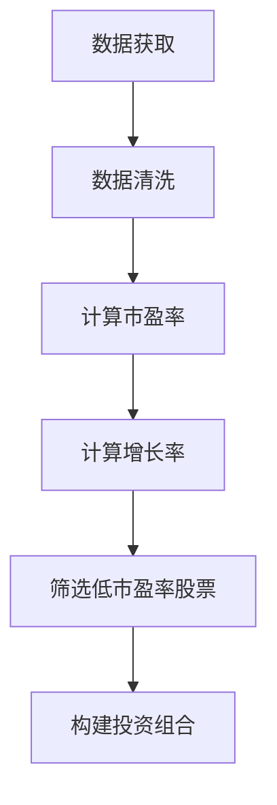

                 


# 约翰·奈夫的低市盈率投资法：简单而有效的价值策略

## 关键词
- 低市盈率投资法
- 约翰·奈夫
- 价值投资
- 投资策略
- 市盈率

## 摘要
低市盈率投资法是一种简单而有效的价值投资策略，由投资大师约翰·奈夫提出。该方法通过寻找市盈率低于市场平均水平的股票，挖掘被市场低估的投资机会。本文将详细介绍低市盈率投资法的背景、核心概念、数学模型、算法实现以及实际应用，并通过具体案例分析，帮助读者全面理解这一投资策略。

---

# 第一部分: 低市盈率投资法的背景与核心概念

## 第1章: 低市盈率投资法的起源与发展

### 1.1 低市盈率投资法的起源
#### 1.1.1 价值投资的起源
价值投资是一种以基本面分析为基础的投资策略，起源于20世纪初。本杰明·格雷厄姆和戴维·多德是价值投资的奠基人，他们强调以低于内在价值的价格购买股票。这种理念为后来的低市盈率投资法奠定了基础。

#### 1.1.2 约翰·奈夫的贡献
约翰·奈夫（John Neff）是低市盈率投资法的代表人物。他在富达投资管理公司（Fidelity）的长期任职中，通过低市盈率策略取得了卓越的投资业绩。奈夫提出，低市盈率股票通常具有较高的股息率和较低的估值，这些股票往往在市场低迷时被忽视，但在长期却能为投资者带来超额收益。

#### 1.1.3 低市盈率投资法的演变
随着市场的变化，低市盈率投资法不断完善。奈夫的策略并非一成不变，而是根据市场环境和企业基本面进行动态调整。这种方法的核心在于寻找那些被市场低估，但具有稳定增长潜力的企业。

### 1.2 低市盈率投资法的核心理念
#### 1.2.1 价值投资的基本原则
价值投资的核心是寻找市场价格低于内在价值的股票。低市盈率投资法通过市盈率这一指标，量化了这一原则，使得投资者能够更方便地筛选出具有投资价值的股票。

#### 1.2.2 低市盈率的定义与标准
市盈率（PE）= 股价 / 每股收益（EPS）。一般来说，市盈率低于市场平均水平的股票被认为是低估的。奈夫通常选择市盈率低于15倍的股票，并结合增长率、股息率等指标进行综合评估。

#### 1.2.3 投资策略的核心要素
- **低市盈率筛选**：通过市盈率指标筛选出低于市场平均水平的股票。
- **基本面分析**：结合企业盈利能力、成长性、财务状况等因素，进一步筛选出具有投资价值的股票。
- **长期持有**：低市盈率投资法强调长期持有优质股票，避免频繁交易。

---

## 第2章: 低市盈率投资法与传统投资方法的区别

### 2.1 传统投资方法的局限性
#### 2.1.1 基于市场的投资误区
传统投资方法往往过于关注市场趋势和短期波动，忽视了企业的基本面。这种方法容易受到市场情绪的影响，导致投资决策失误。

#### 2.1.2 短期波动对投资者的影响
短期波动常常让投资者陷入追涨杀跌的陷阱，而低市盈率投资法则通过长期持有，规避了短期波动的风险。

#### 2.1.3 追求收益的常见陷阱
许多投资者为了追求短期收益，过度依赖杠杆或高风险资产，这种做法往往会导致更大的亏损。

### 2.2 低市盈率投资法的独特优势
#### 2.2.1 长期价值导向
低市盈率投资法注重企业的内在价值，通过长期持有优质股票，实现财富的稳步增长。

#### 2.2.2 低风险与高收益的平衡
通过选择低市盈率股票，投资者可以在控制风险的同时，获得较高的收益。这种方法尤其适合风险厌恶型投资者。

#### 2.2.3 抗跌性强的特点
低市盈率股票通常具有较高的安全边际，能够在市场下跌时表现出较强的抗跌性。

### 2.3 核心概念对比分析
#### 2.3.1 市盈率与市净率的对比
市盈率（PE）衡量的是股价与每股收益的关系，而市净率（PB）衡量的是股价与每股净资产的关系。两者各有优缺点，通常结合使用以全面评估企业价值。

#### 2.3.2 高增长与低市盈率的平衡
高增长企业通常具有较高的市盈率，但低市盈率企业可能更具投资价值，尤其是当其增长潜力被市场低估时。

#### 2.3.3 低市盈率与高股息率的关系
低市盈率股票往往具有较高的股息率，这使得投资者在获得股息收入的同时，还能享受股价上涨的潜在收益。

---

# 第二部分: 低市盈率投资法的核心原理与数学模型

## 第3章: 市盈率与内在价值的计算方法

### 3.1 市盈率的计算与分析
#### 3.1.1 市盈率的公式与应用场景
市盈率（PE）= 股价 / 每股收益（EPS）。该指标反映了市场对公司未来盈利能力的预期。市盈率越低，通常意味着股票的估值越低。

#### 3.1.2 市盈率的行业差异
不同行业的市盈率标准差异较大。例如，科技行业的市盈率通常较高，而传统制造业的市盈率较低。因此，在使用市盈率进行投资决策时，需要结合行业特点进行分析。

#### 3.1.3 市盈率的历史数据分析
通过分析历史市盈率数据，可以发现市场的周期性波动。低市盈率股票往往在市场低迷时出现，而在市场繁荣时被忽视。

### 3.2 内在价值的评估方法
#### 3.2.1 现金流量折现法
现金流量折现法（DCF）是评估企业内在价值的常用方法。该方法通过将未来现金流折现，计算出企业的当前价值。

$$\text{内在价值} = \sum_{t=1}^{n} \frac{\text{现金流}_t}{(1+r)^t}$$

其中，$r$ 是折现率，$n$ 是预测期数。

#### 3.2.2 市盈率与增长率的结合
低市盈率投资法中，通常结合市盈率与增长率（PEG指标）进行筛选。PEG指标的计算公式为：

$$\text{PEG} = \frac{\text{市盈率}}{\text{净利润增长率}}$$

当PEG小于1时，通常认为股票具有投资价值。

#### 3.2.3 行业基准的对比分析
在评估企业的内在价值时，需要将其与行业基准进行对比。例如，可以将企业的市盈率与行业平均水平进行比较，以判断其估值是否合理。

### 3.3 低市盈率投资法的数学模型
#### 3.3.1 市盈率与增长率的关系
低市盈率投资法的核心是寻找市盈率低于行业平均水平，同时具有稳定增长潜力的企业。因此，可以通过以下公式筛选股票：

$$\text{筛选条件} = \text{市盈率} < \text{行业平均市盈率} \text{ 且 } \text{净利润增长率} > \text{行业平均增长率}$$

#### 3.3.2 内在价值的计算公式
内在价值的计算公式可以简化为以下形式：

$$\text{内在价值} = \frac{\text{净利润}}{\text{贴现率}}$$

其中，贴现率通常取企业的资本成本，例如无风险利率加上企业的风险溢价。

---

## 第4章: 低市盈率投资法的算法实现

### 4.1 投资策略的算法框架
#### 4.1.1 数据收集与预处理
- 数据来源：从金融数据库获取股票的历史数据，包括股价、净利润、每股收益等。
- 数据清洗：剔除缺失值和异常值，确保数据的完整性和准确性。

#### 4.1.2 市盈率与增长率的计算
- 计算市盈率：$\text{PE} = \frac{\text{股价}}{\text{每股收益}}$
- 计算净利润增长率：$\text{Growth} = \frac{\text{本期净利润} - \text{上期净利润}}{\text{上期净利润}}$

#### 4.1.3 投资组合的优化算法
- 筛选低市盈率股票：$\text{PE} < \text{行业平均PE}$
- 结合其他指标：如PEG、股息率等，进一步筛选出优质股票。
- 构建投资组合：根据风险偏好和收益目标，合理分配资金，分散投资风险。

### 4.2 基于Python的低市盈率筛选算法
#### 4.2.1 数据获取与清洗代码
```python
import pandas as pd
import yfinance as yf

# 下载股票数据
data = yf.download(tickers='AAPL MSFT', start='2020-01-01', end='2023-01-01')

# 清洗数据
data = data['Adj Close']
data = data.dropna()
```

#### 4.2.2 市盈率与增长率计算代码
```python
import pandas as pd

# 计算市盈率
data['PE'] = data['Adj Close'] / data['EPS']

# 计算净利润增长率
data['Growth'] = (data['净利润'] - data['上期净利润']) / data['上期净利润']
```

#### 4.2.3 筛选低市盈率股票代码
```python
# 筛选条件：PE < 行业平均PE 且 Growth > 行业平均Growth
筛选结果 = data[(data['PE'] < 行业平均PE) & (data['Growth'] > 行业平均Growth)]
```

### 4.3 算法流程图


---

## 第5章: 低市盈率投资法的实际应用

### 5.1 项目实战：筛选低市盈率股票
#### 5.1.1 数据收集与分析
从金融数据库中获取过去5年的股票数据，包括股价、净利润、每股收益等。

#### 5.1.2 筛选低市盈率股票
根据行业平均市盈率，筛选出市盈率低于行业平均水平的股票。

#### 5.1.3 构建投资组合
根据筛选结果，结合其他指标（如PEG、股息率等），构建投资组合，并进行风险分散。

### 5.2 案例分析：2020年市场中的低市盈率股票
以2020年为例，分析市场中低市盈率股票的表现。例如，某公司市盈率为12倍，行业平均市盈率为18倍，净利润增长率为10%，PEG为0.7，符合低市盈率投资法的筛选条件。

### 5.3 投资组合的优化与调整
根据市场环境和企业基本面的变化，定期调整投资组合，确保其持续符合低市盈率投资法的要求。

---

## 第6章: 最佳实践与投资策略小结

### 6.1 投资策略的注意事项
- **风险控制**：低市盈率股票并非绝对安全，仍需关注企业的财务状况和行业前景。
- **长期持有**：低市盈率投资法强调长期持有，避免频繁交易。
- **分散投资**：通过分散投资降低风险，避免过度集中于某一只股票。

### 6.2 投资策略的总结与展望
低市盈率投资法是一种简单而有效的价值投资策略，尤其适合风险厌恶型投资者。随着市场的不断发展，该策略需要根据实际情况进行动态调整，以适应新的市场环境。

---

通过以上详细的分析和实际案例，我们可以看到，低市盈率投资法不仅是一种有效的投资策略，更是一种长期价值导向的投资理念。这种方法通过量化指标和基本面分析，帮助投资者在复杂的市场环境中找到具有投资价值的股票。希望本文能够为读者提供有价值的见解，帮助他们在投资道路上走得更稳、更远。

