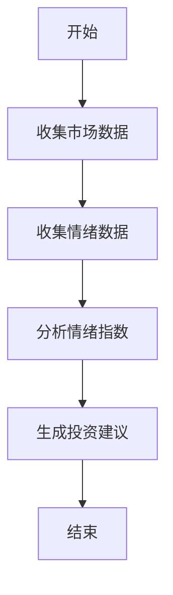
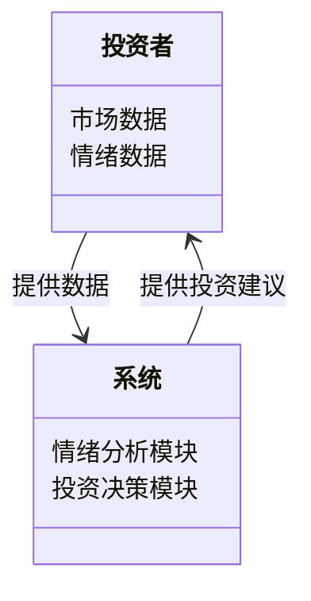
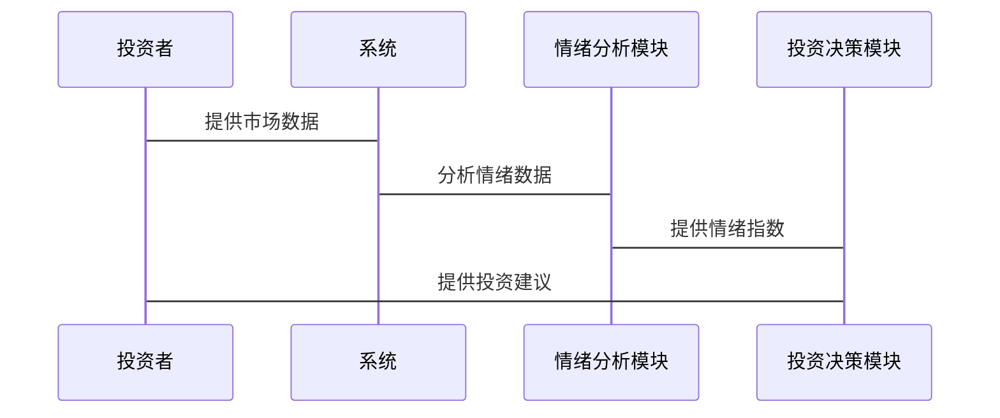

                 


# 约翰·聂夫的价值投资者情绪管理

> 关键词：约翰·聂夫、价值投资、情绪管理、投资心理、投资策略、投资心态、投资者心理

> 摘要：本文深入探讨了约翰·聂夫作为价值投资者的情绪管理方法，分析了情绪在投资决策中的重要性，并结合算法模型、系统架构和项目实战，详细阐述了如何通过情绪管理提升投资绩效。

---

## 第一部分: 价值投资与情绪管理的背景介绍

### 第1章: 价值投资的核心概念

#### 1.1 价值投资的定义与特点
##### 1.1.1 价值投资的定义
价值投资是一种以基本面分析为基础的投资策略，强调以低于内在价值的价格买入优质资产，长期持有，等待市场的合理定价。

##### 1.1.2 价值投资的核心特点
- **长期导向**：关注企业的长期价值，而非短期价格波动。
- **安全边际**：买入价格低于内在价值，以降低风险。
- **逆向思维**：在市场恐慌时寻找机会，在市场狂热时保持冷静。

##### 1.1.3 价值投资的边界与外延
- **边界**：价值投资不等于盲目低价买入，需结合企业基本面。
- **外延**：涵盖股票、债券等多种资产，但核心是企业价值的深度分析。

#### 1.2 情绪管理在投资中的重要性
##### 1.2.1 投资中的情绪问题
- **贪婪与恐惧**：市场上涨时贪婪，下跌时恐惧，影响理性判断。
- **过度自信**：忽视风险，导致错误决策。
- **从众心理**：跟随市场潮流，忽视独立思考。

##### 1.2.2 情绪对投资决策的影响
- **决策失误**：情绪波动可能导致错误买入或卖出。
- **绩效不佳**：情绪不稳定者往往难以长期坚持价值投资。
- **机会错失**：情绪化决策可能错过优质资产的买入机会。

##### 1.2.3 情绪管理的必要性
- **保持理性**：通过情绪管理控制投资行为。
- **提升绩效**：稳定情绪有助于长期坚持价值投资策略。
- **降低风险**：避免因情绪波动导致的重大损失。

### 第2章: 约翰·聂夫的价值投资理念

#### 2.1 约翰·聂夫的生平与成就
##### 2.1.1 约翰·聂夫的背景介绍
- 约翰·聂夫是美国著名的价值投资者，曾管理伯克希尔哈撒韦公司多年。
- 以保守、谨慎的投资风格著称，注重安全边际。

##### 2.1.2 约翰·聂夫的投资成就
- 长期投资绩效优异，创造了超越市场的回报。
- 在市场恐慌时买入优质资产，市场狂热时卖出，展现了卓越的逆向思维。

##### 2.1.3 约翰·聂夫的投资哲学
- **安全边际**：买入价格远低于内在价值。
- **长期持有**：耐心等待市场回归理性。
- **逆向投资**：在市场底部买入，在顶部卖出。

#### 2.2 约翰·聂夫的情绪管理方法
##### 2.2.1 约翰·聂夫的情绪管理理念
- **情绪控制**：通过严格的纪律控制投资行为。
- **独立思考**：避免被市场情绪左右。
- **长期视角**：关注企业的长期价值，而非短期波动。

##### 2.2.2 约翰·聂夫的情绪管理技巧
- **定期反思**：定期回顾投资决策，分析情绪影响。
- **设定止损**：在情绪波动时设定止损点，避免过度损失。
- **分散投资**：通过分散投资降低情绪风险。

##### 2.2.3 约翰·聂夫的情绪管理实践
- **严格纪律**：坚持价值投资原则，不受市场情绪干扰。
- **独立判断**：不被市场舆论左右，坚持自己的判断。
- **耐心等待**：在市场狂热时保持冷静，等待调整机会。

---

## 第二部分: 情绪管理的核心概念与联系

### 第3章: 情绪与投资决策的关系

#### 3.1 情绪对投资决策的影响
##### 3.1.1 情绪的定义与分类
- **情绪**：投资者在投资过程中产生的心理状态，包括贪婪、恐惧、兴奋、焦虑等。
- **分类**：分为正面情绪（贪婪、兴奋）和负面情绪（恐惧、焦虑）。

##### 3.1.2 情绪对投资决策的正向影响
- **正面情绪**：适度的兴奋可能提升投资者的决策效率，但过度的贪婪可能导致高估资产价值。
- **负面情绪**：适度的焦虑可能促使投资者更加谨慎，但过度的恐惧可能导致错失投资机会。

##### 3.1.3 情绪对投资决策的负向影响
- **决策失误**：情绪波动可能导致错误的买入或卖出决策。
- **绩效不佳**：情绪不稳定者往往难以长期坚持投资策略。
- **机会错失**：情绪化决策可能错过优质资产的买入机会。

#### 3.2 情绪与投资行为的联系
##### 3.2.1 情绪周期与投资周期的关系
- **情绪周期**：投资者情绪通常呈现周期性波动，与市场周期密切相关。
- **投资周期**：在市场底部，投资者情绪低落，而在市场顶部，投资者情绪高涨。

##### 3.2.2 情绪波动与市场波动的关联
- **市场波动**：情绪波动是市场波动的重要驱动力。
- **投资者情绪**：投资者情绪的波动会影响市场的买卖行为，从而影响市场价格。

##### 3.2.3 情绪管理与投资绩效的关联
- **情绪管理**：良好的情绪管理能力可以提升投资绩效。
- **投资绩效**：投资绩效不仅取决于基本面分析，还与情绪管理密切相关。

### 第4章: 情绪管理的核心要素

#### 4.1 情绪管理的定义与目标
##### 4.1.1 情绪管理的定义
- 情绪管理是指通过合理的方法和策略，控制和调节情绪，以实现投资目标的过程。

##### 4.1.2 情绪管理的目标
- **保持理性**：在投资过程中保持冷静，避免情绪化决策。
- **提升绩效**：通过情绪管理提升投资绩效。
- **降低风险**：通过情绪管理降低投资风险。

#### 4.2 情绪管理的核心要素
##### 4.2.1 自我认知
- **自我认知**：了解自己的情绪特点和投资风格，找到情绪管理的突破口。

##### 4.2.2 自我调节
- **自我调节**：通过心理调节和行为调节，控制情绪波动。

##### 4.2.3 自我激励
- **自我激励**：通过设定目标和激励机制，保持积极的投资心态。

---

## 第三部分: 情绪管理的算法原理

### 第5章: 情绪管理的算法模型

#### 5.1 情绪管理的算法原理
##### 5.1.1 算法模型的定义
- 情绪管理算法模型是一种通过数学方法量化情绪波动，从而指导投资决策的模型。

##### 5.1.2 算法模型的输入与输出
- **输入**：市场数据（如价格、成交量）、投资者情绪数据。
- **输出**：投资建议（如买入、卖出）、情绪调节策略。

##### 5.1.3 算法模型的核心步骤
1. **数据收集**：收集市场数据和投资者情绪数据。
2. **情绪分析**：分析投资者情绪，量化情绪指数。
3. **投资决策**：根据情绪指数和市场数据，生成投资建议。

#### 5.2 情绪管理的算法流程图


#### 5.3 情绪管理的数学模型
##### 5.3.1 情绪指数计算公式
$$情绪指数 = \sum_{i=1}^{n} (情绪强度_i \times 权重_i)$$

##### 5.3.2 情绪调节
- **情绪调节**：通过数学模型量化情绪指数，指导投资决策。

---

## 第四部分: 情绪管理的系统架构

### 第6章: 情绪管理的系统架构

#### 6.1 系统功能设计
##### 6.1.1 领域模型


#### 6.2 系统架构设计
##### 6.2.1 系统架构图


#### 6.3 系统接口设计
- **输入接口**：接收市场数据和情绪数据。
- **输出接口**：输出投资建议和情绪调节策略。

#### 6.4 系统交互
##### 6.4.1 交互流程图


---

## 第五部分: 情绪管理的项目实战

### 第7章: 情绪管理的项目实战

#### 7.1 环境安装
- **工具安装**：安装Python、Jupyter Notebook、pandas、numpy等工具。

#### 7.2 系统核心实现
##### 7.2.1 情绪指数计算代码
```python
import pandas as pd
import numpy as np

def calculate_emotion_index(data):
    # 数据预处理
    data['情绪强度'] = data['情绪强度'].fillna(0)
    data['权重'] = data['权重'].fillna(1)
    
    # 情绪指数计算
    emotion_index = data['情绪强度'] * data['权重']
    emotion_index = emotion_index.sum() / len(data)
    
    return emotion_index
```

##### 7.2.2 投资决策模块代码
```python
def investment_decision(emotion_index, market_data):
    # 根据情绪指数和市场数据生成投资建议
    if emotion_index < 0.3 and market_data['价格'] < market_data['价值']:
        return '买入'
    elif emotion_index > 0.7 and market_data['价格'] > market_data['价值']:
        return '卖出'
    else:
        return '观望'
```

#### 7.3 实际案例分析
- **案例分析**：通过具体案例分析情绪管理算法的实际应用。

#### 7.4 项目小结
- **小结**：总结项目实施过程中的经验和教训，提出改进建议。

---

## 第六部分: 情绪管理的最佳实践

### 第8章: 情绪管理的最佳实践

#### 8.1 小结
- **总结**：总结全文内容，强调情绪管理在投资中的重要性。

#### 8.2 注意事项
- **注意事项**：在实际应用中，需注意数据的准确性和模型的适用性。

#### 8.3 拓展阅读
- **拓展阅读**：推荐相关书籍和文献，供读者深入学习。

---

## 结语

情绪管理是价值投资成功的关键因素之一。通过本文的分析，我们可以看到，约翰·聂夫通过严格的纪律和独立思考，成功地将情绪管理融入投资决策中。希望本文的分析和方法能为投资者提供有价值的参考，帮助他们在复杂多变的市场中保持理性，实现长期稳定的收益。

