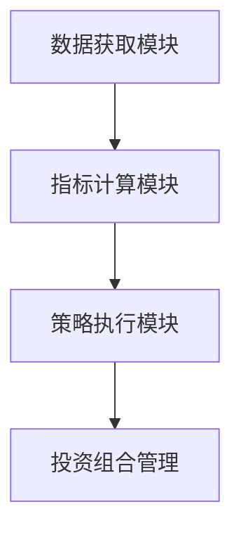

                 

# 约翰·邓普顿的危机投资策略：在恐慌中寻找机会

---

## 关键词：
约翰·邓普顿, 危机投资, 价值投资, 市场恐慌, 投资策略, 股票分析, 风险管理

---

## 摘要：
本文深入探讨了约翰·邓普顿的危机投资策略，分析了他在市场恐慌中寻找投资机会的核心思想。通过详细解析其投资哲学、选股方法和风险管理策略，结合实际案例和数学模型，帮助读者理解如何在危机中捕捉价值。文章还从技术角度分析了投资策略的系统架构和实现方法，为投资者提供实用的指导。

---

# 正文

## 第一部分：约翰·邓普顿的生平与投资理念

### 第1章：约翰·邓普顿的生平简介

#### 1.1 约翰·邓普顿的早年经历与职业生涯
约翰·邓普顿（John Templeton）是20世纪著名的投资家，出生于1912年，逝世于2008年。他早年在英国学习法律，后转战美国，成为最早一批进入投资行业的国际投资者。他的职业生涯跨越了多个经济周期，积累了丰富的投资经验。

#### 1.2 邓普顿的投资哲学
邓普顿的投资理念以价值投资为核心，强调在市场恐慌中寻找被低估的投资机会。他主张长期投资，并注重风险管理，提倡在市场底部买入，顶部卖出。

---

## 第二部分：危机投资策略的核心概念

### 第2章：危机投资的基本原理

#### 2.1 市场恐慌的定义与表现
市场恐慌是指投资者因情绪波动导致的非理性行为，通常表现为股票价格大幅波动、交易量下降等。恐慌的周期性与经济周期密切相关。

#### 2.2 逆向投资的原理
逆向投资是指在市场恐慌时买入，在市场繁荣时卖出。邓普顿的策略强调在恐慌中寻找低估资产，在理性中寻找高估资产。

---

## 第三部分：约翰·邓普顿的危机投资策略

### 第3章：在市场恐慌中寻找投资机会

#### 3.1 逆向投资的实施步骤
1. **识别市场恐慌**：通过分析市场情绪、估值指标等判断市场是否处于恐慌状态。
2. **筛选低估资产**：利用市盈率（P/E）、市净率（P/B）等指标寻找被低估的股票。
3. **构建投资组合**：分散投资，降低风险。

#### 3.2 投资组合管理
- **分散投资**：避免过度集中在某一资产或行业。
- **定期再平衡**：根据市场变化调整持仓比例。

---

## 第四部分：数学模型与算法分析

### 第4章：价值投资的数学模型

#### 4.1 市盈率与市净率的计算公式
- 市盈率（P/E）= 股价 / 每股净利润
- 市净率（P/B）= 股价 / 每股净资产

#### 4.2 股票估值的计算方法
以某公司为例：
- 每股净利润（EPS）= 1元
- 股价 = 10元
- 市盈率 = 10 / 1 = 10倍

---

## 第五部分：系统架构与技术实现

### 第5章：投资组合管理系统架构

#### 5.1 系统功能模块
- 数据获取模块：获取股票数据。
- 指标计算模块：计算P/E、P/B等指标。
- 策略执行模块：根据策略生成买卖信号。

#### 5.2 系统架构图

---

## 第六部分：项目实战与案例分析

### 第6章：实际案例分析

#### 6.1 案例背景
假设2008年金融危机期间，市场恐慌指数上升，许多优质股票被低估。

#### 6.2 投资组合构建
- 选择市盈率低于行业平均水平的股票。
- 分散投资，涵盖多个行业。

---

## 第七部分：总结与展望

### 第7章：总结与小结

#### 7.1 总结
约翰·邓普顿的危机投资策略强调在市场恐慌中寻找低估资产，通过逆向投资实现超额收益。投资者应结合数学模型和系统架构，制定科学的投资策略。

#### 7.2 小结
在实际操作中，投资者需注重风险管理，避免过度依赖单一策略。同时，结合技术分析和基本面分析，提高投资决策的准确性。

---

## 第八部分：最佳实践与注意事项

### 第8章：最佳实践

#### 8.1 投资策略的注意事项
- 定期审视投资组合，及时调整。
- 保持耐心，避免频繁交易。

#### 8.2 拓展阅读
建议读者阅读《约翰·邓普顿的投资哲学》等相关书籍，深入理解其投资理念。

---

# 结语

约翰·邓普顿的危机投资策略为投资者提供了宝贵的思路。通过结合技术分析和基本面分析，投资者可以在市场恐慌中寻找机会，实现长期稳健的投资收益。希望本文的分析能为读者提供启发和指导。

