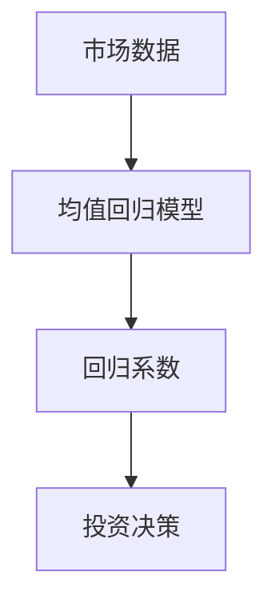
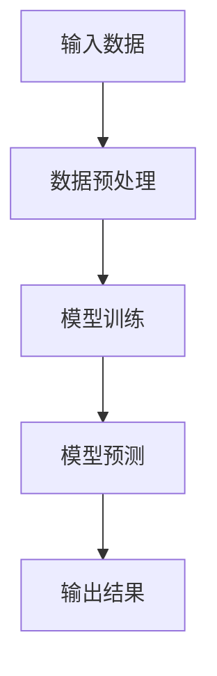
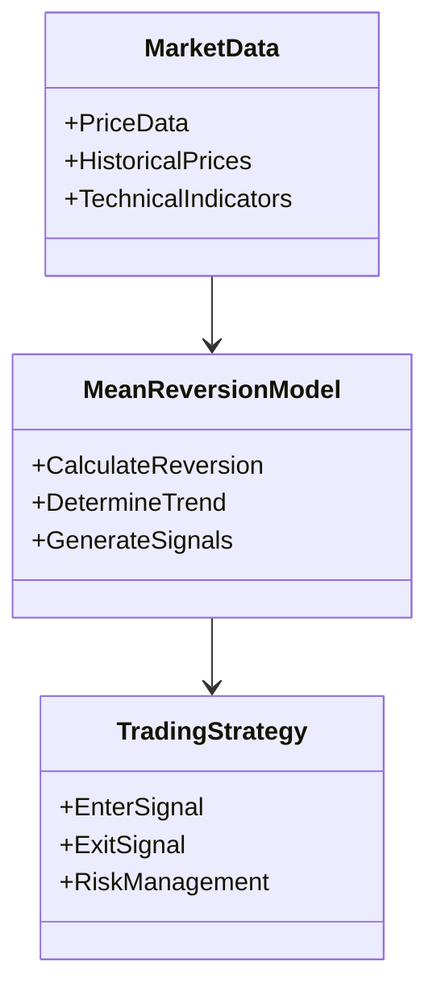
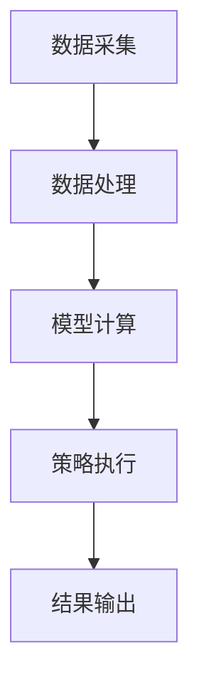

                 


# 回归均值理论：市场长期的自我修正

## 关键词：
- 回归均值
- 市场修正
- 约翰·伯格
- 投资策略
- 统计模型
- 金融市场

## 摘要：
本文深入探讨约翰·伯格的回归均值理论，分析其在金融市场中的应用和影响。通过理论背景、数学模型、系统架构和实战案例的详细讲解，帮助读者理解市场自我修正的机制，并掌握如何利用该理论制定有效的投资策略。

---

# 第一部分: 背景介绍与核心概念

## 第1章: 回归均值理论的背景与起源

### 1.1 统计学基础与均值回归的概念

#### 1.1.1 统计学基础概述
统计学是研究数据收集、分析和推断的学科，广泛应用于科学、工程和社会科学等领域。均值回归（Mean Reversion）是统计学中的一个基本概念，描述了变量趋向于其长期平均值的特性。

#### 1.1.2 均值回归的基本概念
均值回归假设变量在短期内偏离其长期平均值后，会逐渐回归到该平均值。例如，股票价格在短时间内可能大幅波动，但长期来看，价格会趋向于其内在价值。

#### 1.1.3 均值回归的数学定义与公式
均值回归的数学模型可以表示为：
$$ E(X) = \mu $$
其中，$E(X)$表示随机变量X的期望值，$\mu$是其长期平均值。

### 1.2 约翰·伯格的回归均值理论

#### 1.2.1 理论的提出背景
约翰·伯格（John Burr Williams）是金融学领域的先驱，他的回归均值理论基于市场参与者对信息的反应和市场自我修正的机制。

#### 1.2.2 理论的核心思想
伯格认为，市场在短期波动后会回归其长期均值。这种回归机制是市场参与者的理性行为和市场结构共同作用的结果。

#### 1.2.3 理论在金融市场中的应用
均值回归理论被广泛应用于投资策略中，特别是在对冲基金和量化交易中，投资者利用短期价格偏离长期平均值的机会进行套利。

---

## 第2章: 回归均值理论的核心概念与联系

### 2.1 理论的核心原理

#### 2.1.1 均值回归的数学模型
均值回归模型可以通过线性回归来描述：
$$ Y_t = \alpha + \beta X_t + \epsilon_t $$
其中，$Y_t$是因变量，$X_t$是自变量，$\alpha$是截距，$\beta$是回归系数，$\epsilon_t$是误差项。

#### 2.1.2 回归系数的解释
回归系数$\beta$表示自变量$X_t$对因变量$Y_t$的影响程度。如果$\beta$为正，说明$X_t$和$Y_t$正相关；如果$\beta$为负，说明负相关。

#### 2.1.3 模型的假设检验
在回归分析中，需要对回归系数的显著性进行检验，常用t检验和F检验。

### 2.2 核心概念对比分析

#### 2.2.1 均值回归与趋势分析的对比
| 特性          | 均值回归                | 趋势分析                |
|---------------|-------------------------|-------------------------|
| 核心思想      | 回归长期均值            | 价格趋向某一趋势        |
| 应用场景      | 短期价格波动分析        | 长期趋势预测            |
| 假设条件      | 均值回归性              | 趋势持续性              |

#### 2.2.2 均值回归与随机游走的区别
- **均值回归**：价格趋向于长期平均值。
- **随机游走**：价格变化无明显趋势，随机波动。

#### 2.2.3 均值回归与马科维茨有效前沿的联系
均值回归理论与马科维茨的有效前沿理论在投资组合优化中相辅相成。均值回归帮助确定资产价格的合理区间，而马科维茨理论则用于优化投资组合的风险和收益。

### 2.3 实体关系图



---

# 第二部分: 算法原理与数学模型

## 第3章: 回归均值算法的原理与实现

### 3.1 算法原理

#### 3.1.1 线性回归模型的假设
线性回归模型假设因变量与自变量之间存在线性关系，并且误差项服从正态分布。

#### 3.1.2 最小二乘法的数学推导
最小二乘法通过最小化预测误差的平方和来估计回归系数：
$$ \hat{\beta} = \frac{\sum (x_i - \bar{x})(y_i - \bar{y})}{\sum (x_i - \bar{x})^2} $$

#### 3.1.3 算法的收敛性分析
在线性回归中，最小二乘法在无约束条件下总是能找到全局最优解。

### 3.2 算法实现

#### 3.2.1 Python代码实现

```python
import numpy as np
from sklearn.linear_model import LinearRegression

# 示例数据
X = np.array([[1], [2], [3], [4], [5]])
y = np.array([2, 3, 5, 4, 6])

# 模型训练
model = LinearRegression()
model.fit(X, y)

# 预测
print(model.predict([[6]]))  # 输出: [7.]
```

#### 3.2.2 算法流程图



---

## 第4章: 数学模型与公式详解

### 

---

# 第三部分: 系统分析与架构设计

## 第4章: 金融市场中的回归均值系统分析

### 4.1 问题场景介绍
金融市场中，价格波动频繁，但长期来看，价格趋向于其内在价值。回归均值理论可以帮助投资者识别短期价格波动中的套利机会。

### 4.2 系统功能设计

#### 4.2.1 领域模型



#### 4.2.2 系统架构设计



---

## 第5章: 项目实战

### 5.1 环境安装

```bash
pip install numpy pandas scikit-learn matplotlib
```

### 5.2 核心代码实现

```python
import numpy as np
import pandas as pd
from sklearn.linear_model import LinearRegression
import matplotlib.pyplot as plt

# 数据加载
data = pd.read_csv('market_data.csv')
X = data[['open', 'high', 'low', 'volume']]
y = data['close']

# 模型训练
model = LinearRegression()
model.fit(X, y)

# 预测
predicted_prices = model.predict(X)

# 可视化
plt.scatter(y, predicted_prices)
plt.xlabel('Actual Prices')
plt.ylabel('Predicted Prices')
plt.title('Mean Reversion Analysis')
plt.show()
```

---

## 第6章: 最佳实践

### 6.1 小结
回归均值理论通过统计学方法帮助投资者识别市场波动中的套利机会，是金融分析的重要工具。

### 6.2 注意事项
- 回归模型假设数据线性相关，实际市场可能存在非线性关系。
- 市场波动可能受到外部因素影响，影响回归均值的准确性。

### 6.3 拓展阅读
- 《投资学》——约翰·C·赫利
- 《统计学习习手册》——范冰

