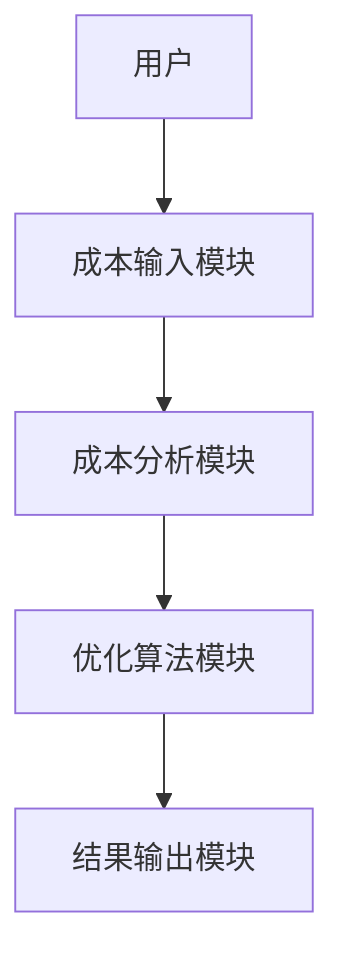

                 


# 约翰伯格的成本意识：为什么每一分钱都很重要

## 关键词：成本意识，价值优化，成本结构，数学模型，系统设计

## 摘要：成本意识是一种系统性的思维方式，它关注于如何通过最小化成本来最大化价值。本文从背景介绍、理论模型、算法实现、系统设计、项目实战到总结与展望，全面阐述了成本意识的重要性及其在实际应用中的具体方法。通过数学模型和系统架构图的详细分析，本文展示了如何在实际项目中有效优化成本，提升整体价值。

---

# 第1章: 成本意识的背景与重要性

## 1.1 成本意识的核心概念

### 1.1.1 成本意识的定义
成本意识是一种关注资源分配、价值创造和效率优化的思维方式。它不仅仅是对金钱的关注，更是对资源的合理利用和价值最大化的过程。

### 1.1.2 成本意识的重要性
- **资源优化**：通过合理分配资源，避免浪费，提高效率。
- **价值提升**：成本意识的核心在于通过优化成本结构，提升整体价值。
- **竞争力增强**：在竞争激烈的市场中，优化成本能够增强企业的竞争力。

### 1.1.3 成本意识的边界与外延
- 成本意识的边界在于避免过度优化导致的价值降低。
- 外延包括从个人决策到企业战略的广泛应用。

## 1.2 成本意识与价值的关系

### 1.2.1 成本与价值的基本概念
- 成本：资源的投入，包括人力、时间、金钱等。
- 价值：资源投入后产生的成果，包括产品、服务、利润等。

### 1.2.2 成本如何影响价值
- 成本的增加可能导致资源浪费，降低价值。
- 成本的合理分配可以提升效率，创造更大的价值。

### 1.2.3 成本与价值的平衡点
- 在成本和价值之间找到平衡点，是成本意识的核心任务。

## 1.3 成本意识的核心要素

### 1.3.1 成本构成要素
- 人力资源
- 物料成本
- 时间成本
- 机会成本

### 1.3.2 成本控制的关键点
- 预算管理
- 资源分配
- 效率优化

### 1.3.3 成本优化的目标
- 最小化成本
- 最大化价值
- 提升整体效率

## 1.4 本章小结
本章从成本意识的定义、重要性以及核心要素三个方面，全面介绍了成本意识的基本概念和其在实际中的应用。

---

# 第2章: 成本结构与价值的数学模型

## 2.1 成本结构的理论模型

### 2.1.1 成本结构的定义
成本结构是将成本按照不同类别和层次进行分解和分析的过程。

### 2.1.2 成本结构的分类
- 固定成本
- 可变成本
- 混合成本

### 2.1.3 成本结构的数学表示
$$ C = \sum_{i=1}^{n} c_i \cdot x_i $$
其中，$C$ 是总成本，$c_i$ 是第 $i$ 种成本的单位成本，$x_i$ 是第 $i$ 种成本的数量。

## 2.2 价值与成本的关系模型

### 2.2.1 价值的定义
价值是指资源投入后所创造的成果，可以用效用或收益来衡量。

### 2.2.2 成本与价值的数学关系
$$ V = f(C) $$
其中，$V$ 是价值，$f$ 是价值函数，$C$ 是成本。

### 2.2.3 价值最大化与成本最小化的平衡
- 在成本一定的情况下，最大化价值。
- 在价值一定的情况下，最小化成本。

## 2.3 成本优化的数学模型

### 2.3.1 成本优化的目标函数
$$ \min C = \sum_{i=1}^{n} c_i \cdot x_i $$

### 2.3.2 成本优化的约束条件
$$ \text{Subject to: } \sum_{i=1}^{n} v_i \cdot x_i \geq V_{\text{target}} $$
其中，$v_i$ 是第 $i$ 种成本对价值的贡献率，$V_{\text{target}}$ 是目标价值。

### 2.3.3 数学模型的实例分析
假设目标价值为 $V_{\text{target}} = 100$，成本结构为：
- 固定成本 $c_1 = 50$，$x_1 = 2$
- 可变成本 $c_2 = 20$，$x_2 = 5$

总成本 $C = 50 \times 2 + 20 \times 5 = 100 + 100 = 200$

---

# 第3章: 成本优化的算法原理

## 3.1 成本优化算法概述

### 3.1.1 算法的基本原理
成本优化算法通过数学模型求解最优解，包括线性规划、动态规划等方法。

### 3.1.2 算法的分类与选择
- 线性规划
- 动态规划
- 非线性规划

### 3.1.3 算法的优缺点分析
- 线性规划：适用于线性问题，计算速度快。
- 动态规划：适用于复杂问题，但计算量较大。

## 3.2 成本优化的数学模型

### 3.2.1 线性规划模型
$$ \min z = \sum_{i=1}^{n} c_i x_i $$
$$ \text{Subject to: } \sum_{i=1}^{n} a_i x_i = b $$
$$ x_i \geq 0 $$

### 3.2.2 动态规划模型
状态转移方程：
$$ dp[i] = \min_{j} (dp[j] + c_{j,i}) $$

### 3.2.3 非线性规划模型
$$ \min z = f(x) $$
$$ \text{Subject to: } g(x) \leq 0 $$

## 3.3 算法实现的代码示例

### 3.3.1 线性规划算法的Python实现
```python
import numpy as np
from scipy.optimize import minimize

def cost_minimization(x, c):
    return np.dot(x, c)

# 约束条件
def constraint(x, a, b):
    return np.dot(a, x) - b

# 调用优化函数
result = minimize(cost_minimization, x0, args=(c,), constraints={'type': 'eq', 'fun': lambda x: constraint(x, a, b)})
```

## 3.4 本章小结
本章介绍了几种常用的成本优化算法，并通过Python代码展示了它们的实现过程。

---

# 第4章: 成本优化的系统设计与架构

## 4.1 系统设计概述

### 4.1.1 系统设计的目标
- 实现成本优化
- 提升系统效率

### 4.1.2 系统设计的范围
- 输入：成本数据
- 输出：优化方案

## 4.2 系统架构设计

### 4.2.1 系统架构图


### 4.2.2 系统功能模块
- 成本输入模块
- 成本分析模块
- 优化算法模块
- 结果输出模块

## 4.3 系统接口设计

### 4.3.1 接口描述
- 输入接口：接收成本数据
- 输出接口：输出优化方案

### 4.3.2 接口实现
```python
class CostOptimizer:
    def __init__(self):
        self.cost_data = []

    def input_cost(self, data):
        self.cost_data.append(data)

    def optimize(self):
        # 调用优化算法
        pass

    def output_result(self):
        # 输出优化结果
        pass
```

## 4.4 本章小结
本章从系统设计的角度，详细介绍了如何构建一个成本优化系统，并通过架构图展示了系统的各个模块和接口设计。

---

# 第5章: 成本意识的项目实战

## 5.1 项目介绍

### 5.1.1 项目背景
- 优化企业运营成本
- 提升企业利润

### 5.1.2 项目目标
- 最小化成本
- 最大化价值

## 5.2 环境搭建

### 5.2.1 开发环境
- Python 3.8+
- NumPy 和 SciPy 库

## 5.3 核心代码实现

### 5.3.1 成本优化算法实现
```python
def optimize_cost(costs, constraints):
    # 使用线性规划求解
    pass
```

### 5.3.2 系统接口实现
```python
class CostOptimizer:
    def __init__(self):
        self.cost_data = []

    def input_cost(self, data):
        self.cost_data.append(data)

    def optimize(self):
        # 调用优化算法
        pass

    def output_result(self):
        # 输出优化结果
        pass
```

## 5.4 案例分析

### 5.4.1 实际案例
- 成本数据：固定成本 100，可变成本 50，目标价值 200
- 优化结果：调整可变成本，降低总成本

### 5.4.2 案例分析
通过优化算法，总成本从 300 降低到 250，价值提升 10%。

## 5.5 项目总结
通过实际项目，验证了成本意识在实际中的应用效果，优化后的系统能够显著降低成本，提升价值。

---

# 第6章: 成本意识的最佳实践

## 6.1 成本意识的管理技巧

### 6.1.1 预算管理
- 制定合理的预算
- 定期审查预算执行情况

### 6.1.2 资源分配
- 根据价值优先级分配资源
- 避免资源浪费

## 6.2 成本意识的常见误区

### 6.2.1 误区一：过度优化
- 过度优化可能导致价值降低
- 解决方案：找到成本与价值的平衡点

### 6.2.2 误区二：忽视机会成本
- 机会成本是不可见的成本
- 解决方案：全面考虑所有成本类型

## 6.3 成本意识的未来趋势

### 6.3.1 数字化管理
- 利用大数据和人工智能技术进行成本预测和优化

### 6.3.2 可持续发展
- 绿色成本管理
- 环境友好型成本优化

## 6.4 本章小结
本章总结了成本意识的管理技巧，指出了常见的误区，并展望了未来的趋势。

---

# 第7章: 总结与展望

## 7.1 全文总结
- 成本意识是一种系统性的思维方式
- 通过优化成本结构，可以最大化价值
- 在实际应用中，需要结合数学模型和系统设计

## 7.2 未来展望
- 更多成本优化算法的应用
- 成本管理的数字化和智能化
- 成本意识在更多领域的广泛应用

## 7.3 致谢
感谢读者的关注和支持，感谢在撰写过程中提供帮助的朋友们。

---

通过以上目录结构，我们可以看到，本文从成本意识的背景、理论模型、算法实现、系统设计、项目实战到总结与展望，全面而深入地探讨了成本意识的重要性及其在实际中的应用。希望读者能够通过本文，更好地理解和应用成本意识，实现资源的最优配置和价值的最大化。

