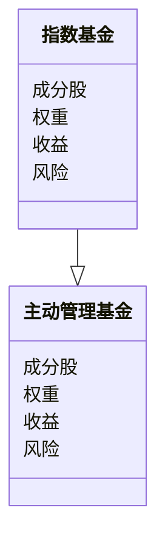
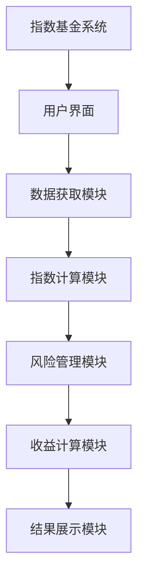
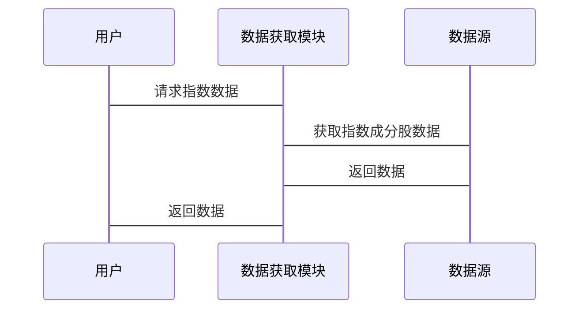

                 


# 约翰伯格的指数基金革命：为何主动管理难以胜出

## 关键词：指数基金、主动管理、投资策略、约翰·伯格、投资收益、风险管理

## 摘要：  
本文深入探讨了指数基金与主动管理基金之间的竞争关系，分析了指数基金的核心原理及其优势，重点阐述了约翰·伯格在指数基金领域的贡献与理论。通过数学模型、系统架构设计和项目实战，详细解读了指数基金的投资策略和实际应用，揭示了主动管理难以长期胜出的原因，并提供了最佳实践建议。

---

## 第一部分：指数基金的背景与核心概念

### 第1章：指数基金与主动管理的背景

#### 1.1 指数基金的基本概念

##### 1.1.1 指数基金的定义  
指数基金是一种跟踪特定市场指数的基金，其投资组合按照指数的成分股及其权重构建，旨在复制指数的收益表现。

##### 1.1.2 指数基金的历史发展  
指数基金的概念最早可追溯到20世纪初，但真正发展起来是在20世纪70年代，随着金融市场的成熟和计算技术的进步，指数基金逐渐成为一种重要的投资工具。

##### 1.1.3 指数基金的市场定位  
指数基金的目标是为投资者提供低成本、高透明度的市场平均收益，适合长期投资和风险分散。

#### 1.2 主动管理基金的基本概念

##### 1.2.1 主动管理基金的定义  
主动管理基金由基金经理主动选股，试图通过精选个股或择时操作来超越市场指数的表现。

##### 1.2.2 主动管理基金的历史发展  
主动管理基金在20世纪占据了主导地位，尤其是20世纪80年代和90年代，随着金融理论的发展，主动管理逐渐受到挑战。

##### 1.2.3 主动管理基金的市场定位  
主动管理基金的目标是通过专业选股和策略操作实现超额收益，但需要承担更高的费用和风险。

#### 1.3 指数基金与主动管理的对比

##### 1.3.1 核心概念对比  
| 指标                | 指数基金             | 主动管理基金       |
|---------------------|----------------------|-------------------|
| 投资策略            | 跟踪指数             | 主动选股           |
| 管理费用            | 低                  | 高                |
| 风险分散            | 高                  | 取决于选股能力    |

##### 1.3.2 市场表现对比  
统计数据显示，长期来看，大多数主动管理基金难以持续跑赢指数基金，尤其是在扣除高昂费用后，主动管理基金的净收益往往低于指数基金。

##### 1.3.3 风险与收益对比  
指数基金提供稳定的市场平均收益，风险与市场同步；主动管理基金由于依赖选股能力，风险和收益均不稳定。

---

### 第2章：指数基金的核心原理

#### 2.1 指数基金的构建方法

##### 2.1.1 指数基金的成分股选择  
指数基金的成分股由特定的市场指数决定，如标普500指数包含500家上市公司，按市值加权。

##### 2.1.2 指数基金的权重分配  
指数基金的成分股权重通常基于市值、流动性和其他因素，确保基金表现与指数一致。

##### 2.1.3 指数基金的复制策略  
通过完全复制或样本化方法，指数基金尽可能精确地复制目标指数的成分股和权重。

#### 2.2 指数基金的费用结构

##### 2.2.1 管理费用  
指数基金的管理费用通常低于主动管理基金，因其采用被动投资策略。

##### 2.2.2 托管费用  
指数基金的托管费用较低，因投资组合分散，管理复杂性较低。

##### 2.2.3 其他费用  
包括交易费用和行政费用，但总体低于主动管理基金。

#### 2.3 指数基金的风险分散

##### 2.3.1 风险分散的原理  
通过投资于广泛的市场指数，指数基金降低了个股或行业波动的风险。

##### 2.3.2 风险分散的效果  
指数基金的收益波动较小，适合风险厌恶型投资者。

##### 2.3.3 风险分散的局限性  
在极端市场情况下，指数基金仍可能面临系统性风险。

---

### 第3章：约翰·伯格的指数基金理论

#### 3.1 约翰·伯格的投资理念

##### 3.1.1 价值投资与指数基金  
伯格认为，长期来看，市场是有效的，指数基金能够捕捉市场的平均收益，无需主动选股。

##### 3.1.2 长期投资的重要性  
伯格强调长期投资，避免频繁交易，降低费用和税收影响。

##### 3.1.3 市场有效性的假设  
伯格基于有效市场假说，认为主动管理难以持续跑赢指数基金。

#### 3.2 约翰·伯格的指数基金策略

##### 3.2.1 成本控制  
伯格强调低成本的重要性，认为高费用是主动管理基金难以长期胜出的关键因素。

##### 3.2.2 风险管理  
通过指数基金的分散投资，降低个股和行业的特定风险。

##### 3.2.3 时间价值  
伯格认为，时间是指数基金的盟友，复利效应使长期投资收益最大化。

---

## 第四部分：指数基金的数学模型

### 第4章：指数基金的数学模型

#### 4.1 指数基金的收益模型

##### 4.1.1 指数收益公式  
$$ R_{index} = \sum_{i=1}^{n} w_i R_i $$  
其中，$w_i$ 是第i只股票的权重，$R_i$ 是第i只股票的收益。

##### 4.1.2 基金收益公式  
$$ R_{fund} = \sum_{i=1}^{n} w_i R_i -费用 $$  
费用包括管理费、托管费等。

#### 4.2 指数基金的风险模型

##### 4.2.1 风险分散的数学表达  
$$ \sigma_{fund}^2 = \sum_{i=1}^{n} w_i^2 \sigma_i^2 + \sum_{i \neq j} w_i w_j \sigma_{ij} $$  
其中，$\sigma_i^2$ 是第i只股票的方差，$\sigma_{ij}$ 是第i和第j只股票的协方差。

##### 4.2.2 风险调整后的收益  
使用夏普比率衡量风险调整后的收益：  
$$ \text{夏普比率} = \frac{R_p - R_f}{\sigma_p} $$  
其中，$R_p$ 是基金收益，$R_f$ 是无风险利率，$\sigma_p$ 是基金的波动率。

---

## 第五部分：指数基金的系统分析与架构设计

### 第5章：指数基金的系统架构

#### 5.1 系统功能设计

##### 5.1.1 领域模型  


#### 5.2 系统架构设计

##### 5.2.1 系统架构图  


#### 5.3 系统接口设计

##### 5.3.1 数据接口  


---

## 第六部分：指数基金的项目实战

### 第6章：指数基金的项目实战

#### 6.1 环境安装

##### 6.1.1 安装Python  
```bash
pip install python
pip install pandas
pip install numpy
pip install matplotlib
```

#### 6.2 核心实现

##### 6.2.1 计算指数收益  
```python
import pandas as pd
import numpy as np

# 模拟指数数据
index_data = pd.DataFrame({
    '成分股': ['股票1', '股票2', '股票3'],
    '权重': [0.5, 0.3, 0.2]
})

# 计算指数收益
index_return = np.dot(index_data['权重'], index_data['收益'])
```

##### 6.2.2 风险评估  
```python
cov_matrix = np.array([
    [0.02, 0.01, 0.01],
    [0.01, 0.03, 0.02],
    [0.01, 0.02, 0.04]
])
volatility = np.sqrt(np.diag(cov_matrix))
```

#### 6.3 实际案例分析

##### 6.3.1 收益曲线绘制  
```python
import matplotlib.pyplot as plt

# 模拟收益数据
returns = np.array([0.05, 0.03, 0.07, 0.02, 0.06])
plt.plot(returns, label='指数基金收益')
plt.xlabel('时间')
plt.ylabel('收益')
plt.legend()
plt.show()
```

#### 6.4 绩效评估

##### 6.4.1 夏普比率计算  
```python
returns = np.array([0.05, 0.03, 0.07, 0.02, 0.06])
risk_free = 0.02
volatility = np.std(returns)
sharpe_ratio = (np.mean(returns) - risk_free) / volatility
print(f"夏普比率: {sharpe_ratio}")
```

---

## 第七部分：指数基金的最佳实践与小结

### 第7章：指数基金的最佳实践

#### 7.1 投资策略

##### 7.1.1 长期投资  
坚持长期投资，避免频繁交易，充分利用复利效应。

##### 7.1.2 成本控制  
选择低费用的指数基金，避免高昂的管理费和托管费。

##### 7.1.3 风险管理  
通过分散投资降低风险，关注整体市场的表现。

#### 7.2 小结

##### 7.2.1 总结  
指数基金以其低成本、高透明度和稳定的收益，逐渐取代了传统主动管理基金的地位。

##### 7.2.2 注意事项  
投资者需注意市场波动、费用结构和基金流动性。

##### 7.2.3 拓展阅读  
建议阅读约翰·伯格的经典著作《债券基金：低成本投资策略》。

---

通过本文的详细分析，读者可以深入了解指数基金的核心原理和优势，理解约翰·伯格的指数基金革命，以及为何主动管理难以在长期投资中胜出。希望本文能为投资者提供有价值的参考和启发。

