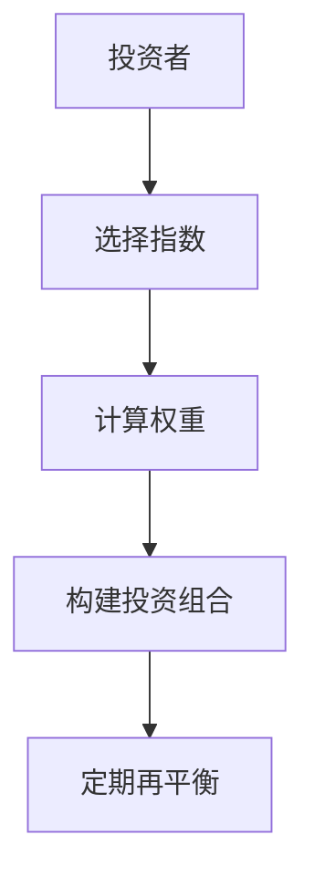
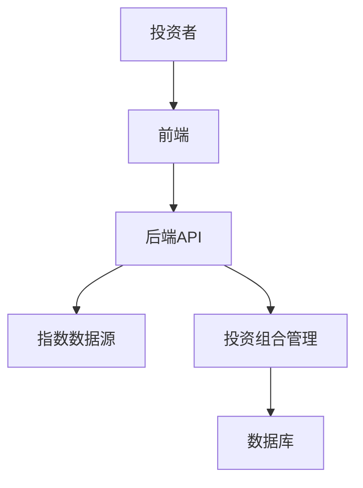
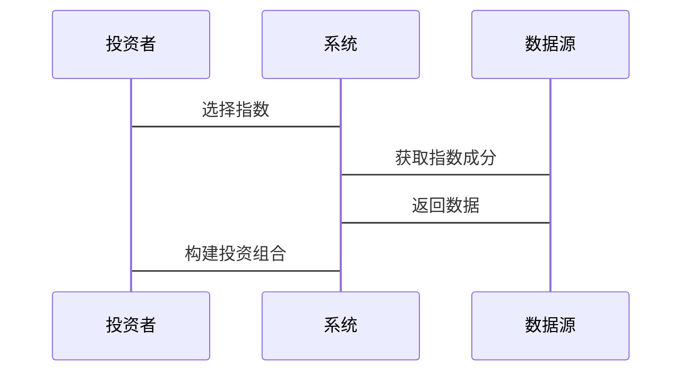

                 


# 约翰伯格的指数投资策略：为什么简单有效

## 关键词：指数投资，约翰·伯格，被动投资，指数基金，投资策略

## 摘要：约翰·伯格是指数投资领域的先驱，他的策略以简单、高效和低成本著称。本文将详细探讨指数投资的核心概念、数学模型、系统设计和实际应用，揭示其为何能在投资领域长期有效。

---

## 第一部分：指数投资策略的背景与核心概念

### 第1章：指数投资概述

#### 1.1 指数投资的定义与特点
- **指数投资的定义**
  指数投资是指通过复制特定市场指数的表现来构建投资组合，避免主动管理的人为干扰，降低费用和风险。
- **指数投资的核心特点**
  - 被动性：不主动选股，跟踪市场指数。
  - 分散风险：投资于广泛市场指数，降低个股风险。
  - 低成本：管理费用低，适合长期投资。

#### 1.2 指数投资的历史与发展
- **指数投资的起源**
  20世纪70年代，约翰·伯格提出指数基金概念，认为市场有效，无法通过主动管理获得超额收益。
- **约翰·伯格的贡献**
  创立先锋基金，推出低成本指数基金，推动指数投资普及。
- **指数投资的现状与趋势**
  现代投资者逐渐转向被动投资，指数基金在全球范围内快速增长。

#### 1.3 指数投资

---

## 第二部分：指数投资的核心概念与联系

### 第2章：指数基金的核心概念

#### 2.1 指数基金的定义与属性
- **定义**
  指数基金是跟踪特定市场指数的基金，如标普500指数。
- **属性**
  - 宽泛分散：投资于多个资产，降低风险。
  - 低周转率：减少交易费用，降低成本。

#### 2.2 指数基金与其他投资策略的对比
- **主动管理型基金 vs. 指数基金**
  | 特性      | 主动管理型基金 | 指数基金 |
  |-----------|----------------|----------|
  | 管理方式  | 主动选股        | 被动跟踪  |
  | 成本       | 高             | 低       |
  | 风险       | 高             | 低       |

#### 2.3 指数基金的ER实体关系图
```mermaid
er
  actor 投资者
  actor 市场指数
  actor 管理人
  entity 指数基金
  entity 股票
  entity 投资组合
  投资者 --> 指数基金: 投资
  管理人 --> 指数基金: 管理
  指数基金 --> 股票: 持股
  投资组合 --> 股票: 组合构成
```

---

## 第三部分：指数投资的算法原理讲解

### 第3章：指数基金的构建与跟踪

#### 3.1 指数基金的构建过程


- **步骤1：选择指数**
  例如，选择标普500指数作为跟踪目标。
- **步骤2：计算权重**
  根据指数中各成分股的市值比例确定权重。
- **步骤3：构建投资组合**
  按照权重购买相应股票，复制指数构成。
- **步骤4：定期再平衡**
  定期调整持仓，保持与指数一致。

#### 3.2 指数基金的数学模型
- **夏普比率**
  $$\text{夏普比率} = \frac{E[r] - R_f}{\sigma}$$
  其中，\( E[r] \) 为预期收益，\( R_f \) 为无风险利率，\( \sigma \) 为收益波动率。

---

## 第四部分：指数投资的系统分析与架构设计

### 第4章：指数基金管理系统设计

#### 4.1 系统功能设计
- **用户界面**
  - 投资者登录与注册
  - 指数基金选择与购买
  - 投资组合查看与调整
- **数据接口**
  - 获取指数数据（如标普500）
  - 计算投资组合回报
  - 更新持仓数据

#### 4.2 系统架构设计


#### 4.3 系统交互流程


---

## 第五部分：指数投资的项目实战

### 第5章：指数基金投资实战

#### 5.1 环境与工具安装
- **工具**
  - Python
  - Pandas库（数据处理）
  - Matplotlib库（数据可视化）

#### 5.2 核心代码实现
```python
import pandas as pd
import numpy as np

# 示例：构建一个简单的指数基金投资组合
index = pd.read_csv('sp500.csv')  # 假设sp500.csv为标普500指数数据
weights = index['Market Cap'].values / np.sum(index['Market Cap'].values)  # 计算权重
portfolio = index['Ticker'].values * weights.reshape(-1, 1)  # 构建投资组合
```

#### 5.3 投资组合分析
- **收益分析**
  计算投资组合的年化收益和波动率。
- **风险调整后收益**
  使用夏普比率评估投资组合的风险调整后收益。

---

## 第六部分：指数投资的最佳实践与总结

### 第6章：指数投资的最佳实践

#### 6.1 投资策略建议
- **长期持有**：避免频繁交易，降低费用。
- **分散投资**：选择宽基指数，降低行业风险。
- **定期再平衡**：保持与指数一致，优化持仓。

#### 6.2 投资者注意事项
- **费用控制**：选择低成本的指数基金。
- **税务规划**：了解税收政策，优化税务负担。

#### 6.3 拓展阅读
- 《The Intelligent Investor》——本杰明·格雷厄姆
- 《The Index Investment Approach》——约翰·伯格

---

## 总结

约翰·伯格的指数投资策略以简单、高效和低成本著称。通过本文的详细分析，读者可以理解指数投资的核心原理，掌握其数学模型和系统设计，最终在实际投资中应用这些策略。指数投资的长期有效性使其成为个人和机构投资者的首选，简单策略往往带来最优结果。

