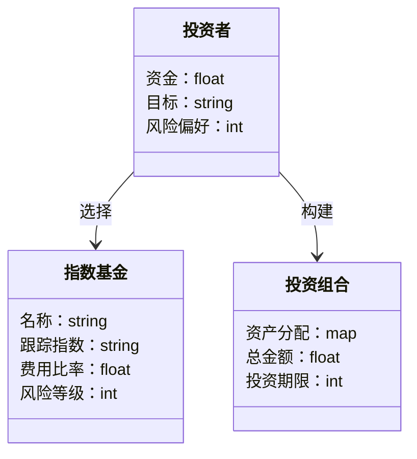
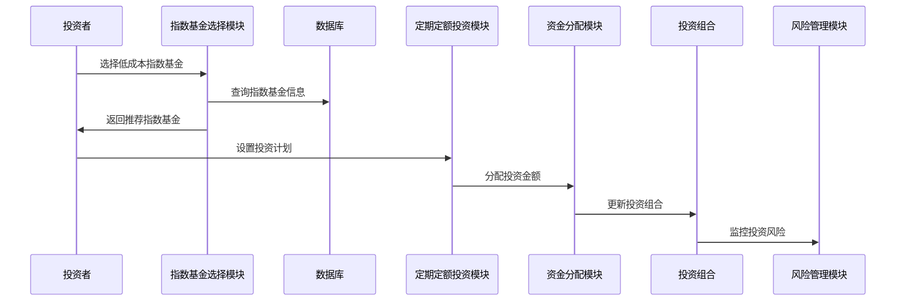

                 


# 约翰·伯格的普通投资者观：为什么简单胜于复杂

## 关键词：约翰·伯格，简单投资，指数基金，长期投资，被动投资，投资哲学

## 摘要：  
约翰·伯格是投资界的一位传奇人物，他的投资理念强调简单和长期，认为普通投资者应避免复杂的投资策略，转而选择指数基金和被动投资。本文深入分析伯格的投资哲学，探讨简单投资的核心优势，通过数学模型和实际案例，证明简单投资在长期中的稳定性和高效性。同时，本文还详细介绍了指数基金的运作机制和选择方法，为普通投资者提供了实用的指导。

---

# 引言

## 1.1 约翰·伯格的背景与投资理念

### 1.1.1 约翰·伯格的生平简介  
约翰·伯格（John Bogle）是美国著名的投资专家，被誉为“指数基金之父”。他是先锋集团（Vanguard Group）的创始人之一，也是伯格將指数基金引入大众市场的先驱。伯格的投资理念以简单、低成本和长期性为核心，他反对过度复杂的金融模型和频繁的市场交易。

### 1.1.2 伯格的投资哲学与核心思想  
伯格的投资哲学可以总结为“简单就是美”。他认为，大多数投资者试图通过复杂的策略来战胜市场，但实际上，这种做法往往会导致高额的交易成本和风险。伯格主张通过长期持有低成本的指数基金来实现财富增长。

### 1.1.3 伯格与指数基金的渊源  
伯格是指数基金的倡导者，他创立的先锋集团是全球最大的指数基金公司之一。他认为指数基金是普通投资者的最佳选择，因为它们能够以极低的成本跟踪市场表现，避免了主动管理型基金的高费用和低透明度。

---

## 1.2 为什么选择简单投资

### 1.2.1 投资市场的复杂性与不确定性  
投资市场本质上是不确定的，股票价格波动受多种因素影响，包括经济周期、政策变化和市场情绪等。复杂的策略试图预测这些波动，但往往以失败告终。

### 1.2.2 简单投资的优势与可行性  
简单投资的核心在于低成本和长期持有。通过投资指数基金，投资者可以避免频繁交易和高昂的管理费用，从而降低整体成本，实现长期稳定的收益。

### 1.2.3 伯格对普通投资者的启示  
伯格强调，普通投资者不需要复杂的策略或专业的知识，只需选择合适的指数基金并长期持有即可。这种方法不仅简单，而且高效。

---

## 1.3 本书的核心观点

### 1.3.1 简单投资的定义与内涵  
简单投资是指通过低成本、低风险的指数基金或ETF进行长期投资，避免频繁交易和复杂的策略。

### 1.3.2 长期投资的重要性  
长期投资能够利用复利效应，降低市场波动的影响，帮助投资者实现财富的稳步增长。

### 1.3.3 指数基金与被动投资的优势  
指数基金通过跟踪市场指数，避免了主动管理型基金的高费用和低透明度，是一种高效的投资工具。

---

# 第2章: 长期投资的意义

## 2.1 长期投资的基本概念

### 2.1.1 长期投资的定义与特征  
长期投资是指将资金投入市场并保持较长时间不变的投资策略。其核心特征包括低成本、低风险和高复利效应。

### 2.1.2 长期投资与短期投资的对比  
长期投资注重时间和复利，而短期投资关注波动和交易成本。长期投资的风险分散能力更强，而短期投资容易受到市场波动的影响。

### 2.1.3 长期投资的哲学基础  
长期投资强调耐心和纪律，避免被市场情绪左右。伯格认为，长期投资是一种生活方式，而非短期交易。

---

## 2.2 长期投资的优势

### 2.2.1 时间复利效应的数学模型  
复利公式为：$$ A = P \times (1 + r)^n $$  
其中，A是终值，P是本金，r是年化收益率，n是投资年数。长期投资能够最大化复利效应。

### 2.2.2 长期投资的风险分散特性  
通过长期持有指数基金，投资者可以分散个券风险，降低整体投资组合的波动性。

### 2.2.3 市场波动对长期投资者的影响  
市场波动对长期投资者的影响较小，因为时间能够平滑短期波动。

---

## 2.3 长期投资的实践策略

### 2.3.1 如何制定长期投资计划  
投资者应根据自身财务状况和风险承受能力制定投资计划，选择合适的指数基金并坚持长期持有。

### 2.3.2 长期投资中的纪律性与耐心  
纪律性是指坚持投资计划，避免频繁交易；耐心是指相信时间的力量，不因短期波动而改变策略。

### 2.3.3 长期投资中的风险管理  
通过多元化投资和低成本策略，降低整体投资组合的风险。

---

# 第3章: 指数基金与被动投资

## 3.1 指数基金的基本概念

### 3.1.1 指数基金的定义与运作机制  
指数基金通过跟踪特定市场指数（如标普500）进行投资，其运作机制是购买指数中的成分股，按比例持有。

### 3.1.2 指数基金的核心优势  
指数基金的优势包括低成本、低风险和高透明度。伯格认为，指数基金是普通投资者的最佳选择。

### 3.1.3 指数基金与主动管理型基金的对比  
指数基金的费用通常低于主动管理型基金，且长期表现更优。

---

## 3.2 指数基金的数学模型

### 3.2.1 指数基金的收益计算公式  
指数基金的收益取决于其跟踪的指数表现，公式为：$$ R = r_{\text{index}} \times t $$  
其中，R是总收益，r_{\text{index}}是指数的年化收益率，t是投资时间。

### 3.2.2 指数基金的费用比率分析  
指数基金的费用比率通常在0.1%到0.2%之间，远低于主动管理型基金的1%到2%。

### 3.2.3 指数基金的长期收益与风险评估  
长期来看，指数基金的风险与市场整体风险一致，但收益能够接近或超越市场表现。

---

## 3.3 指数基金的实践应用

### 3.3.1 如何选择合适的指数基金  
投资者应选择费用低、流动性好且跟踪误差小的指数基金。

### 3.3.2 指数基金的投资组合构建  
通过将指数基金与其他资产（如债券、房地产）结合，构建多元化投资组合。

### 3.3.3 指数基金的定期定额投资策略  
定期定额投资（Dollar-Cost Averaging, DCA）是指定期投入固定金额，平滑市场波动，降低投资成本。

---

# 第4章: 简单投资的哲学与实践

## 4.1 简单投资的核心理念

### 4.1.1 简单投资的定义与内涵  
简单投资是指通过低成本、低风险的投资工具（如指数基金）进行长期投资，避免复杂策略和频繁交易。

### 4.1.2 简单投资的哲学基础  
简单投资强调长期、纪律性和低成本，避免被市场情绪左右。

### 4.1.3 简单投资与复杂投资的对比  
简单投资注重长期和稳定性，而复杂投资追求短期收益和市场预测。

---

## 4.2 简单投资的数学模型

### 4.2.1 简单投资的收益计算公式  
简单投资的收益计算与指数基金类似，公式为：$$ R = r_{\text{simple}} \times t $$  
其中，r_{\text{simple}}是简单投资的年化收益率。

### 4.2.2 简单投资的风险评估模型  
简单投资的风险与市场整体风险一致，但通过多元化和低成本策略，风险得以分散和降低。

### 4.2.3 简单投资与复杂投资的对比分析  
复杂投资的高费用和高风险通常导致其长期表现不佳，而简单投资的低成本和稳定性使其更具优势。

---

## 4.3 简单投资的实践策略

### 4.3.1 如何制定简单的投资计划  
投资者应根据自身需求选择合适的指数基金，制定长期投资计划，并坚持执行。

### 4.3.2 简单投资中的纪律性与耐心  
纪律性是指坚持投资计划，避免被市场波动干扰；耐心是指相信长期投资的力量。

### 4.3.3 简单投资中的风险管理  
通过多元化投资和定期定额策略，降低整体投资组合的风险。

---

# 第5章: 为什么简单胜于复杂

## 5.1 简单投资的优势

### 5.1.1 简单投资的低风险特性  
简单投资通过低成本和多元化降低整体风险，避免了个券风险和市场波动的影响。

### 5.1.2 简单投资的高效率特性  
简单投资通过指数基金实现高效配置，避免了主动管理的高费用和低透明度。

### 5.1.3 简单投资的长期稳定性  
长期来看，简单投资能够稳定增长，避免短期波动带来的损失。

---

## 5.2 复杂投资的劣势

### 5.2.1 复杂投资的高风险特性  
复杂投资试图通过市场预测和频繁交易获得超额收益，但这种策略往往以失败告终。

### 5.2.2 复杂投资的低效率特性  
复杂投资的高费用和低透明度使其长期表现不佳，难以与简单投资竞争。

### 5.2.3 复杂投资的短期波动性  
复杂投资容易受到市场波动的影响，难以实现长期稳定的收益。

---

## 5.3 简单投资的长期成功案例

### 5.3.1 约翰·伯格的简单投资案例  
伯格通过长期持有指数基金实现了财富的稳步增长，证明了简单投资的有效性。

### 5.3.2 其他成功投资者的简单投资案例  
许多成功投资者也选择了简单投资策略，通过长期持有低成本指数基金实现财富增长。

### 5.3.3 简单投资在不同市场环境下的表现  
无论市场上涨还是下跌，简单投资的长期表现均优于复杂投资。

---

# 第6章: 简单投资的系统架构与实现

## 6.1 简单投资的系统架构

### 6.1.1 系统架构的定义与构成  
简单投资的系统架构包括投资目标、投资策略、投资工具和风险管理四个部分。

### 6.1.2 领域模型类图  


### 6.1.3 系统架构设计  
简单投资的系统架构应包括低成本指数基金选择、定期定额投资和长期持有三个核心部分。

### 6.1.4 系统接口设计  
系统接口应包括指数基金筛选、投资组合优化和风险管理功能。

### 6.1.5 系统交互序列图  


---

## 6.2 简单投资的实现步骤

### 6.2.1 环境安装  
投资者需要安装投资账户和指数基金交易平台。

### 6.2.2 核心代码实现  
以下是Python代码示例，用于计算指数基金的长期收益：

```python
def calculate_simple_investment(principal, annual_return, years):
    return principal * (1 + annual_return) ** years

principal = 10000
annual_return = 0.07
years = 30

result = calculate_simple_investment(principal, annual_return, years)
print(f"最终收益为：{result:.2f}")
```

### 6.2.3 代码应用解读与分析  
上述代码计算了本金10000美元，年化收益率7%，投资30年后的最终收益。结果表明，简单投资的复利效应非常显著。

---

## 6.3 实际案例分析与详细讲解

### 6.3.1 投资环境与目标设定  
假设一个投资者计划投资10000美元，目标是30年后的退休生活。

### 6.3.2 投资组合构建  
选择一个跟踪标普500的低成本指数基金，费用比率为0.1%。

### 6.3.3 投资策略实施  
采用定期定额投资策略，每月投入固定金额，避免市场波动影响。

### 6.3.4 风险管理  
通过多元化投资和定期评估，确保投资组合符合风险承受能力。

---

## 6.4 项目小结

### 6.4.1 系统架构的优缺点  
简单投资系统的优点是低成本和高透明度，缺点是缺乏灵活性。

### 6.4.2 实际应用中的注意事项  
投资者应根据自身需求调整投资组合，并定期评估投资策略。

### 6.4.3 系统架构的未来改进方向  
未来可以增加更多的指数基金选择和风险管理工具，进一步优化系统架构。

---

# 结论

## 7.1 约翰·伯格的投资理念总结  
约翰·伯格的简单投资理念强调低成本、长期持有和被动投资，为普通投资者提供了高效的投资策略。

## 7.2 对普通投资者的实用建议  
普通投资者应选择低成本指数基金，坚持长期投资，并避免复杂策略。

## 7.3 未来展望  
随着金融市场的不断发展，简单投资的理论和实践将继续受到关注，为更多投资者提供成功的投资策略。

---

# 附录

## 附录A: 简单投资的数学公式汇总  
$$ \text{复利公式}：A = P \times (1 + r)^n $$  
$$ \text{费用比率}：\text{费用比率} = \frac{\text{管理费用}}{\text{资产规模}} $$  

## 附录B: 简单投资代码示例  
```python
def calculate_simple_investment(principal, annual_return, years):
    return principal * (1 + annual_return) ** years

principal = 10000
annual_return = 0.07
years = 30

result = calculate_simple_investment(principal, annual_return, years)
print(f"最终收益为：{result:.2f}")
```

## 附录C: 进一步阅读的推荐书目  
1. 《投资最重要的简单性》  
2. 《指数基金投资指南》  
3. 《简单投资的成功之道》  

## 附录D: 简单投资的常见问题解答  
1. 简单投资适合所有人吗？  
   是的，简单投资适合大多数普通投资者。  
2. 如何选择合适的指数基金？  
   选择低成本、流动性好且跟踪误差小的指数基金。  
3. 简单投资的长期表现如何？  
   简单投资的长期表现通常优于复杂投资，尤其是在考虑费用和风险的情况下。  

---

# 结语

通过本文的详细讲解，我们深入探讨了约翰·伯格的简单投资理念，分析了其核心优势和实践策略。希望读者能够从中学到简单投资的价值，并将其应用到实际投资中，实现财富的稳步增长。

