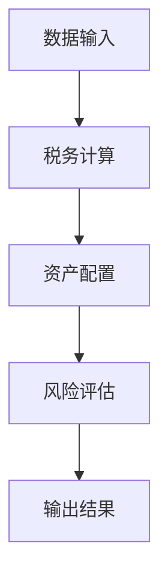
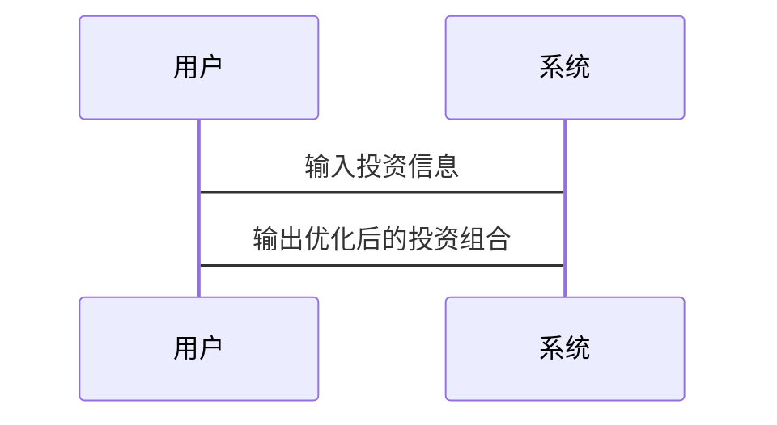

                 


# 约翰伯格的税收敏感投资：如何优化投资回报

## 关键词：税收敏感投资，约翰·伯格，投资回报，税务规划，投资策略

## 摘要：  
本文深入探讨了约翰·伯格的税收敏感投资理念，分析了如何通过优化税务规划来提升投资回报。文章从税收对投资决策的影响入手，结合伯格的投资策略，详细讲解了税收敏感投资的核心要素、策略实施方法以及系统设计，最后通过实际案例分析和数学模型计算，展示了如何在实际投资中应用这些策略以实现回报最大化。

---

# 第1章: 税收敏感投资概述

## 1.1 税收敏感投资的定义与背景

### 1.1.1 投资与税务的基本概念
- 投资：通过购买资产或参与金融工具，期望在未来获得收益的行为。
- 税务：政府对个人或企业收入、财产、交易等行为征收的费用。
- 税收敏感投资：指在投资决策中考虑税收因素，以优化投资回报的投资策略。

### 1.1.2 税收对投资回报的影响
- 税收直接从投资收益中扣除，影响最终回报。
- 不同类型的投资（如股票、债券、房地产）有不同的税务处理。

### 1.1.3 税收敏感投资的核心要素
| 核心要素 | 描述 |
|----------|------|
| 税收环境 | 不同国家或地区的税收政策差异 |
| 投资目标 | 投资者期望的回报率和风险承受能力 |
| 资产配置 | 不同资产的分配比例及税务影响 |

## 1.2 约翰·伯格的投资理念

### 1.2.1 约翰·伯格的生平与投资思想
- 伯格是美国著名投资专家，强调长期投资和分散投资。
- 他的投资理念注重低成本和长期持有，以减少交易成本和税务负担。

### 1.2.2 伯格的投资策略与税务规划
- **长期持有**：通过长期持有减少短期资本利得税。
- **分散投资**：通过多样化降低税务风险。
- **税收优惠账户**：利用401(k)、IRA等账户降低税务负担。

### 1.2.3 伯格投资理念的现代应用
- 现代投资者如何结合伯格的理念，在当前市场环境中优化税务和投资回报。

## 1.3 税收敏感投资的重要性

### 1.3.1 税收对投资回报的直接影响
- 税收会减少实际到账的收益，影响投资决策。
- 高税率可能导致投资回报率下降。

### 1.3.2 税收敏感投资的潜在优势
- 通过优化税务规划，提升实际回报率。
- 在高税率环境下，税收敏感投资尤为重要。

### 1.3.3 税收敏感投资的适用场景
- 高收入投资者需要优化税务负担。
- 长期投资者通过税务规划实现财富最大化。
- 利用税收优惠账户进行投资。

## 1.4 本章小结
本章介绍了税收敏感投资的基本概念，分析了伯格的投资理念及其对现代投资的启示，强调了税收敏感投资在优化回报中的重要性。

---

# 第2章: 税收在投资中的作用

## 2.1 税收对投资决策的影响

### 2.1.1 税收与投资选择的关系
- 税收影响投资者选择不同类型资产（如股票、债券）的意愿。
- 高税率资产可能被规避，低税率资产更受欢迎。

### 2.1.2 不同资产类别的税务处理
| 资产类别 | 税务处理 |
|----------|----------|
| 股票     | 资本利得税 |
| 债券     | 利息税 |
| 房地产   | 资本利得税、房产税 |

### 2.1.3 税收对投资组合的影响
- 投资组合的税务负担影响整体回报。
- 需要考虑资产的税务透明度和流动性。

## 2.2 税收对投资回报的优化

### 2.2.1 税后收益的计算方法
- 税后收益 = 投资收益 - 税费
- 例如：$100的投资收益，税率为20%，则税后收益为$80。

### 2.2.2 税收对不同类型投资的影响
- 股票：资本利得税可能影响短期和长期收益。
- 债券：利息税影响现金流。
- 其他资产：如房地产的资本利得税。

### 2.2.3 税收敏感投资的数学模型
$$ \text{税后收益} = \text{投资收益} \times (1 - \text{税率}) $$

## 2.3 税收与投资风险的平衡

### 2.3.1 税收对投资风险的调节作用
- 高税率可能导致投资风险增加。
- 税收敏感投资通过优化税务规划降低风险。

### 2.3.2 税收敏感投资的风险管理
- 定期评估税务政策变化。
- 分散投资以降低税务风险。

### 2.3.3 税收与投资回报的权衡
- 在高税率环境下，税收敏感投资尤为重要。
- 在低税率环境下，税收敏感投资可以作为优化回报的手段。

## 2.4 本章小结
本章分析了税收对投资决策的影响，探讨了不同类型资产的税务处理，以及如何通过税收敏感投资优化回报。

---

# 第3章: 约翰·伯格的税收敏感投资策略

## 3.1 伯格的投资策略概述

### 3.1.1 伯格的长期投资理念
- 长期持有资产，减少短期交易成本和税务负担。
- 避免频繁交易以降低资本利得税。

### 3.1.2 伯格的分散投资策略
- 通过多样化投资降低风险。
- 分散投资可以减少因某一资产的高税率带来的影响。

### 3.1.3 伯格的低成本投资原则
- 低成本投资工具（如指数基金）通常税负较低。
- 低成本策略有助于最大化税后回报。

## 3.2 税收敏感投资的核心策略

### 3.2.1 税收损失 harvesting 策略
- 利用资本损失抵扣资本收益。
- 例如，卖出亏损的资产以抵消部分资本利得税。

### 3.2.2 税收优惠型投资工具
- 利用税收优惠账户（如401(k)、IRA）进行投资。
- 通过退休账户降低当前税务负担，同时享受税收优惠。

### 3.2.3 税收规划与资产配置
- 根据税收环境调整资产配置。
- 例如，在高税率地区投资债券，低税率地区投资股票。

## 3.3 约翰·伯格策略的数学模型

### 3.3.1 投资回报的数学公式
$$ \text{税后回报} = (\text{资本收益} - \text{资本利得税}) + (\text{股息收入} - \text{股息税}) $$

### 3.3.2 税收敏感投资的优化算法
- 使用动态规划算法优化资产配置。
- 通过数学模型计算不同税率下的最优投资组合。

## 3.4 本章小结
本章详细讲解了伯格的税收敏感投资策略，包括长期持有、分散投资和低成本投资，以及具体的税收规划和资产配置方法。

---

# 第4章: 税收敏感投资的系统分析

## 4.1 投资系统的构成与需求

### 4.1.1 投资系统的基本构成
- 投资目标：回报率、风险承受能力。
- 资产类别：股票、债券、房地产等。
- 税收环境：不同地区的税率和税务政策。

### 4.1.2 税收敏感投资的需求分析
- 确定投资目标和约束条件。
- 分析税务政策对投资的影响。

### 4.1.3 系统的边界与假设
- 系统假设：税收政策不变、市场稳定。
- 边界条件：投资期限、可用资金。

## 4.2 税收敏感投资的系统架构

### 4.2.1 系统架构设计概述
- 分层架构：数据层、逻辑层、用户层。
- 模块化设计：税务计算、资产配置、风险评估。

### 4.2.2 系统功能模块划分
- 数据输入模块：用户输入投资信息。
- 税务计算模块：计算税后回报。
- 资产配置模块：优化投资组合。
- 风险评估模块：评估税务风险。

### 4.2.3 系统架构的 mermaid 图


## 4.3 系统接口与交互设计

### 4.3.1 系统接口设计
- 数据接口：与税务数据库交互。
- 用户接口：图形化界面供用户输入和查看结果。

### 4.3.2 系统交互流程
1. 用户输入投资信息。
2. 系统计算税后回报。
3. 系统优化投资组合。
4. 系统评估风险。
5. 输出结果。

### 4.3.3 系统交互的 mermaid 序列图


## 4.4 本章小结
本章通过系统分析，详细设计了税收敏感投资的系统架构和交互流程，为实际应用提供了理论基础。

---

# 第5章: 税收敏感投资的实战案例分析

## 5.1 环境安装与数据准备

### 5.1.1 环境安装
- 安装Python和相关库（如numpy、pandas）。
- 安装可视化工具（如Matplotlib）。

### 5.1.2 数据准备
- 收集不同资产的历史数据。
- 获取相关税率信息。

## 5.2 核心算法实现

### 5.2.1 税收损失 harvesting 算法
- 计算资本损失和资本收益的差额。
- 使用算法优化资本损失的抵扣。

### 5.2.2 税收优惠账户配置
- 计算不同账户的税后回报。
- 优化资产在不同账户中的分配。

### 5.2.3 投资组合优化算法
- 使用动态规划算法优化投资组合。
- 计算不同税率下的最优配置。

## 5.3 代码实现与分析

### 5.3.1 税收损失 harvesting 的代码实现
```python
import numpy as np

def calculate_tax_loss Harvesting(capital_gain, capital_loss):
    tax_savings = min(capital_gain, capital_loss)
    return tax_savings
```

### 5.3.2 税收优惠账户配置的代码实现
```python
def optimize_account_allocation(portfolio, tax_rates):
    optimized_portfolio = {}
    for asset in portfolio:
        tax_savings = portfolio[asset] * (1 - tax_rates[asset])
        optimized_portfolio[asset] = tax_savings
    return optimized_portfolio
```

### 5.3.3 投资组合优化的代码实现
```python
import numpy as np

def optimize_portfolio/assets, tax_rates):
    n = len(assets)
    returns = np.array([assets['returns']])
    tax_impact = np.array([assets['taxes']])
    total_return = returns - tax_impact * tax_rates
    return total_return.max()
```

## 5.4 案例分析与结果解读

### 5.4.1 案例背景
- 投资者投资组合包括股票和债券。
- 不同税率下的回报差异。

### 5.4.2 案例分析
- 计算不同税率下的税后回报。
- 优化投资组合以最大化回报。

### 5.4.3 结果解读
- 税收敏感投资显著提高回报。
- 优化后的投资组合表现优于未优化的组合。

## 5.5 本章小结
本章通过具体案例分析，展示了如何应用伯格的策略进行税务优化，以及系统设计在实际中的应用。

---

# 第6章: 税收敏感投资的未来趋势与风险管理

## 6.1 税收敏感投资的未来趋势

### 6.1.1 税务政策的变化
- 预测未来税率变化。
- 适应新的税务政策。

### 6.1.2 技术发展对税收敏感投资的影响
- 人工智能在税务规划中的应用。
- 大数据在投资组合优化中的作用。

### 6.1.3 投资者行为的变化
- 更多投资者关注税务规划。
- 机构投资者在税收敏感投资中的角色。

## 6.2 税收敏感投资的风险管理

### 6.2.1 税务风险的识别
- 识别可能的税务风险。
- 评估风险对投资组合的影响。

### 6.2.2 税务风险的量化
- 使用数学模型量化风险。
- 评估不同税率下的风险。

### 6.2.3 税务风险的控制
- 通过多样化投资分散风险。
- 定期评估和调整投资组合。

## 6.3 本章小结
本章探讨了税收敏感投资的未来趋势，分析了税务政策变化和技术发展对投资的影响，并提出了风险管理策略。

---

# 附录: 税收敏感投资相关法规与工具

## 附录A: 税收敏感投资相关法规

### A.1 美国的税收政策
- 资本利得税：短期资本利得税率为普通收入税率，长期资本利得税率为较低税率。
- 股息税：通常按照股息收入的一定比例征税。

### A.2 其他国家的税收政策
- 比较不同国家的税率和税务政策。
- 选择适合的投资地点。

## 附录B: 税收敏感投资工具推荐

### B.1 税收优惠账户
- 401(k)：雇主赞助的退休储蓄计划，通常享有税收优惠。
- IRA：个人退休账户，提供税收优惠。

### B.2 税收敏感投资软件
- 税务规划软件：帮助计算税后回报。
- 投资组合优化软件：优化投资组合的税务影响。

## 附录C: 常见问题解答

### C.1 税收敏感投资是否适合所有投资者？
- 税收敏感投资适合关注税务规划的投资者，尤其是高收入和高净值投资者。

### C.2 如何开始税收敏感投资？
- 制定投资目标和税务规划。
- 选择合适的税收优惠账户和工具。

### C.3 税收政策变化对投资有什么影响？
- 税收政策变化可能影响投资回报，需定期调整投资组合。

---

# 结语

通过本文的分析，读者可以深入了解约翰·伯格的税收敏感投资理念，掌握如何通过优化税务规划提升投资回报。无论是个人投资者还是机构投资者，都可以从本文中获得实用的策略和工具，以应对复杂的税务环境，实现财富的长期增长。

---

**THE END**

