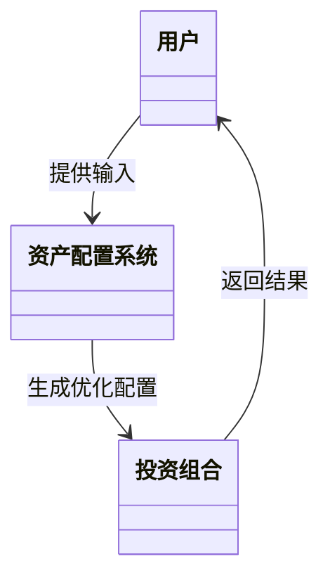
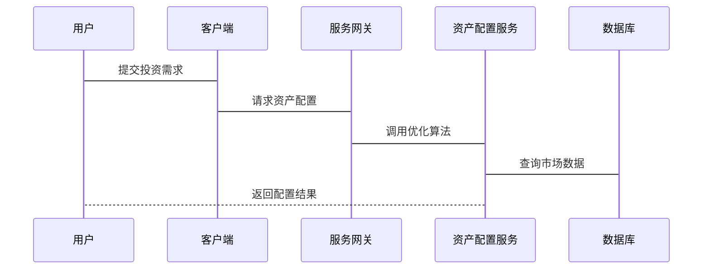

                 


# 约翰伯格的资产配置理论：平衡风险与收益

## 关键词：资产配置，投资策略，风险管理，收益优化，约翰·伯格，现代投资组合理论，系统架构设计

## 摘要：本文深入探讨了约翰·伯格的资产配置理论，分析其核心原理、数学模型、系统架构，并通过项目实战展示其应用。文章从背景介绍到最佳实践，全面解析如何通过科学配置资产，在投资中实现风险与收益的平衡。

---

# 第一部分：约翰伯格的资产配置理论概述

## 第1章：资产配置的基本概念

### 1.1 资产配置的定义与重要性

#### 1.1.1 资产配置的定义
资产配置是指将资金分配到不同资产类别（如股票、债券、房地产等），以实现投资目标的过程。其核心在于通过分散投资降低风险，同时追求最大化的收益。

#### 1.1.2 资产配置在投资中的重要性
资产配置是投资组合成功的关键因素。它帮助投资者在不同市场条件下平衡风险与收益，避免过度集中在某一种资产带来的高风险。

#### 1.1.3 资产配置与投资收益的关系
合理的资产配置能够优化投资组合的收益-风险比，使投资者在不同市场周期中保持稳定的回报。

### 1.2 资产配置的基本原理

#### 1.2.1 投资组合理论的基础
资产配置基于投资组合理论，强调通过多样化投资来降低特定资产的风险。

#### 1.2.2 风险与收益的平衡
投资者需要在高风险高收益和低风险低收益之间找到平衡点，以实现长期稳定的收益。

#### 1.2.3 资产配置的分类与特点
资产配置分为战略配置和战术调整，战略配置注重长期目标，战术调整则根据市场变化进行短期调整。

---

## 第2章：约翰·伯格的资产配置理论

### 2.1 约翰·伯格的生平与贡献

#### 2.1.1 约翰·伯格的背景介绍
约翰·伯格是投资领域的知名专家，以其长期投资和价值投资理念闻名。

#### 2.1.2 伯格在投资领域的成就
伯格创立了先锋基金，推广指数基金，倡导低成本、长期投资策略。

#### 2.1.3 伯格理论的影响力
伯格的理论影响了全球投资策略，强调分散投资和长期持有。

### 2.2 伯格资产配置理论的核心思想

#### 2.2.1 长期投资与价值投资
伯格主张长期持有优质资产，避免频繁交易，降低交易成本。

#### 2.2.2 分散投资的重要性
通过分散投资不同资产类别，降低特定资产的风险。

#### 2.2.3 资产配置的动态调整
根据市场变化和个人风险承受能力，定期调整投资组合。

---

## 第3章：资产配置的数学模型与算法

### 3.1 现代投资组合理论（MPT）

#### 3.1.1 均值-方差优化模型
$$\text{目标函数：} \text{min} \sum_{i=1}^n \sum_{j=1}^n w_i w_j \sigma_{ij}$$
$$\text{约束条件：} \sum_{i=1}^n w_i = 1, \sum_{i=1}^n w_i r_i = T$$

#### 3.1.2 有效前沿的概念
有效前沿是所有可能投资组合中风险最低、收益最高的点，代表最优投资组合。

#### 3.1.3 马科维茨的理论基础
马科维茨提出投资组合理论，强调通过分散化降低风险。

### 3.2 资产配置的优化算法

#### 3.2.1 均值-方差优化的实现
使用Python优化库，如scipy.optimize，实现均值-方差优化。

#### 3.2.2 使用拉格朗日乘数法的优化
通过拉格朗日乘数法，将约束条件融入目标函数，求解最优解。

#### 3.2.3 现实中的应用与挑战
实际应用中，需考虑市场波动、交易成本和税收等因素，影响优化结果。

---

## 第4章：系统分析与架构设计

### 4.1 资产配置系统的项目介绍

#### 4.1.1 系统目标与范围
开发一个基于伯格理论的资产配置系统，帮助用户实现投资组合优化。

#### 4.1.2 项目背景与需求分析
用户需要根据自身风险承受能力和投资目标，获得个性化的资产配置建议。

#### 4.1.3 系统的可行性分析
分析技术可行性、经济可行性和操作可行性，确保系统可实现。

### 4.2 系统功能设计

#### 4.2.1 领域模型设计（Mermaid类图）


#### 4.2.2 系统架构设计（Mermaid架构图）


#### 4.2.3 系统接口设计与交互（Mermaid序列图）


---

## 第5章：项目实战——基于伯格理论的资产配置系统实现

### 5.1 环境安装与配置

#### 5.1.1 开发工具的选择与安装
使用Python、Jupyter Notebook、scipy.optimize库。

#### 5.1.2 数据源的获取与准备
收集历史市场数据，清洗数据，准备输入。

#### 5.1.3 环境配置与依赖管理
安装必要的Python包，如numpy、pandas、scipy.optimize。

### 5.2 核心算法实现

#### 5.2.1 Python代码示例
```python
from scipy.optimize import minimize
import numpy as np

# 定义目标函数
def portfolio_var(weights, covariance_matrix):
    return np.dot(weights.T, np.dot(covariance_matrix, weights))

# 定义约束条件
constraints = [{'type': 'eq', 'fun': lambda w: sum(w) - 1}, 
               {'type': 'eq', 'fun': lambda w: sum(w * expected_returns) - target_return}]

# 优化问题
result = minimize(portfolio_var, initial_guess, constraints)
```

#### 5.2.2 代码应用解读与分析
解释代码的功能，如何计算投资组合的方差，如何应用约束条件。

### 5.3 实际案例分析

#### 5.3.1 案例背景介绍
假设一个投资者有100万美元，风险承受能力中等，目标年收益8%。

#### 5.3.2 资产配置方案
将资金分配到股票（60%）、债券（30%）和现金（10%），以平衡风险和收益。

#### 5.3.3 详细解读与分析
解释每种资产的选择理由，以及配置后的风险和收益预期。

### 5.4 项目小结

#### 5.4.1 项目总结
系统实现了基于伯格理论的资产配置，帮助用户优化投资组合。

#### 5.4.2 成果展示
展示系统输出的配置方案和优化结果，验证理论的有效性。

---

## 第6章：最佳实践与注意事项

### 6.1 最佳实践 tips

#### 6.1.1 定期审视与调整
市场变化和个人情况变化需要定期调整投资组合。

#### 6.1.2 选择合适的工具与平台
使用可靠的工具和平台，确保数据准确和计算高效。

#### 6.1.3 风险管理的重要性
制定风险管理策略，避免重大损失。

### 6.2 小结

#### 6.2.1 理论与实践的结合
通过理论指导实践，实现有效的资产配置。

#### 6.2.2 系统化方法的优势
系统化方法能够提高投资决策的科学性和效率。

### 6.3 注意事项

#### 6.3.1 风险管理
严格控制风险，避免过度杠杆和高风险资产。

#### 6.3.2 数据质量
确保数据来源可靠，避免错误数据影响配置结果。

#### 6.3.3 个性化需求
根据个人风险承受能力和投资目标调整配置方案。

### 6.4 拓展阅读

#### 6.4.1 推荐书籍
《投资最重要的简单真理》、《机构投资的创新理念》。

#### 6.4.2 其他资源
建议阅读学术论文和行业报告，深入了解资产配置的最新发展。

---

## 第7章：小结

通过本文的深入探讨，读者能够全面理解约翰·伯格的资产配置理论，并掌握其在实际投资中的应用。通过系统设计和项目实战，读者可以将理论转化为实际操作，实现风险与收益的平衡。

---

# 结语

约翰·伯格的资产配置理论为投资者提供了一种科学的方法，在复杂多变的市场中实现长期稳定的收益。通过本文的分析和实战，读者可以更好地理解和应用这一理论，优化自己的投资组合，实现财富的稳健增长。

