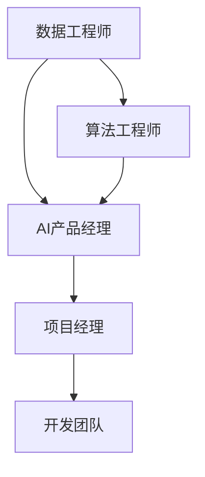
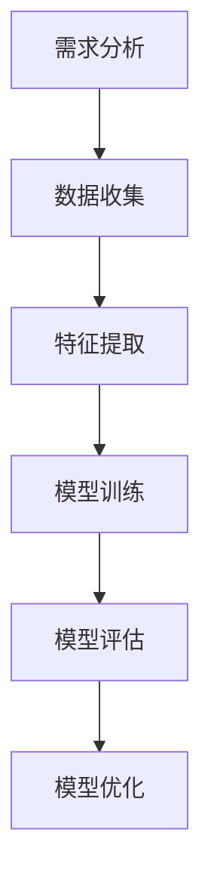
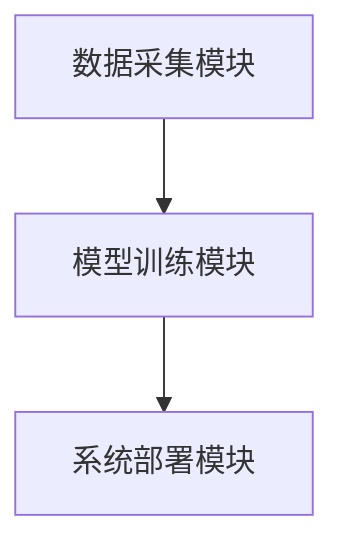
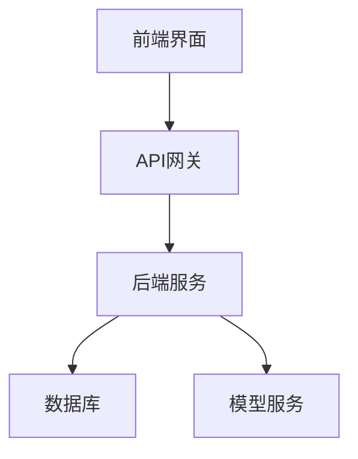

                 


# 组建高效AI开发团队的技巧

## 关键词：AI开发团队，高效协作，技术架构，项目管理，人才管理

## 摘要：本文详细探讨了如何组建和管理高效AI开发团队，从背景分析、核心概念、算法原理到系统架构、项目实战以及最佳实践，全面解析了高效AI开发团队的组建技巧和管理策略。文章结合实际案例和数学模型，深入分析了AI开发团队的关键要素和优化方法，为读者提供了实用的指导和参考。

---

# 第一部分: 组建高效AI开发团队的背景与核心概念

## 第1章: AI开发团队的背景与挑战

### 1.1 人工智能技术的快速发展
人工智能（Artificial Intelligence, AI）技术近年来取得了突飞猛进的发展，从图像识别、自然语言处理到自动驾驶、机器人控制，AI技术已经渗透到各个行业。企业的AI开发团队需要应对技术复杂性增加、数据量爆炸式增长以及算法性能要求日益严格的挑战。

#### 1.1.1 人工智能技术的演进历程
- 20世纪50年代：AI概念的提出与初步研究。
- 20世纪80年代：专家系统和知识工程的发展。
- 21世纪初：深度学习和神经网络的崛起。
- 当前：AI与大数据、云计算的深度融合。

#### 1.1.2 当前AI技术的主要应用领域
- 计算机视觉：图像识别、人脸识别、视频分析。
- 自然语言处理：文本分类、机器翻译、情感分析。
- 机器学习：预测分析、推荐系统、异常检测。
- 自动驾驶：路径规划、环境感知、决策控制。

#### 1.1.3 企业AI开发的现状与趋势
- 现状：AI技术在企业中的应用逐渐普及，但开发效率和团队协作仍存在问题。
- 趋势：AI开发工具化、自动化，团队协作的敏捷化和模块化。

### 1.2 AI开发团队的核心价值
AI开发团队是企业实现AI技术创新和应用落地的核心力量。高效AI开发团队能够快速响应业务需求，高效完成从数据采集、模型训练到部署落地的全生命周期管理。

#### 1.2.1 AI开发团队的定义与特点
- 定义：由数据工程师、算法工程师、AI产品经理等多角色组成的开发团队。
- 特点：跨学科、强协作、技术驱动。

#### 1.2.2 AI开发团队在企业中的作用
- 技术创新：推动企业AI技术的应用和优化。
- 业务价值：通过AI技术提升企业效率和竞争力。
- 成本控制：通过自动化和智能化手段降低运营成本。

#### 1.2.3 高效AI开发团队的成功关键
- 技术能力：团队成员具备扎实的技术背景和创新能力。
- 协作效率：高效的沟通与协作机制。
- 资源支持：充足的计算资源和数据支持。

### 1.3 AI开发中的主要挑战
#### 1.3.1 技术挑战
- 算法复杂性：深度学习模型的训练和优化需要大量计算资源。
- 数据质量：数据清洗、标注和处理耗时且容易出错。
- 模型部署：模型的实时部署和维护需要复杂的环境配置。

#### 1.3.2 人才挑战
- 技术人才稀缺：AI领域人才供不应求，竞争激烈。
- 团队协作：不同角色之间需要高效配合，否则容易出现“单点故障”。
- 技能互补：团队成员需要具备跨领域的知识和技能。

#### 1.3.3 管理与协作挑战
- 项目管理：AI开发项目的周期长、不确定性高，传统的瀑布模型难以适用。
- 资源分配：计算资源、数据资源和人力资源的合理分配。
- 风险控制：模型性能不稳定、数据泄露等风险的预防和应对。

### 1.4 本章小结
本章从AI技术的发展背景出发，分析了高效AI开发团队的核心价值和面临的挑战，为后续章节的深入探讨奠定了基础。

---

## 第2章: AI开发团队的核心概念与体系结构

### 2.1 AI开发团队的核心概念
#### 2.1.1 AI开发团队的组成要素
- 数据工程师：负责数据采集、清洗和存储。
- 算法工程师：负责模型设计、训练和优化。
- AI产品经理：负责需求分析和项目规划。
- 项目经理：负责团队管理和项目进度跟踪。

#### 2.1.2 AI开发团队的角色分工
- 数据工程师：确保数据质量，提供高质量的训练数据。
- 算法工程师：负责模型设计，优化算法性能。
- AI产品经理：协调需求和技术实现，确保项目符合业务目标。
- 项目经理：制定项目计划，跟踪进度，解决团队协作问题。

#### 2.1.3 AI开发团队的协作机制
- 任务分解：将项目分解为多个子任务，明确每个成员的责任。
- 日常沟通：通过定期会议、即时通讯工具保持高效沟通。
- 协作工具：使用JIRA、Trello等工具管理任务和进度。

#### 2.1.4 核心要素对比分析
表2-1展示了AI开发团队核心要素的属性对比：

| 核心要素 | 属性 | 描述 |
|----------|------|------|
| 数据工程师 | 技能 | 数据清洗、特征提取、数据库管理 |
| 算法工程师 | 技能 | 深度学习、模型训练、调参优化 |
| AI产品经理 | 职责 | 需求分析、项目规划、业务对接 |
| 项目经理 | 职责 | 项目管理、进度跟踪、风险控制 |

图2-1展示了AI开发团队的角色分配和协作关系：



### 2.2 AI开发团队的体系结构
#### 2.2.1 AI开发团队的层次结构
- 顶层：战略规划层，负责制定AI开发战略和目标。
- 中层：项目管理层，负责项目执行和资源分配。
- 底层：开发执行层，负责具体任务的开发和实现。

#### 2.2.2 AI开发团队的模块化设计
- 数据模块：数据采集、清洗、存储。
- 算法模块：模型训练、优化、部署。
- 业务模块：需求分析、结果解读、业务对接。

#### 2.2.3 AI开发团队的动态调整机制
- 根据项目需求动态调整团队规模和成员分工。
- 定期评估团队效率，优化协作流程。

### 2.3 本章小结
本章详细分析了AI开发团队的核心概念和体系结构，为后续章节的技术实现和系统设计提供了理论基础。

---

## 第3章: AI开发团队的算法与数学模型

### 3.1 AI开发团队的算法流程
#### 3.1.1 算法流程图
图3-1展示了AI开发团队的算法流程：



### 3.2 AI开发团队的核心算法实现
#### 3.2.1 算法实现代码
以下是一个简单的AI开发流程代码示例：

```python
def ai_development_workflow():
    # 阶段1：需求分析
    requirements = analyze_requirements()
    # 阶段2：数据收集
    data = collect_data(requirements)
    # 阶段3：特征提取
    features = extract_features(data)
    # 阶段4：模型训练
    model = train_model(features)
    # 阶段5：模型评估
    evaluation = evaluate_model(model, features)
    # 阶段6：模型优化
    optimized_model = optimize_model(model, evaluation)
    return optimized_model
```

#### 3.2.2 算法优化策略
- 参数调优：使用网格搜索或随机搜索优化模型参数。
- 模型融合：通过集成学习提升模型性能。
- 并行计算：利用分布式计算加速模型训练。

### 3.3 AI开发团队的数学模型与公式
#### 3.3.1 模型性能评估公式
$$\text{模型准确率} = \frac{\text{正确预测数}}{\text{总样本数}}$$

#### 3.3.2 团队效率评估公式
$$\text{团队效率} = \frac{\text{任务完成量}}{\text{团队规模}}$$

### 3.4 本章小结
本章通过算法流程图和数学公式，详细分析了AI开发团队的算法实现和优化策略，为后续章节的系统设计提供了技术支持。

---

## 第4章: AI开发团队的系统分析与架构设计

### 4.1 问题场景介绍
我们假设一个企业需要开发一个基于深度学习的图像识别系统。系统需要处理大量的图像数据，训练高效的模型，并实现快速的图像分类功能。

#### 4.1.1 项目介绍
- 项目目标：开发一个高效的图像识别系统。
- 项目范围：包括数据采集、模型训练、系统部署三个阶段。
- 项目约束：数据量大、模型训练时间长、系统需要高可用性。

### 4.2 系统功能设计
#### 4.2.1 系统功能模块
- 数据采集模块：负责图像数据的采集和预处理。
- 模型训练模块：负责模型的训练和优化。
- 系统部署模块：负责模型的部署和应用。

#### 4.2.2 功能模块之间的关系
图4-1展示了系统功能模块之间的关系：



### 4.3 系统架构设计
#### 4.3.1 系统架构图
图4-2展示了系统的整体架构：



#### 4.3.2 系统模块化设计
- 前端模块：负责用户交互和请求处理。
- 后端模块：负责业务逻辑处理和API接口定义。
- 数据库模块：负责数据的存储和管理。
- 模型服务模块：负责模型的加载和预测。

### 4.4 系统接口设计
- API接口：提供RESTful API，支持图像上传和结果查询。
- 接口文档：详细描述API的请求格式、响应格式和错误处理机制。

### 4.5 系统交互设计
#### 4.5.1 系统交互流程
图4-3展示了系统交互流程：

```mermaid
sequenceDiagram
用户 -> API网关: 发送图像数据
API网关 -> 后端服务: 请求处理
后端服务 -> 数据库: 查询数据
后端服务 -> 模型服务: 调用模型预测
模型服务 -> 返回结果
后端服务 -> 用户: 返回预测结果
```

### 4.6 本章小结
本章通过系统分析与架构设计，详细描述了AI开发团队在实际项目中的系统设计和实现方案。

---

## 第5章: 项目实战与最佳实践

### 5.1 项目实战
#### 5.1.1 项目环境安装
- 安装Python、TensorFlow、Keras等开发工具。
- 配置GPU环境，安装NVIDIA驱动和CUDA工具链。

#### 5.1.2 系统核心实现
以下是一个简单的图像识别系统的核心代码实现：

```python
import tensorflow as tf
from tensorflow.keras import layers

def build_model():
    model = tf.keras.Sequential()
    model.add(layers.Conv2D(32, (3,3), activation='relu', input_shape=(224, 224, 3)))
    model.add(layers.MaxPooling2D(pool_size=(2,2)))
    model.add(layers.Conv2D(64, (3,3), activation='relu'))
    model.add(layers.MaxPooling2D(pool_size=(2,2)))
    model.add(layers.Flatten())
    model.add(layers.Dense(128, activation='relu'))
    model.add(layers.Dense(10, activation='softmax'))
    return model

model = build_model()
model.compile(optimizer='adam', loss='sparse_categorical_crossentropy', metrics=['accuracy'])
model.fit(x_train, y_train, epochs=10, batch_size=32)
```

#### 5.1.3 代码应用解读与分析
- 上述代码展示了如何构建一个简单的卷积神经网络模型，并进行训练和优化。
- 输入数据经过数据增强和预处理后，输入模型进行训练。
- 训练完成后，模型可以用于图像分类任务。

#### 5.1.4 实际案例分析
通过一个实际的图像识别项目，详细分析了从需求分析、数据采集、模型训练到系统部署的整个流程。

### 5.2 最佳实践
#### 5.2.1 技术层面
- 使用自动化工具（如Airflow）进行任务调度和流程管理。
- 采用模型压缩和量化技术，减少模型体积和推理时间。

#### 5.2.2 管理层面
- 建立完善的团队协作机制，明确角色分工和责任。
- 定期进行代码审查和技术分享，提升团队整体技术水平。

#### 5.2.3 注意事项
- 数据安全：确保数据的隐私性和安全性。
- 模型可解释性：提升模型的可解释性，便于业务理解和应用。

### 5.3 本章小结
本章通过实际案例和最佳实践，总结了AI开发团队在项目实施中的关键点和注意事项。

---

## 第6章: 小结与展望

### 6.1 本章小结
本文从AI开发团队的背景与核心概念出发，详细分析了AI开发团队的算法与数学模型、系统分析与架构设计，并通过项目实战和最佳实践，总结了高效AI开发团队的组建和管理技巧。

### 6.2 未来展望
随着AI技术的不断发展，AI开发团队将面临更多的挑战和机遇。未来，AI开发团队需要更加注重技术的创新和团队的协作，以应对更加复杂和多样化的AI开发需求。

---

## 参考文献
- TensorFlow官方文档
- PyTorch官方文档
- 《深度学习》—— Ian Goodfellow
- 《机器学习实战》—— 周志华

