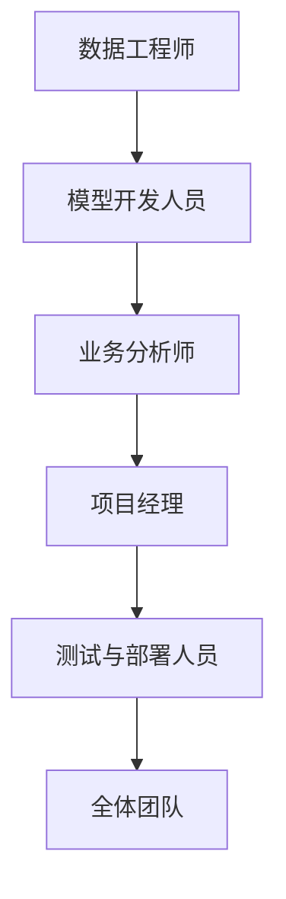
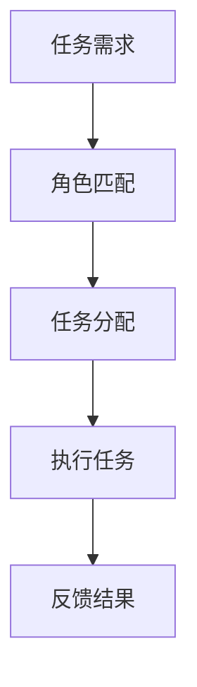
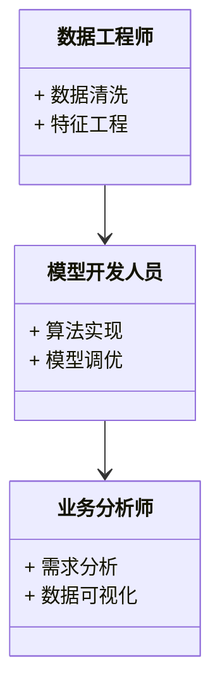

                 


# 组建高效AI开发团队：角色、技能与协作

## 关键词：高效团队、AI开发、角色技能、协作流程、团队管理

## 摘要：本文深入探讨了组建高效AI开发团队的关键要素，包括团队角色的明确、技能的匹配与互补、协作流程的优化等核心内容。通过分析团队协作中的问题与解决方案，结合实际案例，详细阐述了如何通过科学的角色分配和高效的协作机制来提升团队的整体效率。文章内容涵盖背景介绍、核心概念、算法原理、系统架构、项目实战、最佳实践等部分，旨在为AI开发团队的管理者和成员提供实用的指导与启示。

---

## 第1章：高效AI开发团队的背景与挑战

### 1.1 问题背景

#### 1.1.1 AI开发的现状与趋势
AI技术的快速发展推动了各行业对AI开发团队的需求。然而，AI开发团队的组建和管理面临诸多挑战，包括技术复杂性、团队协作效率、资源分配不合理等问题。

#### 1.1.2 高效AI团队的重要性
在AI项目中，高效的团队协作能够显著提升开发效率和产品质量。通过科学的角色分配和技能匹配，团队可以更快速地完成从需求分析到模型部署的整个流程。

#### 1.1.3 当前团队协作中的主要问题
- **角色模糊**：团队成员的职责不明确，导致任务分配混乱。
- **技能错配**：成员技能与任务要求不匹配，影响开发效率。
- **协作低效**：缺乏有效的协作机制，导致资源浪费和进度拖延。

### 1.2 问题描述

#### 1.2.1 团队角色分配的混乱
团队成员在角色分配上存在模糊，导致任务重复或遗漏，影响整体进度。

#### 1.2.2 技能匹配与能力互补的缺失
团队成员的技能与任务需求不匹配，导致部分任务无法高效完成，甚至出现能力空缺。

#### 1.2.3 协作流程中的低效问题
协作流程不畅，任务传递过程中存在信息孤岛，导致沟通不畅和效率低下。

### 1.3 问题解决

#### 1.3.1 明确团队角色与职责
通过明确角色分工，确保每个成员清楚自己的职责和任务范围。

#### 1.3.2 提升技能匹配度
根据团队成员的技能特点，合理分配任务，充分发挥每个人的潜力。

#### 1.3.3 优化协作流程与工具
引入高效的协作工具和流程，减少沟通成本，提升团队协作效率。

### 1.4 问题的边界与外延

#### 1.4.1 团队规模的边界
AI开发团队的规模通常在5-15人之间，过大或过小都会影响协作效率。

#### 1.4.2 不同行业中的差异
不同行业的AI项目需求和团队结构存在差异，需根据具体需求调整团队角色和技能分配。

#### 1.4.3 技术与非技术团队的区分
技术团队与非技术团队在角色和技能上有明显差异，需分别进行管理。

### 1.5 核心概念组成

#### 1.5.1 团队角色的分类
- 数据工程师
- 模型开发人员
- 业务分析师
- 项目经理
- 测试与部署人员

#### 1.5.2 技能体系的构建
构建团队技能矩阵，确保每个角色具备核心技能，同时注重跨技能培养。

#### 1.5.3 协作机制的设计
设计高效的协作流程，明确任务传递、信息共享和问题反馈机制。

---

## 第2章：高效AI团队的角色与技能

### 2.1 团队角色定义

#### 2.1.1 数据工程师
- 数据清洗、特征工程、数据存储与管理。
- 技能要求：熟悉Python、SQL、大数据处理工具（如Hadoop、Spark）。

#### 2.1.2 模型开发人员
- 算法实现、模型调优、模型部署。
- 技能要求：掌握深度学习框架（如TensorFlow、PyTorch）。

#### 2.1.3 业务分析师
- 需求分析、数据可视化、业务逻辑梳理。
- 技能要求：熟悉数据分析工具（如Excel、Tableau）。

#### 2.1.4 项目经理
- 项目规划、进度管理、风险控制。
- 技能要求：具备项目管理经验，熟悉敏捷开发流程。

#### 2.1.5 测试与部署人员
- 测试用例设计、系统测试、部署上线。
- 技能要求：熟悉自动化测试工具（如Selenium）。

### 2.2 技能对比分析

#### 2.2.1 各角色的核心技能对比表
| 角色         | 核心技能                           |
|--------------|-----------------------------------|
| 数据工程师    | 数据清洗、特征工程、数据存储     |
| 模型开发人员  | 算法实现、模型调优、模型部署     |
| 业务分析师    | 需求分析、数据可视化、业务逻辑   |
| 项目经理      | 项目规划、进度管理、风险控制     |
| 测试与部署人员 | 测试用例设计、环境搭建、部署上线   |

### 2.3 团队协作机制

#### 2.3.1 协作流程图


---

## 第3章：高效协作算法原理

### 3.1 任务分配算法

#### 3.1.1 基于角色匹配的任务分配
- 根据任务需求和角色技能进行匹配，确保任务分配合理。
- 算法逻辑：
  1. 分析任务需求，提取关键技能点。
  2. 匹配团队成员的技能，选择最合适的候选人。
  3. 确保任务分配后，其他成员的负载均衡。

#### 3.1.2 算法实现
```python
def assign_task(task, roles):
    matched_role = None
    for role in roles:
        if role.skills_match(task.skills_required):
            matched_role = role
            break
    return matched_role
```

#### 3.1.3 算法的数学模型
目标函数：
$$ \text{最大化任务分配效率} = \sum_{i=1}^{n} \text{角色匹配度}(i) $$

约束条件：
$$ \text{每个任务只能分配给一个角色} $$

### 3.2 协作流程优化

#### 3.2.1 流程图


---

## 第4章：系统分析与架构设计

### 4.1 项目场景介绍

#### 4.1.1 项目介绍
以一个AI推荐系统开发为例，展示团队协作的完整流程。

### 4.2 系统功能设计

#### 4.2.1 领域模型


### 4.3 系统架构设计

#### 4.3.1 系统架构图


---

## 第5章：项目实战

### 5.1 环境安装

#### 5.1.1 安装Python
```bash
python --version
pip install numpy pandas scikit-learn
```

### 5.2 核心实现

#### 5.2.1 任务分配代码
```python
def assign_task(task, roles):
    for role in roles:
        if role.skills_match(task.skills_required):
            return role
    return None
```

#### 5.2.2 任务执行代码
```python
def execute_task(role, task):
    if role == '数据工程师':
        # 数据处理逻辑
    elif role == '模型开发人员':
        # 模型开发逻辑
    # 其他角色处理逻辑
```

### 5.3 实际案例分析

#### 5.3.1 案例分析
以一个AI推荐系统的开发为例，详细分析从需求分析到部署的整个流程。

---

## 第6章：最佳实践

### 6.1 经验总结

#### 6.1.1 明确角色分工
确保每个团队成员清楚自己的职责和任务范围。

#### 6.1.2 技能互补
通过合理分配任务，确保团队整体技能互补。

### 6.2 注意事项

#### 6.2.1 避免技能错配
确保任务分配与成员技能相匹配，避免资源浪费。

#### 6.2.2 选择合适的协作工具
引入高效的协作工具（如Jira、Trello）来提升团队协作效率。

### 6.3 小结

#### 6.3.1 关键点
- 角色明确
- 技能匹配
- 协作高效

---

## 第7章：总结与展望

### 7.1 核心观点回顾

#### 7.1.1 高效团队的关键要素
- 明确的角色分工
- 合理的技能匹配
- 优化的协作流程

### 7.2 展望

#### 7.2.1 未来的团队协作趋势
随着AI技术的不断发展，团队协作将更加依赖自动化工具和智能化管理。

---

## 结语

组建高效AI开发团队是一个系统性工程，需要从角色分配、技能匹配和协作机制等多个方面进行优化。通过科学的方法和工具，团队可以显著提升开发效率和产品质量。希望本文的分析和建议能够为读者提供有价值的参考。

