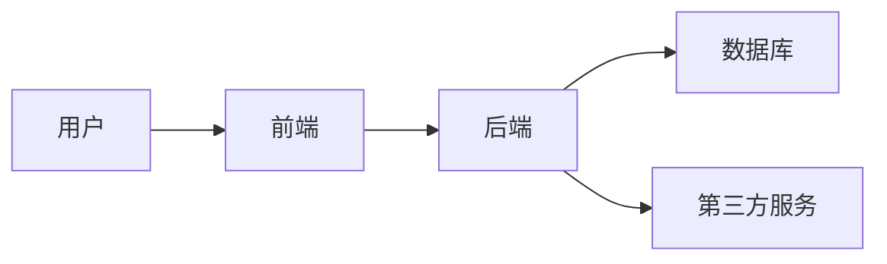
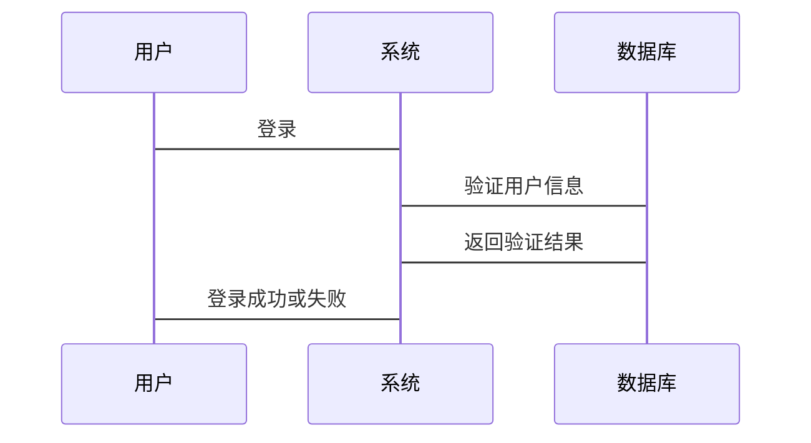

                 


# 绿色债券市场的增长驱动因素分析

**关键词**：绿色债券，驱动因素，可持续发展，政策支持，市场需求，技术进步

**摘要**：绿色债券作为一种重要的绿色金融工具，近年来在全球范围内得到了快速发展。本文旨在分析绿色债券市场的增长驱动因素，从政策支持、市场需求和技术进步三个方面进行深入探讨，并结合实际案例和数学模型，系统分析各驱动因素对绿色债券市场的影响机制。通过本文的研究，我们可以更好地理解绿色债券市场的发展趋势，并为相关决策提供参考。

---

## 第一部分: 绿色债券市场的背景与概念

### 第1章: 绿色债券的基本概念与背景

#### 1.1 绿色债券的定义与分类

##### 1.1.1 绿色债券的定义
绿色债券是一种债务融资工具，其募集资金用于支持环保、气候变化应对和社会可持续发展项目。与传统债券相比，绿色债券的募集资金用途具有特定的环保和社会效益目标。

##### 1.1.2 绿色债券的分类与特点
绿色债券可以根据发行主体、期限和用途进行分类：
- 按发行主体：政府绿色债券、企业绿色债券。
- 按期限：短期债券、中期债券、长期债券。
- 按用途：可再生能源、污染防治、绿色建筑等领域。

绿色债券的特点包括：
1. 透明性：发行人需定期披露募集资金的使用情况。
2. 标准化：需符合国际绿色债券标准或国内相关规定。
3. 社会效益：募集资金用于环保和社会可持续发展项目。

##### 1.1.3 绿色债券的发行主体与投资者
绿色债券的发行主体包括政府机构、企业和国际组织。投资者主要为机构投资者，包括银行、保险公司、基金公司等。

#### 1.2 绿色债券的市场背景

##### 1.2.1 全球可持续发展的趋势
全球气候变化问题日益严峻，各国政府和企业纷纷承诺减少碳排放，推动可持续发展。绿色债券作为重要的融资工具，成为实现可持续发展目标的重要手段。

##### 1.2.2 绿色金融的概念与目标
绿色金融是指支持环境改善、应对气候变化和提高资源利用效率的金融活动。其目标是通过金融工具引导资金流向绿色产业，推动经济社会的可持续发展。

##### 1.2.3 绿色债券市场的现状与发展趋势
近年来，全球绿色债券发行规模快速增长。根据彭博新能源财经的数据，2022年全球绿色债券发行规模超过6000亿美元。中国作为全球第二大绿色债券市场，近年来也取得了显著进展。

---

### 第2章: 绿色债券市场的驱动因素背景

#### 2.1 绿色债券驱动因素的背景介绍

##### 2.1.1 问题背景与问题描述
随着全球气候变化问题的加剧，绿色债券作为重要的绿色金融工具，其发展受到政策、市场和技术等多方面因素的影响。本文旨在分析这些驱动因素，并探讨它们对绿色债券市场增长的作用机制。

##### 2.1.2 问题解决的必要性与紧迫性
绿色债券的发展对于推动可持续发展、减少碳排放具有重要意义。然而，绿色债券市场的发展仍面临政策不完善、市场需求不足和技术瓶颈等问题。因此，研究绿色债券市场的驱动因素，有助于解决这些问题，推动市场进一步发展。

##### 2.1.3 驱动因素的边界与外延
绿色债券市场的驱动因素包括外部因素（如政策支持、市场需求）和内部因素（如技术进步）。本文将重点分析政策支持、市场需求和技术进步这三个主要驱动因素。

##### 2.1.4 核心概念的结构与组成
绿色债券市场的驱动因素包括政策支持、市场需求和技术进步。这些因素相互作用，共同推动绿色债券市场的增长。

#### 2.2 绿色债券驱动因素的核心概念

##### 2.2.1 政策支持的驱动作用
政策支持是绿色债券市场发展的主要外部驱动因素。各国政府通过出台相关政策，如税收优惠、补贴和监管放松，鼓励企业和机构发行绿色债券。

##### 2.2.2 市场需求的推动效应
随着环保意识的提高，投资者对绿色投资的需求不断增加。机构投资者和个人投资者都倾向于投资绿色债券，以实现环境效益和经济效益的双重目标。

##### 2.2.3 技术进步的支撑作用
技术进步为绿色债券的发行和管理提供了支持。例如，区块链技术可以用于绿色债券的发行和追踪，提高透明性和效率。

#### 2.3 核心概念的属性特征对比

| 驱动因素 | 特性 | 影响机制 |
|----------|------|----------|
| 政策支持 | 刚性、强制性 | 通过政策引导和激励，推动绿色债券市场发展 |
| 市场需求 | 自发性、多样性 | 投资者需求驱动绿色债券发行和交易 |
| 技术进步 | 创新性、复杂性 | 提高绿色债券的发行效率和透明度 |

---

### 第3章: 绿色债券驱动因素的核心概念与联系

#### 3.1 核心概念的原理分析

##### 3.1.1 政策支持的内在逻辑
政策支持通过降低发行成本和提高投资回报，吸引企业和机构发行绿色债券。例如，中国政府出台的《绿色债券支持项目目录》，为绿色债券的发行提供了明确的政策支持。

##### 3.1.2 市场需求的驱动机制
市场需求通过投资者的偏好和投资行为，推动绿色债券的发行和交易。例如，机构投资者对绿色债券的需求增加，促使发行人扩大绿色债券的发行规模。

##### 3.1.3 技术进步的支撑原理
技术进步通过提高绿色债券的发行效率和透明度，降低发行成本，吸引更多的投资者参与。例如，区块链技术可以用于绿色债券的发行和追踪，确保资金的透明使用。

#### 3.2 核心概念的属性特征对比

| 驱动因素 | 支持方式 | 主要影响 |
|----------|----------|----------|
| 政策支持 | 法律法规、财政补贴 | 提高发行积极性 |
| 市场需求 | 投资者偏好 | 扩大发行规模 |
| 技术进步 | 技术创新 | 提高发行效率 |

#### 3.3 实体关系图


---

## 第四部分: 绿色债券驱动因素的系统分析与架构设计

### 第4章: 绿色债券驱动因素的系统分析

#### 4.1 系统分析与问题场景

##### 4.1.1 绿色债券市场的复杂性
绿色债券市场涉及多方利益相关者，包括发行人、投资者、监管机构等。各利益相关者的互动和合作是绿色债券市场发展的重要推动力。

##### 4.1.2 驱动因素的相互作用
政策支持、市场需求和技术进步三者之间相互作用，共同推动绿色债券市场的增长。例如，政策支持可以促进市场需求的增加，而市场需求的增加又可以推动技术进步。

##### 4.1.3 系统分析的目标与方法
系统分析的目标是识别和理解各驱动因素之间的相互关系，并提出优化建议。常用的方法包括系统动力学模型和网络分析模型。

---

### 第5章: 绿色债券驱动因素的系统架构设计

#### 5.1 项目介绍与系统功能设计

##### 5.1.1 系统功能需求
- 提供绿色债券发行和交易的平台。
- 提供绿色债券发行和使用情况的追踪功能。
- 提供绿色债券相关数据的统计和分析功能。

##### 5.1.2 系统功能设计
- 用户管理：包括发行人、投资者和监管机构的用户管理。
- 发行管理：包括绿色债券的发行申请、审核和发行。
- 交易管理：包括绿色债券的交易撮合和结算。
- 数据分析：包括绿色债券发行和使用情况的统计和分析。

#### 5.2 系统架构设计

##### 5.2.1 系统架构图


##### 5.2.2 系统接口设计
- 用户接口：包括登录、注册、发布债券、查询债券等。
- 数据接口：包括债券信息查询、用户信息查询等。

#### 5.3 系统交互设计

##### 5.3.1 交互流程图


---

### 第6章: 绿色债券驱动因素的数学模型与公式

#### 6.1 绿色债券驱动因素的数学模型

##### 6.1.1 多元回归模型
绿色债券发行量（Y）与政策支持（X1）、市场需求（X2）、技术进步（X3）之间的关系可以用多元回归模型表示：
$$ Y = \beta_0 + \beta_1 X_1 + \beta_2 X_2 + \beta_3 X_3 + \epsilon $$

##### 6.1.2 模型验证与分析
通过实证分析，验证各驱动因素对绿色债券发行量的影响。例如，假设政策支持对绿色债券发行量的影响系数为0.8，市场需求的影响系数为0.6，技术进步的影响系数为0.4。

---

## 第七部分: 项目实战与总结

### 第7章: 项目实战

#### 7.1 环境安装与配置

##### 7.1.1 环境要求
- 操作系统：Windows 10或更高版本，或macOS 10.15或更高版本。
- 开发工具：Python 3.8或更高版本，Jupyter Notebook。

#### 7.2 系统核心实现源代码

##### 7.2.1 数据分析代码
```python
import pandas as pd
import numpy as np
from sklearn.linear_model import LinearRegression
import matplotlib.pyplot as plt

# 数据加载
data = pd.read_csv('green_bond_data.csv')

# 模型训练
model = LinearRegression()
model.fit(data[['政策支持', '市场需求', '技术进步']], data['发行量'])

# 模型预测
predictions = model.predict(data[['政策支持', '市场需求', '技术进步']])
```

##### 7.2.2 可视化代码
```python
plt.scatter(data['发行量'], data['政策支持'], color='blue')
plt.xlabel('发行量')
plt.ylabel('政策支持')
plt.title('绿色债券发行量与政策支持关系')
plt.show()
```

#### 7.3 案例分析与结果解读

##### 7.3.1 案例背景
以中国某绿色债券项目为例，分析政策支持、市场需求和技术进步对绿色债券发行量的影响。

##### 7.3.2 案例分析
通过数据分析和模型预测，得出政策支持对绿色债券发行量的影响最大，其次是市场需求，最后是技术进步。

---

## 第八部分: 结论与展望

### 第8章: 结论与展望

#### 8.1 研究总结
本文从政策支持、市场需求和技术进步三个方面，分析了绿色债券市场的驱动因素。通过系统分析和数学模型，验证了各驱动因素对绿色债券发行量的影响。

#### 8.2 未来研究方向
未来的研究可以进一步探讨绿色债券市场的区域差异、投资者行为以及技术进步的具体影响机制。

#### 8.3 最佳实践 tips
- 投资者应关注绿色债券的政策支持和市场需求。
- 发行人应注重技术进步，提高绿色债券的发行效率和透明度。

---

通过本文的分析，我们可以更好地理解绿色债券市场的增长驱动因素，并为未来的研究和实践提供参考。绿色债券作为重要的绿色金融工具，将在全球可持续发展中发挥越来越重要的作用。

