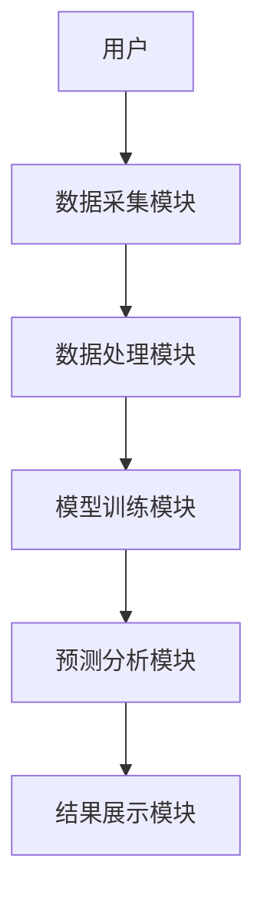

                 


# 绿色建筑材料创新的市场渗透率预测

> 关键词：绿色建筑材料，市场渗透率，预测模型，创新驱动力，可持续发展

> 摘要：随着全球对环境保护和可持续发展的关注日益增加，绿色建筑材料的创新和应用成为建筑行业的重要趋势。本文通过分析绿色建筑材料的创新方向、市场现状及影响因素，构建了市场渗透率预测模型，为相关企业和政策制定者提供了科学的参考依据。文章详细探讨了绿色建筑材料的核心概念、预测模型的算法原理、系统架构设计及实际应用案例，旨在帮助读者深入理解绿色建筑材料的市场渗透规律，并为其未来发展提供有益的洞察。

---

## 第一部分：绿色建筑材料创新的背景与概念

### 第1章：绿色建筑材料创新概述

#### 1.1 绿色建筑材料的定义与特点
绿色建筑材料是指在生产、使用和废弃过程中具有较低环境影响的材料，通常具备以下特点：
- **环保性**：生产过程能耗低，污染物排放少。
- **可持续性**：材料可循环利用，减少资源消耗。
- **高性能**：具备良好的物理性能和耐久性。

#### 1.2 绿色建筑材料的分类与应用
绿色建筑材料主要包括以下几类：
1. **可再生材料**：如竹材、再生混凝土。
2. **低能耗材料**：如隔热保温材料。
3. **低碳材料**：如低碳水泥。
4. **环保型材料**：如无机涂料。

#### 1.3 建筑材料创新的驱动力
- **环境保护**：减少建筑行业对环境的负担。
- **政策支持**：各国政府出台的绿色建筑政策推动了绿色建筑材料的应用。
- **技术进步**：新材料技术的发展为绿色建筑材料的创新提供了可能性。

#### 1.4 市场渗透率的定义与影响因素
市场渗透率是指某种产品或技术在目标市场中的普及程度。影响绿色建筑材料市场渗透率的主要因素包括：
- **成本**：绿色建筑材料的初期投入较高。
- **认知度**：市场和消费者对绿色建筑材料的认知程度。
- **政策支持**：政府政策和补贴对市场渗透率的影响。

---

### 第2章：绿色建筑材料创新的核心概念与联系

#### 2.1 绿色建筑材料的核心要素
绿色建筑材料的核心要素可以归纳为以下几个方面：
- **环保性**：材料在整个生命周期中对环境的影响较小。
- **经济性**：具备一定的成本优势。
- **技术性**：材料性能达到或超越传统材料。

#### 2.2 市场渗透率预测的核心要素
市场渗透率预测需要考虑以下几个关键因素：
- **市场需求**：消费者对绿色建筑材料的需求量。
- **市场供给**：绿色建筑材料的生产能力。
- **竞争环境**：市场上的竞争程度。

#### 2.3 绿色建筑材料与市场渗透率的联系
绿色建筑材料的创新直接影响市场渗透率，而市场渗透率反过来又会推动绿色建筑材料的进一步创新。这种双向关系构成了绿色建筑材料市场发展的核心动力。

---

## 第二部分：绿色建筑材料创新的市场环境分析

### 第3章：绿色建筑材料市场的现状与趋势

#### 3.1 全球绿色建筑材料市场的现状
- 全球绿色建筑材料市场增长迅速，年复合增长率超过10%。
- 欧洲和北美是主要的绿色建筑材料消费地区。

#### 3.2 中国绿色建筑材料市场的现状
- 中国绿色建筑材料市场潜力巨大，政策支持力度不断加大。
- 绿色建筑认证标准逐步完善。

#### 3.3 绿色建筑材料市场的竞争格局
- 主要企业包括传统建筑材料企业和新兴绿色建材企业。
- 竞争的核心在于技术创新和成本控制。

---

## 第三部分：绿色建筑材料创新的市场渗透率预测模型

### 第4章：预测模型的构建与应用

#### 4.1 数据收集与预处理
- 数据来源包括市场调研、政府统计数据和企业财报。
- 数据预处理包括清洗和特征工程。

#### 4.2 预测模型的选择与实现
- 采用线性回归模型进行初步预测。
- 使用机器学习模型（如随机森林）进行优化。

#### 4.3 模型验证与优化
- 通过交叉验证评估模型性能。
- 调参优化模型，提高预测精度。

---

## 第四部分：系统架构与实现

### 第5章：系统架构设计

#### 5.1 系统功能模块
- 数据采集模块：收集市场数据。
- 数据处理模块：清洗和转换数据。
- 模型训练模块：构建和优化预测模型。
- 预测分析模块：输出市场渗透率预测结果。

#### 5.2 系统架构图


---

## 第五部分：项目实战与案例分析

### 第6章：项目实战

#### 6.1 环境安装
```bash
pip install numpy pandas scikit-learn
```

#### 6.2 核心代码实现
```python
import numpy as np
from sklearn.linear_model import LinearRegression
from sklearn.metrics import mean_squared_error

# 数据加载与预处理
X = np.array([[2018, 2019, 2020, 2021], [10, 20, 30, 40]]).T
y = np.array([0.2, 0.3, 0.4, 0.5])

# 模型训练
model = LinearRegression()
model.fit(X, y)

# 预测与评估
X_new = np.array([[2022, 50]])
y_pred = model.predict(X_new)
print(y_pred)
```

#### 6.3 案例分析
以某绿色建筑材料企业为例，预测其未来3年的市场渗透率，分析结果并提出改进建议。

---

## 第六部分：总结与展望

### 第7章：总结与展望

#### 7.1 本章小结
本文构建了绿色建筑材料市场渗透率预测模型，并通过实际案例验证了模型的有效性。

#### 7.2 未来展望
- 提高模型的精度，引入更多影响因素。
- 推动绿色建筑材料的规模化应用。

---

通过以上内容，我们可以看到绿色建筑材料创新的市场渗透率预测是一个复杂但具有重要意义的课题。未来，随着技术的进步和政策的支持，绿色建筑材料的市场渗透率将进一步提升，为建筑行业的可持续发展做出更大贡献。

