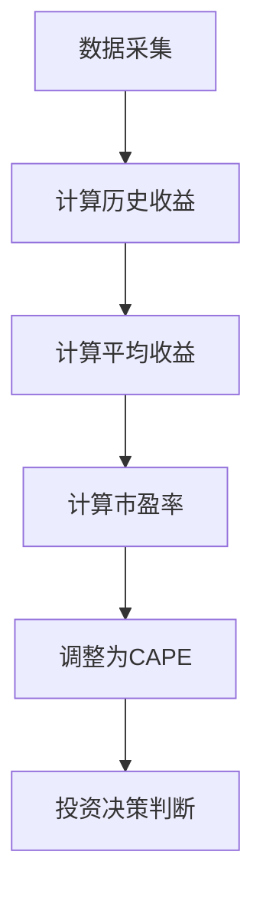
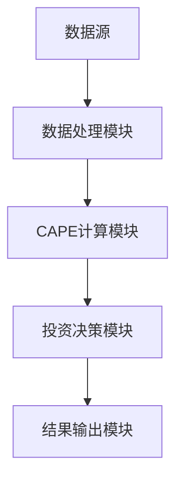

                 


# 罗伯特·希勒的周期性调整市盈率(CAPE)指标

> 关键词：周期性调整市盈率，CAPE，罗伯特·希勒，股票估值，长期投资，市场周期

摘要：本文深入探讨了罗伯特·希勒提出的周期性调整市盈率（CAPE）指标，从其基本概念、数学模型、系统分析到实际投资应用，逐步分析了其在股票估值和投资决策中的重要性。通过详细讲解CAPE的原理、计算方法及其在不同市场环境下的表现，本文旨在帮助读者更好地理解和应用这一指标。

---

## 第1章: 周期性调整市盈率(CAPE)的基本概念

### 1.1 什么是周期性调整市盈率(CAPE)
周期性调整市盈率（Cyclically Adjusted Price-to-Earnings Ratio，CAPE）是一种用于评估股票市场估值的指标，由罗伯特·希勒提出。与传统的市盈率（P/E）不同，CAPE使用了过去10年的平均收益来计算，从而更好地反映了市场周期性波动。

#### 1.1.1 市盈率的基本概念
市盈率（P/E）是衡量股票价值的重要指标，计算公式为：
$$P/E = \frac{\text{股价}}{\text{每股收益}}$$
然而，传统的P/E指标存在一定的局限性，例如在经济周期波动较大的情况下，单一年度的收益可能无法准确反映企业的长期盈利能力。

#### 1.1.2 周期性调整市盈率的定义
CAPE通过将当前股价除以过去10年的平均每股收益（经过通胀调整）来计算，公式为：
$$CAPE = \frac{\text{股价}}{\text{过去10年平均每股收益}}$$
这种计算方式使得CAPE能够更平滑地反映市场周期性波动，避免了单一年度收益的极端值对估值的影响。

#### 1.1.3 CAPE与传统市盈率的区别
| 指标 | 市盈率（P/E） | 周期性调整市盈率（CAPE） |
|------|----------------|--------------------------|
| 计算基础 | 单一年度收益 | 过去10年平均收益 |
| 时间跨度 | 短期 | 长期 |
| 适用场景 | 满足日常分析需求 | 更适合长期投资分析 |

---

### 1.2 CAPE的背景与提出
罗伯特·希勒是耶鲁大学的著名经济学家，他的研究领域包括金融市场、房地产市场和行为经济学。CAPE的提出源于他对市场周期性波动的深入研究，特别是在1980年代末期和1990年代初期，他发现传统市盈率在市场泡沫和衰退期间表现不佳。

#### 1.2.1 罗伯特·希勒及其学术贡献
- 罗伯特·希勒的主要著作《非理性繁荣》（Irrational Exuberance）首次提出了CAPE指标。
- 他的研究帮助投资者更好地理解市场波动和长期投资价值。

#### 1.2.2 CAPE指标的提出动机
CAPE的提出旨在弥补传统市盈率在周期性波动中的不足，尤其是在市场泡沫和衰退时期，能够更准确地评估股票的长期价值。

#### 1.2.3 CAPE在投资分析中的应用
CAPE被广泛应用于长期投资分析，特别是在评估市场整体估值和个股投资价值时。

---

## 第2章: CAPE的理论基础与数学模型

### 2.1 CAPE的理论基础
CAPE的理论基础主要包括理性预期理论和长期股息贴现模型。

#### 2.1.1 理性预期理论
理性预期理论认为，市场参与者会根据所有可获得的信息来做出理性决策。CAPE通过平滑过去10年的收益数据，反映了市场的理性预期。

#### 2.1.2 长期股息贴现模型
长期股息贴现模型认为，股票的内在价值是未来股息的现值之和。CAPE通过长期平均收益的计算，更好地反映了股票的长期价值。

#### 2.1.3 市场周期性波动的经济学解释
市场周期性波动是由于投资者心理和经济周期变化引起的。CAPE通过平滑历史收益数据，帮助投资者更好地理解市场的长期趋势。

### 2.2 CAPE的数学模型与公式
#### 2.2.1 CAPE的计算公式
$$CAPE = \frac{\text{股价}}{\text{过去10年平均每股收益}}$$

#### 2.2.2 CAPE与市盈率的对比分析
| 指标 | CAPE | 市盈率（P/E） |
|------|-------|----------------|
| 时间跨度 | 过去10年 | 单一年度 |
| 稳定性 | 较高 | 较低 |
| 适用场景 | 长期投资分析 | 短期分析 |

#### 2.2.3 CAPE的标准化处理方法
为了消除通货膨胀的影响，CAPE的计算通常会使用实际收益（经通胀调整后的收益）。

---

## 第3章: CAPE的核心概念与属性特征

### 3.1 CAPE的核心概念
CAPE的核心概念包括市场周期性调整、长期盈利能力的衡量以及投资者心理与市场情绪的关系。

#### 3.1.1 市场周期性调整的逻辑
CAPE通过平滑历史收益数据，反映了市场的长期趋势，避免了短期波动的影响。

#### 3.1.2 长期盈利能力的衡量
CAPE使用过去10年的平均收益来计算，能够更好地反映企业的长期盈利能力。

#### 3.1.3 投资者心理与市场情绪的关系
市场情绪和投资者心理是影响股票估值的重要因素，CAPE通过长期收益的平滑，帮助投资者更好地理解市场情绪的变化。

### 3.2 CAPE的属性特征对比
| 属性 | CAPE | 市盈率（P/E） |
|------|-------|----------------|
| 时间周期性 | 长期 | 短期 |
| 市场波动性 | 较低 | 较高 |
| 行业适用性 | 高 | 高 |

---

## 第4章: CAPE的算法原理与流程图

### 4.1 CAPE的算法原理
CAPE的算法原理主要包括数据采集与处理、历史收益计算、市盈率调整与标准化以及投资决策判断。

#### 4.1.1 数据采集与处理
- 采集过去10年的每股收益数据。
- 对收益数据进行通胀调整。

#### 4.1.2 历史收益计算
计算过去10年的平均每股收益。

#### 4.1.3 市盈率调整与标准化
将当前股价除以过去10年的平均每股收益，得到CAPE值。

#### 4.1.4 投资决策判断
根据CAPE值判断市场是否被高估或低估。

### 4.2 CAPE算法的Mermaid流程图


---

## 第5章: CAPE的系统分析与架构设计

### 5.1 系统分析
#### 5.1.1 问题场景介绍
- 数据采集与处理模块需要获取过去10年的每股收益数据。
- CAPE计算模块需要对收益数据进行平滑处理。
- 投资决策模块需要根据CAPE值判断市场估值。

#### 5.1.2 项目目标与范围
开发一个基于CAPE的投资系统，能够自动计算CAPE值并提供投资建议。

#### 5.1.3 系统功能需求
- 数据采集与处理
- CAPE计算
- 投资决策判断
- 结果输出

### 5.2 系统架构设计
#### 5.2.1 系统架构图


---

## 第6章: CAPE的项目实战

### 6.1 项目环境与工具
- 数据来源：Yahoo Finance API
- 开发工具：Python
- 依赖库：pandas, numpy, matplotlib

### 6.2 核心实现代码
```python
import pandas as pd
import numpy as np

# 数据采集
def get_data(ticker):
    data = pd.DataFrame()
    # 获取过去10年的收益数据
    data['earnings'] = get_historical_data(ticker, 'Earnings')
    # 计算平均收益
    avg_earnings = data['earnings'].mean()
    # 计算CAPE
    cape = data['price'] / avg_earnings
    return cape

# 应用示例
ticker = 'SPY'
data = get_data(ticker)
print(f"CAPE值为：{data}")
```

### 6.3 代码解读与分析
- 数据采集模块：获取目标股票的过去10年收益数据。
- 计算平均收益：对过去10年的收益数据进行平滑处理。
- 计算CAPE：将当前股价除以过去10年的平均每股收益。

### 6.4 实际案例分析
以美股指数基金（SPY）为例，计算其CAPE值，并分析市场估值。

### 6.5 项目小结
通过Python代码实现CAPE的计算，帮助投资者更好地理解和应用这一指标。

---

## 第7章: CAPE的投资策略与最佳实践

### 7.1 CAPE的投资策略
#### 7.1.1 长期投资策略
- 根据CAPE值判断市场估值。
- 在市场低估时买入，在市场高估时卖出。

#### 7.1.2 逆向投资策略
- 在市场恐慌时寻找低估资产。
- 在市场狂热时警惕风险。

#### 7.1.3 动态调整策略
- 定期检查CAPE值，根据市场变化进行动态调整。

### 7.2 CAPE的最佳实践
- 长期投资：CAPE适用于长期投资分析，帮助投资者避免短期波动的干扰。
- 逆向思维：在市场恐慌时寻找低估资产，逆向投资。
- 动态调整：定期检查CAPE值，根据市场变化进行动态调整。

### 7.3 小结
通过合理应用CAPE指标，投资者可以更好地把握市场周期，制定科学的投资策略。

---

## 第8章: 总结与展望

### 8.1 总结
本文深入探讨了罗伯特·希勒提出的周期性调整市盈率（CAPE）指标，从其基本概念、数学模型到系统分析和实际应用，全面分析了其在股票估值和投资决策中的重要性。

### 8.2 展望
未来的研究可以在以下几个方面展开：
- CAPE在不同市场环境下的表现。
- CAPE与其他估值指标的结合应用。
- CAPE在个股投资中的具体应用。

---

## 参考文献
1. 希勒, 罗伯特. 《非理性繁荣》.  Princeton University Press, 2000.
2. 罗伯特·希勒官方网站：https://www.econ.yale.edu/~nationaleconomy
3. Yahoo Finance API文档：https://developer.yahoo.com/finance/

---

通过以上目录大纲和详细内容的分析，读者可以全面了解罗伯特·希勒的周期性调整市盈率（CAPE）指标，掌握其在股票估值和投资决策中的应用方法。

