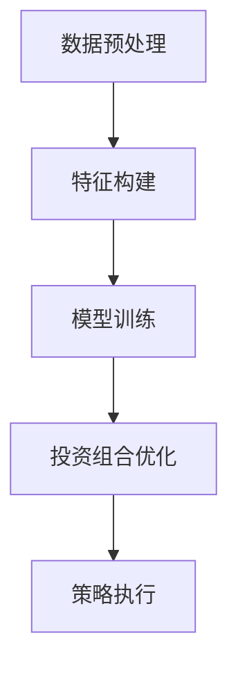
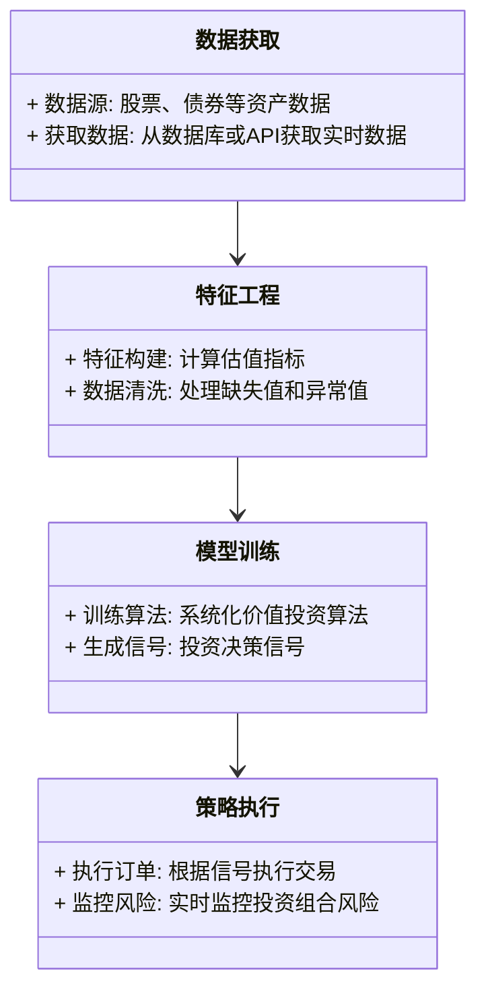
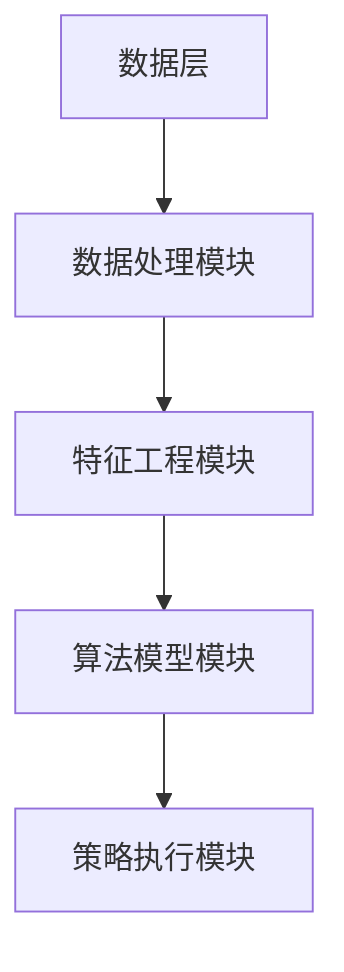
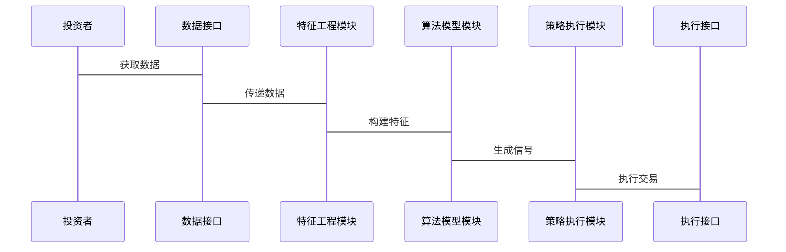

                 


---

# 罗伯特·阿诺特的系统化价值投资：算法与人工智能的应用

## 关键词：系统化价值投资，人工智能，算法，投资策略，金融分析

## 摘要：  
本文详细探讨了罗伯特·阿诺特提出的系统化价值投资方法，结合人工智能和算法的应用，分析其在金融投资中的优势和实现过程。通过理论与实践结合，本文介绍了系统化价值投资的核心概念、算法原理、系统架构设计以及项目实战案例，为读者提供全面的指导和深入的见解。

---

## 第一部分: 系统化价值投资的背景与基础

### 第1章: 价值投资概述

#### 1.1 价值投资的基本概念  
价值投资是一种以内在价值为核心的投资策略，强调以低于内在价值的价格买入优质资产。其核心在于识别市场中的估值偏差，通过基本面分析寻找被低估的投资标的。  

**关键概念：**  
- 内在价值：资产的真实价值，与市场波动无关。  
- 市场价值：资产在市场上的交易价格，受情绪和短期因素影响。  

#### 1.2 系统化投资的必要性  
传统价值投资依赖主观判断，存在效率低、风险高、可复制性差等问题。系统化投资通过量化方法，将经验转化为规则和模型，实现投资决策的系统化和自动化。  

**优势：**  
- 提高投资效率：通过算法筛选标的，减少人工干预。  
- 降低风险：系统化策略减少人为情绪干扰，增强决策的纪律性。  
- 可复制性：模型化的方法可以应用于不同市场和资产类别。  

#### 1.3 人工智能在金融领域的应用  
人工智能（AI）通过大数据分析、模式识别和预测模型，为金融投资提供强大的支持。系统化价值投资结合AI，能够更精准地识别估值偏差，优化投资组合。  

**AI的核心作用：**  
- 数据处理：从海量数据中提取有效信息。  
- 模型构建：通过机器学习算法预测资产价值。  
- 策略优化：动态调整投资组合以适应市场变化。  

---

## 第二部分: 系统化价值投资的核心概念与联系

### 第2章: 系统化价值投资的核心要素

#### 2.1 系统化价值投资的定义与特征  
系统化价值投资是将传统价值投资理念转化为量化模型的投资方法。其核心在于通过算法筛选和优化，实现对优质资产的系统化投资。  

**特征对比：**  
| **维度**       | **传统价值投资**          | **系统化价值投资**          |
|-----------------|---------------------------|-----------------------------|
| 投资决策       | 主观判断为主              | 系统化模型驱动              |
| 标的筛选       | 依赖分析师经验            | 通过算法自动筛选            |
| 风险控制       | 依赖人工监控              | 系统化风险模型自动控制        |

#### 2.2 系统化价值投资与传统价值投资的区别  
系统化价值投资在以下几个方面与传统价值投资有显著区别：  
- **方法论：** 传统投资依赖经验判断，而系统化投资依赖算法模型。  
- **效率：** 系统化投资通过自动化筛选和执行，显著提高了效率。  
- **一致性：** 系统化投资能够保持决策的纪律性，避免情绪干扰。  

#### 2.3 系统化价值投资的ER实体关系图  
系统化价值投资涉及多个实体，包括投资者、资产、数据源、算法模型和投资组合。  

**ER实体关系图：**  
```mermaid
erd
    投资者 --> 数据源: 获取数据
    投资者 --> 算法模型: 输入策略
    算法模型 --> 投资组合: 输出决策
    资产 --> 投资组合: 组合管理
```

---

## 第三部分: 系统化价值投资的算法与人工智能应用

### 第3章: 系统化价值投资的算法原理

#### 3.1 系统化价值投资算法的核心原理  
系统化价值投资算法通过构建特征、训练模型和优化投资组合，实现对优质资产的自动识别和投资决策。  

**算法流程：**  


#### 3.2 价值投资特征构建算法  
特征构建是系统化价值投资的核心步骤，通过量化指标衡量资产的内在价值。  

**特征构建算法：**  
1. 计算市盈率（P/E）、市净率（P/B）等估值指标。  
2. 比较当前估值与历史估值的偏离程度。  
3. 筛选出低于历史均值的资产。  

**代码示例：**  
```python
def calculate_valuation_ratios(data):
    data['PE'] = data['Price'] / data['Earnings']
    data['PB'] = data['Price'] / data['Book']
    return data
```

#### 3.3 投资组合优化算法  
投资组合优化是系统化价值投资的关键，通过数学模型最大化收益、最小化风险。  

**数学模型：**  
$$ \text{目标函数} = \max \left( \sum_{i=1}^{n} w_i R_i \right) $$  
$$ \text{约束条件} = \sum_{i=1}^{n} w_i = 1, \quad \sum_{i=1}^{n} w_i^2 \leq \text{风险容忍度} $$  

**代码示例：**  
```python
import numpy as np
from scipy.optimize import minimize

def optimize_portfolio(weights, returns, risk_tolerance):
    n = len(weights)
    def objective(x):
        return -np.dot(x, returns)
    def constraint1(x):
        return np.sum(x**2) - risk_tolerance
    def constraint2(x):
        return np.sum(x) - 1
    cons = [{'type': 'eq', 'fun': constraint2}, {'type': 'ineq', 'fun': constraint1}]
    result = minimize(objective, np.ones(n)/n, constraints=cons, bounds=[(0,1)]*n)
    return result.x
```

---

## 第四部分: 系统化价值投资的系统架构设计

### 第4章: 系统化价值投资系统架构

#### 4.1 系统功能设计  
系统功能包括数据获取、特征工程、模型训练和策略执行。  

**领域模型：**  


#### 4.2 系统架构设计  
系统架构采用模块化设计，包括数据层、算法层和执行层。  

**系统架构图：**  


#### 4.3 系统接口设计  
系统接口包括数据接口、算法接口和执行接口。  

**接口交互流程：**  


---

## 第五部分: 项目实战与案例分析

### 第5章: 项目实战

#### 5.1 环境安装与配置  
项目实战需要以下环境：  
- Python 3.8+  
- 数据分析库（Pandas、NumPy）  
- 优化库（SciPy、CVXOPT）  

#### 5.2 系统核心实现  
1. 数据获取与处理：  
```python
import pandas as pd
data = pd.read_csv('stock_data.csv')
data = data.dropna()
```

2. 特征工程实现：  
```python
from feature_engineering import calculate_valuation_ratios
data = calculate_valuation_ratios(data)
```

3. 模型训练与优化：  
```python
from model_training import optimize_portfolio
weights = optimize_portfolio(data.returns, data.risk_tolerance)
```

4. 策略回测与分析：  
```python
from backtesting import Backtester
backtester = Backtester(weights, data.prices)
results = backtester.run()
print(results)
```

#### 5.3 实际案例分析  
以某股票为例，分析系统化价值投资策略的应用：  
1. 数据获取与特征构建：计算市盈率、市净率等指标。  
2. 策略生成：筛选出估值低于历史均值的股票。  
3. 回测分析：验证策略在不同市场周期下的表现。  

---

## 第六部分: 最佳实践与小结

### 第6章: 最佳实践与注意事项

#### 6.1 最佳实践  
- 数据质量：确保数据清洗和特征工程的准确性。  
- 模型选择：根据市场环境选择合适的算法。  
- 风险控制：定期监控和调整投资组合。  

#### 6.2 小结与展望  
系统化价值投资结合人工智能和算法，为投资决策提供了高效、可靠的解决方案。未来，随着AI技术的进步，系统化价值投资将在更多场景中得到应用，帮助投资者实现稳健收益。

---

通过以上步骤，系统化价值投资的方法得以全面阐述，从理论到实践，帮助读者掌握这一创新的投资策略。

