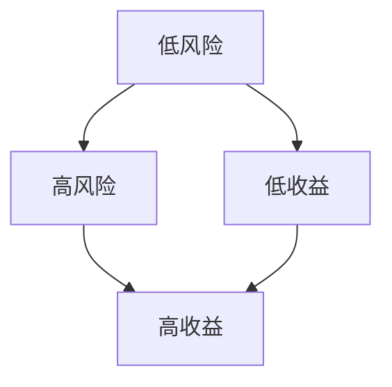
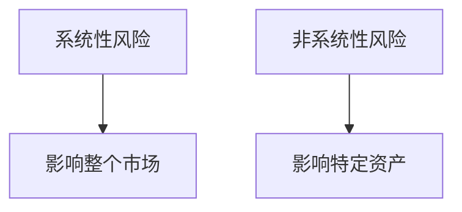
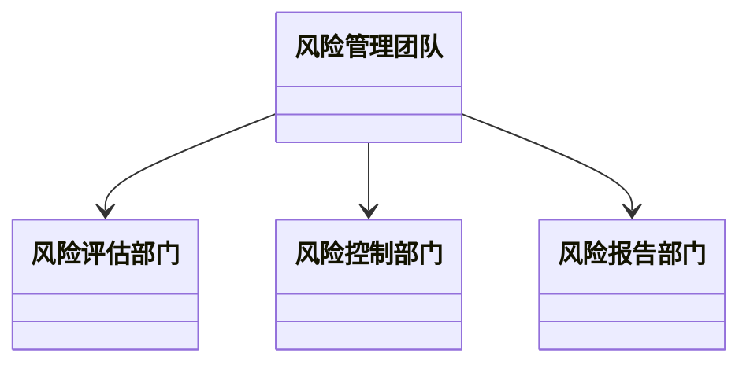

                 

# 第2章: 风险管理的核心概念与联系

## 2.1 风险与收益的关系

### 2.1.1 风险与收益的正相关性
在金融市场中，通常风险较高的投资可能带来较高的预期收益。这意味着投资者可能需要承担更大的风险以追求更高的回报。这种正相关性并非绝对，但在许多情况下，尤其是长期投资中，较高的风险往往与较高的潜在收益相关。

#### Mermaid流程图：风险与收益的关系

### 2.1.2 风险与收益的非线性关系
虽然风险与收益在某些情况下是正相关的，但这种关系并非线性。例如，在市场崩盘的情况下，高风险投资可能会带来巨大的损失，而低风险投资可能仅损失少量价值。

#### 数学模型
风险和收益的关系可以用以下公式表示：
$$ \text{收益} = f(\text{风险}) + \epsilon $$
其中，$\epsilon$ 是误差项，表示其他影响收益的因素。

### 2.1.3 风险与收益的动态平衡
在实际投资中，投资者需要在风险和收益之间找到平衡点。这可以通过调整投资组合来实现，例如通过分散投资来降低特定风险，同时保持预期收益。

## 2.2 风险类型及其特征

### 2.2.1 系统性风险与非系统性风险
系统性风险影响整个市场，如经济衰退或战争，而非系统性风险仅影响特定资产或行业。

#### Mermaid流程图：风险类型

### 2.2.2 市场风险、信用风险、流动性风险

#### 市场风险
市场风险是指资产价格因市场波动而下跌的风险。例如，股市崩盘可能导致投资组合的价值大幅下降。

#### 信用风险
信用风险是指债务人违约的风险。例如，如果一家公司无法偿还贷款，投资者可能会面临损失。

#### 流动性风险
流动性风险是指无法快速将资产转换为现金的风险。例如，在市场低迷时，投资者可能难以以合理价格卖出资产。

### 2.2.3 风险类型的对比分析

| 风险类型 | 描述 | 示例 |
|----------|------|------|
| 系统性风险 | 影响整个市场 | 经济衰退 |
| 非系统性风险 | 影响特定资产或行业 | 公司破产 |

## 2.3 风险管理的核心要素

### 2.3.1 风险识别、度量与控制

#### 风险识别
识别潜在风险是风险管理的第一步。例如，分析市场趋势、公司财务状况等。

#### 风险度量
使用VaR（在险价值）或CVaR（条件在险价值）等指标来量化风险。

#### 风险控制
通过分散投资、对冲等方法来降低风险。

### 2.3.2 风险偏好与风险承受能力

#### 风险偏好
投资者对风险的接受程度。例如，保守型投资者可能更倾向于低风险投资。

#### 风险承受能力
投资者在面对损失时的心理和财务承受能力。

### 2.3.3 风险管理的组织架构

#### Mermaid类图：风险管理组织架构

## 2.4 风险管理与价值

### 2.4.1 风险管理对投资价值的影响
有效的风险管理可以保护投资价值，避免重大损失。

### 2.4.2 风险调整后的价值
通过调整风险因素，可以更准确地评估资产的真实价值。

#### 数学模型
$$ \text{调整后的价值} = \text{原始价值} - \text{风险调整值} $$

## 2.5 总结

风险管理是投资过程中不可或缺的一部分，了解不同风险类型和管理策略有助于投资者做出更明智的决策。通过识别、度量和控制风险，投资者可以在追求收益的同时保护自身财富。

---

接下来，我会根据这个大纲继续撰写后续章节，确保每一部分都详细且逻辑清晰，帮助读者全面理解价值投资风险管理的主题。

