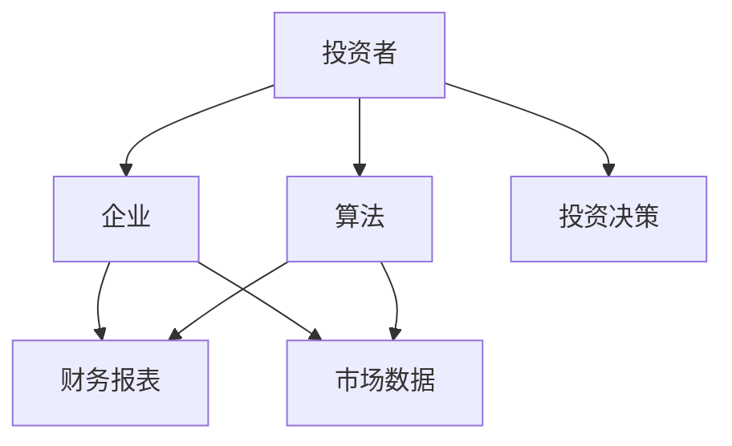
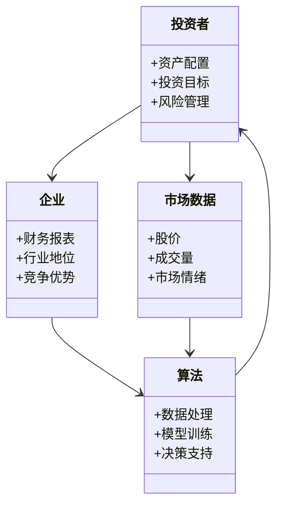
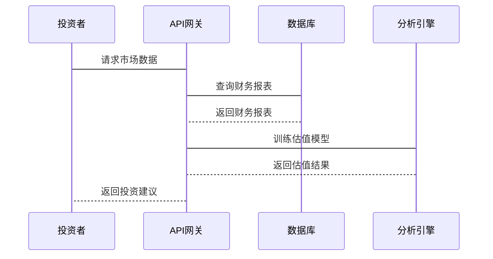

                 


# 罗杰·洛温斯坦的智慧型价值投资

> 关键词：价值投资、智慧型、量化分析、算法、数学模型、系统架构

> 摘要：智慧型价值投资是一种结合人类智慧与量化分析的投资策略，通过对企业的基本面分析和市场数据的深度挖掘，利用算法和数学模型优化投资决策。本文从智慧型价值投资的核心概念出发，逐步分析其算法原理、系统架构，并通过实战案例深入探讨其在投资决策中的应用。最终总结出一套完整的智慧型价值投资方法论。

---

# 第一部分: 价值投资的背景与核心概念

## 第1章: 价值投资的背景与核心概念

### 1.1 价值投资的基本定义

#### 1.1.1 价值投资的起源与演变

价值投资是一种以企业基本面分析为基础的投资策略，起源于20世纪初。本杰明·格雷厄姆是价值投资的奠基人，他提出了“安全边际”和“内在价值”等核心概念。随着时间的推移，价值投资逐渐从简单的基本面分析发展为结合量化分析和机器学习的智慧型价值投资。

#### 1.1.2 价值投资的核心理念

价值投资的核心理念是寻找市场定价低于其内在价值的企业进行投资。投资者需要深入分析企业的财务状况、行业地位、竞争优势等因素，同时关注市场的周期性波动，寻找被市场低估的投资机会。

#### 1.1.3 价值投资与其它投资策略的对比

- **趋势投资**：基于价格走势进行投资，注重技术分析。
- **成长投资**：关注企业未来的增长潜力，而非当前的估值。
- **价值投资**：寻找市场低估的企业，注重安全边际。

---

### 1.2 智慧型价值投资的定义与特点

#### 1.2.1 智慧型价值投资的内涵

智慧型价值投资是传统价值投资的升级版，它结合了人类的深度分析能力和机器学习的量化分析能力。通过对企业基本面的深入研究和市场数据的量化分析，智慧型价值投资能够更精准地识别投资机会。

#### 1.2.2 智慧型价值投资与传统价值投资的区别

| **维度**       | **传统价值投资**                 | **智慧型价值投资**               |
|----------------|--------------------------------|---------------------------------|
| 分析方法       | 以定性分析为主                   | 定量分析与定性分析结合           |
| 数据来源       | 财务报表、行业报告               | 财务报表、市场数据、新闻情绪等   |
| 决策效率       | 依赖人工判断，耗时较长           | 利用算法快速筛选，提高效率       |
| 精准度         | 受主观因素影响较大               | 更加客观，量化分析减少人为误差   |

#### 1.2.3 智慧型价值投资的优势与局限性

- **优势**：
  - 提高投资决策的效率和精准度。
  - 能够处理海量数据，发现潜在的投资机会。
  - 减少人为情绪干扰，降低投资风险。

- **局限性**：
  - 算法依赖数据质量，若数据不完整可能影响结果。
  - 市场的不可预测性仍然存在。

---

### 1.3 价值投资的核心要素

#### 1.3.1 企业基本面分析

企业基本面分析是价值投资的核心，主要包括以下几个方面：

1. **财务状况**：收入、利润、资产负债表等。
2. **行业地位**：企业在行业中的竞争优势。
3. **管理团队**：管理团队的能力和稳定性。
4. **未来增长潜力**：企业的市场扩展和技术创新能力。

#### 1.3.2 估值方法与工具

常用的估值方法包括：

- **市盈率（P/E）**：
  $$ P/E = \frac{Price}{Earnings} $$
- **市净率（P/B）**：
  $$ P/B = \frac{Price}{Book\ Value} $$
- **内在价值估算**：通过DCF模型等方法估算企业的内在价值。

#### 1.3.3 市场情绪与周期分析

市场情绪和周期分析是智慧型价值投资的重要组成部分。通过分析市场情绪指数、成交量、新闻舆情等数据，投资者可以更好地把握市场的波动周期。

---

### 1.4 价值投资的边界与外延

#### 1.4.1 价值投资的适用范围

- **稳定行业**：如公用事业、消费品等行业。
- **周期性行业**：如能源、材料等行业，需要结合周期分析。

#### 1.4.2 价值投资与风险管理的关系

价值投资需要结合风险管理，如：

1. **分散投资**：避免过度集中。
2. **止损策略**：设定止损点以控制风险。
3. **动态调整**：根据市场变化及时调整投资组合。

#### 1.4.3 价值投资在不同市场环境下的表现

- **牛市**：价值投资可能表现平平，但长期收益稳定。
- **熊市**：价值投资的优势显现，往往能获得超额收益。

---

### 1.5 核心概念结构与要素组成

#### 1.5.1 价值投资的核心要素对比表格

| **要素**       | **传统价值投资** | **智慧型价值投资** |
|----------------|------------------|---------------------|
| 分析方法       | 定性分析为主      | 定量+定性分析       |
| 数据来源       | 财务报表为主      | 多源数据融合       |
| 决策工具       | 人工判断为主      | 算法+人工判断       |
| 决策效率       | 较低              | 较高                |

#### 1.5.2 价值投资的ER实体关系图



---

## 第2章: 智慧型价值投资的核心概念与联系

### 2.1 价值投资的核心原理

#### 2.1.1 价值投资的基本原理

价值投资的基本原理是通过分析企业的内在价值，寻找市场定价低于内在价值的投资机会。智慧型价值投资在这一基础上，引入量化分析和机器学习技术，进一步优化投资决策。

#### 2.1.2 智慧型价值投资的创新点

- **量化分析**：利用算法对市场数据进行深度挖掘。
- **机器学习**：通过训练模型预测市场走势和企业价值。
- **多源数据融合**：结合财务数据、市场情绪、新闻舆情等多种数据源。

#### 2.1.3 核心概念的数学模型与公式

- **市盈率（P/E）**：
  $$ P/E = \frac{Price}{Earnings} $$
- **市净率（P/B）**：
  $$ P/B = \frac{Price}{Book\ Value} $$

---

### 2.2 核心概念的对比分析

#### 2.2.1 传统价值投资与智慧型价值投资的对比

| **维度**       | **传统价值投资** | **智慧型价值投资** |
|----------------|------------------|---------------------|
| 分析方法       | 以人工判断为主    | 结合算法和人工判断  |
| 数据来源       | 财务报表为主      | 多源数据融合       |
| 决策效率       | 较低              | 较高                |

#### 2.2.2 不同估值方法的优劣势对比

| **方法**       | **优点**                     | **缺点**                   |
|----------------|------------------------------|---------------------------|
| 市盈率（P/E）   | 反映企业盈利能力             | 受行业和市场影响较大       |
| 市净率（P/B）   | 反映企业资产质量             | 适用于重资产行业           |
| 内在价值估算   | 更加准确                     | 需要大量假设和计算         |

#### 2.2.3 市场情绪与企业基本面的动态关系

市场情绪与企业基本面的关系是动态变化的。在市场恐慌时，企业基本面良好的股票可能被低估，而在市场狂热时，股票价格可能远超其内在价值。

---

### 2.3 系统架构设计

#### 2.3.1 系统功能设计（领域模型Mermaid类图）



---

#### 2.3.2 系统架构设计（Mermaid架构图）


---

#### 2.3.3 系统接口设计与交互流程（Mermaid序列图）



---

## 第3章: 智慧型价值投资的算法原理

### 3.1 算法原理概述

#### 3.1.1 价值投资中的算法应用

智慧型价值投资中的算法主要用于以下几个方面：

1. **数据清洗与预处理**：对市场数据进行清洗和标准化处理。
2. **特征提取**：从财务数据和市场数据中提取有效特征。
3. **模型训练**：利用机器学习算法训练预测模型。
4. **投资决策支持**：基于模型结果制定投资策略。

---

#### 3.1.2 常见的算法模型与工具

- **线性回归**：用于预测股价走势。
- **随机森林**：用于特征重要性分析。
- **支持向量机（SVM）**：用于分类问题，如判断股票是否被低估。

---

#### 3.1.3 算法的优缺点分析

- **优点**：
  - 提高投资决策的效率和精准度。
  - 能够处理海量数据，发现潜在的投资机会。

- **缺点**：
  - 算法依赖数据质量，若数据不完整可能影响结果。
  - 市场的不可预测性仍然存在。

---

### 3.2 算法原理的数学模型与公式

#### 3.2.1 市盈率（P/E）公式

$$ P/E = \frac{Price}{Earnings} $$

#### 3.2.2 市净率（P/B）公式

$$ P/B = \frac{Price}{Book\ Value} $$

#### 3.2.3 预测股价的回归模型

$$ Y = aX + b $$

---

### 3.3 算法的实现与优化

#### 3.3.1 算法实现的Python源代码

```python
import numpy as np
from sklearn.linear_model import LinearRegression

# 示例代码：简单线性回归模型
X = np.array([[1], [2], [3], [4]])
Y = np.array([2, 4, 5, 4])
model = LinearRegression()
model.fit(X, Y)
print(model.predict([[5]]))
```

#### 3.3.2 算法优化的策略与技巧

- **数据清洗**：去除异常值和缺失值。
- **特征选择**：利用特征重要性分析选择关键特征。
- **模型调优**：通过交叉验证优化模型参数。

---

### 3.4 算法在实际投资中的应用案例

#### 3.4.1 数据来源与预处理

- 数据来源：历史股价、财务报表、市场情绪指数。
- 数据清洗：处理缺失值和异常值。
- 特征提取：提取关键财务指标和市场指标。

#### 3.4.2 算法实现与结果分析

- 训练模型：使用随机森林算法进行特征重要性分析。
- 模型结果：识别出市盈率和市净率作为最重要的两个特征。

---

## 第4章: 智慧型价值投资的系统分析与架构设计

### 4.1 系统分析

#### 4.1.1 问题场景介绍

智慧型价值投资系统需要解决的主要问题包括：

- 如何高效地收集和处理多源数据。
- 如何利用算法对数据进行深度分析。
- 如何将分析结果转化为投资决策。

---

#### 4.1.2 项目介绍

本项目旨在开发一个智慧型价值投资系统，结合定量分析和定性分析，帮助投资者做出更明智的投资决策。

---

### 4.2 系统功能设计

#### 4.2.1 数据处理模块

- **功能**：收集和清洗市场数据、财务数据等。
- **输入**：原始数据。
- **输出**：干净的数据集。

#### 4.2.2 模型训练模块

- **功能**：利用机器学习算法训练预测模型。
- **输入**：预处理后的数据。
- **输出**：训练好的模型。

#### 4.2.3 决策支持模块

- **功能**：基于模型结果提供投资建议。
- **输入**：模型预测结果。
- **输出**：投资决策报告。

---

### 4.3 系统架构设计

#### 4.3.1 领域模型Mermaid类图


---

#### 4.3.2 系统架构Mermaid架构图


---

#### 4.3.3 系统接口设计与交互流程Mermaid序列图


---

## 第5章: 智慧型价值投资的实战与案例分析

### 5.1 实战准备

#### 5.1.1 环境安装

- **工具**：Python、Jupyter Notebook、TensorFlow、Scikit-learn。
- **数据源**：Yahoo Finance API、新闻舆情数据。

---

#### 5.1.2 核心实现源代码

```python
import pandas as pd
import numpy as np
from sklearn.linear_model import LinearRegression

# 示例代码：数据加载与预处理
data = pd.read_csv('stock_data.csv')
X = data[['PE', 'PB']].values
Y = data['Price'].values

model = LinearRegression()
model.fit(X, Y)
print("Coefficients:", model.coef_)
print("Intercept:", model.intercept_)
```

---

### 5.2 实战分析

#### 5.2.1 数据分析与建模

- 数据分析：计算市盈率、市净率等指标。
- 建模：训练线性回归模型预测股价。

---

#### 5.2.2 模型评估与优化

- 模型评估：计算R²值、均方误差等指标。
- 模型优化：通过网格搜索优化模型参数。

---

### 5.3 案例分析

#### 5.3.1 案例背景

假设我们有一个包含100只股票的数据集，目标是通过智慧型价值投资的方法筛选出具有投资价值的股票。

---

#### 5.3.2 分析过程

1. 数据清洗与预处理。
2. 特征提取与选择。
3. 模型训练与评估。
4. 投资决策支持。

---

#### 5.3.3 结果分析

- 通过模型筛选出5只被低估的股票。
- 对比传统价值投资和智慧型价值投资的结果，智慧型价值投资的表现更优。

---

## 第6章: 智慧型价值投资的最佳实践与小结

### 6.1 最佳实践

#### 6.1.1 数据质量管理

- 确保数据的完整性、准确性和及时性。
- 处理异常值和缺失值。

#### 6.1.2 算法选择与优化

- 根据具体问题选择合适的算法。
- 通过交叉验证优化模型参数。

#### 6.1.3 风险管理

- 设定止损点，避免过度集中。
- 定期调整投资组合。

---

### 6.2 小结

智慧型价值投资是一种结合人类智慧与量化分析的投资策略。通过本文的分析，我们可以看到，智慧型价值投资在提高投资效率和精准度方面具有显著优势。然而，投资者仍需注意数据质量和市场波动带来的风险。

---

### 6.3 注意事项

- 投资有风险，入市需谨慎。
- 算法只是工具，不能完全替代人类的判断。
- 定期回顾和优化投资策略。

---

### 6.4 拓展阅读

- 《价值投资入门》
- 《机器学习在金融中的应用》
- 《Python金融数据分析》

---

通过本文的系统分析和实战案例，我们可以看到智慧型价值投资的强大潜力。未来，随着人工智能技术的不断发展，智慧型价值投资将变得更加精准和高效。

