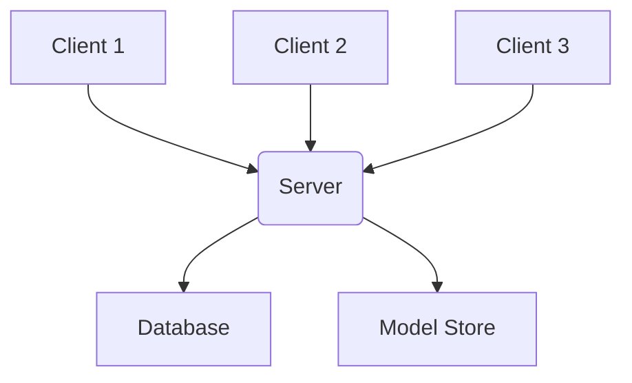

                 


# 联邦元学习在分布式AI Agent中的应用

## 关键词：
- 联邦元学习
- 分布式AI Agent
- 算法原理
- 系统架构
- 项目实战

## 摘要：
联邦元学习是一种结合了分布式系统和元学习的新兴技术，旨在通过多个AI Agent的协同学习来提升整体智能系统的性能和适应性。本文从联邦元学习的基本原理出发，详细探讨其在分布式AI Agent中的应用，包括算法实现、系统设计、项目实战以及最佳实践等方面。通过深入分析，本文旨在为读者提供一个全面了解和应用联邦元学习在分布式AI Agent中的框架。

---

# 第1章: 联邦元学习与分布式AI Agent的背景介绍

## 1.1 联邦元学习的定义与核心概念

### 1.1.1 什么是联邦元学习
联邦元学习（Federated Meta-Learning）是一种结合了联邦学习（Federated Learning）和元学习（Meta-Learning）的技术。它通过在分布式的计算环境中，从多个数据源中学习通用的元知识，以提升模型的泛化能力和适应性。

**核心概念：**
- **联邦学习（Federated Learning）**：通过分布式数据源协作学习全局模型，避免数据泄露。
- **元学习（Meta-Learning）**：通过学习如何学习，提升模型在不同任务或分布中的适应能力。

### 1.1.2 元学习的基本原理
元学习的目标是让模型学会如何快速适应新任务或数据分布。其核心思想是通过在多个任务或数据分布上进行训练，提取通用的特征表示，从而在新的任务中实现快速迁移。

### 1.1.3 联邦学习的定义与特点
联邦学习是一种分布式学习范式，允许多个参与方在不共享原始数据的情况下，通过交换模型参数或梯度来共同训练一个全局模型。其特点包括：
- **数据隐私性**：数据不出域，仅传输模型参数。
- **分布式协作**：多个参与方协作，共同优化全局模型。
- **高效性**：通过并行计算和优化算法，提升训练效率。

## 1.2 分布式AI Agent的基本概念

### 1.2.1 AI Agent的定义与分类
AI Agent是一种能够感知环境、自主决策并执行任务的智能体。根据功能和应用场景，AI Agent可以分为：
- **简单反应式Agent**：基于当前感知做出反应。
- **基于模型的反射式Agent**：通过内部状态和模型进行决策。
- **目标驱动型Agent**：根据目标选择最优动作。

### 1.2.2 分布式AI Agent的体系结构
分布式AI Agent的体系结构包括：
- **单 Agent 系统**：单个AI Agent独立执行任务。
- **多 Agent 系统**：多个AI Agent协作完成复杂任务。
- **分布式协作系统**：多个AI Agent通过通信协议协同工作，共同完成复杂的分布式任务。

### 1.2.3 分布式AI Agent的应用场景
- **智能机器人协作**：多个机器人协同完成任务。
- **分布式推荐系统**：多个推荐系统协作，提供个性化推荐。
- **多智能体游戏AI**：多个AI Agent在复杂环境中协作决策。

## 1.3 联邦元学习与分布式AI Agent的联系

### 1.3.1 联邦元学习在分布式AI Agent中的作用
联邦元学习通过在分布式环境中学习通用的元知识，帮助AI Agent快速适应不同的任务和数据分布，提升其协作能力和智能水平。

### 1.3.2 联邦元学习与分布式AI Agent的协同机制
- **模型共享**：通过联邦学习机制，多个AI Agent共享元知识，提升整体模型的泛化能力。
- **任务协作**：AI Agent通过协作完成多个任务，共同优化全局模型。

### 1.3.3 联邦元学习在分布式AI Agent中的优势
- **数据隐私性**：通过联邦学习，AI Agent可以在不共享原始数据的情况下协作学习。
- **快速适应性**：通过元学习，AI Agent能够快速适应新的任务和数据分布。

## 1.4 本章小结
本章介绍了联邦元学习和分布式AI Agent的基本概念，分析了它们的联系和协同机制。联邦元学习通过在分布式环境中学习通用的元知识，帮助AI Agent提升协作能力和智能水平，为后续章节的深入分析奠定了基础。

---

# 第2章: 联邦元学习的核心原理

## 2.1 元学习的基本原理

### 2.1.1 元学习的定义
元学习是一种通过学习如何学习的技术。其目标是让模型学会如何快速适应新任务或数据分布。

### 2.1.2 元学习的算法框架
元学习的典型算法包括：
- **Meta-SGD**：通过优化元损失函数，更新模型参数。
- **Reptile**：通过局部优化，逐步更新模型参数。
- **MAML**：通过端到端优化，学习任务间共享的特征表示。

### 2.1.3 元学习的核心思想
元学习的核心思想是通过在多个任务或数据分布上进行训练，提取通用的特征表示，从而在新的任务中实现快速迁移。

## 2.2 联邦学习的算法类型

### 2.2.1 联邦平均法
- **Federated Averaging (FedAvg)**：通过客户端上传模型参数的平均值，更新全局模型。
- **FedProx**：在FedAvg的基础上，增加正则化项，提升模型的泛化能力。

### 2.2.2 联邦聚合法
- **Federated K-Means**：通过分布式聚类算法，学习数据的簇中心。
- **Federated GMM**：通过分布式高斯混合模型，学习数据的分布。

### 2.2.3 联邦优化法
- **Federated SGD**：通过分布式随机梯度下降，优化全局模型。
- **Federated Adam**：结合Adam优化器，提升联邦学习的收敛速度和稳定性。

## 2.3 联邦元学习与传统机器学习的对比

### 2.3.1 数据分布的差异
- **联邦学习**：数据分布于多个客户端，每个客户端数据可能不同。
- **传统机器学习**：数据集中在一个或少数几个数据中心。

### 2.3.2 模型更新的差异
- **联邦学习**：通过客户端上传模型参数或梯度，更新全局模型。
- **传统机器学习**：通过集中式训练，直接更新全局模型。

### 2.3.3 性能评估的差异
- **联邦学习**：模型性能依赖于客户端的数据分布和模型更新策略。
- **传统机器学习**：模型性能依赖于数据集中性和训练策略。

## 2.4 本章小结
本章详细介绍了元学习和联邦学习的核心原理，分析了它们的算法类型和与传统机器学习的差异，为后续章节的深入分析奠定了基础。

---

# 第3章: 分布式AI Agent的体系结构

## 3.1 分布式AI Agent的基本结构

### 3.1.1 单个AI Agent的结构
- **感知层**：通过传感器或数据接口感知环境。
- **决策层**：通过算法或模型做出决策。
- **执行层**：通过执行机构执行决策。

### 3.1.2 多个AI Agent的协作结构
- **主从结构**：一个主Agent协调多个从Agent。
- **对等结构**：多个AI Agent对等协作。
- **层次结构**：多个AI Agent分层协作。

### 3.1.3 分布式AI Agent的通信机制
- **点对点通信**：Agent之间直接通信。
- **通过中间件通信**：通过中间件进行通信和协调。
- **基于消息队列的通信**：通过消息队列实现异步通信。

## 3.2 分布式AI Agent的通信协议

### 3.2.1 通信协议的定义
通信协议是分布式AI Agent之间交互的规则和格式。

### 3.2.2 常见的通信协议类型
- **基于HTTP的通信协议**：通过HTTP协议进行通信。
- **基于WebSocket的通信协议**：通过WebSocket协议实现实时通信。
- **基于消息队列的通信协议**：通过Kafka、RabbitMQ等消息队列实现异步通信。

### 3.2.3 通信协议的选择与优化
- **选择通信协议**：根据应用场景和性能需求选择合适的通信协议。
- **优化通信协议**：通过压缩、加密等技术优化通信性能和安全性。

## 3.3 分布式AI Agent的实现方式

### 3.3.1 基于云计算的实现方式
- **IaaS模式**：通过基础设施即服务实现分布式AI Agent。
- **PaaS模式**：通过平台即服务实现分布式AI Agent。
- **SaaS模式**：通过软件即服务实现分布式AI Agent。

### 3.3.2 基于边缘计算的实现方式
- **边缘计算架构**：通过边缘设备实现AI Agent的分布式部署。
- **边缘协同计算**：通过边缘设备之间的协同实现分布式AI Agent的协作。

## 3.4 本章小结
本章详细介绍了分布式AI Agent的体系结构，包括基本结构、通信协议和实现方式，为后续章节的深入分析奠定了基础。

---

# 第4章: 联邦元学习与分布式AI Agent的结合

## 4.1 联邦元学习在分布式AI Agent中的应用

### 4.1.1 联邦元学习的核心思想
- **分布式协作**：通过联邦学习机制，多个AI Agent协作学习全局模型。
- **快速适应性**：通过元学习，AI Agent能够快速适应新的任务和数据分布。

### 4.1.2 联邦元学习与分布式AI Agent的协同机制
- **模型共享**：通过联邦学习机制，多个AI Agent共享元知识，提升整体模型的泛化能力。
- **任务协作**：AI Agent通过协作完成多个任务，共同优化全局模型。

## 4.2 联邦元学习在分布式AI Agent中的实现

### 4.2.1 联邦元学习的算法框架
- **Meta-SGD**：通过优化元损失函数，更新模型参数。
- **Reptile**：通过局部优化，逐步更新模型参数。
- **MAML**：通过端到端优化，学习任务间共享的特征表示。

### 4.2.2 分布式AI Agent的协作流程
1. **初始化**：多个AI Agent初始化模型参数。
2. **联邦学习**：通过联邦学习机制，多个AI Agent协作学习全局模型。
3. **元学习**：通过元学习算法，优化全局模型的泛化能力。
4. **任务协作**：多个AI Agent通过协作完成多个任务，共同优化全局模型。

## 4.3 联邦元学习在分布式AI Agent中的优势

### 4.3.1 数据隐私性
通过联邦学习，AI Agent可以在不共享原始数据的情况下协作学习，保护数据隐私。

### 4.3.2 快速适应性
通过元学习，AI Agent能够快速适应新的任务和数据分布，提升整体系统的智能水平。

## 4.4 本章小结
本章详细介绍了联邦元学习在分布式AI Agent中的应用，分析了其核心思想和实现方式，为后续章节的深入分析奠定了基础。

---

# 第5章: 联邦元学习的算法实现

## 5.1 联邦元学习的数学模型

### 5.1.1 元学习的数学公式
$$ \text{Meta-Learning} = \arg\min_{\theta} \mathbb{E}_{i} [\mathcal{L}_i(\theta)] $$
其中，$\theta$是模型参数，$\mathcal{L}_i$是第i个任务的损失函数。

### 5.1.2 联邦学习的数学公式
$$ \text{Federated Learning} = \arg\min_{\theta} \sum_{i=1}^N \mathcal{L}_i(\theta) $$
其中，$N$是参与方的数量，$\mathcal{L}_i$是第i个参与方的损失函数。

## 5.2 联邦元学习的算法实现

### 5.2.1 Meta-SGD算法
```python
def Meta_SGD(global_model, local_models, learning_rate):
    # 计算梯度
    global_grads = []
    for i in range(len(local_models)):
        local_grads = compute_gradients(local_models[i], global_model)
        global_grads.append(local_grads)
    # 更新全局模型
    for param, grad in zip(global_model.parameters(), global_grads):
        param.data -= learning_rate * grad.data
```

### 5.2.2 Reptile算法
```python
def Reptile(global_model, local_models, learning_rate):
    # 计算梯度
    local_grads = []
    for i in range(len(local_models)):
        local_grads[i] = compute_gradients(local_models[i], global_model)
    # 更新全局模型
    for param, grad in zip(global_model.parameters(), local_grads):
        param.data += learning_rate * (param.data - grad.data)
```

### 5.2.3 MAML算法
```python
def MAML(global_model, local_models, inner_learning_rate, outer_learning_rate):
    # 内部优化
    for i in range(len(local_models)):
        with torch.no_grad():
            local_models[i].parameters() += inner_learning_rate * compute_gradients(local_models[i], global_model)
    # 外部优化
    global_grads = compute_gradients(global_model, local_models)
    for param, grad in zip(global_model.parameters(), global_grads):
        param.data -= outer_learning_rate * grad.data
```

## 5.3 本章小结
本章详细介绍了联邦元学习的数学模型和算法实现，包括Meta-SGD、Reptile和MAML算法的实现方式，为后续章节的深入分析奠定了基础。

---

# 第6章: 系统设计与实现

## 6.1 系统架构设计

### 6.1.1 系统功能设计
- **模型训练**：通过联邦元学习算法，训练全局模型。
- **任务协作**：多个AI Agent协作完成多个任务。
- **模型更新**：通过联邦学习机制，更新全局模型。

### 6.1.2 系统架构图


### 6.1.3 系统交互流程
1. **初始化**：多个客户端初始化模型参数。
2. **模型训练**：客户端通过联邦元学习算法，训练全局模型。
3. **任务协作**：客户端通过协作完成多个任务，共同优化全局模型。
4. **模型更新**：客户端通过联邦学习机制，更新全局模型。

## 6.2 系统接口设计

### 6.2.1 API接口设计
- **/api/federated_learning**：触发联邦学习流程。
- **/api/meta_learning**：触发元学习流程。
- **/api/model_update**：上传模型参数或梯度。

### 6.2.2 接口实现
```python
@app.route('/api/federated_learning', methods=['POST'])
def federated_learning():
    # 获取客户端上传的模型参数
    global_model = load_model()
    for client in clients:
        local_model = client.upload_model()
        update_global_model(global_model, local_model)
    return 'Federated learning completed.'

@app.route('/api/meta_learning', methods=['POST'])
def meta_learning():
    # 通过元学习算法，优化全局模型
    global_model = optimize_global_model(global_model)
    return 'Meta learning completed.'
```

## 6.3 本章小结
本章详细介绍了系统架构设计和接口设计，分析了系统的交互流程和实现方式，为后续章节的深入分析奠定了基础。

---

# 第7章: 项目实战

## 7.1 环境安装与配置

### 7.1.1 安装依赖
```bash
pip install torch
pip install requests
pip install flask
pip install mermaid
```

### 7.1.2 配置环境变量
```bash
export FLASK_APP=app.py
export FLASK_ENV=development
```

## 7.2 核心实现

### 7.2.1 客户端实现
```python
class Client:
    def __init__(self, client_id):
        self.client_id = client_id
        self.model = initialize_model()

    def upload_model(self):
        return self.model

    def download_model(self, global_model):
        self.model = global_model
```

### 7.2.2 服务器实现
```python
class Server:
    def __init__(self):
        self.global_model = initialize_global_model()

    def aggregate_models(self, models):
        # 联邦平均法
        aggregated_model = average(models)
        return aggregated_model

    def optimize_model(self, global_model):
        # 元学习优化
        optimized_model = optimize(global_model)
        return optimized_model
```

## 7.3 代码应用与解读

### 7.3.1 应用场景
- **智能推荐系统**：通过联邦元学习，多个推荐系统协作，提供个性化推荐。
- **多智能体游戏AI**：通过分布式协作，多个AI Agent协同决策。

### 7.3.2 代码解读
```python
def average(models):
    # 计算模型参数的平均值
    averaged_model = copy.deepcopy(models[0])
    for param in averaged_model.parameters():
        param.data /= len(models)
    for i in range(1, len(models)):
        for param, client_param in zip(averaged_model.parameters(), models[i].parameters()):
            param.data += client_param.data / len(models)
    return averaged_model
```

## 7.4 本章小结
本章通过具体的项目实战，详细介绍了环境安装、核心实现和代码应用，帮助读者更好地理解和实现联邦元学习在分布式AI Agent中的应用。

---

# 第8章: 最佳实践与未来展望

## 8.1 最佳实践

### 8.1.1 数据隐私性
- **数据加密**：通过加密技术保护数据隐私。
- **差分隐私**：通过差分隐私技术，保护数据隐私。

### 8.1.2 系统优化
- **通信优化**：通过压缩、加密等技术优化通信性能和安全性。
- **模型优化**：通过模型剪枝、知识蒸馏等技术优化模型性能。

## 8.2 小结与注意事项

### 8.2.1 小结
- 联邦元学习是一种结合了联邦学习和元学习的新兴技术，通过在分布式环境中学习通用的元知识，帮助AI Agent提升协作能力和智能水平。

### 8.2.2 注意事项
- **数据隐私性**：通过联邦学习，保护数据隐私。
- **模型优化**：通过模型优化，提升系统性能和效率。

## 8.3 未来展望

### 8.3.1 联邦元学习的发展方向
- **更高效的算法**：研究更高效的联邦元学习算法，提升系统性能和效率。
- **更广泛的应用**：探索联邦元学习在更多领域的应用，如智能交通、智能医疗等。

### 8.3.2 分布式AI Agent的未来趋势
- **更智能的协作机制**：研究更智能的协作机制，提升AI Agent的协作能力和智能水平。
- **更广泛的应用场景**：探索分布式AI Agent在更多场景中的应用，如智慧城市、智能制造等。

## 8.4 本章小结
本章总结了联邦元学习在分布式AI Agent中的应用，提出了最佳实践和未来展望，为读者提供了进一步学习和研究的方向。

---

# 结语
联邦元学习是一种结合了联邦学习和元学习的新兴技术，通过在分布式环境中学习通用的元知识，帮助AI Agent提升协作能力和智能水平。本文从联邦元学习的基本原理出发，详细探讨了其在分布式AI Agent中的应用，包括算法实现、系统设计、项目实战以及最佳实践等方面。通过深入分析，本文旨在为读者提供一个全面了解和应用联邦元学习在分布式AI Agent中的框架，为未来的研究和实践提供参考。

