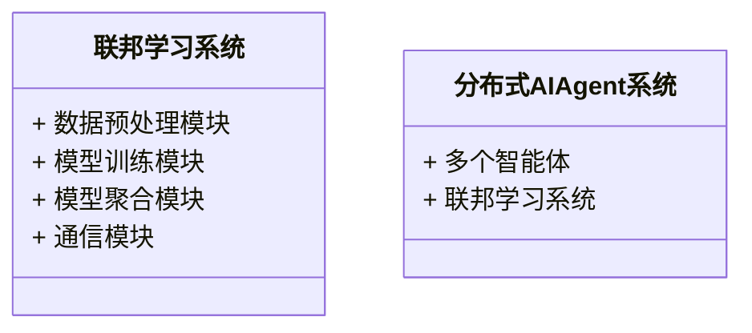
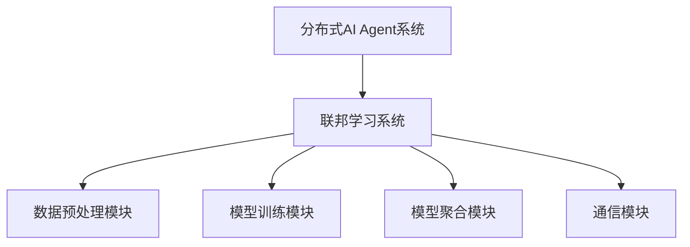
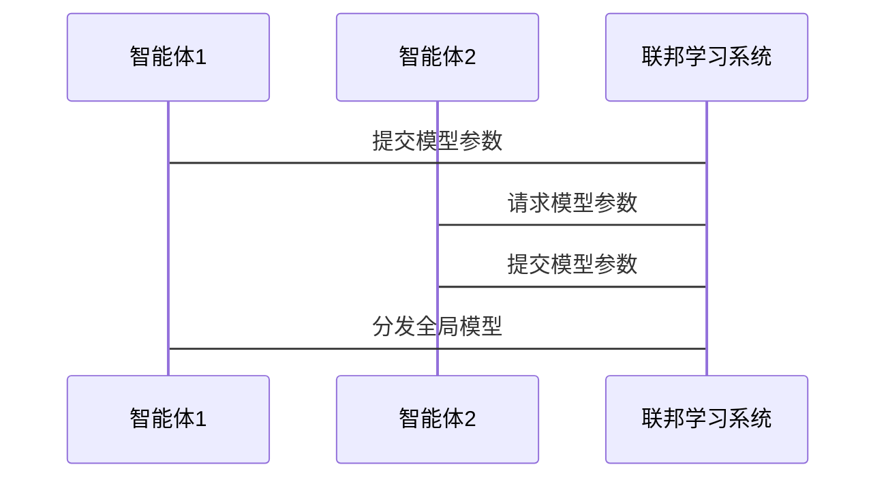

                 


# 联邦学习在分布式AI Agent系统中的应用

## 关键词：联邦学习，分布式系统，AI Agent，数据隐私，协作学习，机器学习

## 摘要：  
随着人工智能技术的快速发展，分布式AI Agent系统在各个领域的应用越来越广泛。然而，数据隐私和协作学习的挑战也日益凸显。联邦学习作为一种新兴的分布式机器学习方法，能够在保护数据隐私的前提下，实现模型的协作训练。本文从联邦学习的核心概念出发，详细探讨其在分布式AI Agent系统中的应用，包括算法原理、系统架构设计、实际案例分析以及未来的发展方向。通过本文的阐述，读者将深入了解联邦学习如何解决分布式AI Agent系统中的关键问题，并掌握其在实际场景中的应用方法。

---

# 正文

## 第一部分：背景介绍

### 第1章：联邦学习与分布式AI Agent系统概述

#### 1.1 联邦学习的定义与特点

联邦学习（Federated Learning）是一种分布式机器学习方法，允许多个参与方在不共享原始数据的情况下，共同训练一个全局模型。其核心特点包括：

- **数据局部性**：数据保留在原始来源处，不进行集中存储。
- **隐私保护**：通过加密和差分隐私等技术，确保数据的安全性。
- **协作性**：各参与方通过通信协议共享模型参数，而非数据。

#### 1.2 分布式AI Agent系统的基本概念

AI Agent（智能体）是指在环境中能够感知并自主行动以实现目标的实体。分布式AI Agent系统由多个智能体组成，每个智能体负责特定任务或区域，通过通信和协作完成全局目标。

- **AI Agent的特点**：
  - 自主性：智能体能够自主决策。
  - 反应性：能够感知环境并实时调整行为。
  - 协作性：通过通信和协作完成复杂任务。
  - 社会性：智能体之间可以形成社会关系，共同完成目标。

- **分布式AI Agent系统的应用场景**：
  - 多智能体游戏：如MOBA游戏中的角色协作。
  - 智能交通系统：多个自动驾驶车辆协作完成交通任务。
  - 分布式推荐系统：多个推荐引擎协作提供个性化服务。

#### 1.3 联邦学习在分布式AI Agent系统中的应用背景

在分布式AI Agent系统中，数据隐私和协作学习是两个关键挑战。联邦学习通过以下方式解决了这些问题：

- **数据隐私保护**：通过联邦学习，数据无需离开本地，模型参数通过加密通信共享，确保数据隐私。
- **协作学习**：各智能体可以在不共享数据的情况下，协作训练全局模型，提升系统整体性能。
- **去中心化架构**：联邦学习天然适合分布式架构，能够适应去中心化的系统设计。

---

## 第二部分：联邦学习的核心概念与原理

### 第2章：联邦学习的核心概念与原理

#### 2.1 联邦学习的核心原理

联邦学习的核心在于通过模型参数的同步，实现全局模型的训练，同时保护数据隐私。其主要步骤包括：

- **初始化**：各参与方本地初始化模型参数。
- **局部训练**：各参与方在本地数据上训练模型，更新本地参数。
- **参数聚合**：通过通信协议将各参与方的模型参数聚合，更新全局模型。
- **模型同步**：将全局模型参数分发给各参与方，供其继续训练。

#### 2.2 联邦学习的数学模型与公式

联邦学习的数学模型主要涉及两个关键步骤：局部更新和全局聚合。

- **局部更新**：每个参与方 $i$ 在本地数据上更新模型参数 $\theta_i$，具体公式为：
  $$ \theta_i^{(t+1)} = \theta_i^{(t)} - \eta \nabla J_i(\theta_i^{(t)}) $$
  其中，$\eta$ 是学习率，$J_i$ 是参与方 $i$ 的损失函数。

- **全局聚合**：将所有参与方的模型参数聚合，更新全局模型 $\theta$：
  $$ \theta^{(t+1)} = \sum_{i=1}^n w_i \theta_i^{(t+1)} $$
  其中，$w_i$ 是参与方 $i$ 的权重。

#### 2.3 联邦学习与分布式AI Agent系统的结合

在分布式AI Agent系统中，联邦学习可以应用于以下场景：

- **多智能体协作学习**：多个智能体通过联邦学习协作训练一个全局模型，提升协作效率。
- **分布式推荐系统**：多个推荐引擎通过联邦学习协作训练推荐模型，提供个性化推荐。
- **去中心化决策系统**：多个决策智能体通过联邦学习协作训练决策模型，实现去中心化决策。

---

## 第三部分：系统分析与架构设计

### 第3章：系统分析与架构设计

#### 3.1 问题场景介绍

假设我们正在设计一个分布式AI Agent系统，用于多个自动驾驶车辆的协作决策。每个车辆是一个智能体，负责感知环境和决策，同时需要与其他车辆协作训练全局决策模型。

#### 3.2 系统功能设计

为了实现联邦学习在分布式AI Agent系统中的应用，我们需要设计以下功能模块：

- **数据预处理模块**：负责对本地数据进行预处理，确保数据格式统一。
- **模型训练模块**：负责在本地数据上训练模型，更新模型参数。
- **模型聚合模块**：负责将各参与方的模型参数聚合，更新全局模型。
- **通信模块**：负责模型参数的上传和下载，确保通信安全。

#### 3.3 系统架构设计

以下是系统的类图和架构图：



架构图如下：



#### 3.4 系统交互设计

以下是系统交互的序列图：



---

## 第四部分：项目实战

### 第4章：项目实战

#### 4.1 环境安装

以下是项目所需的环境安装命令：

```bash
pip install numpy
pip install tensorflow
pip install cryptography
```

#### 4.2 系统核心实现源代码

以下是联邦学习系统的Python实现代码：

```python
import numpy as np
import tensorflow as tf
from cryptography.fernet import Fernet

class FederatedLearningSystem:
    def __init__(self, num_participants):
        self.num_participants = num_participants
        self.participant_weights = [1.0] * num_participants

    def local_update(self, participant_idx, model, data):
        optimizer = tf.keras.optimizers.Adam(learning_rate=0.01)
        for _ in range(10):
            loss = model.train_step(data)
            if loss < 0.01:
                break

    def aggregate_models(self, models):
        average_model = models[0].weights.copy()
        for weight, model_weight in zip(average_model, models[1:].weights):
            weight *= self.participant_weights[models.index(model)]
            weight += model_weight * self.participant_weights[models.index(model)]
        return average_model

    def communicate(self, participants, data):
        for idx, participant in enumerate(participants):
            self.local_update(idx, participant.model, data)
        average_model = self.aggregate_models(participants.models)
        for participant in participants:
            participant.model.set_weights(average_model)
```

#### 4.3 代码实现解读与分析

- **FederatedLearningSystem类**：管理联邦学习系统的初始化和主要功能。
  - `local_update`方法：在参与者本地更新模型参数。
  - `aggregate_models`方法：聚合各参与者的模型参数，计算平均模型。
  - `communicate`方法：协调参与者进行模型更新和同步。

- **模型训练**：在`local_update`方法中，使用Adam优化器在本地数据上训练模型，直到损失函数小于0.01或达到最大迭代次数。

- **模型聚合**：在`aggregate_models`方法中，根据参与者的权重，计算全局模型的平均参数。

- **模型同步**：在`communicate`方法中，将全局模型参数分发给所有参与者，供其继续训练。

#### 4.4 实际案例分析

以电商推荐系统为例，多个推荐引擎通过联邦学习协作训练推荐模型。每个推荐引擎负责处理特定用户的推荐任务，通过联邦学习聚合各引擎的模型参数，更新全局推荐模型，提升推荐系统的准确性和个性化能力。

---

## 第五部分：总结与展望

### 第5章：总结与展望

#### 5.1 最佳实践 tips

- **数据预处理**：确保各参与方的数据格式统一，避免数据偏差。
- **通信安全**：使用加密和差分隐私技术，确保通信过程中的数据安全。
- **模型收敛性**：合理设置学习率和聚合权重，确保模型收敛。

#### 5.2 小结

通过本文的阐述，我们深入探讨了联邦学习在分布式AI Agent系统中的应用，从核心概念到系统设计，再到实际案例，全面展示了联邦学习的优势和实现方法。

#### 5.3 注意事项

- 联邦学习的通信效率和模型收敛性需要进一步优化。
- 数据隐私保护技术需要不断加强，确保数据安全。
- 系统架构设计需要考虑去中心化和可扩展性。

#### 5.4 拓展阅读

- 《Federated Learning: Challenges, Methods, and Future Directions》
- 《Distributed Machine Learning Through Collaborative Model Training》

---

# 结语

联邦学习作为一种新兴的分布式机器学习方法，为分布式AI Agent系统的数据隐私保护和协作学习提供了新的解决方案。通过本文的详细讲解，读者可以掌握联邦学习的核心原理和实际应用方法，为未来的研究和实践奠定基础。

