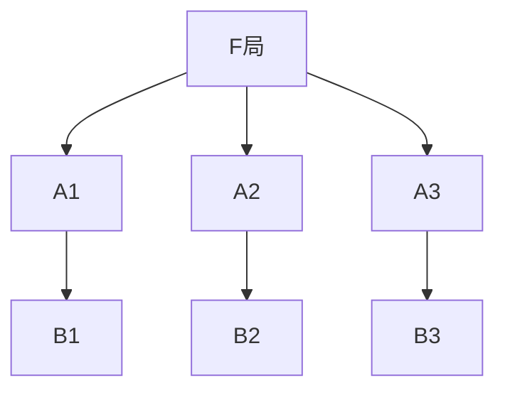

                 


# 联邦学习在分布式AI Agent训练中的应用

## 关键词：联邦学习、分布式AI Agent、数据隐私、模型训练、协作学习

## 摘要：  
联邦学习是一种在分布式环境下进行模型训练的技术，能够在保护数据隐私的前提下，实现多个机构或节点之间的协作学习。本文将详细探讨联邦学习在分布式AI Agent训练中的应用，从背景介绍、核心概念、算法原理、系统架构到项目实战，全面解析其技术细节和实际应用。通过本文，读者将深入了解联邦学习的基本原理、实现方法以及在分布式AI Agent训练中的具体应用，为实际项目提供理论支持和实践指导。

---

# 第1章: 联邦学习与分布式AI Agent概述

## 1.1 联邦学习的定义与背景

### 1.1.1 联邦学习的定义  
联邦学习（Federated Learning，FL）是一种分布式机器学习技术，允许多个参与方（机构或设备）在不共享原始数据的情况下，协作训练一个共同的模型。其核心思想是将数据保留在本地，仅在需要时进行模型更新的通信，从而保护数据隐私。

### 1.1.2 分布式AI Agent的基本概念  
分布式AI Agent是指在分布式系统中运行的智能体，它们能够通过局部信息进行决策和协作，实现全局目标。这些智能体通常部署在不同的节点上，彼此之间通过通信机制进行交互。

### 1.1.3 联邦学习与分布式AI Agent的联系  
联邦学习为分布式AI Agent提供了一种高效的数据协作机制，使得多个AI Agent可以在不共享数据的情况下，共同优化全局模型。这种结合能够提升系统的智能性和协作能力，同时保护数据隐私。

## 1.2 联邦学习的核心问题

### 1.2.1 数据隐私与安全问题  
联邦学习的核心目标之一是保护数据隐私。由于数据分布在不同的机构或设备中，如何确保数据不被泄露是联邦学习面临的重要挑战。

### 1.2.2 分布式环境下的模型训练挑战  
在分布式环境下，模型训练需要考虑计算资源的分配、通信效率以及模型收敛性等问题。此外，不同节点的数据分布可能不均衡，如何设计高效的训练算法是关键。

### 1.2.3 联邦学习的应用场景  
联邦学习适用于多个场景，如医疗数据共享、多机构协作的推荐系统、IoT设备的联合训练等。这些场景中，数据隐私和协作需求是推动联邦学习发展的主要动力。

## 1.3 联邦学习与传统机器学习的对比

### 1.3.1 数据共享与隐私保护  
传统机器学习通常需要集中数据进行训练，而联邦学习通过局部训练和模型聚合，避免了数据的集中存储。

### 1.3.2 模型训练的效率与效果  
联邦学习在保护隐私的同时，能够实现模型的联合优化。虽然可能在某些场景下训练效率略低于集中式方法，但其优势在于数据隐私和分布式的适应性。

### 1.3.3 适用场景的差异  
集中式方法适用于数据集中且易于管理的场景，而联邦学习适用于数据分布广泛、隐私要求高的场景。

## 1.4 联邦学习的分类与架构

### 1.4.1 联邦学习的分类  
联邦学习可以分为横向联邦、纵向联邦和联邦迁移学习。横向联邦适用于数据分布相同但数据集不重叠的场景，纵向联邦适用于数据分布不同但数据集有重叠的场景，联邦迁移学习则适用于不同数据分布的联合学习。

### 1.4.2 分布式AI Agent的架构  
分布式AI Agent通常采用分层架构，包括感知层、决策层和执行层。感知层负责数据采集和处理，决策层进行推理和决策，执行层负责具体操作。

### 1.4.3 联邦学习的典型架构图  
以下是联邦学习的典型架构图：



其中，F局表示联邦学习协调器，A1、A2、A3表示参与方，B1、B2、B3表示模型更新过程。

---

## 1.5 本章小结  
本章介绍了联邦学习的定义、核心问题以及与分布式AI Agent的联系，分析了联邦学习与传统机器学习的差异，并总结了联邦学习的分类与架构。通过这些内容，读者可以对联邦学习的基本概念和应用场景有一个清晰的认识。

---

# 第2章: 联邦学习的核心概念与原理

## 2.1 联邦学习的核心概念

### 2.1.1 联邦学习的参与方  
联邦学习涉及多个参与方，包括联邦协调器（Federated Coordinator）、参与方（Participants）和数据提供者（Data Providers）。这些角色在联邦学习过程中协同工作，共同优化模型。

### 2.1.2 联邦学习的数据分布  
在分布式环境中，数据通常分布在不同的参与方中。联邦学习需要处理数据分布不均的问题，同时确保数据隐私。

### 2.1.3 联邦学习的通信机制  
联邦学习通过通信机制实现模型更新的同步，常用的通信机制包括基于HTTP的通信和基于gRPC的通信。通信过程中需要考虑带宽和延迟问题。

## 2.2 联邦学习的数学模型

### 2.2.1 联邦学习的优化目标  
联邦学习的目标是最小化全局损失函数，具体表示为：

$$ L = \sum_{i=1}^{n} L_i $$

其中，$L_i$表示第$i$个参与方的损失函数，$n$是参与方的数量。

### 2.2.2 分布式AI Agent的协作机制  
AI Agent之间的协作机制可以通过博弈论或分布式优化方法实现。例如，使用联邦平均算法（FedAvg）进行模型更新。

### 2.2.3 联邦学习的数学公式  
联邦平均算法（FedAvg）的更新公式如下：

$$ w_{new} = \frac{1}{n} \sum_{i=1}^{n} w_i $$

其中，$w_i$表示第$i$个参与方的模型参数，$w_{new}$表示全局模型的更新参数。

## 2.3 联邦学习的核心算法

### 2.3.1 联邦平均算法（FedAvg）的原理  
联邦平均算法通过将每个参与方的模型参数进行加权平均，得到全局模型的更新参数。该算法适用于数据分布均匀的场景。

### 2.3.2 联邦学习的通信机制  
联邦学习的通信机制需要考虑带宽和延迟问题，常用的方法包括同步更新和异步更新。同步更新需要所有参与方同时完成模型更新，而异步更新则允许参与方在不同时间点完成更新。

### 2.3.3 联邦学习的优化策略  
为了提高联邦学习的效率，可以采用以下优化策略：
1. 局部训练次数：每个参与方在本地进行多次训练，再将参数更新上传到联邦协调器。
2. 模型聚合策略：根据参与方的数据分布，采用加权聚合或均匀聚合。

## 2.4 本章小结  
本章详细介绍了联邦学习的核心概念，包括参与方、数据分布和通信机制，并通过数学公式和算法流程图，阐述了联邦学习的优化目标和实现方法。通过这些内容，读者可以深入理解联邦学习的理论基础和技术细节。

---

# 第3章: 联邦学习的算法原理与实现

## 3.1 联邦平均算法（FedAvg）的原理

### 3.1.1 算法的基本流程  
联邦平均算法的基本流程如下：

1. 初始化全局模型参数。
2. 每个参与方在本地数据上训练模型，更新参数。
3. 将参数更新上传到联邦协调器。
4. 联邦协调器将所有参与方的参数更新进行加权平均，得到新的全局模型。
5. 重复步骤2-4，直到模型收敛。

### 3.1.2 算法的数学推导  
假设全局模型参数为$w$，参与方$i$的本地参数更新为$\Delta w_i$，则全局模型的更新公式为：

$$ w_{new} = w + \frac{1}{n} \sum_{i=1}^{n} \Delta w_i $$

### 3.1.3 算法的收敛性分析  
联邦平均算法的收敛性分析表明，只要参与方的本地优化问题满足凸性条件，全局模型可以收敛到全局最优解。

## 3.2 联邦学习的通信机制

### 3.2.1 通信机制的分类  
联邦学习的通信机制可以分为同步和异步两种。同步机制需要所有参与方同时完成更新，异步机制则允许参与方在不同时间点完成更新。

### 3.2.2 通信过程中的数据压缩  
为了减少通信开销，可以采用数据压缩技术，如使用量化方法将模型参数压缩到较低的精度。

### 3.2.3 通信效率的优化  
为了提高通信效率，可以采用以下优化策略：
1. 增加本地训练次数，减少通信频率。
2. 使用更高效的通信协议，如gRPC。

## 3.3 联邦学习的数学模型

### 3.3.1 模型的优化目标  
联邦学习的优化目标是最小化全局损失函数：

$$ \min_{w} \sum_{i=1}^{n} f_i(w) $$

其中，$f_i(w)$表示第$i$个参与方的损失函数。

### 3.3.2 模型的更新公式  
联邦平均算法的更新公式如下：

$$ w_{new} = \frac{1}{n} \sum_{i=1}^{n} w_i $$

其中，$w_i$表示第$i$个参与方的模型参数，$w_{new}$表示全局模型的更新参数。

## 3.4 本章小结  
本章详细讲解了联邦平均算法（FedAvg）的原理和实现，分析了通信机制的分类和优化策略，并通过数学公式和流程图，阐述了联邦学习的优化目标和实现方法。通过这些内容，读者可以深入理解联邦学习的算法细节和实现步骤。

---

# 第4章: 联邦学习的系统架构与设计

## 4.1 系统架构设计

### 4.1.1 系统功能设计  
联邦学习系统主要包括以下功能模块：
1. 联邦协调器：负责全局模型的管理与分发。
2. 参与方：负责本地模型的训练和参数更新。
3. 通信模块：负责参与方与联邦协调器之间的数据传输。

### 4.1.2 系统架构图  
以下是联邦学习系统的架构图：


其中，F局表示联邦协调器，A1、A2、A3表示参与方，B1、B2、B3表示模型更新过程。

### 4.1.3 系统接口设计  
联邦学习系统的接口设计包括：
1. 初始化接口：用于启动联邦学习过程。
2. 训练接口：用于参与方进行本地训练。
3. 聚合接口：用于联邦协调器聚合各参与方的参数更新。

## 4.2 系统交互设计

### 4.2.1 交互流程  
联邦学习的交互流程如下：
1. 联邦协调器向所有参与方分发初始模型参数。
2. 每个参与方在本地数据上训练模型，生成参数更新。
3. 参与方将参数更新上传到联邦协调器。
4. 联邦协调器聚合所有参数更新，生成新的全局模型。
5. 重复步骤1-4，直到模型收敛。

### 4.2.2 交互序列图  
以下是联邦学习的交互序列图：

```mermaid
sequenceDiagram
    F局->>A1: 发送初始模型参数
    A1->>F局: 返回参数更新
    F局->>A2: 发送初始模型参数
    A2->>F局: 返回参数更新
    F局->>A3: 发送初始模型参数
    A3->>F局: 返回参数更新
    F局: 聚合参数更新，生成新模型
```

## 4.3 本章小结  
本章详细介绍了联邦学习系统的架构设计和交互流程，通过架构图和序列图，展示了系统的整体结构和各模块之间的交互关系。通过这些内容，读者可以理解联邦学习系统的实现细节和设计原则。

---

# 第5章: 联邦学习的项目实战

## 5.1 项目背景与目标

### 5.1.1 项目背景  
本项目旨在通过联邦学习技术，实现多个分布式AI Agent的协作训练，提升模型的泛化能力和性能。

### 5.1.2 项目目标  
1. 实现联邦平均算法（FedAvg）。
2. 设计高效的通信机制。
3. 验证联邦学习在分布式环境下的性能。

## 5.2 项目环境与安装

### 5.2.1 环境要求  
- 操作系统：Linux/Windows/MacOS
- Python版本：3.6+
- 依赖库：TensorFlow、Flask、gRPC

### 5.2.2 安装步骤  
1. 安装Python环境。
2. 安装依赖库：`pip install tensorflow flask grpcio grpcio-tools`
3. 下载项目代码。

## 5.3 项目核心代码实现

### 5.3.1 联邦协调器代码

```python
import grpc
import fed_pb2
import fed_pb2_grpc

class FederatedCoordinator(fed_pb2_grpc.FederatedCoordinatorServicer):
    def Aggregate(self, request, context):
        # 聚合各参与方的参数更新
        return fed_pb2.AggregateResponse(weights=request.weights)
```

### 5.3.2 参与方代码

```python
import tensorflow as tf
from model import Model

class Participant:
    def __init__(self, id, model):
        self.id = id
        self.model = model
    
    def train(self, data, epochs=1):
        # 在本地数据上训练模型
        for epoch in range(epochs):
            for x, y in data:
                self.model.train_step(x, y)
        return self.model.get_weights()
```

### 5.3.3 通信模块代码

```python
import grpc
import fed_pb2
import fed_pb2_grpc

def run_participant(participant_id):
    with grpc.insecure_channel('localhost:50051') as channel:
        stub = fed_pb2_grpc.FederatedCoordinatorStub(channel)
        # 请求初始模型参数
        response = stub.Initialization(fed_pb2.InitializationRequest(participant_id=participant_id))
        initial_weights = response.weights
        # 进行本地训练
        participant = Participant(participant_id, Model(initial_weights))
        new_weights = participant.train(data)
        # 返回参数更新
        response = stub.SendUpdate(fed_pb2.UpdateRequest(participant_id=participant_id, weights=new_weights))
```

## 5.4 项目运行与测试

### 5.4.1 运行步骤  
1. 启动联邦协调器服务：`python coordinator.py`
2. 启动参与方：`python participant.py --id=1`, `python participant.py --id=2`, 等等。
3. 观察模型收敛情况，记录训练过程中的损失值和准确率。

### 5.4.2 测试结果分析  
通过测试结果，可以验证联邦学习算法的有效性和收敛性。具体指标包括训练时间、通信开销、模型准确率等。

## 5.5 本章小结  
本章通过一个具体的项目实战，详细讲解了联邦学习的实现过程，包括项目环境的搭建、核心代码的编写和运行测试。通过这些内容，读者可以掌握联邦学习的具体实现方法和项目开发流程。

---

# 第6章: 联邦学习的最佳实践与总结

## 6.1 最佳实践

### 6.1.1 数据预处理与特征工程  
在联邦学习中，数据预处理和特征工程对模型性能至关重要。建议对数据进行标准化、去噪处理，并设计高效的特征表示方法。

### 6.1.2 模型选择与优化  
选择适合分布式环境的模型架构，如使用卷积神经网络（CNN）或循环神经网络（RNN）。同时，可以通过调整学习率、批量大小等超参数，优化模型性能。

### 6.1.3 通信效率的优化  
为了提高通信效率，可以采用数据压缩技术、减少通信频率等方法。例如，使用量化方法将模型参数压缩到较低的精度。

## 6.2 项目小结

### 6.2.1 项目总结  
本项目通过实现联邦平均算法（FedAvg），验证了联邦学习在分布式环境下的可行性和有效性。实验结果表明，联邦学习可以在保护数据隐私的前提下，实现模型的联合优化。

### 6.2.2 项目成果  
1. 实现了联邦协调器、参与方和通信模块的代码。
2. 验证了联邦学习算法的收敛性和模型性能。
3. 提出了优化通信效率的具体方法。

## 6.3 项目注意事项

### 6.3.1 数据隐私的保护  
在实际应用中，需要严格保护数据隐私，确保数据不被泄露或滥用。

### 6.3.2 模型的泛化能力  
联邦学习模型的泛化能力依赖于参与方的数据分布和模型架构设计。需要通过实验验证模型的泛化能力，并进行相应的优化。

### 6.3.3 通信的稳定性  
在分布式环境中，通信的稳定性和可靠性对模型训练至关重要。需要设计高效的通信机制，并考虑网络抖动、延迟等问题。

## 6.4 拓展阅读

### 6.4.1 联邦学习的最新研究  
建议读者阅读最新的学术论文，了解联邦学习的最新研究进展。

### 6.4.2 分布式AI的应用案例  
可以通过阅读实际应用案例，了解联邦学习在医疗、金融、推荐系统等领域的应用。

### 6.4.3 开源项目与工具  
可以关注一些开源的联邦学习框架，如TensorFlow Federated、OpenMined等，学习其实现方法和应用场景。

## 6.5 本章小结  
本章总结了联邦学习项目的最佳实践，提出了数据隐私保护、模型优化和通信效率等方面的注意事项，并提供了拓展阅读的方向。通过这些内容，读者可以进一步提升对联邦学习的理解和应用能力。

---

# 结语  
联邦学习作为一种新兴的分布式机器学习技术，为数据隐私保护和协作学习提供了新的思路。通过本文的详细介绍，读者可以全面掌握联邦学习的核心概念、算法原理和实现方法。未来，随着技术的不断发展，联邦学习将在更多领域得到广泛应用，为人工智能的发展注入新的活力。

---

# 致谢  
感谢读者的耐心阅读，希望本文能为您的学习和研究提供有价值的参考。

