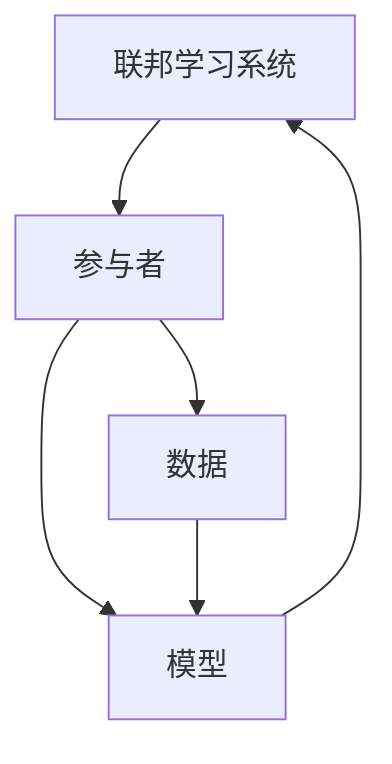
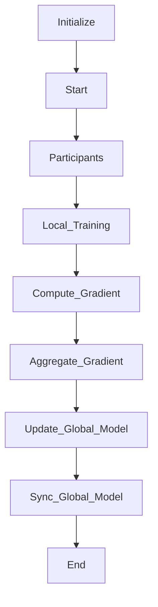
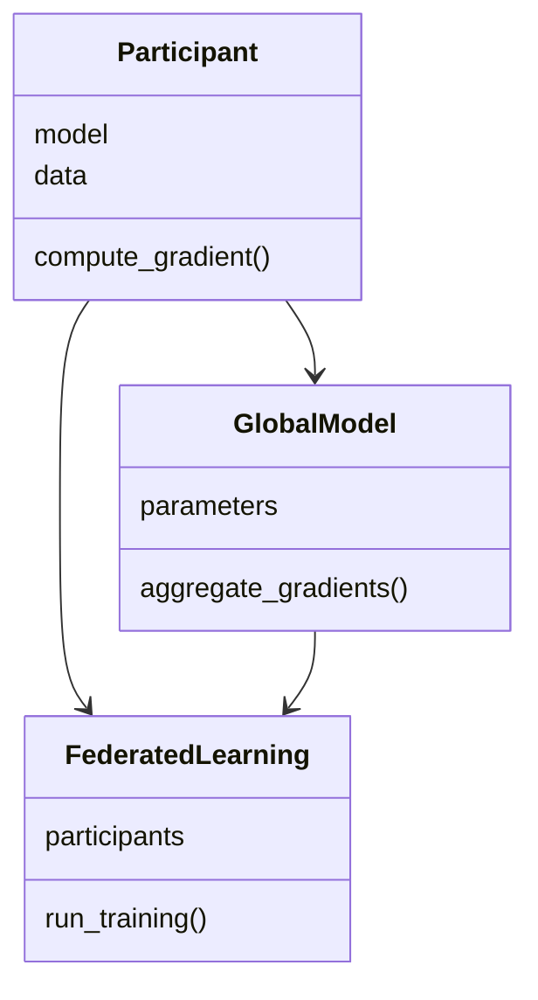
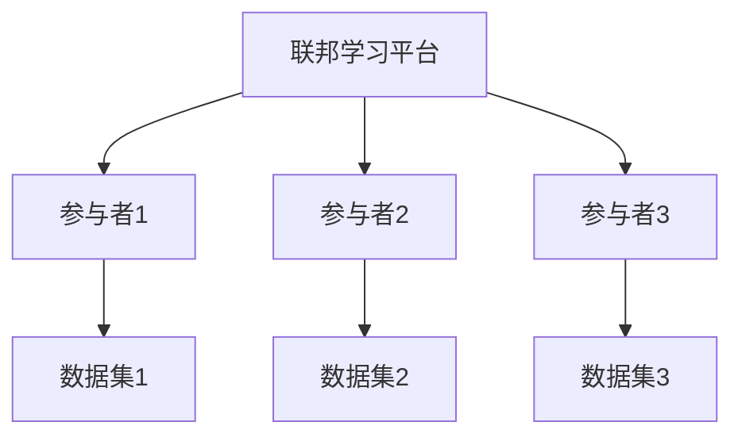
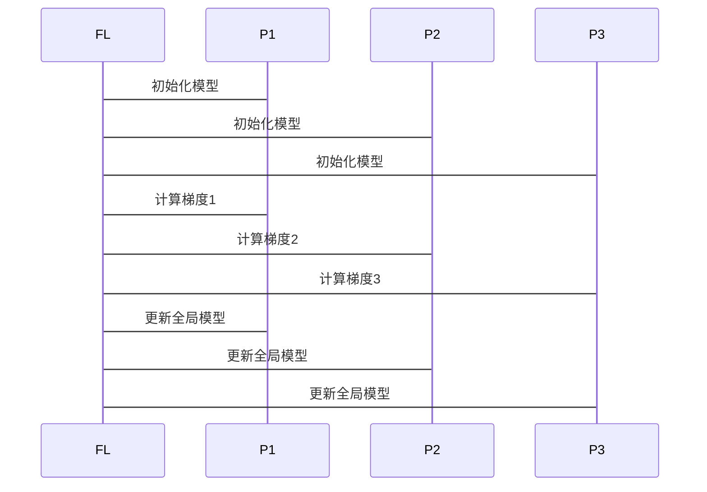

                 


# 联邦学习：保护隐私的分布式AI Agent训练

## 关键词：
联邦学习、数据隐私、分布式AI、AI代理训练、数据协作

## 摘要：
本文深入探讨了联邦学习在保护隐私的前提下，如何实现分布式AI代理训练。文章从联邦学习的背景出发，分析其核心概念、算法原理、系统架构，并通过实际案例展示其在保护隐私的同时提升AI模型性能的优势。文中详细讲解了联邦学习的关键技术，包括数据划分、模型聚合、通信协议等，并通过图表和代码示例帮助读者理解其工作原理。同时，文章还提供了系统设计和项目实战的详细步骤，帮助读者快速上手实现联邦学习。

---

# 目录

## 第1章 联邦学习的背景与核心概念

### 1.1 联邦学习的背景

#### 1.1.1 数据隐私与安全的挑战

随着AI技术的快速发展，数据隐私问题日益突出。企业间的数据孤岛现象严重，如何在不共享原始数据的前提下进行模型训练成为亟待解决的问题。

#### 1.1.2 分布式AI训练的必要性

传统的集中式训练模式面临数据隐私泄露的风险。分布式训练可以在保护数据隐私的前提下，充分利用各参与方的数据进行模型优化。

#### 1.1.3 联邦学习的提出与目标

联邦学习（Federated Learning）作为一种新兴的分布式机器学习技术，旨在在保护数据隐私的前提下，实现跨机构、跨设备的协同学习。

### 1.2 联邦学习的核心概念

#### 1.2.1 参与者

- 数据持有者（Data Holder）：拥有原始数据的机构或个人。
- 模型服务器（Model Server）：负责协调各参与者的模型训练过程。
- 联邦学习平台（Federated Learning Platform）：提供联邦学习的基础设施和服务。

#### 1.2.2 数据划分

- 数据局部化：每个参与者只处理自己的数据子集。
- 数据分割策略：根据数据分布和模型需求进行数据划分。

#### 1.2.3 通信协议

- 梯度聚合：各参与者计算梯度后进行聚合，更新全局模型。
- 模型同步：定期将全局模型同步到各参与者，保持模型一致性。

## 第2章 联邦学习的核心概念与联系

### 2.1 联邦学习的核心原理

#### 2.1.1 分布式计算

各参与者在本地数据上进行模型训练，仅交换梯度或模型参数，避免直接共享原始数据。

#### 2.1.2 数据隐私保护

通过加密技术、差分隐私等手段，确保数据在传输和计算过程中的安全性。

#### 2.1.3 模型优化

利用联邦学习算法，在保护隐私的前提下，优化全局模型性能。

### 2.2 概念属性特征对比

| 概念 | 分布式学习 | 数据联邦 | 联邦学习 |
|------|------------|----------|----------|
| 核心目标 | 分布式计算资源 | 数据共享与协作 | 联邦模型训练 |
| 参与者角色 | 计算节点 | 数据提供者 | 数据持有者 |
| 数据处理方式 | 分布式计算 | 数据共享 | 数据局部化 |

### 2.3 ER实体关系图



---

## 第3章 联邦学习的算法原理

### 3.1 算法原理概述

#### 3.1.1 联邦学习的基本流程

1. 初始化：各参与者初始化本地模型参数。
2. 模型训练：各参与者在本地数据上训练模型，计算梯度。
3. 梯度聚合：将各参与者的梯度进行聚合，更新全局模型参数。
4. 模型同步：将更新后的全局模型参数同步到所有参与者。

#### 3.1.2 联邦学习的数学模型

全局模型参数更新公式：

$$\theta_{new} = \theta_{old} + \sum_{i=1}^{n} \nabla L_i(\theta_{old})$$

其中，$\theta_{old}$是当前全局模型参数，$\nabla L_i(\theta_{old})$是第$i$个参与者计算的梯度。

#### 3.1.3 联邦学习的通信机制

通过安全通道传输梯度或模型参数，确保数据在传输过程中的安全性。

### 3.2 算法实现细节

#### 3.2.1 梯度聚合方法

- 加权平均：根据各参与者的数据量或模型复杂度，对梯度进行加权聚合。
- 非匀质聚合：根据数据分布或任务需求，动态调整梯度聚合权重。

#### 3.2.2 模型同步策略

- 定期同步：在每个训练周期结束后，将全局模型参数同步到所有参与者。
- 增量更新：仅传输模型参数的变化量，减少通信开销。

#### 3.2.3 数据划分与采样

- 分块划分：将数据集按块划分给各参与者。
- 分层划分：根据数据特征进行分层，确保数据分布的均衡性。

### 3.3 算法流程图



### 3.4 算法实现代码

```python
import numpy as np

def federated_learning(participants, epochs, batch_size):
    global_model = initialize_model()
    for epoch in range(epochs):
        for participant in participants:
            # 本地训练
            gradient = compute_gradient(participant, global_model, batch_size)
            # 梯度聚合
            global_model = aggregate_gradients(global_model, gradient)
        # 模型同步
        sync_model(global_model, participants)
    return global_model

def compute_gradient(participant, model, batch_size):
    # 在本地数据上计算梯度
    gradient = participant.local_optimizer(model, batch_size)
    return gradient

def aggregate_gradients(global_model, gradient):
    # 简单平均
    global_model.parameters += np.mean([g.parameters for g in gradient], axis=0)
    return global_model

def sync_model(global_model, participants):
    # 同步全局模型到所有参与者
    for p in participants:
        p.model = global_model.copy()
```

---

## 第4章 系统分析与架构设计

### 4.1 问题场景介绍

在分布式AI训练中，各参与者拥有自己的数据集，需要在不共享数据的前提下协同训练全局模型。

### 4.2 系统功能设计

#### 4.2.1 数据预处理模块

- 数据清洗：处理脏数据，确保数据质量。
- 数据分割：将数据划分为训练集、验证集和测试集。

#### 4.2.2 模型训练模块

- 本地训练：各参与者在本地数据上训练模型，计算梯度。
- 梯度聚合：将各参与者的梯度进行聚合，更新全局模型。

#### 4.2.3 模型评估模块

- 模型评估：在全局模型上进行验证和测试，评估模型性能。
- 模型优化：根据评估结果，调整模型参数或训练策略。

### 4.3 系统架构设计

#### 4.3.1 类图设计



#### 4.3.2 架构图设计



#### 4.3.3 序列图设计



---

## 第5章 项目实战

### 5.1 环境安装

- 安装必要的依赖库：TensorFlow、Keras、numpy等。
- 配置联邦学习平台的环境变量。

### 5.2 核心代码实现

```python
import tensorflow as tf
from tensorflow.keras import layers

def create_model(input_shape, num_classes):
    model = tf.keras.Sequential()
    model.add(layers.Dense(64, activation='relu', input_shape=input_shape))
    model.add(layers.Dense(num_classes, activation='softmax'))
    return model

def compute_loss(y_true, y_pred):
    return tf.keras.losses.sparse_categorical_crossentropy(y_true, y_pred)

def compute_gradients(model, x, y):
    with tf.GradientTape() as tape:
        y_pred = model(x)
        loss = compute_loss(y, y_pred)
    return tape.gradient(loss, model.trainable_weights)

def aggregate_gradients(global_model, gradients):
    average_gradients = []
    for g in zip(*[g for g in gradients]):
        average_gradients.append(tf.reduce_mean(tf.stack(g), axis=0))
    return average_gradients

# 初始化全局模型
global_model = create_model(input_shape=(784,), num_classes=10)

# 模型同步
def sync_model(global_model, participants):
    for p in participants:
        p.model = global_model.copy()
```

### 5.3 代码解读与分析

- `create_model`：定义全局模型的结构和参数。
- `compute_loss`：计算模型在当前数据上的损失。
- `compute_gradients`：计算模型在当前数据上的梯度。
- `aggregate_gradients`：对各参与者的梯度进行平均，更新全局模型。
- `sync_model`：将全局模型同步到所有参与者。

### 5.4 实际案例分析

假设我们有三个参与者，每个参与者拥有部分MNIST数据集。通过联邦学习，可以在不共享原始数据的前提下，训练出一个高性能的全局模型。

### 5.5 项目小结

通过实际项目，我们可以看到联邦学习在保护数据隐私的同时，能够有效地进行分布式AI训练，提升模型性能。

---

## 第6章 最佳实践与小结

### 6.1 最佳实践

- 数据预处理：确保数据质量，合理划分数据集。
- 模型优化：根据任务需求，调整模型结构和参数。
- 安全性保障：采用加密技术和差分隐私，确保数据在传输和计算过程中的安全性。

### 6.2 小结

联邦学习作为一种新兴的分布式机器学习技术，能够在保护数据隐私的前提下，实现跨机构、跨设备的协同学习。本文详细介绍了联邦学习的核心概念、算法原理、系统架构，并通过实际案例展示了其在保护隐私的同时提升AI模型性能的优势。

### 6.3 注意事项

- 数据隐私保护：必须采用合适的安全技术，确保数据在传输和计算过程中的安全性。
- 模型收敛性：需要合理设计训练策略和参数，确保模型能够有效收敛。
- 系统可扩展性：在实际应用中，需要考虑系统的可扩展性和性能优化。

### 6.4 拓展阅读

- 《Differential Privacy》
- 《Decentralized Machine Learning》
- 《Federated Learning in Practice》

