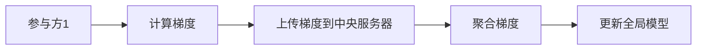

                 


# 联邦学习：在保护隐私的前提下训练AI Agent

---

## 关键词：联邦学习，数据隐私，AI训练，分布式机器学习，隐私计算，联邦算法

---

## 摘要：  
联邦学习是一种在保护数据隐私的前提下，通过分布式计算实现模型训练的技术。本文将从联邦学习的基本概念、核心算法、系统架构、项目实战到最佳实践进行全面解析，帮助读者深入理解如何在保护隐私的同时高效训练AI模型。

---

# 第一部分: 联邦学习的背景与概念

## 第1章: 联邦学习的背景与意义

### 1.1 什么是联邦学习？
- 联邦学习是一种分布式机器学习技术，允许多个参与方在不共享原始数据的情况下共同训练模型。
- 它通过在数据源处进行局部模型训练，并将模型更新同步到中央服务器或通过点对点网络进行通信。

### 1.2 联邦学习的背景
- **数据隐私问题**：随着数据隐私法规（如GDPR）的严格，企业无法轻松共享数据。
- **数据孤岛问题**：数据分散在不同的机构或设备中，难以集中训练模型。
- **联邦学习的需求**：在保护隐私的前提下，利用分散的数据进行联合训练，提升模型性能。

### 1.3 联邦学习的核心目标
- 在不共享原始数据的情况下，协同训练高精度AI模型。
- 通过局部模型更新实现数据不出本地，同时保持全局模型的优化。

---

## 第2章: 联邦学习的核心概念与原理

### 2.1 联邦学习的核心概念
- **数据分布**：数据分布在多个参与方（如设备或服务器）中，每个参与方持有部分数据。
- **通信协议**：定义参与方之间的通信方式，如模型参数的同步与更新。
- **隐私保护机制**：确保数据在传输和计算过程中不被泄露。

### 2.2 联邦学习的原理
- **局部训练**：每个参与方使用本地数据训练模型，生成梯度或模型更新。
- **模型同步**：通过通信协议将局部更新聚合到全局模型中。
- **全局优化**：通过迭代优化全局模型，提升整体性能。

### 2.3 联邦学习的数学模型

#### 联邦平均（FedAvg）算法
- 每个参与方计算本地梯度，并将梯度上传到中央服务器。
- 中央服务器聚合所有参与方的梯度，更新全局模型参数。
- 具体步骤如下：



- 数学公式：
  - 全局模型参数更新：$$\theta_{\text{new}} = \theta_{\text{old}} + \sum \text{梯度}_i / N$$
  - 其中，N为参与方数量。

---

# 第二部分: 联邦学习的算法与实现

## 第3章: 联邦学习的核心算法

### 3.1 联邦平均（FedAvg）算法
- **算法流程**：
  1. 初始化全局模型参数。
  2. 每个参与方下载当前全局模型。
  3. 参与方本地训练模型，生成梯度或模型更新。
  4. 将更新上传到中央服务器。
  5. 中央服务器聚合更新，更新全局模型。
  6. 重复步骤2-5，直到模型收敛或达到预设迭代次数。

### 3.2 联邦随机梯度下降（FedSGD）算法
- **算法流程**：
  1. 初始化全局模型参数。
  2. 中央服务器将模型分发给所有参与方。
  3. 每个参与方随机抽取本地数据样本，计算梯度。
  4. 将梯度上传到中央服务器。
  5. 中央服务器更新全局模型参数。
  6. 重复步骤2-5，直到模型收敛。

### 3.3 联邦学习算法的对比
| 算法名称 | 通信方式 | 计算开销 | 收敛速度 |
|----------|----------|----------|----------|
| FedAvg   | 中央服务器聚合 | 较低 | 较快 |
| FedSGD   | 中央服务器聚合 | 较高 | 较慢 |
| 其他算法 | 点对点通信 | - | - |

---

## 第4章: 联邦学习的系统架构与设计

### 4.1 联邦学习的系统架构
- **中心化架构**：
  - 有一个中央服务器，协调所有参与方的模型训练。
  - 优点：易于管理，聚合简单。
  - 缺点：中央服务器可能成为单点故障。

- **去中心化架构**：
  - 参与方之间直接通信，无中央服务器。
  - 优点：抗单点故障，去中心化。
  - 缺点：通信复杂，难以管理。

- **混合架构**：
  - 结合中心化和去中心化，部分功能由中央服务器处理，部分去中心化。

### 4.2 联邦学习的系统功能设计

#### 系统功能模块
- **数据管理模块**：
  - 管理本地数据，确保数据不出域。
  - 数据预处理，如清洗、归一化。

- **模型训练模块**：
  - 执行局部模型训练，生成更新参数。
  - 支持多种算法，如FedAvg、FedSGD。

- **通信协议模块**：
  - 定义数据和模型的传输方式。
  - 确保通信安全，防止数据泄露。

#### 系统交互流程
1. 注册与身份验证：参与方向中央服务器注册，并验证身份。
2. 任务分发：中央服务器将模型参数分发给参与方。
3. 模型训练：参与方本地训练模型，生成梯度或更新。
4. 模型同步：参与方将更新上传到中央服务器。
5. 模型聚合：中央服务器聚合所有更新，更新全局模型。
6. 模型分发：更新后的模型分发给所有参与方。

---

## 第5章: 联邦学习的项目实战

### 5.1 项目背景
- 案例：医疗领域的疾病预测。
- 数据来源：多家医院的数据，包含患者信息和诊断结果。
- 目标：通过联邦学习训练一个预测模型，同时保护患者隐私。

### 5.2 环境搭建
- 安装必要的库：
  ```bash
  pip install fedlearn
  pip install numpy
  pip install tensorflow
  ```

### 5.3 核心代码实现

#### 数据预处理
```python
import numpy as np

# 假设数据分布在一个列表中
data_distributors = [
    {'name': 'Hospital1', 'data': X1, 'label': y1},
    {'name': 'Hospital2', 'data': X2, 'label': y2},
    # 其他医院数据
]

# 数据归一化
for distributor in data_distributors:
    mean = np.mean(distributor['data'], axis=0)
    std = np.std(distributor['data'], axis=0)
    distributor['data'] = (distributor['data'] - mean) / std
```

#### 模型定义
```python
import tensorflow as tf
from tensorflow.keras import layers

def create_model(input_dim):
    model = tf.keras.Sequential()
    model.add(layers.Dense(64, activation='relu', input_dim=input_dim))
    model.add(layers.Dense(32, activation='relu'))
    model.add(layers.Dense(1, activation='sigmoid'))
    model.compile(optimizer='adam', loss='binary_crossentropy', metrics=['accuracy'])
    return model
```

#### 联邦学习训练
```python
from fedlearn import FedAvg

# 初始化联邦学习框架
fed_avg = FedAvg(data_distributors, model=create_model(input_dim))

# 开始训练
fed_avg.fit(epochs=10, batch_size=32)
```

### 5.4 案例分析与结果解读
- 训练过程中，模型准确率逐步提升。
- 每个参与方的数据隐私得到保护，数据未被共享。
- 全局模型在所有参与方的数据上表现良好。

---

## 第6章: 联邦学习的最佳实践与注意事项

### 6.1 小结
- 联邦学习在保护隐私的前提下，实现了数据的联合训练。
- 通过合理的架构设计和算法选择，可以提升模型性能。

### 6.2 注意事项
- **数据分布**：确保数据分布合理，避免某一参与方数据占比过大影响模型。
- **通信效率**：优化通信协议，减少数据传输量。
- **模型收敛性**：选择合适的算法和参数，确保模型快速收敛。

### 6.3 未来趋势
- **隐私增强技术**：结合同态加密、秘密共享等技术，进一步提升隐私保护。
- **联邦学习的普及**：随着技术成熟，应用场景将更加广泛。
- **去中心化架构**：进一步研究去中心化的联邦学习架构，提升系统的鲁棒性。

---

## 结语
联邦学习作为一种新兴的分布式机器学习技术，为保护数据隐私提供了新的解决方案。通过合理的架构设计和算法优化，可以在不共享数据的前提下，训练出高性能的AI模型。未来，随着技术的不断发展，联邦学习将在更多领域发挥重要作用。

--- 

**感谢您的阅读！**

