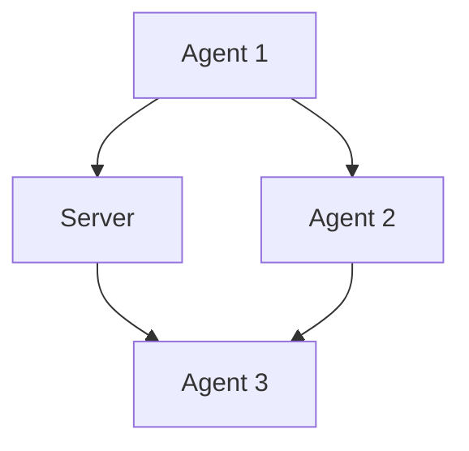
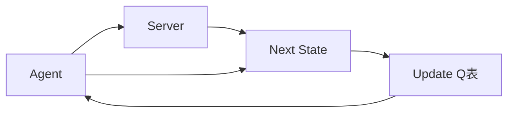
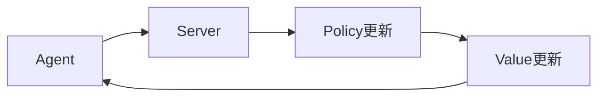
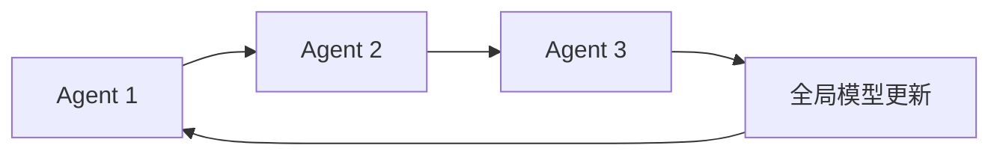
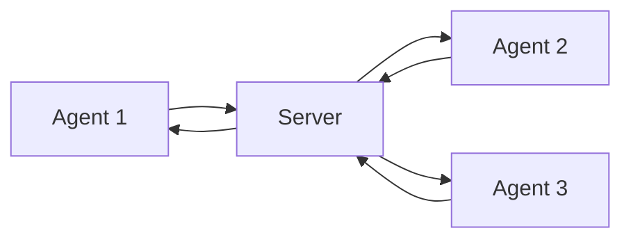

                 


# 《联邦强化学习在分布式AI Agent控制中的应用》

> **关键词**：联邦强化学习，分布式AI Agent，多智能体协作，强化学习算法，分布式系统架构

> **摘要**：  
> 本文系统地探讨了联邦强化学习（Federated Reinforcement Learning, FRL）在分布式AI Agent控制中的应用。文章首先介绍了FRL的基本概念和核心特点，分析了其在分布式系统中的优势与挑战。接着，深入讲解了FRL的核心算法，包括分布式价值函数计算、协作学习算法及其数学模型。随后，详细阐述了FRL的系统架构设计，包括通信协议、系统接口和多智能体协作机制。通过实际案例分析，展示了FRL在分布式机器人协作中的应用，并讨论了其在边缘计算和区块链等领域的扩展应用。最后，总结了FRL的研究进展和未来发展方向，为读者提供全面的视角。

---

# 第一部分: 联邦强化学习基础

## 第1章: 联邦强化学习的背景与概念

### 1.1 问题背景与挑战

#### 1.1.1 分布式AI Agent控制的难点  
在分布式系统中，多个AI Agent需要协作完成复杂的任务。然而，这些Agent通常分布在不同的设备或环境中，彼此之间需要通过通信协议进行信息交换。由于环境的异构性和动态性，传统的集中式强化学习方法难以直接应用。此外，数据隐私和通信带宽的限制也增加了协作的难度。

#### 1.1.2 联邦学习的起源与核心思想  
联邦学习（Federated Learning）起源于移动设备上的数据隐私保护需求。其核心思想是通过在本地设备上进行模型训练，只上传模型更新到中心服务器，避免数据的集中存储。这种去中心化的学习方式在保护隐私的同时，能够利用分布式数据进行模型优化。

#### 1.1.3 强化学习在AI Agent控制中的作用  
强化学习（Reinforcement Learning, RL）是一种通过试错机制优化决策策略的方法。在分布式AI Agent控制中，强化学习可以帮助Agent在动态环境中做出最优决策。结合联邦学习的去中心化特点，联邦强化学习能够将强化学习的能力扩展到分布式系统中。

---

### 1.2 联邦强化学习的定义与特点

#### 1.2.1 联邦强化学习的定义  
联邦强化学习（FRL）是一种结合了联邦学习和强化学习的分布式学习范式。它允许多个AI Agent在不共享原始数据的前提下，通过通信协议协作优化强化学习模型。

#### 1.2.2 联邦强化学习的核心特点  
- **去中心化**：FRL不需要集中存储数据，每个Agent在本地进行训练，并通过通信协议共享模型更新。
- **异构性**：Agent可以分布在不同的环境中，具有不同的观测和动作空间。
- **动态协作**：Agent之间通过通信机制动态调整协作策略，以应对环境的变化。

#### 1.2.3 联邦强化学习与传统强化学习的区别  
| 属性             | 传统强化学习       | 联邦强化学习       |
|------------------|-------------------|-------------------|
| 数据存储         | 集中式存储         | 去中心化存储       |
| 通信需求         | 无                | 需要通信协议       |
| 环境异构性         | 同质环境           | 异构环境           |
| 隐私保护         | 无                | 强隐私保护         |

---

### 1.3 联邦强化学习的应用场景

#### 1.3.1 分布式机器人协作  
在机器人编队任务中，多个机器人需要协作完成目标，如货物运输、环境监测等。FRL可以通过去中心化的学习方式，使机器人在不共享敏感数据的情况下协作优化路径。

#### 1.3.2 多智能体游戏  
在多智能体游戏中，FRL可以用于训练多个AI Agent协作完成游戏任务，如MOBA游戏中的团队协作。

#### 1.3.3 联邦学习在分布式系统中的应用  
FRL可以应用于边缘计算、物联网等领域，通过分布式模型优化提升系统的性能和隐私保护。

---

## 第2章: 联邦强化学习的核心概念

### 2.1 联邦强化学习的框架

#### 2.1.1 联邦学习的通信机制  
FRL的通信机制包括本地更新和全局同步两个阶段。每个Agent在本地环境中训练模型，并通过通信协议将模型更新上传到中心服务器。中心服务器将所有Agent的模型更新聚合，形成新的全局模型。

#### 2.1.2 强化学习的基本原理  
强化学习通过Agent与环境的交互，学习最优策略。Agent通过执行动作获得奖励，并根据奖励调整策略以最大化累积奖励。

#### 2.1.3 联邦强化学习的协作模型  
在FRL中，Agent之间的协作可以通过以下方式实现：
- **价值函数共享**：Agent共享价值函数参数，以协调决策。
- **策略共享**：Agent共享策略网络参数，以统一动作选择。

---

### 2.2 联邦强化学习的关键组件

#### 2.2.1 AI Agent的角色与职责  
- **智能体（Agent）**：负责在本地环境中进行强化学习，更新模型参数。
- **中心服务器（Server）**：负责接收和聚合各Agent的模型更新，分发全局模型。

#### 2.2.2 联邦学习的通信协议  
FRL的通信协议包括：
- **模型同步**：Agent将本地模型上传到服务器，服务器将全局模型分发给Agent。
- **参数更新**：服务器聚合各Agent的模型更新，形成新的全局模型。

#### 2.2.3 系统架构设计  
以下是FRL的系统架构图：



---

### 2.3 联邦强化学习的数学模型

#### 2.3.1 强化学习的基本公式  
强化学习的目标是最小化损失函数：

$$ L = \mathbb{E}_{\tau \sim \pi} [ -R(\tau) ] $$

其中，$\tau$ 是策略 $\pi$ 下的轨迹，$R(\tau)$ 是轨迹的累积奖励。

#### 2.3.2 联邦学习的数学表达  
FRL的模型更新过程如下：

1. 每个Agent在本地环境中训练模型，得到模型参数 $\theta_i$。
2. Agent将 $\theta_i$ 上传到中心服务器。
3. 服务器聚合所有 $\theta_i$，得到新的全局模型 $\Theta = \frac{1}{n}\sum_{i=1}^n \theta_i$。
4. 全局模型 $\Theta$ 分发给所有Agent，作为下一轮训练的初始参数。

---

## 第3章: 联邦强化学习的算法原理

### 3.1 分布式价值函数的计算

#### 3.1.1 分布式价值函数的定义  
分布式价值函数（Distributed Value Function）是FRL中用于评估状态-动作对价值的函数。它通过多个Agent协作计算价值函数的参数。

#### 3.1.2 分布式价值函数的计算流程  
1. 每个Agent在本地计算价值函数 $V_i(s)$。
2. Agent将 $V_i(s)$ 上传到服务器。
3. 服务器聚合所有 $V_i(s)$，得到全局价值函数 $V(s) = \frac{1}{n}\sum_{i=1}^n V_i(s)$。

---

### 3.2 联邦强化学习的协作算法

#### 3.2.1 联邦Q-learning算法  
以下是联邦Q-learning算法的流程图：



数学表达式如下：

$$ Q(s, a) = Q(s, a) + \alpha (r + \max_{a'} Q(s', a') - Q(s, a)) $$

其中，$\alpha$ 是学习率。

---

#### 3.2.2 联邦Actor-Critic算法  
以下是联邦Actor-Critic算法的流程图：



数学表达式如下：

$$ \nabla \theta = \frac{\partial}{\partial \theta} \left( \mathbb{E}[R] \right) $$

---

#### 3.2.3 联邦多智能体协作算法  
以下是联邦多智能体协作算法的流程图：



数学表达式如下：

$$ \Theta_{\text{global}} = \frac{1}{n}\sum_{i=1}^n \Theta_i $$

---

### 3.3 联邦强化学习的通信机制

#### 3.3.1 模型同步的流程  
1. 每个Agent在本地训练模型，得到 $\theta_i$。
2. Agent将 $\theta_i$ 上传到服务器。
3. 服务器聚合所有 $\theta_i$，得到 $\Theta_{\text{global}}$。
4. 服务器将 $\Theta_{\text{global}}$ 分发给所有Agent。

---

### 3.4 联邦强化学习的数学模型

#### 3.4.1 联邦强化学习的损失函数  
$$ L = \mathbb{E}_{\tau \sim \pi} [ -R(\tau) ] $$

其中，$R(\tau)$ 是轨迹的累积奖励。

---

#### 3.4.2 联邦强化学习的优化目标  
最大化累积奖励：

$$ \max_{\theta} \mathbb{E}_{\tau \sim \pi} [ R(\tau) ] $$

---

## 第4章: 联邦强化学习的系统架构与设计

### 4.1 系统需求分析

#### 4.1.1 功能需求  
- 每个Agent能够本地训练模型。
- Agent之间能够通过通信协议协作。
- 系统支持动态环境变化。

#### 4.1.2 性能需求  
- 通信延迟低。
- 模型更新效率高。

---

### 4.2 系统架构设计

#### 4.2.1 系统架构图  
以下是FRL的系统架构图：



---

### 4.3 系统接口设计

#### 4.3.1 模型同步接口  
- **输入**：模型参数 $\theta_i$。
- **输出**：全局模型 $\Theta_{\text{global}}$。

#### 4.3.2 通信协议设计  
- 使用gRPC或HTTP进行模型同步。
- 定期同步模型参数，确保一致性。

---

## 第5章: 联邦强化学习的项目实战

### 5.1 项目背景

#### 5.1.1 项目目标  
实现一个多机器人协作任务，使用FRL进行分布式控制。

---

### 5.2 环境配置

#### 5.2.1 环境搭建  
- 安装Python和相关库（如TensorFlow、Keras）。
- 配置分布式环境（如多台机器）。

---

### 5.3 核心实现

#### 5.3.1 模型同步代码  
以下是模型同步的Python代码：

```python
import numpy as np

# 本地模型更新
def update_model(local_model, global_model):
    for i in range(len(local_model)):
        global_model[i] = (local_model[i] + global_model[i]) / 2

# 模型同步
def sync_models(agents, server):
    for agent in agents:
        server.update_model(agent.model)
    for agent in agents:
        agent.model = server.global_model
```

---

#### 5.3.2 多智能体协作代码  
以下是多智能体协作的Python代码：

```python
class Agent:
    def __init__(self, id, environment):
        self.id = id
        self.environment = environment
        self.model = initialize_model()

    def train(self):
        for _ in range(epochs):
            state = self.environment.get_state()
            action = self.model.predict(state)
            next_state = self.environment.step(action)
            self.model.update(state, action, next_state)

    def update_model(self, server_model):
        self.model.sync(server_model)
```

---

### 5.4 项目测试与优化

#### 5.4.1 系统测试  
- 测试模型同步是否正常。
- 测试多智能体协作是否有效。

#### 5.4.2 性能优化  
- 优化通信协议，降低延迟。
- 使用更高效的模型聚合方法。

---

## 第6章: 联邦强化学习的高级主题与应用

### 6.1 联邦强化学习的扩展应用

#### 6.1.1 边缘计算中的应用  
在边缘计算中，FRL可以用于分布式设备的协同优化。

#### 6.1.2 区块链与联邦强化学习的结合  
区块链可以为FRL提供更安全的通信机制。

---

## 第7章: 总结与展望

### 7.1 总结  
本文系统地介绍了联邦强化学习在分布式AI Agent控制中的应用，包括其核心概念、算法原理和系统架构。

### 7.2 展望  
未来的研究方向包括：
- 更高效的模型聚合方法。
- 更强的隐私保护机制。
- 更广泛的实际应用。

---

**注**：本文是《《联邦强化学习在分布式AI Agent控制中的应用》》的完整目录大纲，实际文章需要根据此大纲进行详细展开。

