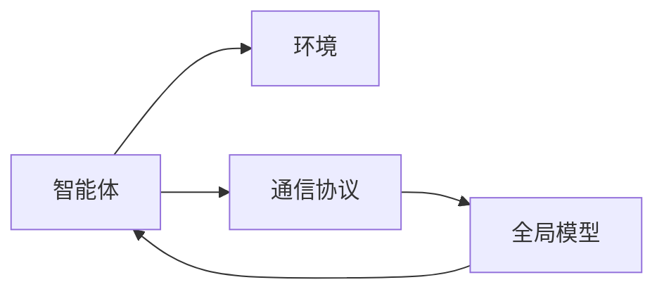
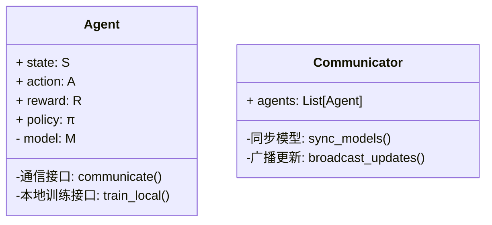

                 


# 联邦强化学习在分布式AI Agent控制优化中的应用

---

## 关键词

- 联邦强化学习
- 分布式AI Agent
- 多智能体协作
- 强化学习
- 分布式系统架构

---

## 摘要

本文深入探讨联邦强化学习（Federated Reinforcement Learning, FRL）在分布式AI Agent控制优化中的应用。通过分析FRL的核心概念、算法原理、系统架构以及实际案例，本文旨在为读者提供从理论到实践的全面理解。文章首先介绍了分布式AI Agent的基本概念和联邦学习的背景，随后详细阐述了FRL的核心思想和算法框架，包括分布式Actor-Critic算法和联邦Q-learning算法等。接着，从系统架构设计的角度，分析了FRL在实际场景中的实现方案，并通过具体案例展示了FRL在无人机编队控制中的应用。最后，总结了FRL的优势与挑战，并提出了未来的研究方向。

---

## 第一部分: 联邦强化学习与分布式AI Agent概述

### 第1章: 联邦强化学习的背景与概念

#### 1.1 分布式AI Agent的基本概念

##### 1.1.1 分布式AI Agent的定义

分布式AI Agent是指在分布式系统中运行的智能体，它们通过局部信息和通信机制协同完成全局任务。与集中式AI不同，分布式AI Agent在去中心化的环境中运行，每个Agent负责特定的子任务，并通过交互实现全局目标。

##### 1.1.2 分布式AI Agent的特点

- **去中心化**：没有单点控制中心，Agent之间通过通信协议协同。
- **自主性**：每个Agent能够独立决策，无需外部干预。
- **协作性**：Agent之间通过信息共享实现任务协同。
- **动态性**：环境和任务需求可能动态变化，Agent需快速适应。

##### 1.1.3 分布式AI Agent的应用场景

- **多智能体游戏**：如分布式游戏AI。
- **机器人协作**：如无人机编队、智能工厂中的机器人协作。
- **分布式推荐系统**：在去中心化的推荐系统中优化用户体验。

#### 1.2 联邦学习的基本原理

##### 1.2.1 联邦学习的定义

联邦学习是一种分布式机器学习范式，允许多个参与方在不共享原始数据的情况下，通过加密通信共同优化模型。其核心思想是“数据不动，模型动”。

##### 1.2.2 联邦学习的核心思想

- **数据隐私保护**：通过局部模型更新和通信，避免数据泄露。
- **去中心化训练**：多个参与方协作优化全局模型，同时保持数据局部性。

##### 1.2.3 联邦学习与传统分布式学习的区别

| 特性       | 联邦学习                          | 传统分布式学习                  |
|------------|-----------------------------------|---------------------------------|
| 数据共享   | 不共享原始数据，只共享模型更新   | 共享原始数据或模型               |
| 隐私保护   | 强化隐私保护机制                 | 数据可能暴露在中心服务器         |
| 计算资源   | 参与方本地计算，减少中心计算压力 | 中央服务器集中计算                |

#### 1.3 强化学习的基本原理

##### 1.3.1 强化学习的定义

强化学习是一种通过智能体与环境交互来学习策略的方法。智能体通过执行动作并获得奖励或惩罚，逐步优化策略以最大化累计奖励。

##### 1.3.2 强化学习的核心要素

- **状态（State）**：智能体所处的环境信息。
- **动作（Action）**：智能体采取的行为。
- **奖励（Reward）**：智能体行为的价值反馈。
- **策略（Policy）**：智能体选择动作的规则。

##### 1.3.3 强化学习的应用场景

- **游戏AI**：如AlphaGo、Dota AI。
- **机器人控制**：如自动驾驶、工业机器人。
- **资源分配**：如云计算资源调度。

#### 1.4 联邦强化学习的定义与特点

##### 1.4.1 联邦强化学习的定义

联邦强化学习是强化学习与联邦学习的结合，允许多个分布式智能体在不共享原始数据的情况下，通过通信优化联合策略。

##### 1.4.2 联邦强化学习的核心思想

- **去中心化策略优化**：多个智能体协作优化全局策略，而不共享局部数据。
- **分布式通信与同步**：通过通信协议同步模型更新，实现联合策略优化。

##### 1.4.3 联邦强化学习与传统强化学习的区别

| 特性       | 联邦强化学习                          | 传统强化学习                  |
|------------|-----------------------------------|---------------------------------|
| 数据共享   | 不共享原始数据，只共享模型更新   | 共享环境和数据                 |
| 隐私保护   | 强化隐私保护机制                 | 数据可能集中存储或共享         |
| 计算资源   | 参与方本地计算，减少中心计算压力 | 单一或少数计算资源              |

---

## 第2章: 联邦强化学习的核心概念

### 2.1 联邦强化学习的组件与关系

#### 2.1.1 联邦强化学习的组件构成

- **智能体（Agent）**：分布式环境中执行任务的主体。
- **环境（Environment）**：智能体所处的外部世界，提供状态和奖励。
- **通信协议**：智能体之间同步模型更新的机制。
- **优化目标**：全局策略的优化目标。

#### 2.1.2 各组件之间的关系



### 2.2 联邦强化学习的数学模型

#### 2.2.1 状态空间的定义

状态空间可以表示为一个概率空间$(\mathcal{S}, \mathcal{P})$，其中$\mathcal{S}$是所有可能状态的集合，$\mathcal{P}$是状态转移的概率分布。

#### 2.2.2 动作空间的定义

动作空间可以表示为一个离散或连续的集合$\mathcal{A}$，智能体在每个时间步选择一个动作$a \in \mathcal{A}$。

#### 2.2.3 奖励函数的设计

奖励函数$r: \mathcal{S} \times \mathcal{A} \rightarrow \mathbb{R}$，定义智能体在状态$s$采取动作$a$后获得的奖励。

#### 2.2.4 联邦优化的目标函数

全局目标函数为：

$$
J = \sum_{i=1}^{n} J_i
$$

其中$J_i$是第$i$个智能体的局部目标函数。

---

### 2.3 联邦强化学习的算法流程

#### 2.3.1 联邦强化学习的总体流程


---

## 第3章: 联邦强化学习的算法原理

### 3.1 联邦强化学习的算法框架

#### 3.1.1 分布式Actor-Critic算法

##### 3.1.1.1 算法流程


##### 3.1.1.2 算法实现

```python
class DistributedActorCritic:
    def __init__(self, num_agents):
        self.agents = [Agent(i) for i in range(num_agents)]
    
    def communicate(self):
        # 同步模型参数
        for agent in self.agents:
            agent.sync()
    
    def train(self, num_epochs):
        for epoch in range(num_epochs):
            for agent in self.agents:
                agent.train_local()
            self.communicate()
```

---

## 第4章: 联邦强化学习的系统架构设计

### 4.1 系统功能设计

#### 4.1.1 系统功能模块划分



---

### 总结

本文从理论到实践，详细探讨了联邦强化学习在分布式AI Agent控制优化中的应用。通过分析核心概念、算法原理和系统架构，为读者提供了全面的视角。未来，随着分布式系统的普及和强化学习技术的成熟，联邦强化学习将在更多领域发挥重要作用。

