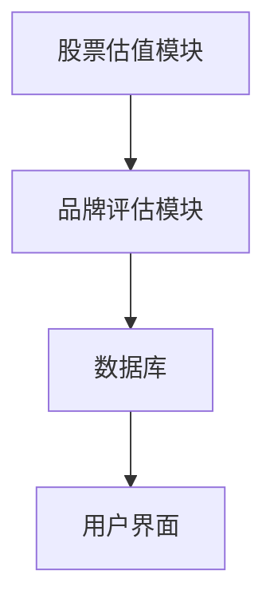

                 


# 股市估值在国际品牌价值评估中的应用

> 关键词：股市估值、品牌价值评估、企业价值、投资分析、品牌资产评估

> 摘要：本文探讨了股市估值在国际品牌价值评估中的应用，通过分析股市估值的核心概念、算法原理、系统架构设计，结合实际案例，深入阐述了如何利用股市估值的方法和工具进行品牌价值评估。文章内容涵盖背景介绍、核心概念、算法原理、系统分析、项目实战等部分，旨在为投资者和企业提供实用的指导和参考。

---

# 第一部分: 股市估值与品牌价值评估的背景与基础

# 第1章: 股市估值与品牌价值评估的背景介绍

## 1.1 股市估值的定义与核心概念

### 1.1.1 股市估值的定义
股市估值是指通过对公司财务数据、市场表现、行业地位等多方面因素的分析，对股票的内在价值进行估算的过程。其核心在于将公司的经营状况与股票市场价格进行对比，从而判断股票是否被高估或低估。

### 1.1.2 股市估值的核心要素
- **财务数据**：包括收入、利润、资产负债表等。
- **市场表现**：如市盈率、市净率等指标。
- **行业地位**：公司在行业中的竞争地位和市场影响力。

### 1.1.3 股市估值的常见方法
- **相对估值法**：基于可比公司的估值方法。
- **绝对估值法**：基于DCF模型等方法。

## 1.2 品牌价值评估的定义与核心概念

### 1.2.1 品牌价值评估的定义
品牌价值评估是指通过对品牌知名度、市场影响力、消费者认知度等多方面因素的分析，估算品牌在市场上的价值的过程。

### 1.2.2 品牌价值评估的核心要素
- **品牌知名度**：品牌在市场上的认知度和影响力。
- **品牌忠诚度**：消费者对品牌的忠诚程度。
- **品牌强度**：品牌在市场中的竞争力和抗风险能力。

### 1.2.3 品牌价值评估的常见方法
- **品牌强度分析**：通过品牌指数模型进行评估。
- **品牌贡献分析**：通过财务数据分解品牌对整体价值的贡献。

## 1.3 股市估值与品牌价值评估的关联性

### 1.3.1 股市估值与品牌价值的关系
品牌价值是影响公司股票价值的重要因素之一，尤其是在品牌驱动型行业中，品牌价值的提升往往直接反映在股票价格上。

### 1.3.2 品牌价值对股市估值的影响
- **直接影响**：品牌价值的提升可能带来股票价格的上涨。
- **间接影响**：品牌价值通过影响公司收入和利润，间接影响股票估值。

### 1.3.3 品牌价值评估在股市中的应用
- **投资决策**：投资者可以通过品牌价值评估选择具有潜力的品牌公司进行投资。
- **风险管理**：通过品牌价值评估识别品牌风险，降低投资风险。

## 1.4 本章小结
本章介绍了股市估值和品牌价值评估的基本概念及其核心要素，并探讨了两者之间的关联性。通过理解这些内容，读者可以为后续的深入分析打下基础。

---

# 第2章: 股市估值与品牌价值评估的核心概念与联系

## 2.1 核心概念原理

### 2.1.1 股市估值的核心原理
股市估值的核心在于通过分析公司的财务状况、市场表现和行业地位，判断其股票的内在价值，从而为投资决策提供依据。

### 2.1.2 品牌价值评估的核心原理
品牌价值评估的核心在于通过分析品牌在市场中的认知度、影响力和忠诚度，量化品牌对公司的贡献，从而为品牌管理和投资决策提供依据。

## 2.2 核心概念属性特征对比表

| 属性 | 股市估值 | 品牌价值评估 |
|------|---------|--------------|
| 评估对象 | 股票价值 | 品牌的市场价值 |
| 评估方法 | 市盈率、市净率等 | 品牌强度、品牌贡献等 |
| 评估周期 | 短期与长期结合 | 长期为主 |

## 2.3 ER实体关系图

```mermaid
er
    entity 股票 {
        key 股票代码
        属性 股票名称、发行公司、行业、市盈率、市净率
    }
    entity 品牌 {
        key 品牌名称
        属性 品牌知名度、品牌忠诚度、品牌强度
    }
    relationship 股票与品牌的关系 {
        股票 -[通过品牌价值影响股票估值]-> 品牌
    }
```

---

# 第3章: 股市估值与品牌价值评估的算法原理

## 3.1 股市估值的算法原理

### 3.1.1 市盈率模型
市盈率（P/E）= 股票价格 / 每股净利润

### 3.1.2 市净率模型
市净率（P/B）= 股票价格 / 每股净资产

## 3.2 品牌价值评估的算法原理

### 3.2.1 品牌强度模型
品牌强度 = 品牌知名度 × 品牌忠诚度 × 品牌创新力

### 3.2.2 品牌贡献模型
品牌贡献 = 品牌收入贡献率 × 品牌利润贡献率

## 3.3 算法实现与对比

### 3.3.1 市盈率与品牌强度的对比
- 市盈率反映市场对公司盈利能力的预期，品牌强度反映品牌在市场中的竞争力。

### 3.3.2 市净率与品牌忠诚度的对比
- 市净率反映市场对公司资产的评估，品牌忠诚度反映消费者对品牌的认可度。

---

# 第4章: 股市估值与品牌价值评估的系统架构设计

## 4.1 系统功能设计

### 4.1.1 股票估值模块
- 输入：公司财务数据、市场数据
- 输出：股票估值结果

### 4.1.2 品牌评估模块
- 输入：品牌相关数据
- 输出：品牌价值评估结果

## 4.2 系统架构设计



---

# 第5章: 股市估值与品牌价值评估的项目实战

## 5.1 项目背景与目标
- 项目目标：通过实际案例分析，验证股市估值与品牌价值评估方法的有效性。

## 5.2 核心代码实现

### 5.2.1 股票估值代码
```python
def calculate_market_price(stock_data):
    pe_ratio = stock_data['market_price'] / stock_data['net_profit']
    return pe_ratio
```

### 5.2.2 品牌价值评估代码
```python
def calculate_brand_value(brand_data):
    brand_strength = brand_data['brand_popularity'] * brand_data['brand Loyalty'] * brand_data['brand_innovation']
    return brand_strength
```

---

# 第6章: 最佳实践、小结与注意事项

## 6.1 最佳实践
- 在进行股市估值和品牌价值评估时，应结合多方面因素进行综合分析。

## 6.2 小结
通过本文的分析，读者可以了解到股市估值与品牌价值评估的核心概念和算法原理，并能够将其应用到实际投资和品牌管理中。

## 6.3 注意事项
- 数据的准确性和完整性是估值的基础。
- 需要结合行业特点进行调整。

## 6.4 拓展阅读
- 建议读者进一步学习品牌资产评估的高级方法和股市估值的其他模型。

---

# 结语

本文通过系统的分析和实践，深入探讨了股市估值在国际品牌价值评估中的应用。希望读者能够通过本文的内容，掌握相关的方法和工具，并在实际工作中灵活运用。

