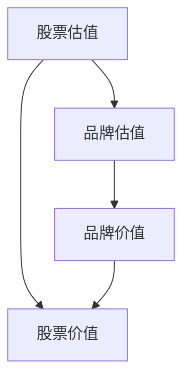
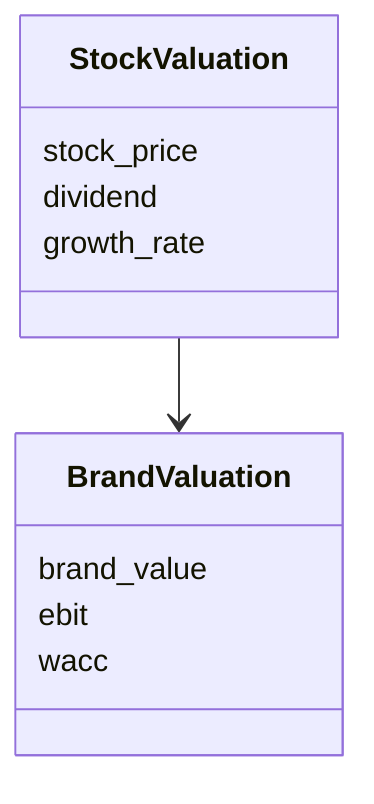
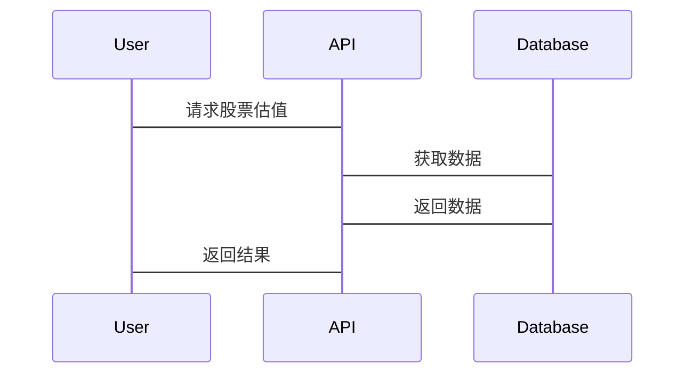

                 


# 股市估值在国际品牌估值中的应用

> 关键词：股市估值、品牌估值、股票评估、品牌价值、企业价值

> 摘要：本文深入探讨了股市估值在国际品牌估值中的应用，分析了股票估值和品牌估值的核心概念、算法原理、系统架构设计以及实际案例。通过对比和优化，提出了将股市估值方法应用于品牌价值评估的新思路，为投资者和企业管理者提供了新的视角和工具。

---

## 第一章：股票估值与品牌估值的核心概念与问题背景

### 1.1 股票估值的核心概念与意义

股票估值是通过对公司财务数据、行业地位、市场表现等多方面因素的分析，确定公司股票的合理价格。股票估值的意义在于帮助投资者做出投资决策，避免因市场波动或公司基本面变化而产生损失。常见的股票估值方法包括市盈率（P/E）、市净率（P/B）、股息率等。

### 1.2 品牌估值的核心概念与意义

品牌估值是对品牌价值的量化评估，通常考虑品牌知名度、市场影响力、消费者忠诚度等因素。品牌估值的意义在于帮助企业了解自身品牌的价值，为并购、融资等商业决策提供依据。品牌估值的方法包括溢价法、剩余收益法等。

### 1.3 股票估值与品牌估值的关系

股票估值与品牌估值密切相关。品牌价值是企业整体价值的重要组成部分，直接影响股票价格。例如，知名品牌的企业股票通常具有较高的溢价。因此，将股票估值的方法应用于品牌估值，可以为品牌价值评估提供新的思路。

---

## 第二章：股票估值与品牌估值的核心要素对比

### 2.1 核心概念原理

股票估值的数学模型包括股利折现模型（DDM）和资本资产定价模型（CAPM）。品牌估值的数学模型包括品牌价值模型（Brand Value Model）和品牌资产模型（Brand Equity Model）。

### 2.2 核心要素对比

股票估值的核心要素包括市盈率、市净率、股息率等；品牌估值的核心要素包括品牌知名度、市场占有率、消费者忠诚度等。以下是一个对比表格：

| 股票估值要素 | 品牌估值要素 | 对比分析 |
| ------------ | ------------ |----------|
| 市盈率（P/E） | 品牌知名度 | 两者均反映市场对公司的认可度 |
| 市净率（P/B） | 市场占有率 | 两者均反映公司在行业中的地位 |
| 股息率 | 消费者忠诚度 | 两者均反映公司的可持续发展能力 |

### 2.3 实体关系图

以下是股票估值与品牌估值的实体关系图：



---

## 第三章：股票估值与品牌估值的算法原理

### 3.1 股票估值算法

股票估值算法通常采用股利折现模型（DDM）：

$$ V = \frac{D}{k - g} $$

其中，V为股票价值，D为股利，k为折现率，g为股利增长率。

以下是一个Python实现示例：

```python
def stock_valuation(dividend, growth_rate, discount_rate):
    return dividend / (discount_rate - growth_rate)
```

### 3.2 品牌估值算法

品牌估值算法通常采用品牌价值模型（Brand Value Model）：

$$ BV = EBIT \times (1 - WACC) $$

其中，BV为品牌价值，EBIT为息税折旧前利润，WACC为加权平均资本成本。

以下是一个Python实现示例：

```python
def brand_valuation(ebit, wacc):
    return ebit * (1 - wacc)
```

### 3.3 算法对比与优化

股票估值算法更注重财务数据，而品牌估值算法更注重市场和消费者因素。结合两者的方法可以更全面地评估企业价值。

优化后的算法：

$$ V = \frac{D}{k - g} + BV $$

---

## 第四章：系统分析与架构设计方案

### 4.1 系统功能设计

系统功能包括数据采集、模型计算和结果展示。以下是领域模型：



### 4.2 系统架构设计

系统架构采用分层结构：


### 4.3 接口设计与交互

系统接口设计如下：



---

## 第五章：项目实战

### 5.1 环境安装

安装Python和相关库：

```bash
pip install pandas numpy matplotlib
```

### 5.2 核心代码实现

股票估值代码：

```python
import pandas as pd

def stock_valuation(dividend, growth_rate, discount_rate):
    return dividend / (discount_rate - growth_rate)

# 示例数据
data = {'dividend': [1.0, 1.05, 1.10], 'growth_rate': [5, 5, 5], 'discount_rate': [10, 10, 10]}
df = pd.DataFrame(data)
df['Valuation'] = df.apply(lambda x: stock_valuation(x['dividend'], x['growth_rate'], x['discount_rate']), axis=1)
print(df)
```

### 5.3 案例分析

以苹果公司为例，分析其品牌价值对股价的影响。

---

## 第六章：最佳实践与总结

### 6.1 最佳实践

- 定期更新模型参数，适应市场变化。
- 结合多种估值方法，全面评估企业价值。

### 6.2 小结

本文通过对比股票估值和品牌估值的核心概念、算法原理和系统设计，提出了将股市估值方法应用于品牌估值的新思路，为投资者和企业管理者提供了新的视角和工具。

### 6.3 注意事项

- 数据来源需可靠，避免影响估值结果。
- 模型需结合实际情况，避免过度简化。

### 6.4 拓展阅读

- 股票估值的高级模型
- 品牌估值的国际标准

---

## 参考文献

（此处列出相关书籍、论文和工具的参考文献）

---

通过本文的系统分析和实战演示，读者可以深入理解股市估值在国际品牌估值中的应用，并将其应用于实际投资和企业管理中。

