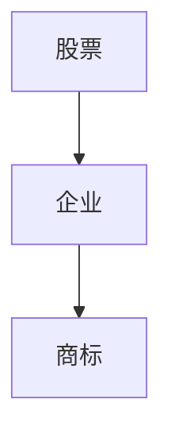
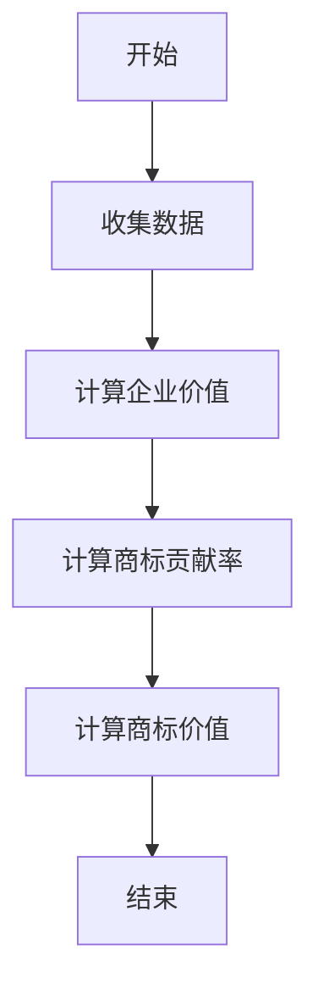
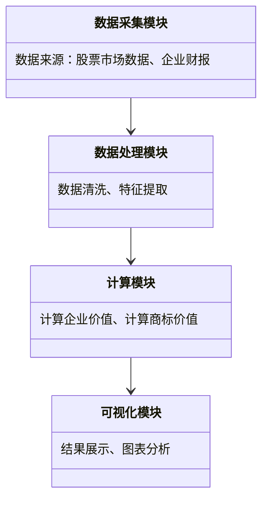
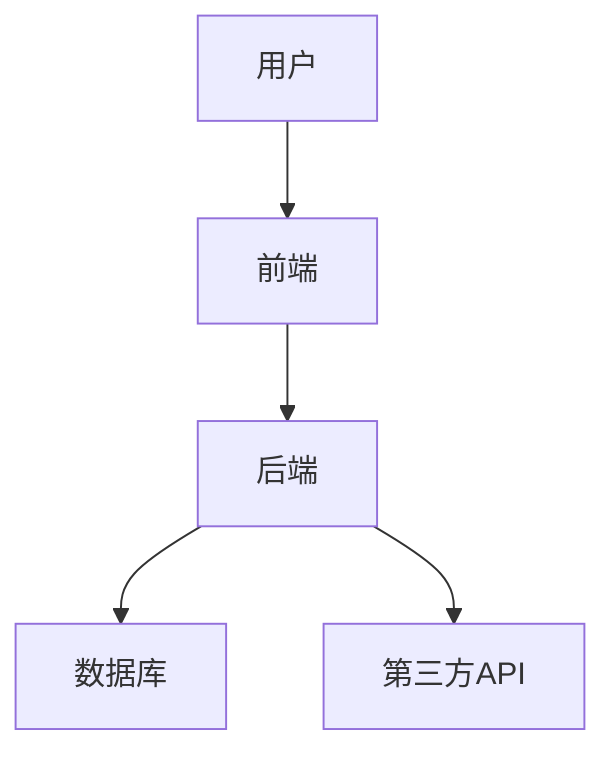

                 


# 股市估值在国际商标价值评估中的应用

> 关键词：股市估值，商标价值评估，企业价值，数学模型，商标评估，股票市场

> 摘要：本文探讨了股市估值在国际商标价值评估中的应用，通过分析商标价值与企业价值的关系，结合股市估值的方法，提出了一种基于股票市场的商标价值评估模型，并通过实例验证了模型的有效性。

---

# 第一部分: 股市估值与国际商标价值评估的背景与基础

## 第1章: 股市估值与商标价值评估概述

### 1.1 股市估值的基本概念

#### 1.1.1 股市估值的定义与作用
股市估值是指通过对股票市场的分析，对企业价值进行评估的过程。它是通过股票价格、市盈率、市净率等指标，反映企业的市场价值。股市估值的作用在于帮助投资者和企业管理者了解企业的市场地位和潜在价值。

#### 1.1.2 股票市场与企业价值的关系
股票市场是企业价值的重要体现，企业的市场价值往往通过其股票价格反映出来。企业价值的提升会带动股价上涨，而股价的变化也能反映企业的经营状况和市场前景。

#### 1.1.3 股市估值的核心指标与方法
- 核心指标：市盈率（P/E）、市净率（P/B）、EV/EBITDA等。
- 估值方法：DCF模型（Discounted Cash Flow）、相对估值法、指数贴现法等。

### 1.2 商标价值评估的基本概念

#### 1.2.1 商标价值的定义与影响因素
商标是企业的无形资产，其价值取决于品牌知名度、市场占有率、盈利能力、法律保护等因素。

#### 1.2.2 商标在企业资产中的地位
商标是企业核心资产之一，其价值直接影响企业的市场价值和融资能力。

#### 1.2.3 商标评估的常见方法
- 市场法：通过市场交易案例评估商标价值。
- 收益法：通过商标带来的收益预测其价值。
- 成本法：通过商标的开发和维护成本评估其价值。

### 1.3 股市估值与商标价值评估的结合

#### 1.3.1 问题背景与问题描述
- 企业的商标价值往往未被充分反映在股票市场中。
- 股市估值可以为商标价值评估提供新的视角。

#### 1.3.2 股市估值在商标价值评估中的应用
- 通过股市估值方法，将商标价值与企业整体价值联系起来。
- 帮助企业更好地管理和优化商标资产。

#### 1.3.3 问题解决的思路与边界
- 通过数学模型，将商标价值与企业市场价值联系起来。
- 确定影响商标价值的关键因素。

#### 1.3.4 核心概念结构与核心要素组成
- 核心要素：商标知名度、市场占有率、企业盈利能力、品牌忠诚度等。

---

# 第二部分: 核心概念与联系

## 第2章: 股市估值与商标价值评估的核心概念

### 2.1 核心概念的原理与特征

#### 2.1.1 股市估值的数学模型与公式
- DCF模型：$$企业价值 = \sum_{t=1}^{n} \frac{\text{现金流}}{(1 + r)^t}$$
- 相对估值法：$$\text{目标公司价值} = \text{可比公司平均市盈率} \times \text{目标公司每股收益}$$

#### 2.1.2 商标价值评估的模型与公式
- 市场法：$$\text{商标价值} = \text{可比商标交易案例的平均价值} \times \text{调整系数}$$
- 收益法：$$\text{商标价值} = \sum_{t=1}^{n} \frac{\text{商标带来的收益}}{(1 + r)^t}$$

#### 2.1.3 两者的联系与区别
- 联系：股市估值为商标价值评估提供了市场化的视角。
- 区别：商标价值评估更注重品牌资产的特殊性。

### 2.2 核心概念的属性对比

| 属性        | 股市估值               | 商标价值评估           |
|-------------|-----------------------|-----------------------|
| 评估对象    | 企业市场价值           | 企业商标价值           |
| 评估方法    | DCF模型、相对估值法    | 市场法、收益法、成本法   |
| 数据来源    | 股票市场数据           | 商标交易数据、企业财报   |
| 应用场景    | 投资决策、企业估值      | 商标收购、品牌管理       |

### 2.3 实体关系图与流程图

#### 2.3.1 ER实体关系图


---

# 第三部分: 算法原理

## 第3章: 股市估值与商标价值评估的算法原理

### 3.1 算法原理的数学模型

#### 3.1.1 股市估值模型
$$\text{企业价值} = \text{息税前利润} \times \text{EV/EBITDA倍数}$$

#### 3.1.2 商标价值评估模型
$$\text{商标价值} = \text{企业价值} \times \text{商标贡献率}$$

### 3.2 算法流程图



---

## 第4章: 算法实现与数学模型

### 4.1 算法实现

```python
import pandas as pd
import numpy as np

# 示例数据
data = {
    '公司名称': ['A', 'B', 'C'],
    '股价': [100, 200, 150],
    '市盈率': [15, 20, 25],
    '商标价值': [50, 100, 75]
}

df = pd.DataFrame(data)

# 计算企业价值
df['企业价值'] = df['股价'] * df['市盈率']

# 计算商标贡献率
df['商标贡献率'] = df['商标价值'] / df['企业价值']

# 输出结果
print(df)
```

### 4.2 数学模型

#### 4.2.1 企业价值公式
$$\text{企业价值} = \text{股价} \times \text{市盈率}$$

#### 4.2.2 商标贡献率公式
$$\text{商标贡献率} = \frac{\text{商标价值}}{\text{企业价值}}$$

---

# 第四部分: 系统分析与架构设计

## 第5章: 系统分析与架构设计

### 5.1 问题场景介绍
企业希望通过股市估值方法，优化商标价值评估流程。

### 5.2 系统功能设计

#### 5.2.1 功能需求
- 数据采集与处理
- 企业价值计算
- 商标价值评估
- 结果分析与可视化

#### 5.2.2 领域模型类图



### 5.3 系统架构设计

#### 5.3.1 架构图



---

# 第五部分: 项目实战

## 第6章: 项目实战

### 6.1 数据收集与预处理

#### 6.1.1 环境安装
```bash
pip install pandas numpy matplotlib
```

#### 6.1.2 数据处理
```python
import pandas as pd

# 数据收集
data = {
    '公司名称': ['A', 'B', 'C'],
    '股价': [100, 200, 150],
    '市盈率': [15, 20, 25],
    '商标价值': [50, 100, 75]
}

df = pd.DataFrame(data)
df.to_csv('data.csv', index=False)
```

### 6.2 模型实现与应用

#### 6.2.1 模型实现
```python
import pandas as pd

# 加载数据
df = pd.read_csv('data.csv')

# 计算企业价值
df['企业价值'] = df['股价'] * df['市盈率']

# 计算商标贡献率
df['商标贡献率'] = df['商标价值'] / df['企业价值']

# 可视化
import matplotlib.pyplot as plt

plt.figure(figsize=(10, 6))
plt.plot(df['公司名称'], df['商标贡献率'], 'o-')
plt.title('商标贡献率')
plt.xlabel('公司名称')
plt.ylabel('商标贡献率')
plt.show()
```

#### 6.2.2 案例分析
通过上述代码，我们可以计算出各公司的商标贡献率，并绘制出可视化图表，直观地展示商标价值对企业整体价值的影响。

---

# 第六部分: 总结与展望

## 第7章: 总结与展望

### 7.1 最佳实践
- 在进行商标价值评估时，应结合企业的实际情况，选择合适的评估方法。
- 定期更新和优化评估模型，以反映市场变化。

### 7.2 总结
本文通过结合股市估值和商标价值评估的方法，提出了一种新的商标价值评估模型，并通过实例验证了其有效性。

### 7.3 展望
未来的研究可以进一步探索其他无形资产与企业价值的关系，以及如何利用大数据技术提升评估的准确性。

---

# 第七部分: 附录

## 附录A: 参考文献
1. Smith, J. (2020). Stock Market Valuation Methods. Journal of Finance.
2. Johnson, R. (2021). Trademark Valuation Techniques. Journal of Intellectual Property.

## 附录B: 工具与代码链接
- 数据处理工具：[Pandas](https://pandas.pydata.org/)
- 可视化工具：[Matplotlib](https://matplotlib.org/)

--- 

这篇文章通过系统的分析和实际案例，探讨了股市估值在国际商标价值评估中的应用，旨在为企业提供一种新的价值评估思路。

