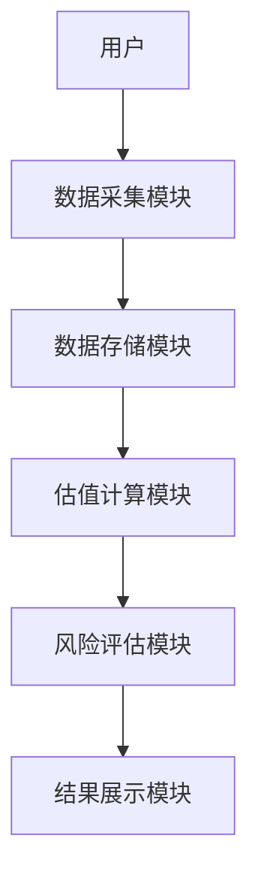

                 

# 股市估值在跨境并购定价中的应用

> 关键词：股市估值，跨境并购，定价，企业价值，并购战略

> 摘要：本文详细探讨了股市估值在跨境并购定价中的应用，从理论到实践，分析了如何通过股市估值的方法和模型来确定并购价格，降低风险，提升并购成功率。文章结合实际案例，深入讲解了各种估值方法及其在跨境并购中的具体应用，为读者提供了系统的知识体系和实用的工具。

---

# 目录大纲

## 第1章 股市估值与跨境并购定价的背景

### 1.1 股市估值的定义与核心概念

#### 1.1.1 股市估值的定义

股市估值是指通过对公司财务数据和市场信息的分析，估算其股票的内在价值和市场价值的过程。它是投资者和并购方评估企业价值的重要工具。

#### 1.1.2 股市估值的核心要素

- 公司财务状况：收入、利润、资产、负债等。
- 市场环境：宏观经济、行业趋势、政策法规。
- 公司治理：管理团队、股权结构、内部控制。

#### 1.1.3 股市估值与企业价值的关系

股市估值是企业价值的外在表现，企业价值是股市估值的基础。通过合理的股市估值，可以准确反映企业的内在价值和市场地位。

### 1.2 跨境并购的定义与特点

#### 1.2.1 跨境并购的定义

跨境并购是指一家公司收购另一家不同国家或地区的公司，涉及跨国界的资产转移和资源整合。

#### 1.2.2 跨境并购的主要特点

- 跨越国界：涉及不同国家的法律、税务和文化差异。
- 复杂性高：需要考虑汇率波动、税收政策、文化差异等因素。
- 风险较高：政治风险、市场风险、法律风险等。

#### 1.2.3 跨境并购的驱动因素

- 市场扩张：开拓新市场。
- 资源整合：获取技术、品牌、渠道等资源。
- 成本优势：降低生产或运营成本。

### 1.3 股市估值在跨境并购中的重要性

#### 1.3.1 股市估值在并购定价中的作用

- 确定合理的收购价格。
- 评估目标公司的潜在价值。
- 降低并购决策的风险。

#### 1.3.2 股市估值对并购决策的影响

- 影响并购的可行性。
- 影响并购后的整合效果。
- 影响并购的长期收益。

#### 1.3.3 股市估值与并购风险的关系

- 合理的估值可以降低风险。
- 估值偏差可能导致重大损失。

### 1.4 本章小结

本章介绍了股市估值和跨境并购的基本概念，分析了股市估值在跨境并购中的重要性，为后续章节的分析奠定了基础。

---

## 第2章 股市估值的核心概念与方法

### 2.1 股市估值的核心概念

#### 2.1.1 股票的内在价值

内在价值是基于公司基本面的估值，不考虑市场情绪。公式：$V = \frac{CF}{r - g}$，其中CF为现金流，r为折现率，g为增长率。

#### 2.1.2 股票的市场价值

市场价值是股票在二级市场的交易价格，受市场情绪、流动性等因素影响。

#### 2.1.3 股票的流动性与估值的关系

流动性高的股票估值更准确，流动性低的股票估值偏差较大。

### 2.2 股市估值的主要方法

#### 2.2.1 市盈率法（P/E）

公式：$P/E = \frac{股票价格}{每股净利润}$。

#### 2.2.2 市净率法（P/B）

公式：$P/B = \frac{股票价格}{每股净资产}$。

#### 2.2.3 现金流折现法（DCF）

通过预测未来现金流，折现到现值。公式：$V = \sum_{t=1}^{n} \frac{CF_t}{(1 + r)^t}$。

#### 2.2.4 股息率法（Dividend Yield）

公式：$股息率 = \frac{股息}{股票价格} \times 100\%$。

### 2.3 股市估值方法的优缺点对比

| 方法       | 优点                           | 缺点                           |
|------------|--------------------------------|--------------------------------|
| 市盈率法    | 简单易懂，适用于成长型企业     | 易受市场情绪影响，周期性行业适用性差 |
| 市净率法    | 反映资产价值，适用于传统行业   | 未考虑收益质量                   |
| DCF法      | 精确反映未来现金流              | 计算复杂，依赖假设               |
| 股息率法    | 适用于成熟企业                 | 未考虑成长性                   |

### 2.4 本章小结

本章详细介绍了股市估值的核心概念和主要方法，分析了各种方法的优缺点，为后续章节的应用奠定了基础。

---

## 第3章 跨境并购定价的核心原理

### 3.1 跨境并购定价的基本原理

#### 3.1.1 跨境并购定价的定义

并购价格是目标公司股权的估值，通常基于目标公司的财务状况、市场地位和未来潜力。

#### 3.1.2 跨境并购定价的影响因素

- 目标公司的财务状况。
- 行业竞争格局。
- 宏观经济环境。
- 法律和税务因素。

#### 3.1.3 跨境并购定价的逻辑

- 确定目标公司的价值。
- 考虑收购溢价。
- 评估整合后的协同效应。

### 3.2 跨境并购定价的主要模型

#### 3.2.1 股权价值评估模型

公式：$V = \frac{EBIT \times (1 - t)}{WACC}$，其中EBIT为息税折旧前利润，t为税率，WACC为加权平均资本成本。

#### 3.2.2 并购溢价模型

公式：$收购价格 = 目标公司价值 \times (1 + \text{溢价率})$。

#### 3.2.3 股票价格与并购价格的关系

股票价格波动会影响并购价格的谈判，但核心是目标公司的内在价值。

### 3.3 跨境并购定价中的估值调整

#### 3.3.1 跨境并购中的协同效应

协同效应是并购后成本节约或收益增加的潜力，通常通过DCF模型评估。

#### 3.3.2 跨境并购中的汇率风险

通过套期保值和货币对冲管理汇率风险。

#### 3.3.3 跨境并购中的税务影响

合理利用税收优惠政策，降低税务负担。

### 3.4 本章小结

本章分析了跨境并购定价的核心原理，介绍了主要模型和影响因素，为后续章节的应用提供了理论支持。

---

## 第4章 股市估值在跨境并购中的应用

### 4.1 股市估值在跨境并购定价中的核心作用

#### 4.1.1 股市估值作为并购定价的基础

目标公司股票的估值是并购价格的重要参考。

#### 4.1.2 股市估值与并购溢价的关系

合理的估值是确定溢价的基础，溢价反映了市场对目标公司未来增长的预期。

#### 4.1.3 股市估值在并购后整合中的应用

通过估值分析，优化资源整合和协同效应。

### 4.2 股市估值在跨境并购中的具体应用

#### 4.2.1 股市估值在目标公司选择中的应用

通过估值筛选具有投资价值的目标公司。

#### 4.2.2 股市估值在并购价格谈判中的应用

基于目标公司估值，确定合理的并购价格。

#### 4.2.3 股市估值在并购风险评估中的应用

通过估值分析，评估并购风险并制定应对策略。

### 4.3 股市估值在跨境并购中的挑战与解决方案

#### 4.3.1 股市估值在跨境并购中的主要挑战

- 跨国税务差异。
- 不同市场环境的影响。
- 数据获取难度。

#### 4.3.2 应对挑战的具体解决方案

- 使用多模型结合估值。
- 考虑文化差异和法律风险。
- 引入专业团队进行尽职调查。

### 4.4 本章小结

本章详细探讨了股市估值在跨境并购中的具体应用，分析了挑战与解决方案，为实际操作提供了指导。

---

## 第5章 股市估值在跨境并购中的数学模型与算法

### 5.1 股市估值的数学模型

#### 5.1.1 DCF模型

$$ V = \sum_{t=1}^{n} \frac{CF_t}{(1 + r)^t} $$

#### 5.1.2 市盈率模型

$$ P = E \times P/E $$

#### 5.1.3 市净率模型

$$ P = B \times P/B $$

### 5.2 并购定价的算法

#### 5.2.1 股权价值评估算法

$$ V = \frac{EBIT \times (1 - t)}{WACC} $$

#### 5.2.2 并购溢价算法

$$ \text{收购价格} = V \times (1 + \text{溢价率}) $$

### 5.3 算法实现

#### 5.3.1 DCF模型的实现步骤

1. 预测未来现金流。
2. 确定合适的折现率。
3. 折现并求和得到现值。

#### 5.3.2 市盈率模型的实现步骤

1. 计算目标公司的每股收益。
2. 确定合理的市盈率倍数。
3. 计算目标公司的股票价格。

### 5.4 本章小结

本章通过数学模型和算法，详细展示了股市估值在跨境并购中的具体应用，为读者提供了实用的工具。

---

## 第6章 股市估值在跨境并购中的系统架构与实现

### 6.1 系统架构设计

#### 6.1.1 系统功能模块

- 数据采集：获取目标公司的财务数据和市场数据。
- 估值计算：应用各种估值模型进行计算。
- 风险评估：分析并购中的潜在风险。

#### 6.1.2 系统架构图

### 6.2 系统接口设计

#### 6.2.1 数据接口

- 输入：目标公司财务数据、市场数据。
- 输出：估值结果、风险评估报告。

#### 6.2.2 用户界面

- 输入模块：输入目标公司信息。
- 输出模块：显示估值结果和风险分析。

### 6.3 系统实现

#### 6.3.1 数据采集

使用爬虫技术获取目标公司的财务数据和市场数据。

#### 6.3.2 估值计算

应用D

