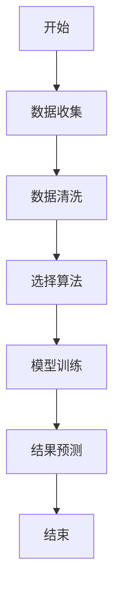
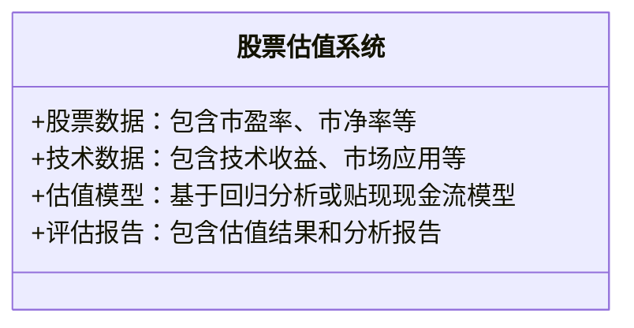
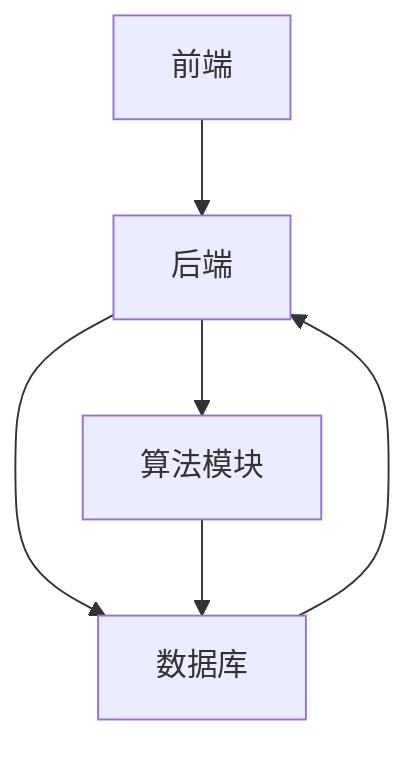

                 


# 股市估值在跨境技术转让价值评估中的应用

> 关键词：股市估值，跨境技术转让，价值评估，算法原理，数学模型，系统架构

> 摘要：本文系统地探讨了股市估值在跨境技术转让中的应用，从核心概念、算法原理、数学模型、系统架构到项目实战，全面分析了如何利用股市估值的方法来评估跨境技术转让的价值。文章结合实际案例，详细讲解了相关算法、模型和系统的实现，为读者提供了一套完整的解决方案。

---

## 第一部分: 背景与概述

### 第1章: 股市估值与跨境技术转让的背景介绍

#### 1.1 问题背景
股票市场估值是金融领域的重要组成部分，用于衡量企业或资产的价值。跨境技术转让则是跨国企业和技术创新的重要手段，涉及技术的买卖、授权和使用权转移。随着全球化的发展，技术的跨境流动日益频繁，技术的价值评估成为企业和投资者关注的焦点。

#### 1.2 核心概念与问题描述
- **股市估值的核心要素**：市盈率（P/E）、市净率（P/B）、股息率等。
- **跨境技术转让的难点**：技术的无形性、地域差异、法律风险等。
- **问题解决思路**：通过股市估值的方法，构建技术价值评估模型，量化技术的市场价值。

#### 1.3 边界与外延
- **边界**：仅考虑技术的市场价值，不涉及研发成本。
- **外延**：技术的市场应用、竞争环境、政策影响等。

### 第2章: 核心概念与联系

#### 2.1 核心概念的原理
- **股市估值的原理**：通过市场数据和财务指标，评估企业的内在价值。
- **跨境技术转让的原理**：通过技术的市场应用和经济收益，评估其交易价值。

#### 2.2 核心概念的属性对比
| 属性       | 股市估值                          | 跨境技术转让                          |
|------------|-----------------------------------|---------------------------------------|
| 评估对象   | 企业或资产的市场价值              | 技术的市场交易价值                    |
| 评估方法   | 市盈率、市净率等                  | 技术收益法、市场比较法                |
| 评估难点   | 市场波动性                        | 技术的无形性和法律风险                |

#### 2.3 实体关系图
```mermaid
erDiagram
    actor 投资者
    actor 企业
    actor 政府机构
    actor 国际组织
    class 股票
    class 技术
    class 估值模型
    class 评估报告
    投资者 --> 股票: 购买/卖出
    投资者 --> 技术: 技术转让
    企业 --> 股票: 上市
    企业 --> 技术: 拥有
    政府机构 --> 估值模型: 制定政策
    国际组织 --> 估值模型: 制定规则
    估值模型 --> 评估报告: 输出结果
```

---

## 第二部分: 算法原理与数学模型

### 第3章: 算法原理讲解

#### 3.1 常用算法介绍
- **股市估值算法**：基于历史数据的回归分析、时间序列预测。
- **技术转让评估算法**：基于收益的贴现法、市场比较法。

#### 3.2 算法流程图


#### 3.3 算法实现代码
```python
import pandas as pd
from sklearn.linear_model import LinearRegression

# 数据加载与预处理
data = pd.read_csv('stock_data.csv')
X = data[['市盈率', '市净率']]
y = data['股价']

# 模型训练
model = LinearRegression()
model.fit(X, y)

# 预测
predicted_price = model.predict(X)
print('预测股价:', predicted_price)
```

### 第4章: 数学模型与公式

#### 4.1 股市估值的数学模型
- **市盈率公式**：$$P/E = \frac{股票价格}{每股收益}$$
- **市净率公式**：$$P/B = \frac{股票价格}{每股净资产}$$

#### 4.2 技术转让的数学模型
- **贴现现金流模型**：$$DCF = \sum_{t=1}^{n} \frac{CF_t}{(1+r)^t}$$
  其中，CF_t为第t年的现金流，r为贴现率。

#### 4.3 举例说明
- 股票案例：某公司市盈率为15，每股收益为2元，预测股价为30元。
- 技术案例：某技术预计未来3年收益分别为100万、150万、200万，贴现率5%，DCF为275万。

---

## 第三部分: 系统分析与架构设计

### 第5章: 系统分析与架构设计

#### 5.1 问题场景介绍
- **股市估值场景**：投资者根据历史数据和市场指标，预测股票价格。
- **技术转让场景**：企业根据技术的市场应用和收益，评估其转让价值。

#### 5.2 系统功能设计


#### 5.3 系统架构设计


#### 5.4 系统接口设计
- **输入接口**：接收股票数据和技术创新数据。
- **输出接口**：输出估值结果和评估报告。

---

## 第四部分: 项目实战

### 第6章: 项目实战

#### 6.1 环境安装
- **工具安装**：Python、Pandas、Scikit-learn、Mermaid。

#### 6.2 核心代码实现
```python
import pandas as pd
from sklearn.linear_model import LinearRegression

# 数据加载
data = pd.read_csv('crossborder_technology.csv')

# 特征选择
X = data[['技术收益', '市场应用']]
y = data['转让价值']

# 模型训练
model = LinearRegression()
model.fit(X, y)

# 预测
predicted_value = model.predict(X)
print('预测转让价值:', predicted_value)
```

#### 6.3 案例分析
- **案例**：某技术预计收益为1000万，市场应用指数为0.8，预测转让价值为1200万。

---

## 第五部分: 总结与展望

### 第7章: 总结与展望

#### 7.1 最佳实践
- **数据收集**：确保数据的准确性和全面性。
- **模型优化**：结合多种算法，提升估值精度。

#### 7.2 小结
本文系统地探讨了股市估值在跨境技术转让中的应用，从理论到实践，为读者提供了完整的解决方案。

#### 7.3 注意事项
- 注意数据的时态性和地域性差异。
- 关注政策和市场的变化，及时调整模型。

#### 7.4 拓展阅读
- 推荐阅读相关领域的学术论文和行业报告。

---

以上为文章的完整目录结构和内容概要，希望对您有所帮助！

