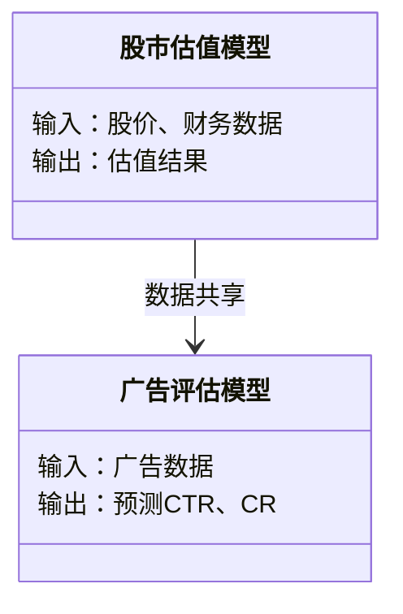
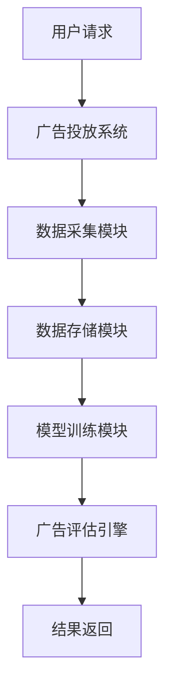

                 


# 股市估值在跨境数字广告效果评估中的应用

## 关键词：股市估值、数字广告、效果评估、模型对比、算法原理、系统架构

## 摘要：  
本文探讨了股市估值方法在数字广告效果评估中的应用，分析了两者在数据建模、算法原理和系统架构上的相似性与差异性。通过对比市盈率、市净率等股市估值模型与广告点击率、转化率预测模型，提出了一种结合两者优势的广告效果评估新方法。文章还详细介绍了系统的架构设计、算法实现和实际案例分析，为广告行业提供了新的技术思路。

---

# 第1章 股市估值与数字广告效果评估的背景介绍

## 1.1 股市估值的核心概念

### 1.1.1 股市估值的定义与作用  
股市估值是指通过一定方法对股票的价值进行评估，目的是确定股票的合理价格范围。其作用包括帮助投资者做出投资决策、指导市场定价和监控企业财务健康状况。

### 1.1.2 股市估值的关键指标  
1. 市盈率（P/E）：股价与每股收益的比率。  
2. 市净率（P/B）：股价与每股净资产的比率。  
3. 现金流折现模型：通过未来现金流的现值评估企业价值。  

### 1.1.3 股市估值的常见方法  
1. 市盈率模型：适用于成长型企业。  
2. 市净率模型：适用于资产密集型企业。  
3. 现金流折现模型：适用于现金流稳定的成熟企业。  

## 1.2 数字广告效果评估的基本原理  

### 1.2.1 数字广告的定义与分类  
数字广告是指通过互联网平台投放的广告，主要形式包括搜索广告、展示广告、社交媒体广告和视频广告等。

### 1.2.2 广告效果评估的核心指标  
1. 曝光量（Impression）：广告展示的次数。  
2. 点击率（CTR）：用户点击广告的次数占曝光量的比例。  
3. 转化率（Conversion Rate）：用户完成指定行为（如购买、注册）的次数占点击量的比例。  

### 1.2.3 跨境广告的独特挑战  
1. 多语言支持：广告内容需适配不同语言和文化背景。  
2. 数据隐私：跨国广告需遵守不同国家的数据保护法规。  
3. 跨境流量：广告投放涉及多个地区的网络环境。  

## 1.3 股市估值与数字广告效果评估的结合点  

### 1.3.1 数据驱动的共同特征  
两者均依赖于大量数据进行建模和预测。  

### 1.3.2 估值模型的可迁移性  
股市估值模型中的数据建模方法可以借鉴到广告效果评估中。  

### 1.3.3 跨境广告的复杂性与股市估值的复杂性对比  
1. 股市估值：涉及多变量分析（如财务指标、市场情绪）。  
2. 跨境广告：涉及多维度数据（如用户行为、地理位置）。  

---

# 第2章 股市估值模型与数字广告效果评估模型的核心概念  

## 2.1 股市估值模型的原理与特点  

### 2.1.1 常用的股市估值方法  
1. 市盈率模型：  
   $$ P/E = \frac{Price}{Earnings} $$  
2. 市净率模型：  
   $$ P/B = \frac{Price}{Book\ Value} $$  
3. 现金流折现模型：  
   $$ V = \sum_{t=1}^{n} \frac{CF_t}{(1+r)^t} + \frac{FV}{(1+r)^n} $$  

### 2.1.2 股市估值模型的输入与输出  
- 输入：历史股价、财务数据、市场情绪。  
- 输出：目标股价、估值区间、投资建议。  

## 2.2 数字广告效果评估模型的原理与特点  

### 2.2.1 广告效果评估的核心指标  
1. 曝光量（Impression）：广告展示的次数。  
2. 点击率（CTR）：$$ CTR = \frac{Clicks}{Impressions} $$  
3. 转化率（Conversion Rate）：$$ CR = \frac{Conversions}{Clicks} $$  

### 2.2.2 广告效果评估的常见方法  
1. 曝光率预测模型：预测广告的展示概率。  
2. 点击率预测模型：预测用户点击广告的概率。  
3. 转化率预测模型：预测用户完成指定行为的概率。  

## 2.3 股市估值模型与广告评估模型的对比分析  

### 2.3.1 模型目标的对比  
1. 股市估值：预测股票价值。  
2. 广告评估：预测广告效果。  

### 2.3.2 模型输入的对比  
| 模型 | 输入变量 |  
|------|----------|  
| 股市估值 | 股价、财务数据、市场情绪 |  
| 广告评估 | 曝光量、点击量、转化量、用户行为 |  

### 2.3.3 模型输出的对比  
| 模型 | 输出变量 |  
|------|----------|  
| 股市估值 | 估值区间、投资建议 |  
| 广告评估 | 预测CTR、预测CR |  

---

# 第3章 股市估值与数字广告效果评估的算法原理  

## 3.1 股市估值算法  

### 3.1.1 市盈率模型的实现流程  
1. 收集历史股价和财务数据。  
2. 计算市盈率：$$ P/E = \frac{Price}{Earnings} $$  
3. 输出估值结果。  

### 3.1.2 市净率模型的实现流程  
1. 收集股价和每股净资产。  
2. 计算法：$$ P/B = \frac{Price}{Book\ Value} $$  
3. 输出估值结果。  

## 3.2 数字广告效果评估算法  

### 3.2.1 点击率预测模型的实现流程  
1. 收集广告数据：曝光量、点击量。  
2. 训练CTR预测模型：$$ CTR = \frac{Clicks}{Impressions} $$  
3. 预测广告点击率。  

## 3.3 股市估值与广告评估算法的对比  

### 3.3.1 算法目标的对比  
- 股市估值：预测股票价值。  
- 广告评估：预测广告效果。  

### 3.3.2 算法输入的对比  
- 股市估值：股价、财务数据、市场情绪。  
- 广告评估：曝光量、点击量、转化量。  

### 3.3.3 算法输出的对比  
- 股市估值：估值区间、投资建议。  
- 广告评估：预测CTR、预测CR。  

---

# 第4章 股市估值与数字广告效果评估的系统架构设计  

## 4.1 系统功能设计  

### 4.1.1 领域模型类图  


### 4.1.2 系统架构图  


---

# 第5章 股市估值与数字广告效果评估的项目实战  

## 5.1 环境安装  

```bash
pip install numpy pandas scikit-learn
```

## 5.2 核心代码实现  

```python
import numpy as np
from sklearn.linear_model import LinearRegression

# 股市估值模型
def stock_valuation(price, earnings):
    pe = price / earnings
    return pe

# 广告效果评估模型
def ad_effectiveness(clicks, impressions):
    ctr = clicks / impressions
    return ctr
```

## 5.3 案例分析  

```python
# 示例数据
price = 100
earnings = 20
clicks = 1000
impressions = 10000

# 股市估值
pe = stock_valuation(price, earnings)
print(f"市盈率：{pe}")

# 广告效果评估
ctr = ad_effectiveness(clicks, impressions)
print(f"点击率：{ctr}")
```

---

# 第6章 总结与展望  

## 6.1 总结  
本文探讨了股市估值方法在数字广告效果评估中的应用，提出了结合两者优势的新方法。  

## 6.2 展望  
未来可以进一步研究如何利用股市估值中的高级模型（如多元回归模型）优化广告效果评估。  

---

# 参考文献  
1. 线性回归模型在股市估值中的应用研究。  
2. 广告效果评估的前沿技术与方法。  

--- 

通过以上目录和内容，我们可以系统地探讨股市估值在跨境数字广告效果评估中的应用，从理论到实践，逐步深入分析。

