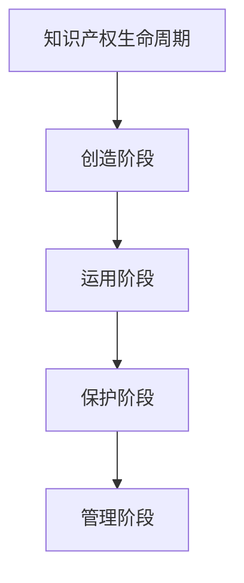
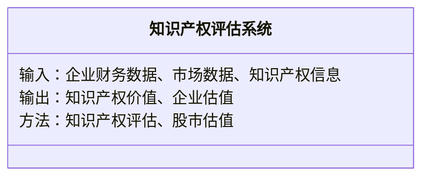
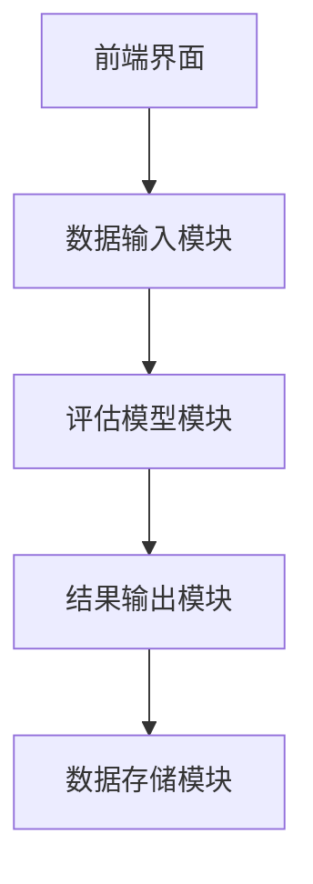

                 


# 股市估值在跨境知识产权价值链分析中的应用

> 关键词：股市估值、知识产权、价值链分析、跨境贸易、企业价值

> 摘要：本文探讨了股市估值在跨境知识产权价值链分析中的应用，通过介绍知识产权的基本概念、股市估值的核心原理，以及如何将知识产权评估纳入股市估值模型中，结合实际案例分析，详细讲解了知识产权在跨境贸易中的经济价值和对股市的影响。

---

## 第1章：知识产权的基本概念与股市估值的背景

### 1.1 知识产权的基本概念

#### 1.1.1 知识产权的定义与特征

- **定义**：知识产权是指法律所确认的智力成果和商业标志的专有权，包括专利、商标、版权、商业秘密等。
- **特征**：无形性、专有性、地域性、时间性。

| 特征 | 描述 |
|------|------|
| 无形性 | 知识产权不依赖于物理载体存在，如专利、版权。 |
| 专有性 | 知识产权受法律保护，他人未经许可不得使用。 |
| 地域性 | 知识产权的保护范围受地域限制，需在不同国家申请。 |
| 时间性 | 知识产权有法定保护期限，如专利20年，版权50年。 |

#### 1.1.2 知识产权的分类与保护

- **分类**：
  - 专利权：保护发明创造。
  - 商标权：保护商品或服务的标识。
  - 版权：保护文学、艺术和科学作品。
  - 商业秘密：保护未公开的经营信息和技术诀窍。

- **保护方式**：通过法律注册、合同保护、技术措施等。

#### 1.1.3 知识产权在经济活动中的作用

- **促进创新**：激励企业和个人进行技术创新。
- **提升企业价值**：知识产权是企业核心竞争力的重要组成部分。
- **国际市场中的竞争优势**：在跨境贸易中，知识产权是企业开拓市场的关键。

### 1.2 股市估值的基本概念

#### 1.2.1 股市估值的定义与方法

- **定义**：股市估值是对上市公司价值的评估，通常基于财务指标、市场趋势和行业分析。
- **方法**：
  - 市盈率（P/E）：市价与每股收益之比。
  - 市净率（P/B）：市价与每股净资产之比。
  - 净现值法（DCF）：通过现金流折现评估企业价值。

#### 1.2.2 股市估值的核心指标

- **市盈率（P/E）**：反映市场对公司的盈利预期。
- **市净率（P/B）**：衡量股价与账面价值的关系。
- **股息率**：股息与股价的比率，反映投资回报。

#### 1.2.3 股市估值与企业价值的关系

- 股市估值是市场对公司未来盈利能力的预期，企业价值是其内在价值的体现。
- 企业价值 = 股东权益 + 长期负债 - 现金。

### 1.3 跨境知识产权价值链分析的必要性

#### 1.3.1 知识产权在跨境贸易中的重要性

- 知识产权是国际贸易中的核心资产，特别是在高科技行业。
- 知识产权保护直接影响企业的市场地位和盈利能力。

#### 1.3.2 股市估值在知识产权价值链中的作用

- 股市估值能够量化知识产权的价值，帮助投资者评估企业潜力。
- 知识产权的市场表现影响企业的股价波动。

#### 1.3.3 跨境知识产权价值链分析的意义

- 通过分析知识产权的创造、运用、保护和管理，优化企业在全球价值链中的位置。
- 为企业制定知识产权战略提供数据支持。

---

## 第2章：知识产权与股市估值的核心概念

### 2.1 知识产权的核心要素

#### 2.1.1 知识产权的法律属性

- **法律保护**：知识产权受专利法、版权法等法律保护。
- **侵权风险**：知识产权可能面临被侵权的风险，影响企业的市场地位。

#### 2.1.2 知识产权的经济价值

- **直接价值**：知识产权本身的价值，如专利转让收入。
- **间接价值**：通过提升产品竞争力间接带来的收益。

#### 2.1.3 知识产权的生命周期



### 2.2 股市估值的核心原理

#### 2.2.1 股市估值的基本模型

- **市盈率模型**：适用于盈利稳定的公司。
- **市净率模型**：适用于资产密集型行业。
- **DCF模型**：适用于高成长性公司。

#### 2.2.2 股市估值的关键指标

- **收入增长率**：反映企业盈利能力。
- **净利润率**：衡量企业的盈利效率。
- **ROE（净资产收益率）**：反映股东资金的使用效率。

#### 2.2.3 股市估值与企业价值的关系

- 股市估值是市场对企业价值的即时反映，而企业价值是其内在价值的体现。
- 企业价值 = 股东权益 + 长期负债 - 现金。

### 2.3 知识产权与股市估值的联系

#### 2.3.1 知识产权对股市估值的影响

- 知识产权的强大会增加企业的市场竞争力，提升其估值。
- 知识产权纠纷可能会影响企业的股价波动。

#### 2.3.2 股市估值对知识产权价值的反馈作用

- 股市估值为企业提供了一个衡量知识产权价值的市场标准。
- 投资者的估值行为影响市场的知识产权交易价格。

#### 2.3.3 跨境知识产权价值链的复杂性

- 不同国家的知识产权保护政策差异影响企业的全球化布局。
- 跨境知识产权交易涉及复杂的法律和税务问题。

---

## 第3章：知识产权评估方法

### 3.1 知识产权评估的基本方法

#### 3.1.1 市场法

- **基于市场交易案例**：参考类似知识产权的交易价格。
- **优点**：评估结果具有市场参考性。
- **缺点**：数据获取难度较大。

#### 3.1.2 收益法

- **基于未来收益预测**：评估知识产权带来的未来收益。
- **公式**：知识产权价值 = ∑(未来现金流 / 折现率)。
- **优点**：考虑了时间价值因素。
- **缺点**：预测未来收益的难度较大。

#### 3.1.3 成本法

- **基于开发成本**：评估知识产权的开发和维护成本。
- **优点**：适用于成本数据容易获取的情况。
- **缺点**：忽略市场价值因素。

### 3.2 股市估值中的知识产权评估

#### 3.2.1 知识产权对企业价值的影响

- 知识产权的强大会增加企业的市场竞争力，提升其估值。
- 知识产权的弱化可能导致企业估值下降。

#### 3.2.2 知识产权在股市估值中的权重

- 不同行业对知识产权的重视程度不同，科技行业权重较高。
- 企业规模和行业地位影响知识产权在估值中的权重。

#### 3.2.3 知识产权评估的市场案例

- 例如，苹果公司的专利组合对其市值的影响。

---

## 第4章：股市估值模型构建

### 4.1 股市估值模型的基本框架

#### 4.1.1 股市估值模型的构成要素

- 企业财务数据：收入、利润、现金流。
- 市场数据：行业平均市盈率、市净率。
- 宏观经济指标：GDP增长率、利率。

#### 4.1.2 股市估值模型的假设条件

- 市场有效假设：市场能够合理反映企业价值。
- 风险中性假设：忽略系统性风险的影响。

#### 4.1.3 股市估值模型的适用范围

- 适用于成熟稳定的行业和企业。

### 4.2 知识产权在股市估值模型中的应用

#### 4.2.1 知识产权对企业利润的影响

- 通过专利分析企业研发投入和创新产出。

#### 4.2.2 知识产权对企业发展潜力的影响

- 知识产权储备反映了企业的长期发展潜力。

#### 4.2.3 知识产权对股价波动的影响

- 知识产权诉讼可能引发股价短期波动。

### 4.3 股市估值模型的优化与调整

#### 4.3.1 知识产权评估的动态调整

- 根据市场变化和企业知识产权情况实时调整评估参数。

#### 4.3.2 股市估值模型的参数优化

- 调整折现率、增长率等参数以适应不同行业特点。

#### 4.3.3 股市估值模型的实证分析

- 使用历史数据验证模型的有效性。

---

## 第5章：风险与风险管理

### 5.1 股市估值中的风险因素

#### 5.1.1 知识产权风险

- 侵权风险：可能导致法律诉讼和经济损失。
- 无效风险：知识产权可能因法律无效而失去价值。

#### 5.1.2 市场风险

- 宏观经济波动影响股市整体表现。

#### 5.1.3 汇率风险

- 跨境贸易中的汇率波动影响企业估值。

### 5.2 知识产权风险的管理策略

#### 5.2.1 知识产权保护

- 加强知识产权申请和保护，降低侵权风险。

#### 5.2.2 风险分散

- 通过多元化经营和知识产权组合分散风险。

#### 5.2.3 风险预警

- 建立风险预警机制，及时发现和应对潜在风险。

---

## 第6章：系统架构与项目实战

### 6.1 系统架构设计

#### 6.1.1 领域模型



#### 6.1.2 系统架构



### 6.2 项目实战

#### 6.2.1 环境安装

- 安装Python、数据处理库（Pandas、NumPy）和可视化库（Matplotlib）。

#### 6.2.2 核心实现代码

```python
import pandas as pd
import numpy as np

def calculate Intellectual_Property_Value(ip_info, financial_data):
    # 示例：计算知识产权价值
    ip_value = ip_info['专利数量'] * 100000 + ip_info['商标数量'] * 50000
    return ip_value

def stock_valuation(ip_value, revenue, net_profit):
    # 示例：使用市盈率模型
    industry_pe = 20  # 行业平均市盈率
    target_pe = industry_pe * 1.5  # 假设企业知识产权带来1.5倍行业市盈率
    target_price = target_pe * (net_profit / revenue)
    return target_price

# 示例数据
ip_info = {'专利数量': 10, '商标数量': 5}
financial_data = {'收入': 1000000, '净利润': 200000}

ip_value = calculate_Intellectual_Property_Value(ip_info, financial_data)
target_price = stock_valuation(ip_value, financial_data['收入'], financial_data['净利润'])
print(f"目标股价：{target_price:.2f}")
```

---

## 第7章：最佳实践与总结

### 7.1 最佳实践

- 定期更新知识产权评估模型，以反映市场变化。
- 结合定量分析和定性分析，全面评估知识产权价值。

### 7.2 小结

- 股市估值在跨境知识产权价值链分析中具有重要意义。
- 知识产权评估和股市估值模型的结合能够帮助企业更好地管理和优化知识产权资源。

### 7.3 注意事项

- 数据获取的准确性和完整性是关键。
- 模型的应用需结合具体行业特点和企业实际情况。

### 7.4 拓展阅读

- 推荐阅读《知识产权管理》和《股市分析实战》等书籍，深入了解相关领域的最新动态。

---

## 附录

### 附录A：知识产权相关法律

- 《专利法》、《商标法》、《版权法》等。

### 附录B：常用股市估值工具

- 谷歌财经、FactSet、Morningstar等。

---

通过以上结构和内容，我们可以系统地分析和应用股市估值在跨境知识产权价值链中的作用，为企业提供有效的决策支持。

