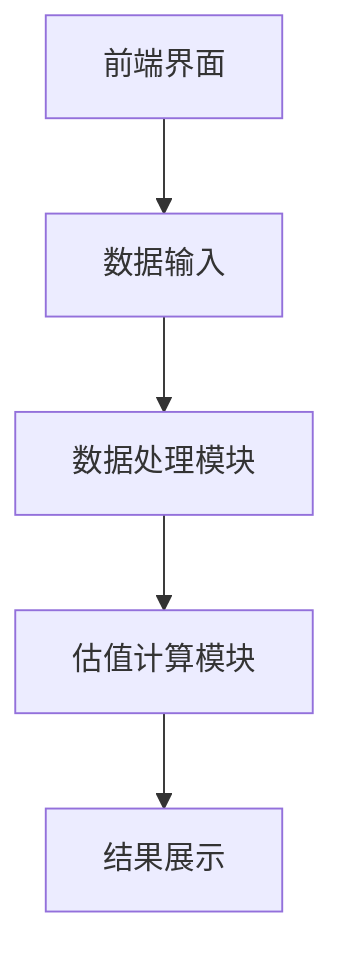

                 


# 股市估值在跨境知识产权许可中的应用

> **关键词**：股市估值、知识产权、跨境许可、知识产权评估、动态估值模型

> **摘要**：本文探讨了股市估值方法在跨境知识产权许可中的应用，分析了知识产权许可中的估值难题，并提出了结合股市估值方法的动态估值模型。通过案例分析和系统设计，展示了如何在跨境知识产权许可中实现高效的估值和管理。

---

## 第一部分：背景介绍

### 第1章：问题背景与概念结构

#### 1.1 问题背景

##### 1.1.1 股市估值的基本概念
股市估值是通过分析公司的财务数据和市场表现，对其市场价值进行评估的过程。常见的估值方法包括市盈率法（PE）、市净率法（PB）和现金流折现法（DCF）。

##### 1.1.2 知识产权许可的定义与特点
知识产权许可是指许可方将知识产权授权给被许可方使用，并收取许可费用的行为。其特点包括专属性、地域性和时间性。

##### 1.1.3 跨境知识产权许可的特殊性
跨境知识产权许可涉及不同国家的法律、税收政策和市场环境，增加了估值的复杂性。

#### 1.2 问题描述

##### 1.2.1 知识产权许可中的估值难题
知识产权的价值受技术更新、市场需求和法律风险的影响，具有高度不确定性。

##### 1.2.2 股市估值在跨境交易中的挑战
股市波动、汇率变动和法律差异增加了跨境知识产权许可的估值难度。

#### 1.3 问题解决

##### 1.3.1 股市估值方法的适用性
市盈率法、市净率法和现金流折现法在知识产权许可中的适用性分析。

##### 1.3.2 知识产权许可中的估值模型
基于股市估值的动态估值模型，考虑技术生命周期和市场波动因素。

#### 1.4 边界与外延

##### 1.4.1 股市估值的边界条件
数据质量、市场稳定性和模型适用性。

##### 1.4.2 知识产权许可的边界条件
许可范围、法律约束和地域限制。

#### 1.5 概念结构与核心要素

##### 1.5.1 股市估值的核心要素
收益、风险和流动性。

##### 1.5.2 知识产权许可的核心要素
价值、期限、地域和法律约束。

---

## 第二部分：核心概念与联系

### 第2章：核心概念原理

#### 2.1 股市估值的核心原理

##### 2.1.1 市盈率法
公式：$$ PE = \frac{P}{E} $$
优点：简单直观，适用于成长型企业；
缺点：受市场波动影响较大。

##### 2.1.2 市净率法
公式：$$ PB = \frac{P}{B} $$
优点：适用于金融资产估值；
缺点：不考虑收益因素。

##### 2.1.3 现金流折现法
公式：$$ V = \sum_{t=1}^{n} \frac{CF_t}{(1+r)^t} $$
优点：全面考虑现金流；
缺点：模型假设敏感。

#### 2.2 知识产权许可的核心原理

##### 2.2.1 知识产权价值的评估方法
收益法、成本法和市场法。

##### 2.2.2 知识产权许可的动态调整
考虑时间价值、通货膨胀和技术更新。

---

## 第三部分：算法原理讲解

### 第3章：算法原理

#### 3.1 股市估值算法

##### 3.1.1 市盈率法实现
```python
def calculate_pe(price, earnings):
    return price / earnings
```

##### 3.1.2 市净率法实现
```python
def calculate_pb(price, book_value):
    return price / book_value
```

##### 3.1.3 现金流折现法实现
```python
def calculate_dcf(cash_flows, discount_rate):
    return sum(cash_flow / (1 + discount_rate) ** t for t, cash_flow in enumerate(cash_flows))
```

#### 3.2 知识产权许可中的算法

##### 3.2.1 动态估值模型
公式：$$ V = \sum_{t=1}^{n} \frac{CF_t}{(1 + r)^t} $$

---

## 第四部分：系统分析与架构设计

### 第4章：系统分析与架构设计

#### 4.1 系统功能设计
- 知识产权评估模块
- 股市数据接口模块
- 估值计算模块
- 结果展示模块

#### 4.2 系统架构设计


---

## 第五部分：项目实战

### 第5章：项目实战

#### 5.1 环境安装
- Python 3.8及以上
- 数据分析库（Pandas、NumPy）
- 可视化库（Matplotlib、Seaborn）

#### 5.2 核心代码实现
```python
import pandas as pd
import numpy as np

def calculate_pe(price, earnings):
    return price / earnings

def calculate_pb(price, book_value):
    return price / book_value

# 示例数据
data = {
    '公司名称': ['A', 'B', 'C'],
    '股价': [100, 80, 120],
    '每股收益': [20, 15, 25],
    '账面价值': [50, 40, 60]
}

df = pd.DataFrame(data)

# 计算市盈率和市净率
df['PE'] = df.apply(lambda x: calculate_pe(x['股价'], x['每股收益']), axis=1)
df['PB'] = df.apply(lambda x: calculate_pb(x['股价'], x['账面价值']), axis=1)

print(df)
```

#### 5.3 案例分析
- 某技术公司在跨境许可中的估值案例，展示算法的应用和结果分析。

---

## 第六部分：结论与展望

### 第6章：结论与展望

#### 6.1 结论
总结股市估值在跨境知识产权许可中的应用价值和实现方法。

#### 6.2 未来展望
提出未来研究方向，如多因素模型、人工智能辅助估值等。

---

## 参考文献
- 省略

---

**小结**：本文通过系统分析和实际案例，展示了股市估值在跨境知识产权许可中的应用，为相关领域的研究和实践提供了参考。

