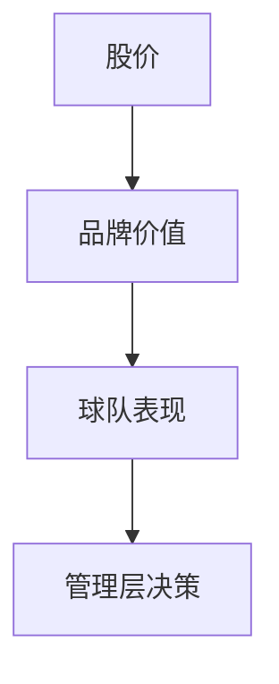
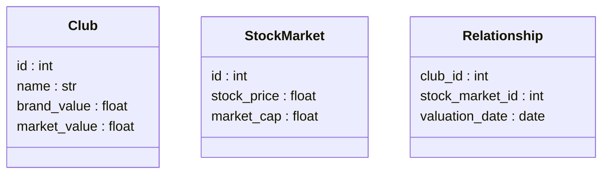
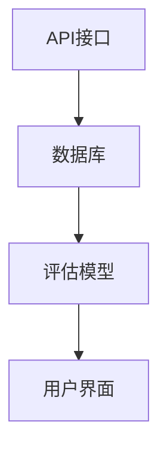
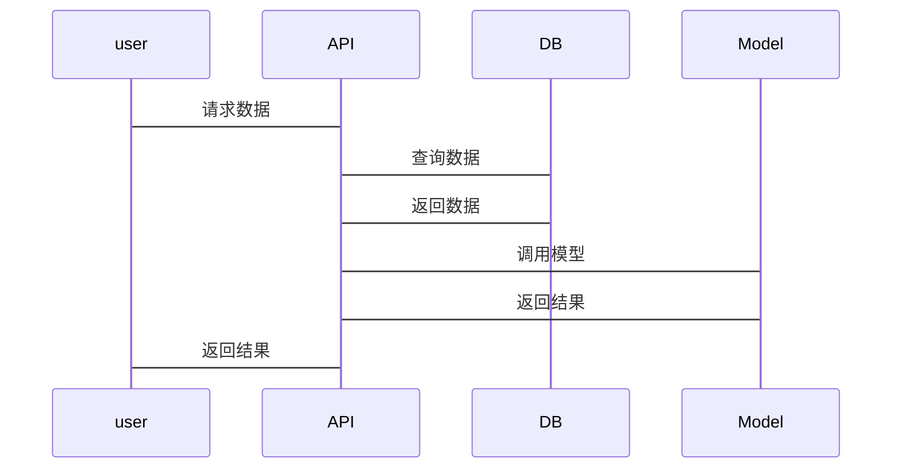

                 


# 股市估值对国际体育俱乐部品牌价值的影响

## 关键词：股市估值、品牌价值、国际体育俱乐部、数据分析、金融模型

## 摘要：  
本文深入探讨了股市估值与国际体育俱乐部品牌价值之间的关系，通过数据分析和金融模型，揭示了股市估值对品牌价值的影响机制。文章从背景介绍、核心概念、算法原理、系统分析、项目实战到最佳实践，全面阐述了如何通过量化分析和系统设计，评估和优化国际体育俱乐部的品牌价值。

---

# 第1章: 背景与核心概念

## 1.1 问题背景

### 1.1.1 股市估值的基本概念  
股市估值是通过对企业财务数据和市场表现的分析，评估其股票的内在价值。常用的方法包括市盈率（P/E）、市净率（P/B）等。

### 1.1.2 国际体育俱乐部品牌价值的定义  
品牌价值是指品牌在市场上的影响力和盈利能力。国际体育俱乐部的品牌价值受到球队表现、球迷基础和市场推广等因素的影响。

### 1.1.3 股市估值与品牌价值的关系  
股市估值反映了市场对俱乐部未来盈利能力的预期，而品牌价值则是俱乐部长期发展的核心驱动力。

## 1.2 问题描述

### 1.2.1 股市估值对品牌价值的影响机制  
球队表现、管理层决策和市场环境等因素影响股市估值，进而影响品牌价值。

### 1.2.2 品牌价值对股市估值的影响路径  
品牌价值通过提升球队市场吸引力和收入，间接影响股市估值。

### 1.2.3 两者关系的复杂性与动态性  
股市估值受短期市场情绪影响，而品牌价值则更关注长期积累。

## 1.3 问题解决

### 1.3.1 理论模型构建  
构建包含球队表现、财务状况和市场环境的综合模型。

### 1.3.2 数据收集与分析方法  
使用历史数据和统计分析方法，评估两者的关系。

### 1.3.3 研究框架的初步设计  
通过案例分析和模型验证，初步评估关系强度。

## 1.4 边界与外延

### 1.4.1 股市估值的边界条件  
仅考虑俱乐部自身因素，排除外部经济波动。

### 1.4.2 品牌价值的边界条件  
主要考虑市场因素，排除不可抗力。

### 1.4.3 两者关系的外延与限制  
强调长期动态关系，短期波动不作为主要研究对象。

## 1.5 核心概念的结构与组成

### 1.5.1 股市估值的核心要素  
市盈率、市净率、收入增长。

### 1.5.2 品牌价值的核心要素  
球队实力、球迷数量、市场覆盖。

### 1.5.3 两者的相互作用机制  
球队表现→品牌价值提升→股市估值上升。

---

# 第2章: 核心概念与联系

## 2.1 核心概念的原理

### 2.1.1 股市估值的计算方法  
市盈率公式：$$P/E = \frac{\text{股价}}{\text{每股收益}}$$

### 2.1.2 品牌价值的评估方法  
品牌价值公式：$$BV = \frac{\text{销售收入} \times \text{品牌强度}}{1 - \text{贴现率}}$$

### 2.1.3 两者关系的理论基础  
市场预期理论：股市估值反映市场对品牌价值的预期。

## 2.2 概念属性特征对比

| 特性         | 股市估值                 | 品牌价值               |
|--------------|--------------------------|------------------------|
| 计量方式     | 价格指标                | 综合价值                |
| 时间维度     | 短期波动                | 长期积累                |
| 影响因素     | 市场情绪、财务数据        | 市场推广、球队表现        |

## 2.3 ER实体关系图

```mermaid
erDiagram
    club {
        id
        name
        brand_value
        market_value
    }
    stock_market {
        id
        stock_price
        market_cap
    }
    relationship {
        club_id
        stock_market_id
        valuation_date
    }
```

---

# 第3章: 算法原理讲解

## 3.1 基本算法讲解

### 3.1.1 回归分析



回归方程：$$\text{股价} = \beta_0 + \beta_1 \times \text{球队表现} + \epsilon$$

### 3.1.2 多元统计模型

```python
import statsmodels.api as sm
model = sm.OLS(y, X)
results = model.fit()
print(results.summary())
```

### 3.1.3 逻辑回归

```python
from sklearn.linear_model import LogisticRegression
lr = LogisticRegression()
lr.fit(X, y)
```

### 3.1.4 数学模型的详细讲解  
线性回归模型：$$y = \beta X + \epsilon$$

## 3.2 机器学习算法

### 3.2.1 随机森林

```python
from sklearn.ensemble import RandomForestRegressor
rf = RandomForestRegressor(n_estimators=100)
rf.fit(X, y)
```

### 3.2.2 神经网络

```python
import torch
model = torch.nn.Sequential(
    torch.nn.Linear(3, 6),
    torch.nn.ReLU(),
    torch.nn.Linear(6, 1)
)
```

### 3.2.3 支持向量机

```python
from sklearn.svm import SVC
svc = SVC(kernel='rbftest', gamma='auto')
svc.fit(X, y)
```

---

# 第4章: 系统分析与架构设计

## 4.1 系统分析

### 4.1.1 问题场景介绍  
分析国际体育俱乐部的市场表现和品牌价值。

### 4.1.2 项目介绍  
开发一个品牌价值评估系统，结合股市数据和俱乐部信息。

## 4.2 系统功能设计

### 4.2.1 领域模型类图



## 4.3 系统架构设计

### 4.3.1 系统架构图



## 4.4 接口设计

### 4.4.1 数据接口  
API接口：提供俱乐部和股市数据的接口。

### 4.4.2 模型接口  
模型接口：调用评估模型，返回品牌价值。

## 4.5 交互设计

### 4.5.1 交互序列图



---

# 第5章: 项目实战

## 5.1 环境安装

### 5.1.1 安装Python和相关库  
安装步骤：pip install numpy pandas matplotlib statsmodels scikit-learn

## 5.2 核心代码实现

### 5.2.1 数据预处理

```python
import pandas as pd
data = pd.read_csv('data.csv')
data = data.dropna()
```

### 5.2.2 模型训练

```python
from sklearn.model_selection import train_test_split
X_train, X_test, y_train, y_test = train_test_split(X, y, test_size=0.2)
model = RandomForestRegressor()
model.fit(X_train, y_train)
```

### 5.2.3 模型评估

```python
from sklearn.metrics import mean_squared_error
y_pred = model.predict(X_test)
print(mean_squared_error(y_test, y_pred))
```

## 5.3 案例分析

### 5.3.1 某国际俱乐部的案例分析  
分析球队表现与股价的相关性。

## 5.4 项目小结  
总结项目实施过程，评估模型效果。

---

# 第6章: 最佳实践与小结

## 6.1 最佳实践 tips

### 6.1.1 数据收集  
确保数据的准确性和全面性。

### 6.1.2 模型选择  
根据数据特点选择合适的算法。

### 6.1.3 模型优化  
通过参数调优提升模型性能。

## 6.2 小结  
总结全文内容，强调股市估值对品牌价值的重要性。

## 6.3 注意事项  
注意数据的实时性和模型的适用性。

## 6.4 拓展阅读  
推荐相关书籍和文献，供读者深入学习。

---

# 结语  
本文通过系统分析和实战案例，深入探讨了股市估值对国际体育俱乐部品牌价值的影响，为相关研究提供了理论和实践参考。

