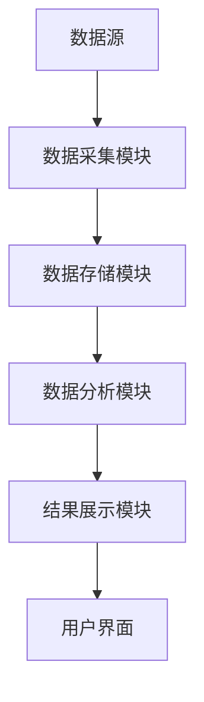

                 


# 股市估值对国际体育赛事估值的影响

> 关键词：股市估值，国际体育赛事，体育赛事估值，金融市场，经济分析

> 摘要：本文探讨股市估值方法与国际体育赛事估值之间的关系，分析股市波动对体育赛事经济价值的影响，通过数据模型和算法，提出结合两者的方法，并通过案例分析展示其应用。

---

## 第一部分：背景介绍

### 第1章：股市估值的基本概念

#### 1.1 股市估值的定义与意义
- **1.1.1 股市估值的定义**  
  股市估值是指通过分析公司财务数据、市场趋势和行业动态，确定股票的内在价值和市场价格的过程。  
  $$ V = \text{内在价值} = \text{净利润} \times \text{市盈率} $$  

- **1.1.2 股市估值的重要性**  
  股市估值帮助投资者做出投资决策，优化资产配置，降低投资风险。  

- **1.1.3 股市估值的核心要素**  
  包括公司盈利能力、成长性、财务状况、行业地位和市场环境等。

#### 1.2 国际体育赛事估值的基本概念
- **1.2.1 国际体育赛事的定义**  
  国际体育赛事是指在全球范围内具有广泛影响力和商业价值的体育比赛，如世界杯、奥运会等。  

- **1.2.2 国际体育赛事的分类**  
  按类型分为足球、篮球、网球等；按规模分为国际性、洲际性和全球性赛事。  

- **1.2.3 国际体育赛事的经济价值**  
  包括转播权收入、赞助商收入、门票销售和衍生品收入等。  

### 第2章：股市估值与国际体育赛事估值的关系

#### 2.1 两者的联系
- **2.1.1 股市波动与体育赛事的关系**  
  股市波动可能反映投资者对体育赛事相关公司的信心变化。  

- **2.1.2 体育赛事对股市的影响**  
  重大体育赛事可能影响相关公司的股价，尤其是赞助商和转播商。  

- **2.1.3 股市对体育赛事估值的借鉴意义**  
  股市估值的方法可以为体育赛事的价值评估提供参考，如使用市盈率、市净率等指标。

#### 2.2 两者的区别
- **2.2.1 数据来源与分析方法的差异**  
  股市估值基于财务数据，体育赛事估值基于观众人数、媒体曝光等数据。  

- **2.2.2 影响因素的差异**  
  股市受宏观经济影响较大，而体育赛事受粉丝基础和市场热度影响较大。  

- **2.2.3 估值目标的差异**  
  股市估值用于投资决策，体育赛事估值用于商业决策。

### 第3章：问题背景与问题描述

#### 3.1 问题背景
- **3.1.1 当前股市估值的挑战**  
  股市波动性大，传统估值方法难以捕捉短期变化。  

- **3.1.2 国际体育赛事估值的现状**  
  体育赛事估值缺乏统一标准，难以量化。  

- **3.1.3 两者的结合对经济的影响**  
  通过结合股市估值和体育赛事估值，可以优化资源配置，提升商业价值。

#### 3.2 问题描述
- **3.2.1 股市估值与体育赛事估值的结合问题**  
  如何将股市估值方法应用于体育赛事估值。  

- **3.2.2 体育赛事对股市估值的影响机制**  
  分析体育赛事如何影响相关公司的股价。  

- **3.2.3 股市波动对体育赛事估值的影响**  
  如何利用股市波动预测体育赛事的经济价值。

## 第二部分：核心概念与联系

### 第4章：核心概念与联系

#### 4.1 核心概念原理
- **4.1.1 股市估值的核心原理**  
  通过分析公司基本面和市场情绪，确定股票的内在价值。  

- **4.1.2 体育赛事估值的核心原理**  
  通过分析赛事的市场影响力和商业价值，确定其经济价值。  

#### 4.2 概念属性对比
| 属性       | 股市估值                         | 体育赛事估值                   |
|------------|----------------------------------|--------------------------------|
| 数据来源   | 财务报表、市场数据               | 观众人数、赞助商数据           |
| 影响因素   | 利润、市盈率、宏观经济           | 媒体曝光、粉丝基础、赞助商     |
| 估值目标   | 投资决策                        | 商业决策、赞助定价             |

#### 4.3 ER实体关系图
```mermaid
erd
  entity 股市公司 {
    key 股票代码
    股票名称
    股票价格
  }
  entity 体育赛事 {
    key 赛事编号
    赛事名称
    赛事类型
  }
  entity 股东 {
    股东名称
    持股数量
  }
  entity 赞助商 {
    赞助商名称
    赞助金额
  }
  股市公司 -- 股东: 持股关系
  股市公司 -- 赞助商: 赞助关系
  体育赛事 -- 股市公司: 赞助关系
```

## 第三部分：算法原理

### 第5章：算法原理

#### 5.1 数据收集与特征提取
- 数据来源：历史股价、赛事数据、市场情绪数据。  

#### 5.2 模型训练与评估
- 使用回归模型预测体育赛事的经济价值，基于历史数据训练模型。

#### 5.3 代码实现
```python
import pandas as pd
import numpy as np
from sklearn.linear_model import LinearRegression

# 数据加载
data = pd.DataFrame({
    '股价': [100, 105, 98, 110],
    '观众人数': [50000, 60000, 55000, 65000],
    '赞助商数量': [10, 12, 8, 15],
    '赛事价值': [1000000, 1200000, 900000, 1500000]
})

# 特征选择
X = data[['股价', '观众人数', '赞助商数量']]
y = data['赛事价值']

# 模型训练
model = LinearRegression()
model.fit(X, y)

# 模型预测
predictions = model.predict(X)
print("预测值:", predictions)
```

#### 5.4 数学模型与公式
- 使用多元线性回归模型预测体育赛事的经济价值：  
  $$ \text{赛事价值} = \beta_0 + \beta_1 \times \text{股价} + \beta_2 \times \text{观众人数} + \beta_3 \times \text{赞助商数量} + \epsilon $$

## 第四部分：系统分析与架构设计

### 第6章：系统分析与架构设计

#### 6.1 问题场景介绍
- 构建一个基于股市数据的体育赛事估值系统，帮助投资者和赞助商做出决策。

#### 6.2 系统功能设计
- 数据采集模块：收集股价、赛事数据。  
- 数据分析模块：使用回归模型预测赛事价值。  
- 结果展示模块：生成可视化报告。

#### 6.3 系统架构设计


## 第五部分：项目实战

### 第7章：项目实战

#### 7.1 环境安装
- 安装Python和相关库：`pip install pandas numpy scikit-learn`

#### 7.2 核心代码实现
```python
import pandas as pd
from sklearn.linear_model import LinearRegression

# 数据加载
data = pd.read_csv('data.csv')

# 特征选择
X = data[['股价', '观众人数', '赞助商数量']]
y = data['赛事价值']

# 模型训练
model = LinearRegression()
model.fit(X, y)

# 模型预测
new_data = pd.DataFrame({
    '股价': [110],
    '观众人数': [60000],
    '赞助商数量': [12]
})
predictions = model.predict(new_data)
print("预测的赛事价值:", predictions[0])
```

#### 7.3 案例分析
- 使用实际数据训练模型，预测某次国际体育赛事的经济价值，并分析结果。

## 第六部分：最佳实践

### 第8章：最佳实践

#### 8.1 小结
- 总结股市估值与体育赛事估值的结合方法和应用场景。

#### 8.2 注意事项
- 数据质量和模型选择对结果影响较大，需谨慎处理。  

#### 8.3 拓展阅读
- 推荐阅读相关领域的书籍和论文，深入理解数据挖掘和金融建模技术。

---

# 结语

通过本文的分析，我们了解了股市估值与国际体育赛事估值的关系，掌握了结合两者的方法，并通过实际案例展示了其应用。希望本文能为相关领域的研究和实践提供参考。

