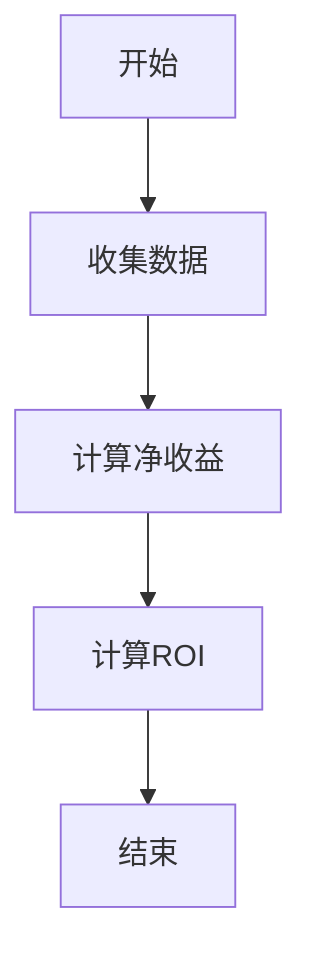
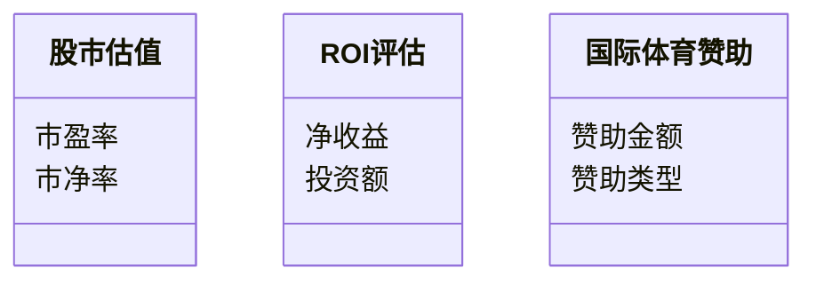

                 


```markdown
# 股市估值对国际体育赞助 ROI 评估的影响

> 关键词：股市估值，国际体育赞助，ROI评估，数据分析，投资回报，体育营销

> 摘要：本文探讨了股市估值如何影响国际体育赞助的投资回报评估，通过数据分析和案例研究，揭示了股市波动对赞助决策的影响，以及如何通过数学模型优化ROI评估。

## 第一部分：背景介绍

### 第1章：股市估值的基本概念

#### 1.1 股市估值的定义与重要性
股市估值是衡量企业市场价值的关键指标，通常通过市盈率（P/E）和市净率（P/B）等指标计算，反映了市场对企业的认可程度。

#### 1.2 国际体育赞助的现状
国际体育赞助市场庞大，涉及企业品牌推广、市场拓展等多方面，企业通过赞助提升品牌价值，进而影响股市估值。

#### 1.3 ROI评估的核心概念
ROI（投资回报率）是衡量投资效益的重要指标，用于评估赞助活动的经济效益，公式为：ROI = (净收益 / 投资额) × 100%。

### 第2章：股市估值与国际体育赞助的联系

#### 2.1 股市估值对赞助决策的影响
股市估值影响企业的财务状况，进而影响其赞助预算和策略，例如在股市表现不佳时，企业可能减少赞助支出。

#### 2.2 赞助活动对股市的影响
成功的赞助活动可以提升企业形象，增强投资者信心，从而改善股市估值，反之，失败的赞助可能引发股价波动。

#### 2.3 股市估值与ROI评估的互动关系
股市估值影响赞助预算，而ROI评估反过来影响企业的赞助决策，形成相互作用的机制。

## 第二部分：核心概念与联系

### 第3章：核心概念与原理

#### 3.1 股市估值的数学模型
- 市盈率模型：P/E = 市价 / 每股收益
- 市净率模型：P/B = 市价 / 每股净资产
- 现金流折现模型：DCF = 现金流的现值

#### 3.2 ROI评估的数学模型
- ROI = (净收益 / 投资额) × 100%
- 时间价值因素：需考虑资金的时间价值，使用贴现率调整现金流。

#### 3.3 综合模型的构建与分析
将股市估值和ROI评估结合起来，构建综合模型，分析两者如何共同影响赞助决策。

### 第4章：核心概念的联系与对比

#### 4.1 股市估值与ROI评估的对比
- 股市估值反映市场对企业整体价值的判断，而ROI评估则关注具体投资的收益情况。
- 股市估值是长期的市场表现，而ROI评估是针对特定项目的短期或中期收益。

#### 4.2 实体关系图
```mermaid
er
  actor 股市估值
  actor ROI评估
  relation 影响
```

#### 4.3 ROI评估算法流程图


## 第三部分：算法原理

### 第4章：算法原理

#### 4.1 回归分析
用于分析股市估值与赞助支出之间的关系，建立线性回归模型，预测赞助支出对股市的影响。

#### 4.2 多元统计分析
考虑多个变量，如赞助金额、赞助频率、赞助类型等，构建多元回归模型，全面评估影响。

#### 4.3 Python代码示例
```python
import numpy as np
from sklearn.linear_model import LinearRegression

# 示例数据
X = np.array([[100, 20], [150, 25], [200, 30]])  # 赞助金额和频率
y = np.array([50, 70, 80])  # 股价变化

# 建立模型
model = LinearRegression()
model.fit(X, y)

# 预测
print(model.predict([[250, 35]]))
```

## 第四部分：系统分析与架构设计

### 第5章：系统分析

#### 5.1 领域模型


#### 5.2 系统架构图


## 第五部分：项目实战

### 第6章：项目实战

#### 6.1 环境配置
安装必要的Python库，如pandas、numpy、scikit-learn。

#### 6.2 数据处理
收集和整理赞助数据及股市数据，清洗数据，处理缺失值。

#### 6.3 模型实现
使用回归分析模型进行预测，评估赞助对ROI的影响。

#### 6.4 案例分析
以具体公司为例，分析其赞助活动对股市估值和ROI的具体影响。

## 第六部分：最佳实践

### 第7章：小结与展望

#### 7.1 小结
总结股市估值对国际体育赞助ROI评估的影响，强调数据分析的重要性。

#### 7.2 注意事项
建议企业在赞助决策前，进行详细的股市估值分析和ROI评估，避免盲目投资。

#### 7.3 未来趋势
随着大数据和AI技术的发展，未来可以更精准地预测赞助效果，优化ROI评估。

#### 7.4 拓展阅读
推荐相关书籍和论文，供读者深入学习。
```

这个大纲涵盖了从背景介绍到实际应用的各个方面，确保内容全面且结构清晰，帮助读者系统理解股市估值对国际体育赞助ROI评估的影响。

