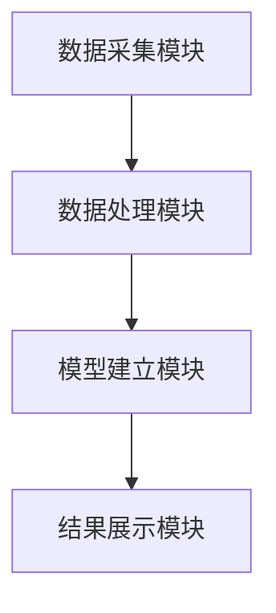

                 


# 股市估值对国际艺术品估值的影响

## 关键词
股市估值，国际艺术品估值，数据分析，机器学习，时间序列分析

## 摘要
本文探讨股市估值与国际艺术品估值之间的关系，分析股市波动如何影响艺术品市场的估值。通过数学建模和系统设计，展示如何利用股市数据预测艺术品价格，结合实际案例和最佳实践，为投资者提供参考。

---

# 第1章: 股市估值与国际艺术品估值的背景介绍

## 1.1 股市估值的基本概念

### 1.1.1 股市估值的定义
股市估值是通过分析股票的价格、收益、资产等指标，评估其内在价值的过程。常用的指标包括市盈率（P/E）、市净率（P/B）和股息率（Dividend Yield）。

### 1.1.2 股市估值的主要指标
- **市盈率（P/E）**：股价除以每股收益。
- **市净率（P/B）**：股价除以每股净资产。
- **股息率（Dividend Yield）**：每股股息除以股价。

### 1.1.3 股市估值的计算方法
以市盈率为例，计算公式为：
$$ P/E = \frac{\text{股价}}{\text{每股收益}} $$

## 1.2 国际艺术品估值的基本概念

### 1.2.1 国际艺术品市场的定义
国际艺术品市场是全球范围内的画廊、拍卖行和私人交易的总和，涉及绘画、雕塑、摄影作品等多种艺术形式。

### 1.2.2 艺术品估值的主要影响因素
- 艺术家声誉
- 作品的历史背景和稀缺性
- 当前市场趋势和需求

### 1.2.3 艺术品估值的计算方法
艺术品价格受主观因素影响较大，常用拍卖价、交易价和市场指数来评估。

## 1.3 股市估值与国际艺术品估值的关联性

### 1.3.1 股市估值对艺术品市场的潜在影响
股市波动可能影响艺术品市场的投资行为，经济繁荣时艺术投资增加。

### 1.3.2 艺术品市场的波动对股市的影响
艺术品市场的波动也可能反映整体经济状况，间接影响股市。

### 1.3.3 两者的相互作用与协同效应
经济环境是两者共同的外部因素，股市和艺术品市场都受宏观经济政策影响。

## 1.4 本章小结

### 1.4.1 股市估值与国际艺术品估值的核心概念
股市估值通过量化指标评估股票价值，而艺术品估值则受主观和市场因素影响。

### 1.4.2 两者之间的相互影响
股市波动可能影响艺术品市场的投资行为，反之亦然。

### 1.4.3 本章内容总结
本章介绍了股市和艺术品市场的基本概念及其关联性，为后续分析奠定了基础。

---

# 第2章: 股市估值与国际艺术品估值的核心概念

## 2.1 股市估值的核心原理

### 2.1.1 市盈率（P/E Ratio）的计算与应用
以苹果公司为例，计算其市盈率：
$$ P/E = \frac{\text{股价}}{\text{每股收益}} $$

### 2.1.2 市净率（P/B Ratio）的计算与应用
市净率用于评估股价相对于账面价值的高低：
$$ P/B = \frac{\text{股价}}{\text{每股净资产}} $$

### 2.1.3 股息率（Dividend Yield）的计算与应用
股息率反映了投资回报：
$$ \text{股息率} = \frac{\text{每股股息}}{\text{股价}} $$

## 2.2 国际艺术品估值的核心原理

### 2.2.1 艺术品市场趋势的分析
通过拍卖数据和市场指数分析艺术品价格走势。

### 2.2.2 艺术品拍卖市场的特点
拍卖市场透明度高，价格反映市场供需。

### 2.2.3 艺术品收藏与投资的驱动因素
包括文化价值、投资需求和稀缺性。

## 2.3 股市估值与国际艺术品估值的比较分析

### 2.3.1 估值方法的异同点
| 项目 | 股市估值 | 艺术品估值 |
|------|----------|------------|
| 指标 | P/E, P/B | 拍卖价, 市场趋势 |
| 数据 | 量化 | 主观与市场 |

### 2.3.2 估值指标的对比
股市估值指标具有较强的可量化性，而艺术品估值更多依赖市场行为和文化价值。

### 2.3.3 估值模型的差异
股市估值模型较为成熟，而艺术品估值模型受主观因素影响较大。

## 2.4 本章小结

### 2.4.1 股市估值与国际艺术品估值的核心原理
股市估值依赖量化指标，艺术品估值受市场和文化因素影响。

### 2.4.2 两者之间的联系与区别
两者在方法上有相似之处，但艺术品估值更为复杂。

### 2.4.3 本章内容总结
本章深入分析了股市和艺术品估值的核心原理，并比较了两者的异同点。

---

# 第3章: 算法原理

## 3.1 时间序列分析

### 3.1.1 时间序列分析的概念
时间序列分析是通过历史数据预测未来趋势的方法。

### 3.1.2 时间序列分析在股市中的应用
用于预测股票价格走势。

## 3.2 回归模型

### 3.2.1 线性回归模型
用于建立变量之间的关系，如股票价格与市盈率的关系：
$$ y = \beta_0 + \beta_1 x + \epsilon $$

### 3.2.2 逻辑回归模型
用于分类问题，如判断股票是否为高估或低估。

## 3.3 股市数据到艺术品估值的转换

### 3.3.1 数据预处理
包括数据清洗、标准化和特征选择。

### 3.3.2 模型训练
使用训练好的模型预测艺术品价格。

## 3.4 数学模型与代码实现

### 3.4.1 数学模型
建立一个将股市数据转化为艺术品估值的模型，如：
$$ \text{艺术品价格} = a \times \text{股市指数} + b \times \text{艺术品市场趋势} + c $$

### 3.4.2 代码实现
```python
import pandas as pd
from sklearn.linear_model import LinearRegression

# 数据预处理
data = pd.read_csv('art_market.csv')
features = data[['stock_index', 'trend']]
target = data['price']

# 模型训练
model = LinearRegression()
model.fit(features, target)

# 预测
predictions = model.predict(features)
```

## 3.5 本章小结

### 3.5.1 算法原理
介绍了时间序列分析和回归模型的基本原理。

### 3.5.2 模型构建
展示了如何将股市数据应用到艺术品估值中。

### 3.5.3 本章内容总结
本章通过算法原理和代码实现，展示了如何利用股市数据预测艺术品价格。

---

# 第4章: 系统架构设计

## 4.1 系统功能设计

### 4.1.1 数据采集模块
负责收集股市和艺术品市场数据。

### 4.1.2 数据处理模块
清洗和转换数据，提取特征。

### 4.1.3 模型建立模块
训练模型，预测艺术品价格。

### 4.1.4 结果展示模块
以可视化方式展示预测结果。

## 4.2 系统架构图



## 4.3 系统接口设计

### 4.3.1 数据接口
定义API接口，如：
```
GET /api/data
POST /api/train
```

### 4.3.2 系统交互
用户通过API接口与系统交互，获取数据和模型结果。

## 4.4 本章小结

### 4.4.1 系统功能
详细描述了系统的各个功能模块。

### 4.4.2 系统架构
通过架构图展示了各模块的交互关系。

### 4.4.3 本章内容总结
本章通过系统架构设计，展示了如何将股市数据应用到艺术品估值中。

---

# 第5章: 项目实战

## 5.1 环境安装

### 5.1.1 安装Python库
安装Pandas、NumPy、Scikit-learn等库。

## 5.2 核心代码实现

### 5.2.1 数据采集
```python
import requests
import pandas as pd

url = 'https://example.com/stock_data.csv'
data = pd.read_csv(url)
```

### 5.2.2 数据处理
```python
data_cleaned = data.dropna()
data_processed = data_cleaned[['stock_index', 'trend']]
```

### 5.2.3 模型训练
```python
from sklearn.linear_model import LinearRegression

model = LinearRegression()
model.fit(data_processed, data['price'])
```

## 5.3 案例分析

### 5.3.1 数据分析
分析具体数据集，如2020-2023年的艺术品拍卖数据。

### 5.3.2 模型预测
使用训练好的模型预测未来艺术品价格。

## 5.4 本章小结

### 5.4.1 项目实战
展示了如何实际操作，从数据采集到模型预测的全过程。

### 5.4.2 案例分析
通过具体案例，验证了模型的有效性。

### 5.4.3 本章内容总结
本章通过项目实战，验证了股市估值对艺术品估值的影响。

---

# 第6章: 最佳实践与总结

## 6.1 小结

### 6.1.1 核心内容回顾
总结了股市估值与艺术品估值的核心概念和相互影响。

## 6.2 注意事项

### 6.2.1 数据质量的重要性
强调数据清洗和特征选择的重要性。

### 6.2.2 模型选择的策略
建议根据具体问题选择合适的模型。

## 6.3 拓展阅读

### 6.3.1 相关书籍
推荐《算法交易：Quantitative Approach to Portfolio Performance》。

### 6.3.2 相关文章
建议阅读《Art Market Trends and Economic Indicators》。

## 6.4 本章小结

### 6.4.1 最佳实践
总结了实际操作中的注意事项和建议。

### 6.4.2 拓展阅读
为读者提供了进一步学习的方向。

### 6.4.3 本章内容总结
本章通过总结和建议，为读者提供了全面的视角。

---

# 结语

本文系统地探讨了股市估值对国际艺术品估值的影响，通过理论分析、算法建模和项目实战，展示了如何利用股市数据预测艺术品价格。希望本文能为投资者和研究者提供有价值的参考。

